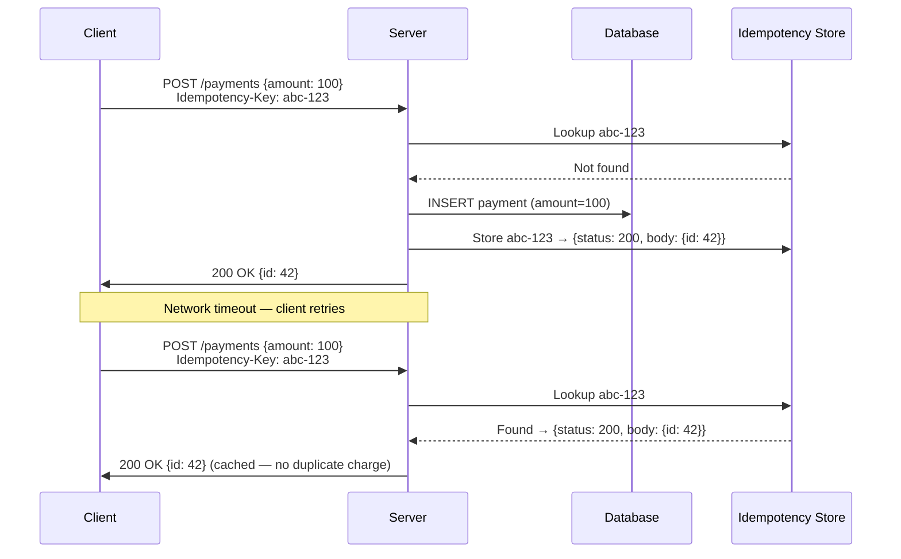

A client sends `POST /payments` to charge $100. The response times out. The client retries. Your API charges $200. This is the fundamental problem that idempotency keys solve: making retries safe. API versioning solves a different but equally important problem: evolving your API without breaking existing clients.

## Idempotency Keys

An idempotency key is a client-generated unique identifier (typically a UUID) sent with a request. The server uses it to detect duplicates: if a request with the same key has already been processed, the server returns the **cached response** without re-executing the operation.



### Server-Side Implementation

```python
def handle_payment(request):
    idempotency_key = request.headers.get("Idempotency-Key")
    if not idempotency_key:
        return error(400, "Idempotency-Key header required")

    # Check for existing result
    cached = redis.get(f"idem:{idempotency_key}")
    if cached:
        return json.loads(cached)

    # Lock to prevent concurrent duplicates
    lock_key = f"idem_lock:{idempotency_key}"
    if not redis.set(lock_key, "1", nx=True, ex=30):
        return error(409, "Request in progress — retry later")

    try:
        # Execute business logic
        result = process_payment(request.body)

        # Cache the result with TTL
        redis.setex(
            f"idem:{idempotency_key}",
            86400,  # 24 hour TTL
            json.dumps({"status": 200, "body": result})
        )
        return success(result)
    except Exception as e:
        redis.delete(lock_key)  # allow retry on failure
        raise
```

### Storage for Idempotency Keys

| Storage | Durability | Latency | TTL Handling | Best For |
|---------|-----------|---------|-------------|----------|
| **Redis** | Volatile (survives restart with AOF) | Sub-millisecond | Built-in TTL per key | Most API idempotency (payments, orders) |
| **Database row** | Durable (ACID) | ~1ms | Manual cleanup job | Financial transactions where durability is critical |
| **In-memory** | None (lost on restart) | Nanoseconds | Process lifetime | Single-instance services only |

**Stripe's approach:** stores idempotency keys in their database within the same transaction as the payment. The payment insert and idempotency record are atomic — no window for inconsistency.

### Key Design Decisions

**Who generates the key?** The **client** — always. The server cannot generate a meaningful idempotency key because it doesn't know which client retries map to which original request.

**Key scope:** one key per logical operation. If the client retries with the same key but a **different request body**, the server should return an error (not silently use the cached result or re-execute with new parameters).

**TTL:** 24 hours is typical. Too short and delayed retries fail. Too long and storage grows indefinitely.


**The key must be tied to a single request body.** If the client reuses the same idempotency key with a different payload (e.g., same key but $200 instead of $100), the server should return `422 Unprocessable Entity` — not the cached $100 result or a new $200 charge. Stripe enforces this by hashing the request body and comparing it on duplicate key access.


## API Versioning

APIs evolve. Fields get added, renamed, or removed. Response formats change. Without versioning, any change risks breaking existing clients — and you can't force all clients to upgrade simultaneously.

### Versioning Strategies

| Strategy | Example | Pros | Cons |
|----------|---------|------|------|
| **URL path** | `GET /v1/orders` | Explicit, simple routing, cacheable | URL clutter; every resource path includes version |
| **Custom header** | `API-Version: 2` | Clean URLs | Header can be forgotten; less discoverable |
| **Content negotiation** | `Accept: application/vnd.api.v2+json` | RESTful purist approach | Complex; poor tooling support |
| **Query parameter** | `GET /orders?version=2` | Simple to add | Pollutes the query string; breaks caching |

**URL path versioning dominates in practice.** Stripe (`/v1/`), GitHub (`/v3/`), Twilio (`/2010-04-01/`) all use URL-based versioning because it's explicit and hard to miss.

### Breaking vs Non-Breaking Changes

| Change | Breaking? | Why |
|--------|-----------|-----|
| Add a new field to the response | **No** | Existing clients ignore unknown fields |
| Add a new optional request parameter | **No** | Existing clients don't send it; server uses default |
| Remove a response field | **Yes** | Clients parsing that field will break |
| Rename a field | **Yes** | Same as remove old + add new |
| Change a field's type (string → int) | **Yes** | Clients deserializing the old type will crash |
| Change error response format | **Yes** | Client error handling breaks |
| Add a required request parameter | **Yes** | Existing clients don't send it |
| Tighten validation (reject previously valid input) | **Yes** | Requests that used to work now fail |

**Rule of thumb:** you can always add optional things. You can never remove, rename, or change the type of existing things without a version bump.

### Sunset and Deprecation

When you release v2, v1 doesn't disappear overnight. A deprecation lifecycle:

```
v1 released: 2024-01-01
v2 released: 2025-01-01
v1 deprecated: 2025-01-01 (announced, still works)
v1 sunset: 2025-07-01 (returns 410 Gone)

Timeline:
|------ v1 active ------|-- v1 deprecated --|-- v1 gone --|
                         |------------- v2 active ----------|
```

**Response headers for deprecation:**

```
HTTP/1.1 200 OK
Sunset: Sat, 01 Jul 2025 00:00:00 GMT
Deprecation: true
Link: <https://api.example.com/docs/migration-v2>; rel="deprecation"
```

**Monitoring:** track the percentage of traffic still hitting deprecated versions. If 30% of traffic is on v1 three months before sunset, send targeted migration reminders or extend the grace period.

### Date-Based Versioning

An alternative to incremental version numbers: use the API release date as the version identifier.

```
Stripe: API-Version: 2024-12-18
Twilio: /2010-04-01/Accounts/...
```

**Advantage:** finer granularity — each API release date is a version. Clients pin to the date they integrated, and new changes are introduced under newer dates. The server maintains backward compatibility for all pinned dates within the support window.

## Comparison: Idempotency vs Versioning

| Concern | Idempotency Keys | API Versioning |
|---------|-----------------|----------------|
| Problem solved | Safe retries — prevent duplicate side effects | API evolution — don't break existing clients |
| Who's responsible | Client generates key, server enforces | Server maintains multiple versions |
| Typical HTTP methods | POST, PUT, PATCH (non-idempotent by default) | All methods — versioning applies to the contract |
| Storage cost | Per-key with TTL | Per-version code paths |


**Interview tip:** When designing an API, say: "All mutating endpoints require an `Idempotency-Key` header — the server stores the key and result in Redis with a 24-hour TTL. Duplicates return the cached response. For versioning, I'd use URL path versioning (`/v1/`) with a 6-month deprecation window. Non-breaking changes (new optional fields) go into the current version; breaking changes get a new version. The `Sunset` header tells clients when a version will be removed." This shows you've thought about client safety (idempotency) and API lifecycle (versioning) as separate concerns.
