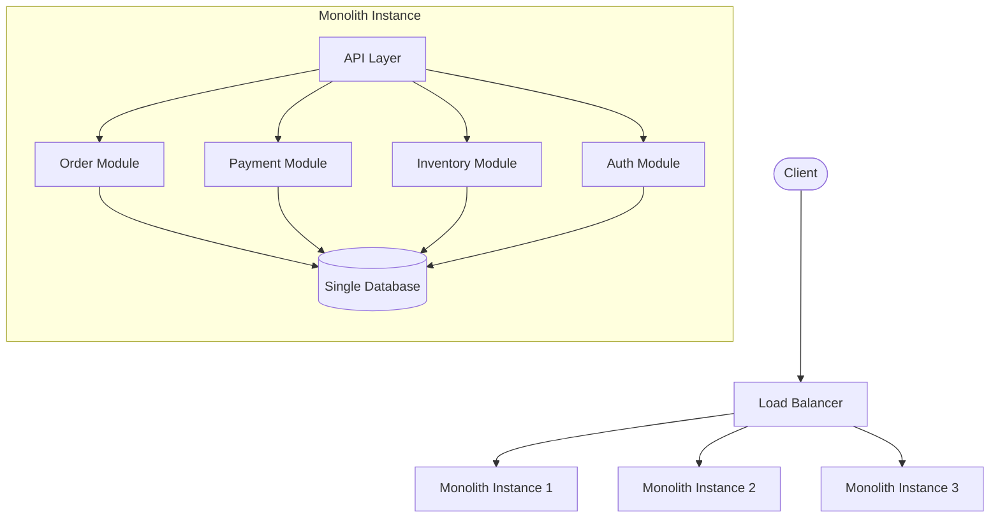
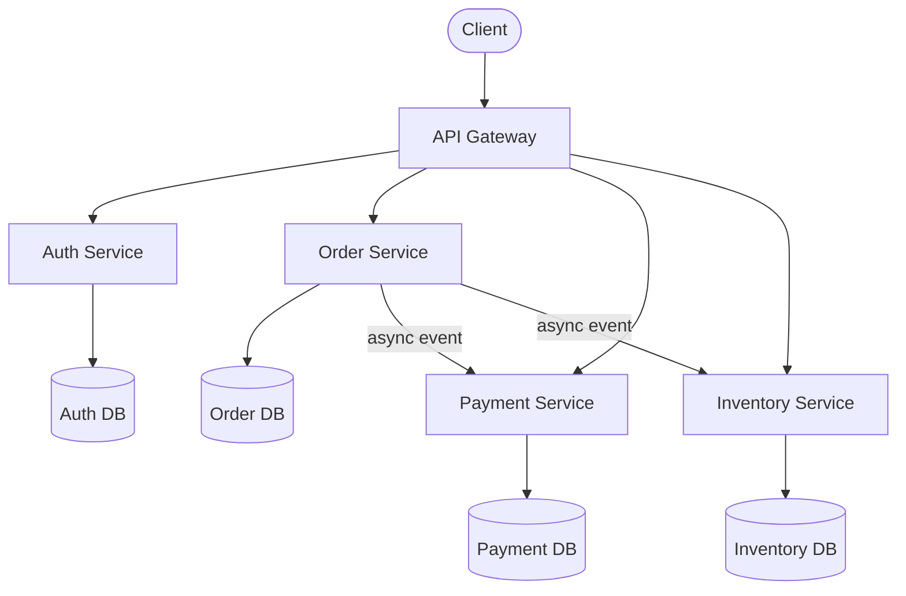
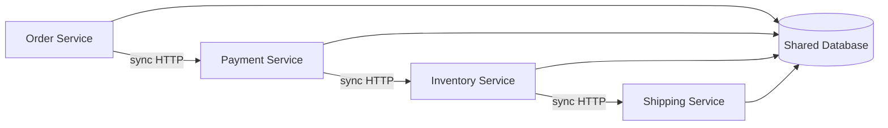

A team of 5 engineers building an early-stage product does not need microservices. A single deployable unit with a well-structured codebase is faster to build, simpler to debug, and cheaper to operate. Microservices become justified when the organization scales — multiple teams, independent release cadences, and workloads with vastly different scaling profiles. The architecture choice is driven by **team structure and operational maturity**, not by technology hype.

## Monolith

A monolith is a single deployable unit where all functionality lives in one codebase, one build artifact, and one process (or a few replicas of it).



### Benefits

| Benefit | Why |
|---------|-----|
| **Simple deployment** | One artifact to build, test, and deploy. No service orchestration, no version matrix. |
| **Easy cross-module calls** | In-process function calls — no network latency, no serialization, no service discovery. |
| **ACID transactions** | All modules share one database. A single transaction can atomically update orders, inventory, and payments. |
| **Simple debugging** | One process — stack traces span the full request path. No distributed tracing needed. |
| **Lower operational cost** | One build pipeline, one monitoring stack, one deployment target. |

### When It Breaks Down

| Symptom | Root Cause |
|---------|-----------|
| **Deploy fear** | A change to the payment module requires deploying the entire application — including untested order changes a colleague committed. |
| **Scaling mismatch** | The image processing module needs 10× the CPU of the checkout module, but you can only scale the whole monolith. |
| **Team contention** | 6 teams merge code into one repository. Merge conflicts, broken builds, and coordination overhead slow everyone. |
| **Long build/test times** | The full test suite takes 45 minutes. Engineers avoid running it, and broken code reaches production. |

## Microservices

Each business capability becomes an independently deployable service with its own codebase, database, and team.



### Benefits

| Benefit | Why |
|---------|-----|
| **Independent deployment** | Deploying the payment service doesn't touch orders. Each service has its own release cadence. |
| **Team autonomy** | The payments team owns their service end-to-end — code, data, deployment, monitoring. No cross-team merge conflicts. |
| **Isolated failure domains** | If the recommendation service crashes, checkout still works. |
| **Per-service scaling** | Scale the image processing service to 50 replicas while the user profile service runs on 3. |
| **Technology heterogeneity** | The search service can use Elasticsearch + Go while the order service uses PostgreSQL + Java. |

### The Cost

| Cost | Detail |
|------|--------|
| **Network overhead** | Every cross-service call is an RPC — serialization, latency, failure handling. A local function call becomes a distributed system problem. |
| **Data consistency** | No shared transactions. Cross-service consistency requires [Saga pattern](../../distributed/saga-pattern) or [eventual consistency](../../distributed/consistency-models). |
| **Operational complexity** | N services = N build pipelines, N monitoring dashboards, N deployment configurations. Requires container orchestration (Kubernetes), service discovery, distributed tracing. |
| **Debugging difficulty** | A request touches 5 services. Finding the root cause requires distributed tracing (Jaeger, Zipkin), correlated logs, and service dependency maps. |

## The Distributed Monolith Anti-Pattern

The worst of both worlds: you split into services but they're **tightly coupled** — shared databases, synchronous call chains, coordinated deployments.



**Symptoms:**
- Deploying one service requires deploying others (they share schema)
- A single slow service cascades failures through the synchronous chain
- Teams can't make schema changes without coordinating with every other team
- You have the operational cost of microservices with none of the benefits

**Root cause:** decomposition was done by **technical layer** (API layer, business logic layer, data layer) instead of **business capability** (order management, payments, inventory).

## Decomposition Strategies

### By Business Capability

Each service maps to a business function. The service owns the full vertical slice — API, logic, and data.

```
E-commerce platform:
├── Order Service         (create order, order status, order history)
├── Payment Service       (charge, refund, payment methods)
├── Inventory Service     (stock levels, reservations, replenishment)
├── Catalog Service       (products, pricing, categories)
├── User Service          (registration, profiles, authentication)
└── Notification Service  (email, push, SMS)
```

### By DDD Bounded Context

Start with Domain-Driven Design: identify bounded contexts where terms have unambiguous meaning. An "Order" in the order context and a "Shipment" in the shipping context may refer to the same real-world event but have different data models and lifecycles.

```
Bounded Context: Order Management
  - Aggregate: Order (id, items, status, total)
  - Events: OrderPlaced, OrderCancelled
  - Own database, own team

Bounded Context: Shipping
  - Aggregate: Shipment (id, tracking_number, carrier, status)
  - Events: ShipmentCreated, ShipmentDelivered
  - Own database, own team

Communication: Order Management publishes OrderPlaced →
               Shipping consumes it and creates a Shipment
```

## Decision Framework

| Factor | Choose Monolith | Choose Microservices |
|--------|----------------|---------------------|
| Team size | < 10 engineers | > 20 engineers, multiple teams |
| Product maturity | Early-stage, MVP, unclear domain boundaries | Established product with well-understood domains |
| Operational maturity | No DevOps team, no Kubernetes, no distributed tracing | Infrastructure automation, CI/CD, container orchestration |
| Scaling needs | Uniform — all modules scale the same | Divergent — some modules need 10× the resources of others |
| Deployment cadence | Weekly or less frequent | Multiple times per day, per-team |
| Data consistency needs | Strong ACID transactions across domains | Eventual consistency acceptable via Sagas |
| Domain boundaries | Unclear — still discovering what the product is | Clear — teams own distinct business capabilities |


**"Start monolith, extract services when clear boundary emerges"** is the pragmatic default. Premature decomposition into microservices creates a distributed monolith — you pay for the complexity but get none of the benefits. The services you extract first should be the ones with the clearest boundary: a service that has a distinct team, a distinct data model, and a distinct scaling requirement.


## The Modular Monolith Alternative

A middle ground: structure the monolith into well-encapsulated modules with **strict boundaries** — separate packages, no cross-module database queries, communication only through defined interfaces. When a module needs to become a service, it can be extracted with minimal refactoring.

```
monolith/
├── modules/
│   ├── orders/
│   │   ├── api/           (public API — other modules call this)
│   │   ├── internal/      (private — no other module imports this)
│   │   └── schema/        (own tables — other modules can't query directly)
│   ├── payments/
│   │   ├── api/
│   │   ├── internal/
│   │   └── schema/
│   └── inventory/
│       ├── api/
│       ├── internal/
│       └── schema/
└── shared/
    └── events/            (event bus for async communication between modules)
```

**Shopify** ran this pattern at enormous scale — a modular Rails monolith serving millions of merchants — before selectively extracting critical services.


**Interview tip:** When asked "monolith or microservices?" don't default to microservices. Say: "For an early-stage system with a small team, I'd start with a modular monolith — strict module boundaries, separate schemas per module, inter-module communication through events. This gives us the option to extract services later without premature complexity. The first extraction candidate would be the module with the most distinct scaling requirement — say, the image processing pipeline — because it needs GPU workers while the rest of the system is CPU-bound." This shows you understand when and why to decompose, not just how.
