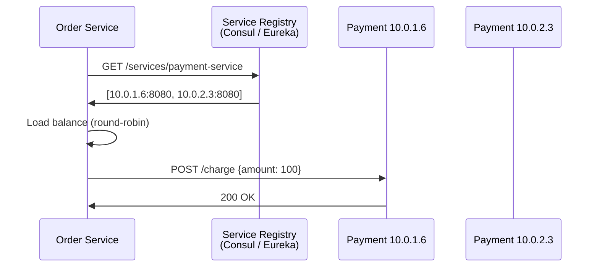
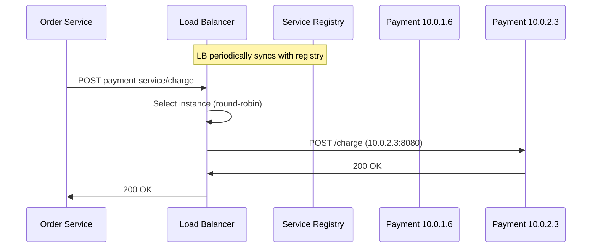
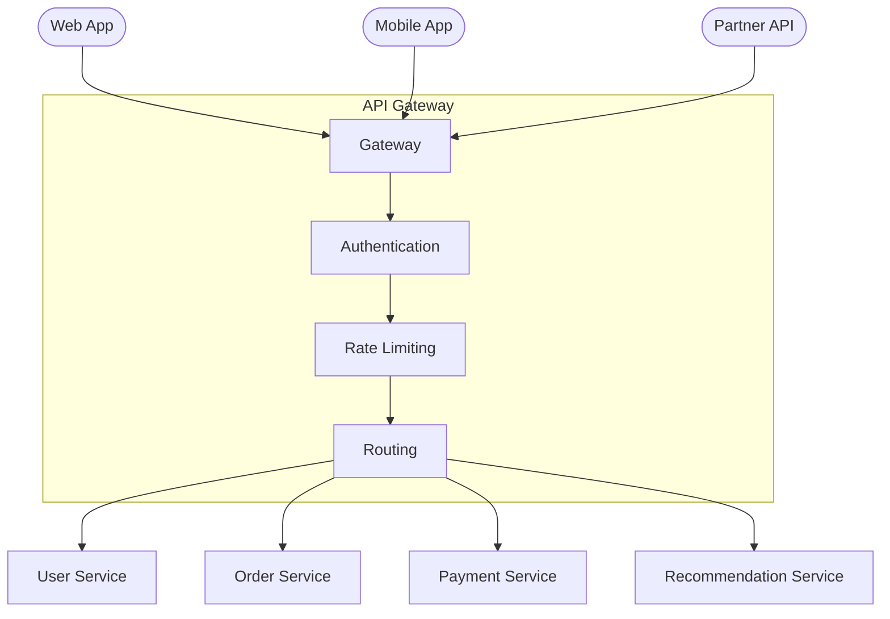
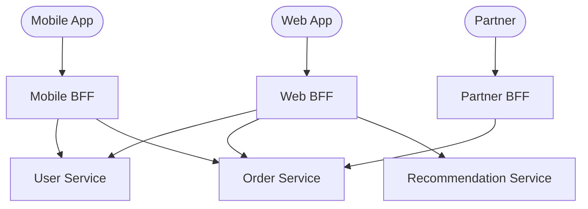
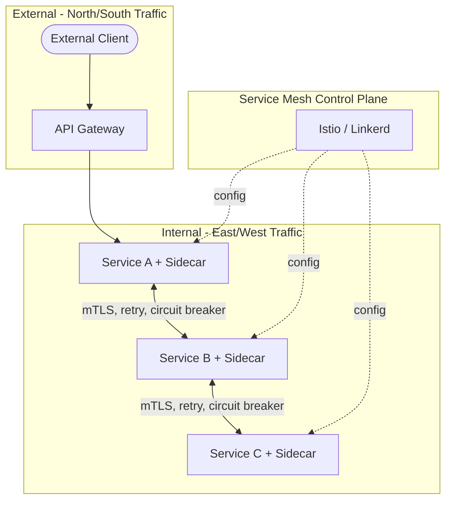

In a monolith, the order module calls the payment module with a local function call. In a microservices architecture, the order service needs to know the **network address** of the payment service — and that address changes as instances scale up, fail, and redeploy. Service discovery solves this: it maintains a registry of available service instances and their addresses. An API gateway solves a different problem: it provides a single entry point for external clients, handling routing, authentication, and protocol translation.

## Service Discovery

### The Problem

Each service runs multiple instances across different hosts. IP addresses change on every deployment. Instances come and go as auto-scaling adds and removes capacity.

```
Order Service needs to call Payment Service.

Payment Service instances:
  t=0:  10.0.1.5:8080, 10.0.1.6:8080
  t=1:  10.0.1.5:8080, 10.0.1.6:8080, 10.0.2.3:8080  (scaled up)
  t=2:  10.0.1.6:8080, 10.0.2.3:8080                   (10.0.1.5 crashed)
  t=3:  10.0.1.6:8080, 10.0.2.3:8080, 10.0.2.4:8080   (replaced + scaled)

Hardcoding addresses is impossible.
```

### Client-Side Discovery

The calling service queries a **service registry** to get the list of available instances, then load-balances across them directly.



**How registration works:** each service instance registers itself on startup and sends heartbeats. If heartbeats stop, the registry removes the instance.

```python
# Service registration (on startup)
consul.agent.service.register(
    name="payment-service",
    address="10.0.1.6",
    port=8080,
    check=consul.Check.http("http://10.0.1.6:8080/health", interval="10s")
)
```

| Pros | Cons |
|------|------|
| No intermediary — one fewer hop | Discovery logic in every service client |
| Client can use smart routing (latency-based, weighted) | Client must handle stale registry data |
| No single point of failure in the data path | Tighter coupling between client and registry |

**Used by:** Netflix Eureka (Spring Cloud), Consul with client-side load balancing, gRPC name resolution.

### Server-Side Discovery

A load balancer sits between the client and the service instances. The client sends requests to a single known address; the load balancer queries the registry and routes.



| Pros | Cons |
|------|------|
| Clients are simple — just call one address | Load balancer is a single routing point (can become bottleneck) |
| Discovery logic centralized — update once | Extra hop adds latency |
| Client doesn't need registry awareness | Load balancer must be highly available |

**Used by:** AWS ALB/NLB + ECS/EKS, Kubernetes Service (kube-proxy), NGINX with Consul template.

### DNS-Based Discovery

The simplest form: use DNS to resolve a service name to instance IPs. The DNS server returns multiple A records; the client picks one.

```
dig payment-service.internal.example.com

payment-service.internal.example.com  A  10.0.1.6
payment-service.internal.example.com  A  10.0.2.3
```

**Limitation:** DNS TTL caching means stale records persist after an instance dies. Not suitable for rapidly changing instance pools. Works well for services that change infrequently.

**Kubernetes DNS:** `payment-service.default.svc.cluster.local` resolves to the `ClusterIP` — an internal virtual IP that kube-proxy routes to healthy pods. This combines DNS discovery with server-side load balancing.

## API Gateway

An API gateway is a single entry point for all external client traffic. It sits between clients and the internal service mesh, handling cross-cutting concerns that don't belong in individual services.



### Responsibilities

| Responsibility | What It Does |
|---------------|-------------|
| **Routing** | Maps external URL (`/api/orders`) to internal service (`order-service:8080/orders`) |
| **Authentication** | Validates JWT/OAuth tokens before requests reach services — services trust the gateway's identity headers |
| **Rate limiting** | Enforces per-client or per-endpoint rate limits (see [Rate Limiting](../rate-limiting/algorithms)) |
| **SSL termination** | Handles TLS at the edge — internal traffic can be plaintext (within a trusted network) or mTLS |
| **Protocol translation** | Client speaks REST/JSON; internal services use gRPC/Protobuf. Gateway translates. |
| **Request aggregation** | Mobile app needs data from 3 services in one screen. Gateway makes 3 internal calls and returns one response. |
| **Caching** | Cache GET responses at the gateway to reduce backend load |
| **Observability** | Centralized access logs, request tracing IDs, latency metrics |

### Gateway Products

| Gateway | Type | Key Feature |
|---------|------|-------------|
| **Kong** | Open-source + enterprise | Plugin ecosystem (auth, rate limiting, logging), runs on NGINX |
| **AWS API Gateway** | Managed | Tight integration with Lambda, Cognito, IAM; pay-per-request |
| **Envoy** | Proxy/gateway | L7 proxy with advanced routing, circuit breaking, observability; used in service meshes |
| **NGINX** | Reverse proxy + gateway | Configuration-based routing, high performance, widely deployed |
| **Spring Cloud Gateway** | Java framework | Integrates with Spring ecosystem, reactive, filter chains |

## Backend for Frontend (BFF)

A specialized API gateway per client type. Each BFF is tailored to its client's data needs — the mobile BFF returns smaller payloads, the web BFF aggregates more data, the partner BFF uses a different auth scheme.



| Without BFF | With BFF |
|-------------|----------|
| Mobile app receives full user profile (50 fields) and filters locally | Mobile BFF returns 8 fields the mobile app actually uses |
| Web and mobile share one API design — compromises for both | Each BFF is optimized for its client's screen layouts and network constraints |
| Partner API changes risk breaking mobile app | Each BFF evolves independently |

**Trade-off:** N BFFs = N codebases to maintain. Use BFF when client data needs diverge significantly — don't create a BFF for two clients that consume the same API shape.

## Service Mesh vs API Gateway

Two patterns that solve different traffic routing problems:



| Property | API Gateway | Service Mesh |
|----------|------------|-------------|
| **Traffic direction** | North-south (external → internal) | East-west (service → service) |
| **Deployment** | Central, shared instance(s) | Sidecar proxy per service pod |
| **Primary concern** | External client management (auth, rate limiting, routing) | Internal service communication (mTLS, retries, circuit breakers, observability) |
| **Examples** | Kong, AWS API Gateway, NGINX | Istio (Envoy sidecars), Linkerd |
| **When to use** | Always — every system needs an external entry point | When service-to-service communication needs consistent security, retries, and observability without changing application code |

They are **complementary**, not alternatives. A typical production setup has an API gateway at the edge and a service mesh for internal communication.


**Interview tip:** When designing a microservices system, say: "External traffic enters through an API gateway that handles auth, rate limiting, and TLS termination. Internally, services discover each other through Kubernetes DNS — `payment-service.default.svc.cluster.local` resolves to a ClusterIP backed by healthy pods. For service-to-service concerns like retries, circuit breaking, and mTLS, I'd use a service mesh sidecar (Envoy) rather than implementing those in every service's application code." This shows you understand the separation between edge routing and internal communication.
