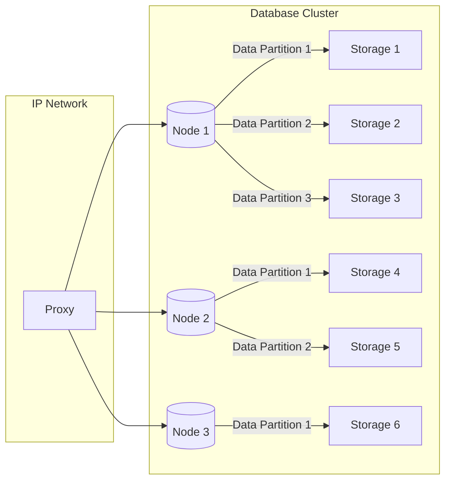
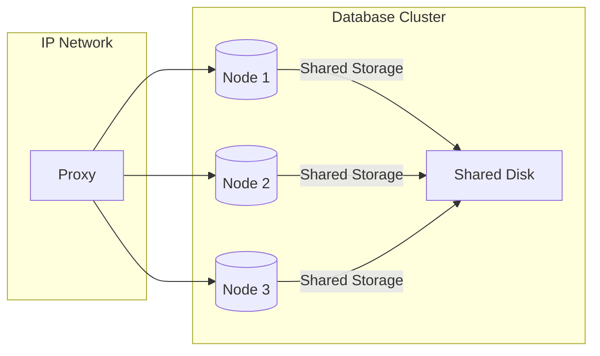
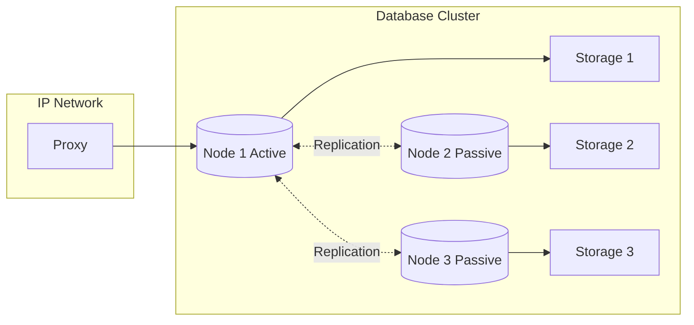
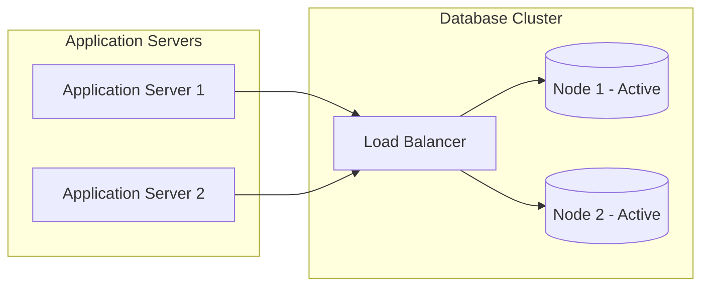

Database clustering is a method used to enhance the performance, availability, and scalability of databases. It involves creating multiple copies of a database, called nodes, and distributing the workload across them. This not only increases the capacity to handle more requests but also provides fault tolerance in case one node fails.

### Types of Database Clustering:

#### Shared-Nothing Clustering

In this type, each node has its own storage and processing power, and they do not share any components. Data is partitioned across the nodes, and each node handles a specific subset of data. Common in environments where high availability and scalability are crucial.

#### Shared-Disk Clustering

In this type, all nodes share a common storage system, allowing them to access the same data. Each node has its own processing power, but they all read and write to a shared storage medium. Typically used in environments where a large dataset needs to be accessed simultaneously.

#### Active-Passive Clustering (Failover Clustering)
In this setup, one node is active and handles all requests while the other node(s) remain passive, ready to take over in case of a failure. The passive node(s) constantly replicate data from the active node, ensuring it's up-to-date.

#### Active-Active Clustering
In this setup, all nodes are actively processing requests simultaneously. Data is usually partitioned so that each node handles a specific subset of the workload. Provides better scalability but can be more complex to manage than active-passive setups.

### Benefits of Database Clustering:

1. **High Availability**:
   - Clustering provides redundancy, ensuring that if one node fails, another can take over without significant downtime.

2. **Scalability**:
   - Clustering allows for the distribution of the workload, enabling a database system to handle more requests than a single node.

3. **Load Balancing**:
   - Requests can be distributed evenly across nodes, preventing any single node from becoming a bottleneck.

4. **Fault Tolerance**:
   - Even if a node fails, the database continues to operate, maintaining data integrity and availability.

5. **Improved Performance**:
   - By distributing queries across multiple nodes, the overall performance of the database system can be significantly enhanced.

### Challenges and Considerations:

1. **Complexity**:
   - Setting up and managing a clustered database can be more complex than a single-node system.

2. **Synchronization**:
   - Ensuring that data across nodes is consistent can be challenging, especially in active-active setups.

3. **Cost**:
   - Clustering typically requires additional hardware and software licenses, which can increase the overall cost of the database system.

4. **Network Overhead**:
   - Communication between nodes can introduce additional latency, especially in geographically distributed clusters.

### Popular Implementations:

1. **MySQL Cluster**:
   - An open-source distributed database management system designed for high availability and scalability.

2. **PostgreSQL Streaming Replication**:
   - Allows for replication of data from one PostgreSQL database to another for failover and load balancing.

3. **Oracle Real Application Clusters (RAC)**:
   - Provides a shared-disk architecture that allows multiple nodes to access a single database simultaneously.

4. **MongoDB Sharding**:
   - MongoDB uses sharding to distribute data across multiple nodes, enabling horizontal scalability.

5. **Microsoft SQL Server AlwaysOn Availability Groups**:
   - Provides high availability and disaster recovery capabilities, allowing for automatic failover.

Keep in mind that the choice of clustering method and implementation depends on the specific requirements and constraints of the application and infrastructure. It's crucial to carefully evaluate these factors before implementing a clustered database solution.