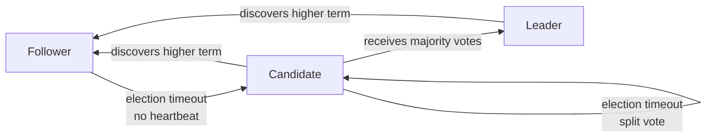
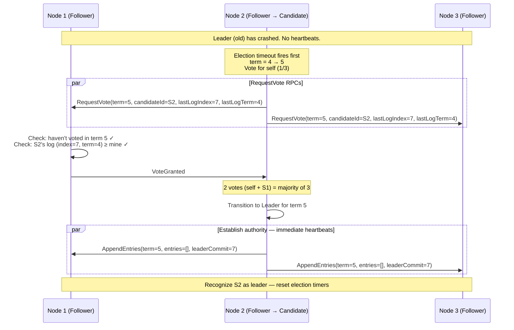
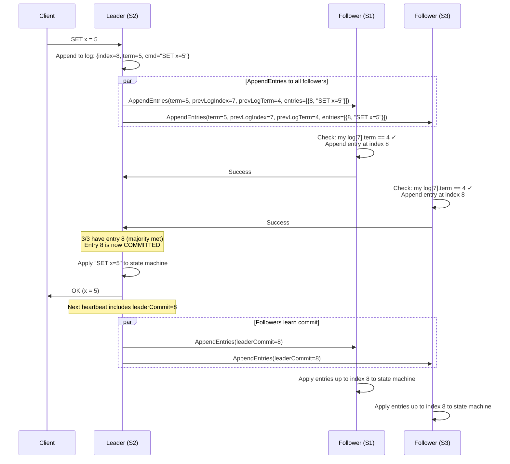

You're building Kubernetes' control plane. Every kubectl apply, every pod scheduling decision, every secret update needs to be durably committed to a cluster store that survives node failures and never loses a write. If two API servers both believed they were authoritative and accepted conflicting updates to a Deployment spec, your cluster state would diverge irrecoverably. **etcd solves this with Raft** — a small group of nodes elects one leader, that leader sequences every write into a replicated log, and a majority must persist each entry before it counts as committed. The same algorithm powers CockroachDB's per-range replication, TiKV, Consul, and Kafka's KRaft controller.

Raft is a consensus algorithm that ensures a cluster of servers agrees on a **replicated log** — the same sequence of commands applied in the same order on every node. It is designed to be understandable (unlike Paxos) while providing the same safety guarantees.

If every server starts in the same state and applies the same deterministic commands in the same order, they all reach the same final state. This is **replicated state machine** — the foundation of etcd, CockroachDB, TiKV, and Kafka KRaft.

## Terms and Roles

### Terms (Logical Clock)

Raft divides time into **terms** — monotonically increasing integers. Each term begins with an election. If a leader is elected, it serves for the rest of the term. If the election fails (split vote), a new term begins immediately.

Terms act as a logical clock: any message with a stale term is rejected. If a node receives a message with a higher term than its own, it immediately updates its term and steps down to follower.

```
Term 1          Term 2          Term 3          Term 4
|── election ──|── election ──|── election ──|── election ──|
|   Leader: S1 |   Leader: S3 |  (split vote) |   Leader: S5 |
|   normal op  |   normal op  |  no leader    |   normal op  |
```

### Roles

Every node is in exactly one of three states:



| Role | Responsibility |
|------|---------------|
| **Follower** | Passive. Receives log entries from leader, responds to vote requests. Becomes candidate on election timeout. |
| **Candidate** | Requests votes from all peers. Becomes leader on majority, reverts to follower on higher term or loss. |
| **Leader** | Handles all client requests. Replicates log entries. Sends heartbeats to suppress elections. At most one per term. |

## Leader Election

### Election Trigger

Each follower maintains a randomized **election timeout** (e.g., 150–300ms). If the follower doesn't receive a heartbeat from the leader within this period, it assumes the leader has failed and starts an election.

Randomization is critical: it ensures nodes don't all start elections simultaneously, which would cause repeated split votes.

### Election Protocol



### The Vote Grant Rule (Critical for Safety)

A node grants its vote only if **both** conditions hold:

1. **It hasn't already voted in this term** (one vote per term per node)
2. **The candidate's log is at least as up-to-date** as the voter's

Log "up-to-dateness" is compared by:
- First: the **term** of the last log entry (higher term = more recent leader = more up-to-date)
- Tie-break: the **index** of the last log entry (longer log = more entries)

This rule guarantees the **Leader Completeness Property**: any elected leader has all previously committed entries. A node missing committed entries cannot win — at least one voter in any majority will have those entries and will refuse the vote.

### Split Vote

If two candidates start simultaneously, votes may split evenly and neither reaches majority. Both increment to the next term and retry with fresh randomized timeouts. Statistical analysis shows that with a 150–300ms timeout range, split votes resolve within one or two rounds.

## Log Replication

Once elected, the leader handles all client requests and replicates log entries to followers.

### Normal Operation



### The Log Matching Property

Raft maintains a critical invariant: **if two logs contain an entry with the same index and term, then all preceding entries are identical.**

This is enforced through the `prevLogIndex` and `prevLogTerm` fields in AppendEntries:
- The leader sends the index and term of the entry **immediately before** the new entries
- The follower checks that its log matches at that position
- If it doesn't match: reject → leader decrements `nextIndex` and retries with earlier entries
- This "backtrack" mechanism repairs divergent follower logs

```
Leader's log:     [1:1] [2:1] [3:2] [4:3] [5:3] [6:3]
Follower's log:   [1:1] [2:1] [3:2] [4:2]  ← diverged at index 4

Leader sends: prevLogIndex=5, prevLogTerm=3
Follower: "I don't have index 5" → reject

Leader retries: prevLogIndex=4, prevLogTerm=3
Follower: "My index 4 has term 2, not 3" → reject

Leader retries: prevLogIndex=3, prevLogTerm=2
Follower: "My index 3 has term 2 — match!" → accept
Follower overwrites: entries at index 4, 5, 6 with leader's entries

Result: follower's log now matches leader's exactly
```

## Commit Rules

An entry is **committed** when the leader has replicated it to a majority of nodes. Once committed, it is guaranteed to be durable and will eventually be applied by all nodes.


**The Commitment Rule for Previous Terms:** A leader can only commit entries from its current term by counting replicas. It cannot directly commit entries from a previous term (even if replicated to a majority) — it must first commit a new entry in its own term, which implicitly commits all preceding entries. This prevents a subtle safety violation where an entry could be replicated to a majority, then overwritten by a new leader.


## Safety Properties

Raft guarantees five properties that together ensure correctness:

| Property | Guarantee |
|----------|----------|
| **Election Safety** | At most one leader per term |
| **Leader Append-Only** | A leader never overwrites or deletes entries in its own log |
| **Log Matching** | If two logs have an entry with same index and term, all prior entries are identical |
| **Leader Completeness** | If an entry is committed in term T, it is present in all leaders' logs for terms > T |
| **State Machine Safety** | If a server applies entry at index i, no other server applies a different entry at index i |

Leader Completeness is the most important: it guarantees **committed entries are never lost**, regardless of leader changes. The vote grant rule (candidate must have the most up-to-date log) is what enforces this.

## Log Compaction and Snapshots

Without compaction, the log grows unboundedly. Raft uses **snapshots** to discard old log entries:

```
Log:        [1] [2] [3] [4] [5] [6] [7] [8] [9] [10]
                                ↑
                          Snapshot taken at index 5
                          State: {x=3, y=7, z=1}

After snapshot:
Snapshot:   state={x=3, y=7, z=1}, lastIncludedIndex=5, lastIncludedTerm=3
Log:                                     [6] [7] [8] [9] [10]
```

Each server independently takes snapshots. If a follower is so far behind that the leader has already discarded the entries it needs, the leader sends its snapshot via **InstallSnapshot RPC** instead of replaying the log from the beginning.

## Cluster Membership Changes

Adding or removing nodes is dangerous: during the transition, two different majorities could exist simultaneously, electing two leaders.

### Single-Server Changes (Safe Approach)

Add or remove **one server at a time**. This is safe because any two majorities of N and N+1 (or N and N-1) nodes must overlap by at least one node — preventing two independent majorities.

```
3-node cluster: {A, B, C}
Add D: transition to {A, B, C, D}  — majority goes from 2 to 3
  Old majority: any 2 of {A,B,C}
  New majority: any 3 of {A,B,C,D}
  These always overlap → safe

Add E: transition to {A, B, C, D, E} — majority goes from 3 to 3
  Safe: overlap guaranteed
```

### Joint Consensus (General Approach)

For multi-server changes, Raft uses a two-phase configuration change. The leader first commits a **joint configuration** entry (old ∪ new), requiring majorities from both old and new configurations. Then it commits the **new configuration** entry. During joint consensus, both old and new majorities must agree on any decision.

## Linearizable Reads

By default, a leader can serve reads from its local state machine — but a stale leader (one that has been replaced but doesn't know it yet) could return stale data.

**Solutions:**

| Approach | How | Cost |
|----------|-----|------|
| **Read through Raft log** | Write a no-op entry, wait for commit | Full round-trip, highest latency |
| **ReadIndex** | Leader confirms it's still leader by exchanging heartbeats with majority, then reads at that commit index | One round-trip, no log write |
| **Lease-based reads** | Leader holds a time-bounded lease; reads served locally during lease | No network cost, relies on bounded clock skew |

etcd uses ReadIndex by default. CockroachDB uses lease-based reads.

## Real-World Systems

| System | What Raft manages | Notes |
|--------|-------------------|-------|
| **etcd** | Key-value store for Kubernetes config | The reference Raft implementation |
| **CockroachDB** | Per-range Raft group (each shard has its own Raft group) | Thousands of concurrent Raft groups |
| **TiKV** | Per-region Raft group (TiDB's storage layer) | Multi-Raft: one Raft group per data region |
| **Kafka KRaft** | Controller quorum (metadata management) | Replaced ZooKeeper dependency |
| **Consul** | Service catalog and KV store | Used for service discovery |
| **HashiCorp Vault** | Integrated storage backend | Raft for HA secret management |

### Multi-Raft (CockroachDB / TiKV)

In a large database, running a single Raft group for all data would bottleneck on one leader. Instead, data is split into ranges (shards), and **each range has its own independent Raft group**:

```
Range [a-f]: Raft group 1 — Leader on Node 1
Range [g-m]: Raft group 2 — Leader on Node 3
Range [n-z]: Raft group 3 — Leader on Node 2

Each range replicates independently.
Leadership is spread across nodes for load balancing.
```

This allows the system to scale writes linearly with the number of ranges, while each individual range maintains strong consistency via Raft.


**Interview framing:** When asked "how does CockroachDB achieve both strong consistency and horizontal scaling," the answer is: "Each data range is a separate Raft group. Writes within a range go through Raft for linearizable consistency. Ranges are split across nodes so different ranges can accept writes in parallel — that's the horizontal scaling. Cross-range transactions use [2PC](../two-phase-commit) on top of Raft."



**Interview tip:** When asked how to build a strongly consistent metadata store, I'd say: "I'd use a Raft group of 3 or 5 nodes — odd-sized so we always have a clear majority. Writes go to the leader, which appends to its log and replicates to followers; an entry is committed only when a majority has persisted it, which guarantees durability across one or two failures. The vote-grant rule — candidates must have at least as up-to-date a log as any voter — gives us the leader-completeness property, so no committed entry is ever lost across leader changes." For reads, I'd default to ReadIndex (one round-trip to confirm leadership) rather than reading from local state, since a stale leader can't safely serve linearizable reads. For scale, I'd shard with multi-Raft like CockroachDB rather than running one giant Raft group.

