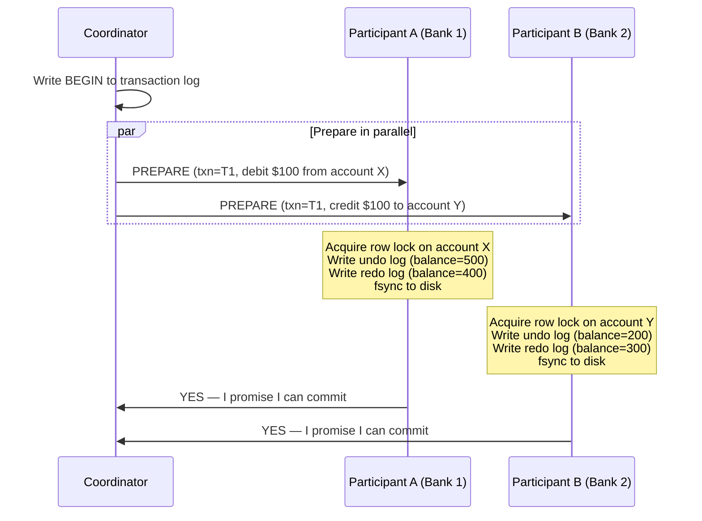
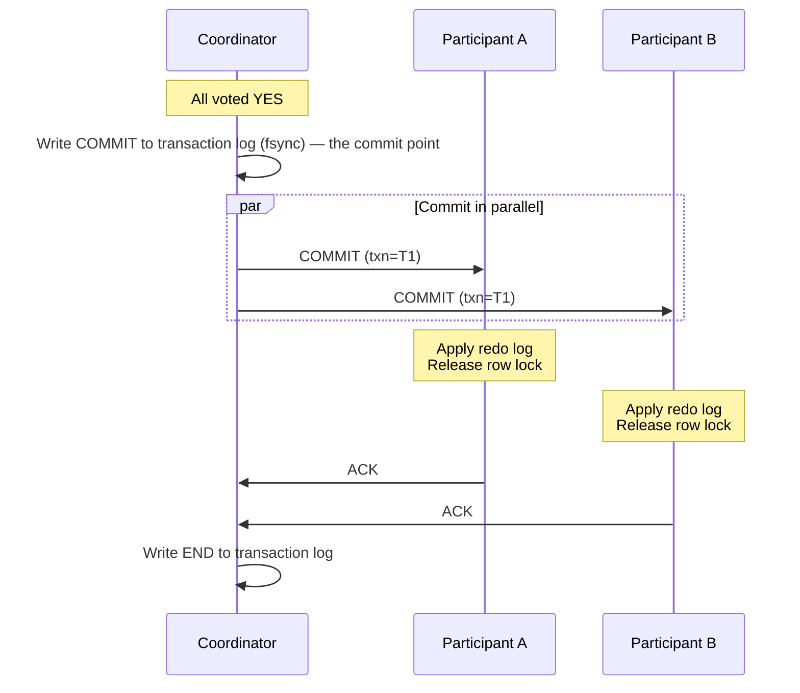
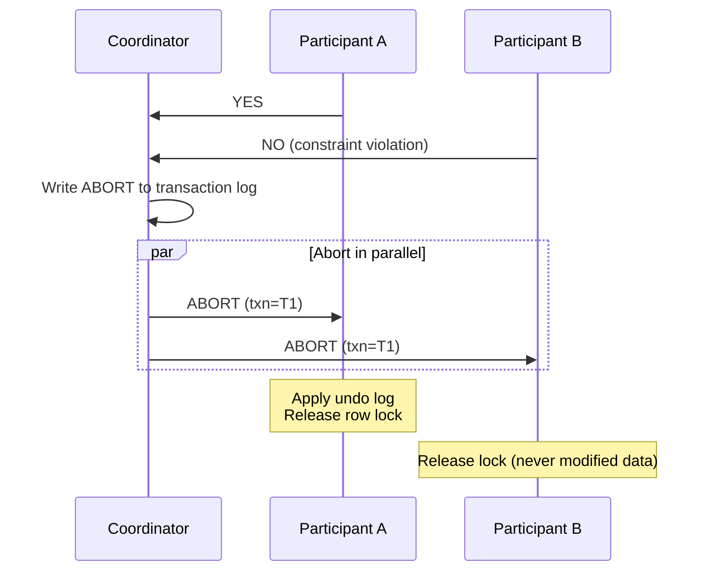
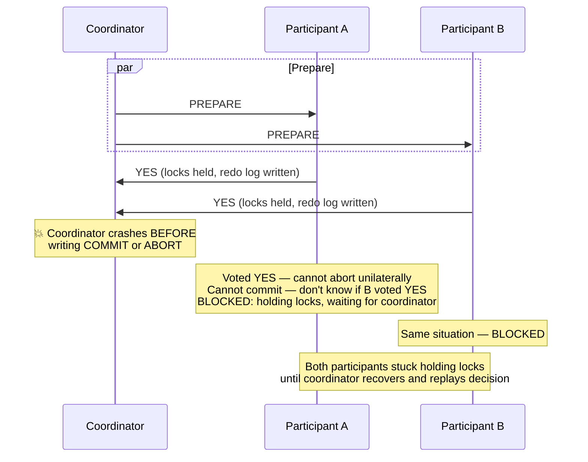

Two-Phase Commit is a protocol that ensures all participants in a distributed transaction either **all commit** or **all abort**. It solves the **atomic commit problem**: when a transaction spans multiple nodes, how do you guarantee that no node commits while another aborts?

## The Atomic Commit Problem

A single database handles atomicity with a local transaction log — write the commit record, then it's committed. But when a transaction touches data on multiple nodes (e.g., transferring money between two banks), a local commit on one node says nothing about the other.

The challenge: **any participant can fail at any time**. If Node A commits and Node B crashes before committing, the system is in an inconsistent state — the money left one account but never arrived at the other.

2PC solves this by splitting the commit into two phases, with a **coordinator** orchestrating the decision.

## The Protocol

### Phase 1 — Prepare



A `YES` vote is an **irrevocable promise**: the participant guarantees it can commit the transaction at any point in the future, even after a crash and recovery. This is why it must fsync its redo log before voting — the data must survive a reboot.

A `NO` vote means the participant cannot commit (constraint violation, deadlock, disk failure). The coordinator will abort the entire transaction.

### Phase 2 — Commit or Abort




**The commit point** is the moment the coordinator writes `COMMIT` to its durable log — not when participants acknowledge. Once that record is fsync'd, the transaction is committed regardless of subsequent crashes.


If **any** participant voted `NO`:



## Failure Modes

This is where 2PC gets interesting — and where it earns the label **"blocking protocol."**

### Participant Crash Before Voting

```
Coordinator sends PREPARE to A and B
A crashes before responding

Coordinator waits for timeout → no response from A
Coordinator writes ABORT → sends ABORT to B
B rolls back, releases locks

A recovers: checks with coordinator → "transaction was aborted" → rolls back
```

**Impact:** The coordinator simply aborts. No blocking.

### Participant Crash After Voting YES

```
A votes YES, then crashes immediately

Coordinator received YES from both A and B
Coordinator writes COMMIT, sends COMMIT to both
B commits successfully, A is down

A recovers: reads its redo log → "I voted YES for T1"
A asks coordinator: "What happened to T1?"
Coordinator: "T1 was committed"
A applies redo log → commits
```

**Impact:** A is temporarily unavailable but recovers correctly. Its `YES` vote guaranteed it could commit later.

### Coordinator Crash — The Blocking Problem

This is the critical failure mode that defines 2PC's weakness:



**Why this is devastating:**
- Participants hold **row-level locks** during the entire wait
- Other transactions that need those rows are blocked too
- If the coordinator's disk is destroyed, participants may be stuck **indefinitely**
- No participant can safely make a unilateral decision — committing when the coordinator intended to abort (or vice versa) would violate atomicity

### Coordinator Recovery

The coordinator's durable transaction log enables recovery:

| Log State | Recovery Action |
|-----------|----------------|
| No record of T1 | Abort (never started Phase 2) |
| `BEGIN` but no decision | Abort (PREPARE may have been sent, but no commit decided) |
| `COMMIT` written | Re-send COMMIT to all participants |
| `ABORT` written | Re-send ABORT to all participants |
| `END` written | Nothing to do — transaction fully completed |

Participants that time out waiting for a decision can ask the coordinator (or, in cooperative recovery protocols, ask other participants) for the outcome.

## Performance Cost

```
Timeline of a 2PC transaction:

Client ──── BEGIN TXN ──── PREPARE ──── COMMIT ──── END
                              │            │
              Locks acquired ─┘            └─ Locks released

Lock hold time = network RTT (prepare) + coordinator fsync
               + network RTT (commit) + participant fsync
             ≈ 4-20ms locally, 100-400ms cross-datacenter
```

| Cost | Detail |
|------|--------|
| **Network round trips** | 2 (prepare + commit), 4 messages minimum |
| **Forced disk writes** | Coordinator: 2 (commit record, end record). Each participant: 1 (redo log before YES vote) |
| **Lock duration** | Entire protocol — not just the local operation |
| **Latency** | Bounded by the slowest participant |

Cross-datacenter 2PC is particularly painful: a 100ms RTT between datacenters means locks are held for 200-400ms, dramatically reducing throughput.

## XA Transactions

XA is the industry standard API for 2PC across heterogeneous resources (e.g., PostgreSQL + Oracle + a message queue in the same transaction).

```
Application (Transaction Manager)
    ├── xa_start() → PostgreSQL (Resource Manager 1)
    ├── xa_start() → Oracle (Resource Manager 2)
    │
    │   ... execute SQL on both databases ...
    │
    ├── xa_prepare() → PostgreSQL → YES
    ├── xa_prepare() → Oracle → YES
    ├── xa_commit() → PostgreSQL → OK
    └── xa_commit() → Oracle → OK
```

**Why XA is rare in practice:**
- Each resource manager holds an open connection and locks during the entire protocol
- The transaction manager (coordinator) is a single point of failure
- Performance is 2-10x worse than local transactions
- Most modern applications use microservices with separate databases — XA doesn't work across independent services

## When to Use 2PC vs Alternatives

| Scenario | Use | Why |
|----------|-----|-----|
| Cross-shard commit within one database (Spanner, CockroachDB) | **2PC** | Controlled environment, low latency between shards, database manages coordinator |
| Cross-service business transaction (Order → Payment → Inventory) | **Saga** | Services are independent, locks across services are impractical |
| Database + message queue atomicity | **Outbox pattern** | Avoids distributed transaction entirely |
| Read-only cross-node query | **Neither** | No atomicity needed for reads |


**Interview red flag:** If a candidate proposes 2PC across microservices ("we'll use a distributed transaction to ensure the order and payment are atomic"), that signals a misunderstanding of microservice architecture. 2PC requires tight coupling and shared failure domains — the opposite of why you chose microservices. The correct answer is the Saga pattern with compensating transactions.


## Three-Phase Commit (3PC)

3PC adds a **pre-commit** phase between prepare and commit to eliminate the blocking problem:

```
Phase 1: PREPARE → YES/NO (same as 2PC)
Phase 2: PRE-COMMIT → ACK (participants know commit is coming)
Phase 3: COMMIT → ACK
```

If the coordinator crashes after pre-commit, participants know the decision was to commit (they received pre-commit) and can proceed without the coordinator. If they never received pre-commit, they can safely abort.

**Why 3PC is not used in practice:**
- Requires a **synchronous network** (bounded message delay) — unrealistic in real networks
- Network partitions can still cause inconsistency (one side commits, the other aborts)
- The extra round trip adds latency without solving the real-world problem
- Paxos/Raft-based commit protocols (e.g., Spanner) solve the problem properly
