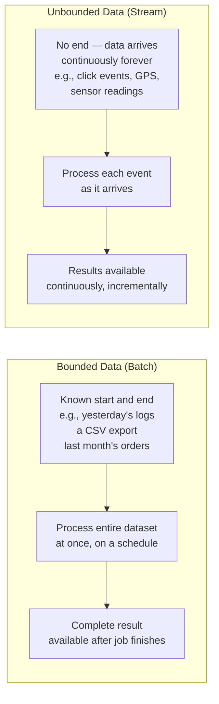
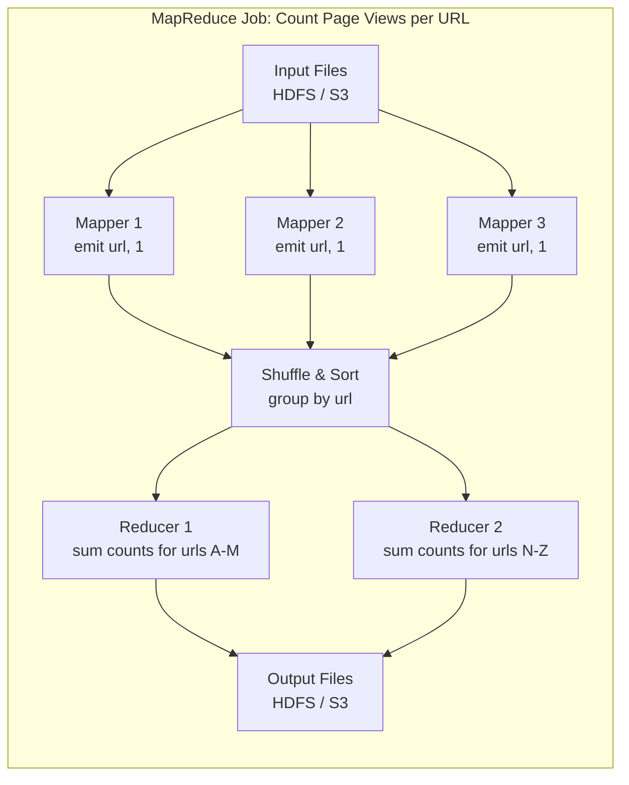
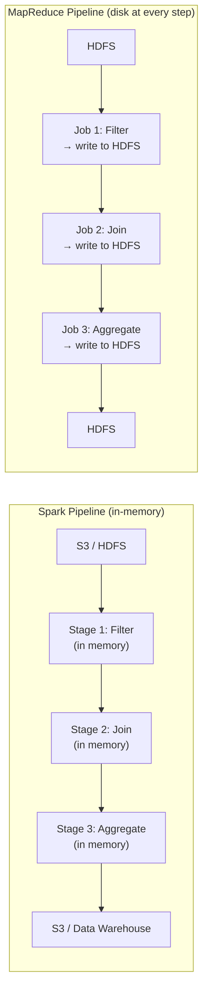
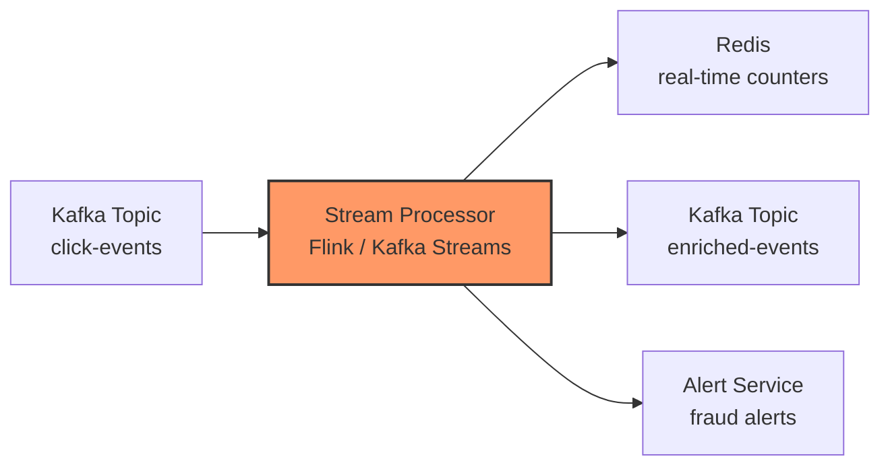
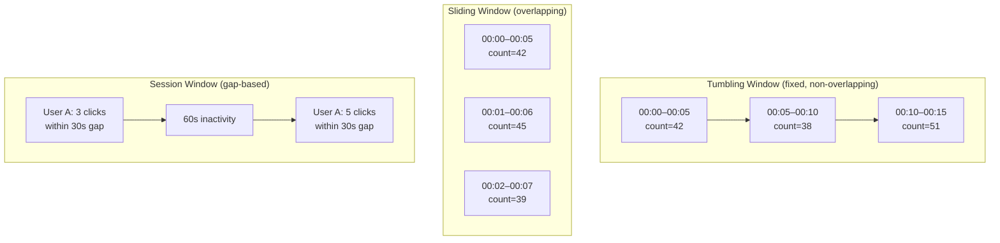
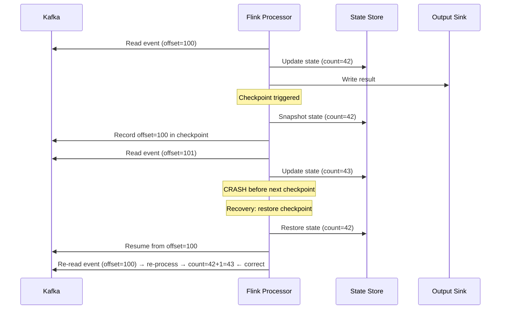
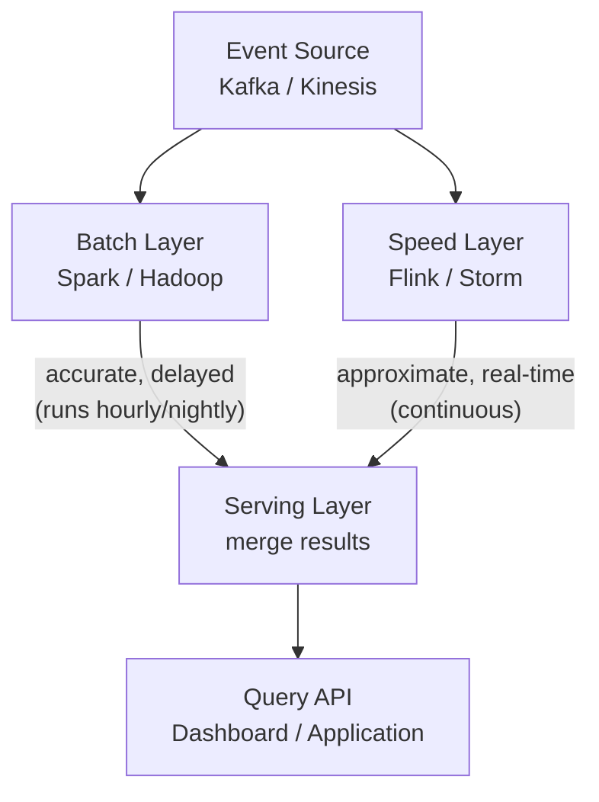
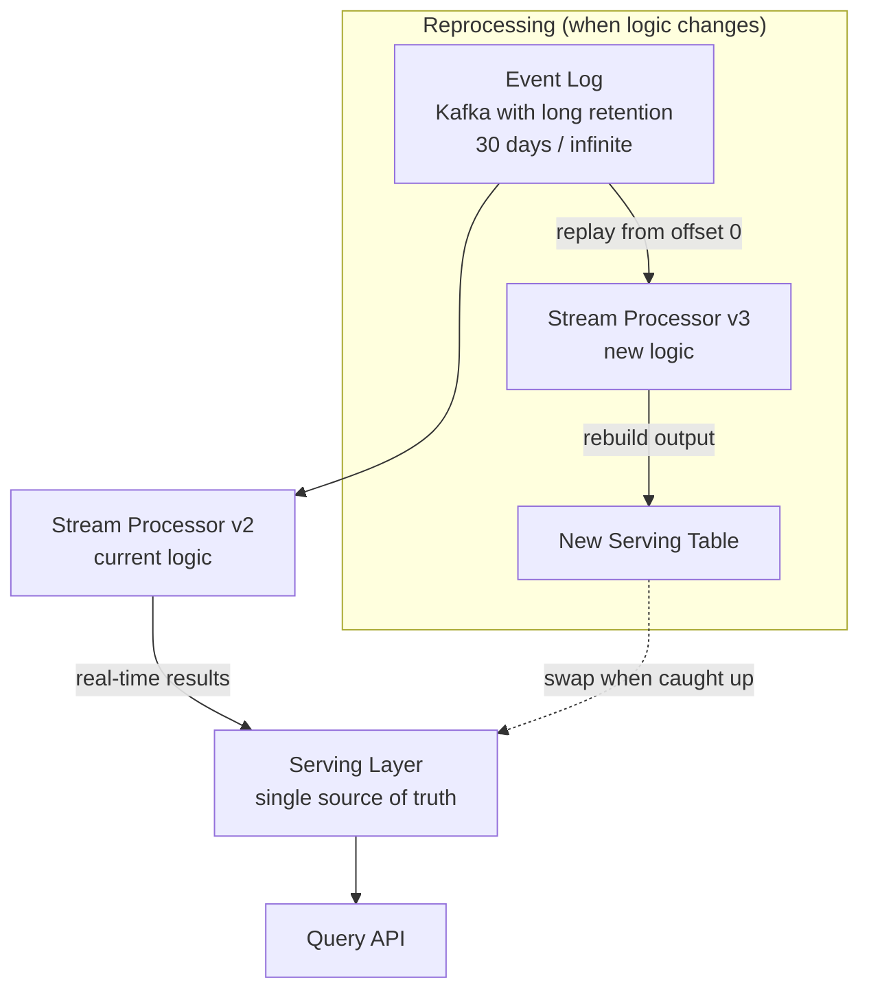
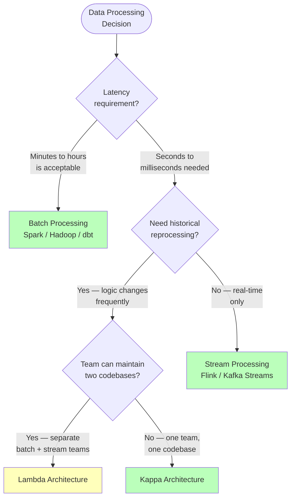
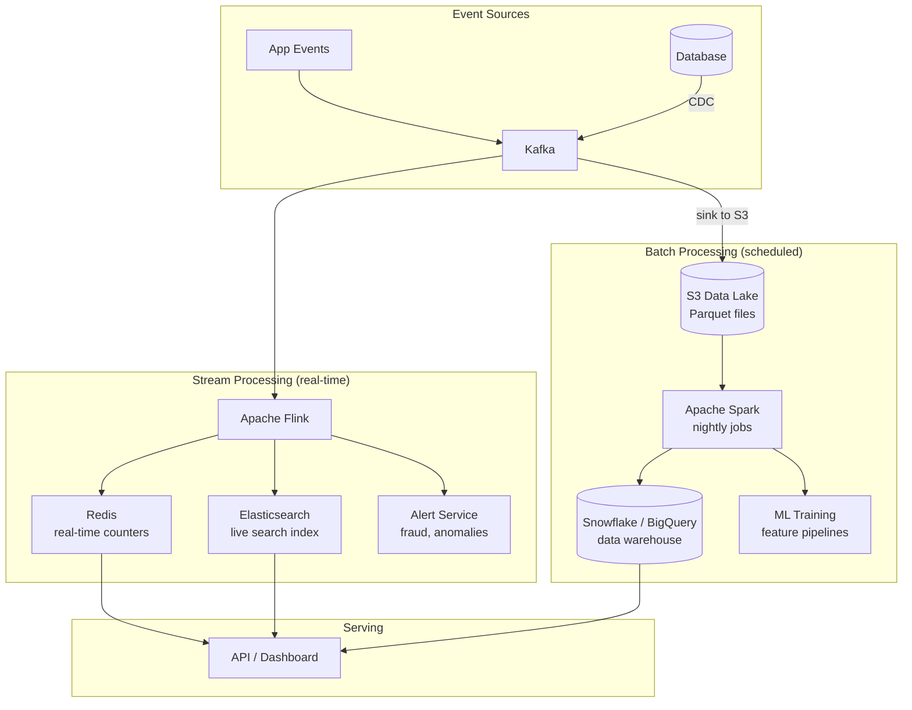

Every night at 2 AM, a Spark job reads the day's 500 million click events from S3, joins them with user profiles, computes per-user engagement scores, and writes the results to a data warehouse. The marketing team queries these scores at 9 AM to plan the day's campaigns. This works — until the fraud team needs to block a stolen credit card **within 5 seconds** of the first suspicious transaction. They can't wait until 2 AM. They need the same data, processed the same way, but in real-time. **This tension — high-throughput scheduled processing vs. low-latency continuous processing — is the fundamental trade-off between batch and stream processing.**

## Bounded vs. Unbounded Data

The distinction isn't really about "batch" and "stream" as technologies — it's about the **nature of the data**:



| Property | Bounded (Batch) | Unbounded (Stream) |
|----------|----------------|-------------------|
| **Dataset size** | Known and finite | Infinite and growing |
| **When processing starts** | After all data is collected (or on a schedule) | As soon as data arrives |
| **Processing model** | Read → Transform → Write (entire dataset) | Event arrives → Process → Emit (one at a time or micro-batch) |
| **Result availability** | After the job completes (minutes to hours) | Continuously (milliseconds to seconds) |
| **Example** | "Compute yesterday's revenue" | "Alert if revenue drops 20% in the last 5 minutes" |

## Batch Processing

### The Problem It Solves

You have a large volume of historical data and need to compute aggregations, joins, transformations, or ML features over the entire dataset. Correctness and throughput matter more than latency. The results are consumed by downstream systems (dashboards, APIs, ML models) that don't need real-time freshness.

### How It Works: MapReduce to Spark

**MapReduce** (Hadoop) was the original distributed batch framework. It reads data from HDFS, processes it in two phases (Map and Reduce), and writes results back to HDFS.



```python
# Conceptual MapReduce for counting page views per URL

def mapper(line):
    """Map phase: parse log line, emit (url, 1)."""
    timestamp, user_id, url, status = line.split("\t")
    yield (url, 1)

def reducer(url, counts):
    """Reduce phase: sum all counts for this URL."""
    yield (url, sum(counts))

# MapReduce framework handles:
# 1. Distributing input splits across mapper tasks
# 2. Shuffling mapper output by key to the correct reducer
# 3. Calling reducer for each unique key
# 4. Writing results to output files
```

**MapReduce's problem:** Every job writes intermediate results to disk between Map and Reduce phases. A multi-step pipeline (filter → join → aggregate → sort) means 4 jobs × 2 disk writes each = 8 disk round-trips. This is extremely slow for iterative algorithms (ML training, graph processing).

### Apache Spark: In-Memory Batch

Spark solved MapReduce's disk I/O problem by keeping intermediate data **in memory** across pipeline stages.



```python
# Spark equivalent: entire pipeline in one program
from pyspark.sql import SparkSession
from pyspark.sql import functions as F

spark = SparkSession.builder.appName("DailyEngagement").getOrCreate()

# Read yesterday's click events (bounded dataset)
clicks = (
    spark.read.parquet("s3://data-lake/clicks/date=2026-04-24/")
    .filter(F.col("status") == 200)
)

# Join with user profiles
users = spark.read.parquet("s3://data-lake/users/")

engagement = (
    clicks
    .groupBy("user_id")
    .agg(
        F.count("*").alias("click_count"),
        F.countDistinct("url").alias("unique_pages"),
        F.avg("dwell_time_ms").alias("avg_dwell_ms"),
    )
    .join(users, "user_id", "left")
    .withColumn("engagement_score",
        F.col("click_count") * 0.3
        + F.col("unique_pages") * 0.5
        + F.col("avg_dwell_ms") / 1000 * 0.2
    )
)

# Write to data warehouse
engagement.write.mode("overwrite").parquet(
    "s3://data-warehouse/engagement/date=2026-04-24/"
)
```

### Batch Processing Characteristics

| Property | Value |
|----------|-------|
| **Latency** | Minutes to hours (job startup + full dataset scan) |
| **Throughput** | Very high — optimized for scanning TB/PB of data |
| **Fault tolerance** | Simple — if a task fails, rerun it from the input partition (input is immutable on disk) |
| **Exactly-once** | Trivial — rerun the failed task, overwrite the output partition |
| **State management** | Easy — state is the entire dataset; shuffle handles grouping |
| **Resource usage** | Bursty — cluster idle between runs, full utilization during runs |

## Stream Processing

### The Problem It Solves

You need to react to events **as they happen**: detect fraud in real-time, update a live dashboard, trigger a notification within seconds of an event, or maintain a continuously-updated materialized view. Waiting for a batch job is unacceptable.

### How It Works

A stream processor consumes events from a **source** (Kafka topic, Kinesis stream), applies transformations **event by event** (or in small windows), and writes results to a **sink** (another Kafka topic, database, dashboard).



```python
# Conceptual stream processing: real-time fraud detection
# (pseudocode representing Flink/Kafka Streams logic)

class FraudDetector:
    """Process each transaction event as it arrives."""

    def __init__(self):
        # Per-user state: recent transaction history
        self.user_state = {}  # user_id → list of recent transactions

    def process_event(self, event: dict):
        user_id = event["user_id"]
        amount = event["amount"]
        location = event["location"]
        timestamp = event["timestamp"]

        history = self.user_state.get(user_id, [])

        # Rule 1: velocity check — more than 5 transactions in 1 minute
        recent = [t for t in history if timestamp - t["ts"] < 60]
        if len(recent) >= 5:
            emit_alert(user_id, "high_velocity", event)

        # Rule 2: impossible travel — transaction in NYC, then London
        #          within 1 hour
        if history:
            last = history[-1]
            distance = geodistance(last["location"], location)
            time_diff = timestamp - last["ts"]
            if distance > 5000 and time_diff < 3600:  # 5000km in <1hr
                emit_alert(user_id, "impossible_travel", event)

        # Rule 3: amount anomaly — 10x above user's average
        avg_amount = sum(t["amount"] for t in history) / max(len(history), 1)
        if amount > avg_amount * 10 and avg_amount > 0:
            emit_alert(user_id, "amount_anomaly", event)

        # Update state
        history.append({"ts": timestamp, "amount": amount,
                        "location": location})
        # Keep only last 1 hour of history
        self.user_state[user_id] = [
            t for t in history if timestamp - t["ts"] < 3600
        ]
```

### Windowing: Aggregating Over Time

Batch processing aggregates over a **complete dataset** — easy because boundaries are known. Stream processing aggregates over **time windows** — harder because data arrives continuously and out of order.



| Window type | How it works | Use case |
|-------------|-------------|----------|
| **Tumbling** | Fixed-size, non-overlapping (e.g., every 5 min) | "Requests per 5-minute bucket" — simple counts |
| **Sliding** | Fixed-size, overlapping (e.g., 5 min window, slides every 1 min) | "Average latency over the last 5 minutes, updated every minute" |
| **Session** | Variable-size, defined by inactivity gap | "Group a user's clicks into browsing sessions" |

### The Late Data Problem

Events don't always arrive in order. A mobile app sends an event at 10:00:00, but network delays mean it reaches Kafka at 10:00:07. If the 10:00:00–10:00:05 window has already been computed and emitted, this late event is missed.

```
Event time:      10:00:00  10:00:01  10:00:03  10:00:04  [window closes at 10:00:05]
Processing time: 10:00:00  10:00:01  10:00:03  10:00:04  10:00:05 → emit result

Late event arrives: event_time=10:00:02, processing_time=10:00:07
→ This event belongs to the already-closed window

Without watermarks: event is dropped → inaccurate count
With watermarks:    allow up to 10s of lateness → wait until 10:00:15
                    before finalizing the window → accurate but higher latency
```

**Watermarks** are the mechanism stream processors use to track progress in event time. A watermark of `t=10:00:05` means "I believe all events with event_time ≤ 10:00:05 have arrived." The processor can close windows up to that point. Late events beyond the watermark are either dropped or handled by a side output.

### Exactly-Once in Stream Processing

#### The Problem

A stream processor reads an event from Kafka, updates an internal counter, and writes the result to a sink. If the processor crashes **after updating the counter but before committing the Kafka offset**, it will re-process the event on restart — the counter is incremented twice.

```
Normal:    read event → update state → commit offset → ✓
Crash:     read event → update state → CRASH → restart
Restart:   read event (again, old offset) → update state (again) → double count!
```

#### The Solution: Checkpointing + Transactional Sinks

Stream processors like Flink solve this with **coordinated checkpoints**: periodically snapshot the processor's internal state and the current Kafka offsets atomically. On recovery, restore from the last checkpoint — both state and offset are consistent.



### Stream Processing Characteristics

| Property | Value |
|----------|-------|
| **Latency** | Milliseconds to seconds |
| **Throughput** | High — but less than batch for same data volume (per-event overhead) |
| **Fault tolerance** | Complex — checkpointing, exactly-once requires coordination |
| **Exactly-once** | Hard — needs checkpointed state + transactional sinks |
| **State management** | Complex — must handle per-key state, expiry, and recovery |
| **Resource usage** | Continuous — cluster runs 24/7, must handle traffic peaks |

## Lambda Architecture

### The Problem It Solves

You want **both**: accurate historical analytics from batch processing **and** low-latency results from stream processing. The batch layer gives you correctness (it can reprocess the entire history), and the speed layer gives you freshness (results within seconds).

### How It Works



```
Example: real-time view counts + accurate daily totals

Speed layer (stream):
  - Counts views in real-time as events arrive
  - Result: "Video X has ~1,042,387 views" (approximate, up-to-date)
  - May have double-counts from retries or missed events

Batch layer (nightly):
  - Reprocesses all events from the raw log
  - Result: "Video X had exactly 1,042,351 views yesterday" (precise)
  - Overwrites the speed layer's approximation for completed time ranges

Serving layer merges:
  - For yesterday: use batch result (1,042,351) ← authoritative
  - For today (in progress): use speed layer result ← approximate but fresh
```

### Why Lambda Is Problematic

```
The operational cost of Lambda:

  1. You write EVERY piece of business logic TWICE:
     - Once in Spark (Python/Scala, batch semantics)
     - Once in Flink (Java, streaming semantics)

  2. You maintain TWO codebases that must produce the SAME results

  3. When a bug is found:
     - Fix it in the batch code
     - Fix it in the streaming code (different language, different API)
     - Verify both produce the same output
     - Deploy both independently

  4. Two sets of infrastructure to operate, monitor, and scale

  Result: 2× engineering cost for every feature
```

| Advantage | Disadvantage |
|-----------|-------------|
| Batch layer serves as a "source of truth" that corrects stream approximations | Two codebases to maintain with identical logic |
| Stream layer provides real-time freshness | Different languages/frameworks for batch and stream |
| Batch can reprocess history when logic changes | Serving layer must merge two result sets — complex |
| Simpler to reason about batch correctness | Operational overhead of two separate systems |

## Kappa Architecture

### The Problem It Solves

Lambda's core pain is maintaining two codebases. Kappa eliminates the batch layer entirely: **one streaming pipeline handles both real-time processing and historical reprocessing.** If the processing logic changes, you replay the event log from the beginning through the new version of the streaming pipeline.

### How It Works



```
Kappa reprocessing workflow:

  1. Current pipeline (v2) processes events in real-time → writes to output_v2
  2. Business logic changes → deploy new pipeline (v3)
  3. v3 starts consuming from the BEGINNING of the Kafka log
  4. v3 processes historical + real-time events → writes to output_v3
  5. When v3 catches up to real-time: swap serving table from output_v2 → output_v3
  6. Shut down v2

  Result: one codebase, one framework, reprocessing via replay
```

### Prerequisites for Kappa

Kappa only works if:

1. **The event log is retained long enough** — Kafka must retain events for the full reprocessing window (30 days, 1 year, or infinite with tiered storage)
2. **Replay throughput is sufficient** — the stream processor must be able to catch up from history within a reasonable time. Processing 1 year of events might take hours even at 10× speed
3. **Processing logic is deterministic** — replaying the same events must produce the same results (no external API calls during processing that might return different results)

### Lambda vs Kappa

| Property | Lambda | Kappa |
|----------|--------|-------|
| **Codebases** | Two (batch + stream) | One (stream only) |
| **Reprocessing** | Rerun batch job on historical data | Replay event log through new stream processor |
| **Correctness guarantee** | Batch layer is the "source of truth" | Stream processor must be correct — no batch safety net |
| **Operational complexity** | High — two systems, merging layer | Lower — one system, but replay infrastructure needed |
| **Event log requirement** | Short retention OK (batch reads from data lake) | Long retention required (Kafka stores all history) |
| **Reprocessing speed** | Fast (Spark reads Parquet from S3 — optimized for bulk) | Slower (stream processor replays sequentially) |
| **Best for** | When batch and stream have fundamentally different requirements | When one pipeline can serve both real-time and historical |


**Kappa doesn't mean "no batch at all."** Some workloads are inherently batch: ML model training on historical data, one-time data migrations, complex graph algorithms. Kappa means the *primary serving pipeline* is stream-based with replay capability — not that batch processing is banned from the entire organization.


## When to Choose Each



### Decision Matrix

| Use case | Latency | Best approach | Why |
|----------|---------|--------------|-----|
| **Nightly revenue report** | Hours | Batch (Spark) | Full-table aggregation, correctness matters, no urgency |
| **ML model training** | Hours | Batch (Spark) | Reads terabytes of historical features, iterative algorithms |
| **ETL to data warehouse** | Hours | Batch (Spark / dbt) | Transform and load bounded datasets on a schedule |
| **Fraud detection** | Milliseconds | Stream (Flink) | Must block transaction before it completes |
| **Real-time dashboard** | Seconds | Stream (Flink / KStreams) | Live metrics updated every few seconds |
| **Recommendation feed refresh** | Minutes | Micro-batch (Spark Streaming) | Near-real-time but can tolerate ~1 min delay |
| **Event-driven microservices** | Milliseconds | Stream (Kafka Streams) | React to domain events as they occur |
| **Log aggregation + alerting** | Seconds | Stream → batch | Stream for alerting, batch for historical analysis |
| **Search index updates** | Seconds | Stream (CDC → Flink → ES) | Keep Elasticsearch in sync with DB changes |
| **Ad click attribution** | Mixed | Lambda or Kappa | Real-time counts for billing + batch for accurate reconciliation |

### Real-World Architecture: Combining Both

Most production systems don't choose one — they use **both batch and stream processing** for different parts of the pipeline:



**The event log (Kafka) is the shared backbone.** Stream processors consume in real-time. Batch processors consume the same events archived to S3 in Parquet format. Both produce outputs that feed into the serving layer. This is not Lambda — there's no merging of batch and stream results for the same query. Instead, batch and stream serve **different use cases** from the **same data source**.

## Head-to-Head Comparison

| Property | Batch | Stream | Micro-Batch |
|----------|-------|--------|-------------|
| **Latency** | Minutes–hours | Milliseconds–seconds | Seconds–minutes |
| **Throughput** | Highest (bulk I/O) | High (per-event overhead) | High (small bulk I/O) |
| **Exactly-once** | Trivial (rerun failed task) | Hard (checkpointing + transactional sinks) | Moderate |
| **State management** | Shuffle-based (no long-lived state) | Per-key state stores, watermarks, expiry | Per-batch state |
| **Fault tolerance** | Rerun from input partition | Checkpoint + replay from offset | Rerun micro-batch |
| **Late data handling** | N/A (all data present) | Watermarks, allowed lateness, side outputs | Per-batch cutoff |
| **Reprocessing** | Rerun job on historical data | Replay event log (if retained) | Rerun on historical micro-batches |
| **Cost model** | Pay for compute during job runs | Pay for 24/7 running cluster | Pay for frequent small jobs |
| **Tools** | Spark, Hadoop, dbt, Presto | Flink, Kafka Streams, Storm | Spark Structured Streaming |


**Interview tip:** When data processing comes up in a system design interview, say: "I'd use batch for scheduled analytics and ML training — a Spark job reads from the data lake nightly, computes aggregates, and writes to the warehouse. For real-time requirements like fraud detection or live dashboards, I'd use stream processing with Flink consuming from Kafka — each event is processed with sub-second latency. Both read from the same Kafka event log: streams in real-time, batch from Parquet archives on S3. I wouldn't use Lambda architecture because maintaining the same logic in two frameworks doubles engineering cost. If I need historical reprocessing, I'd take the Kappa approach — replay the Kafka log through a new version of the stream processor and swap the serving table when it catches up."

