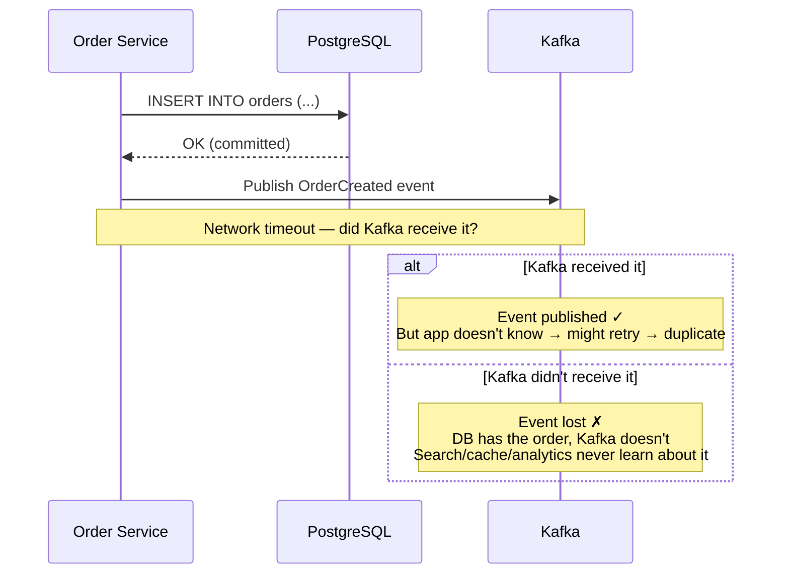
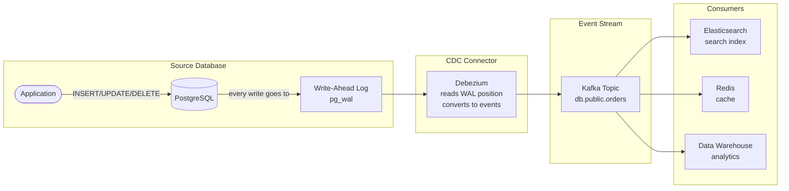
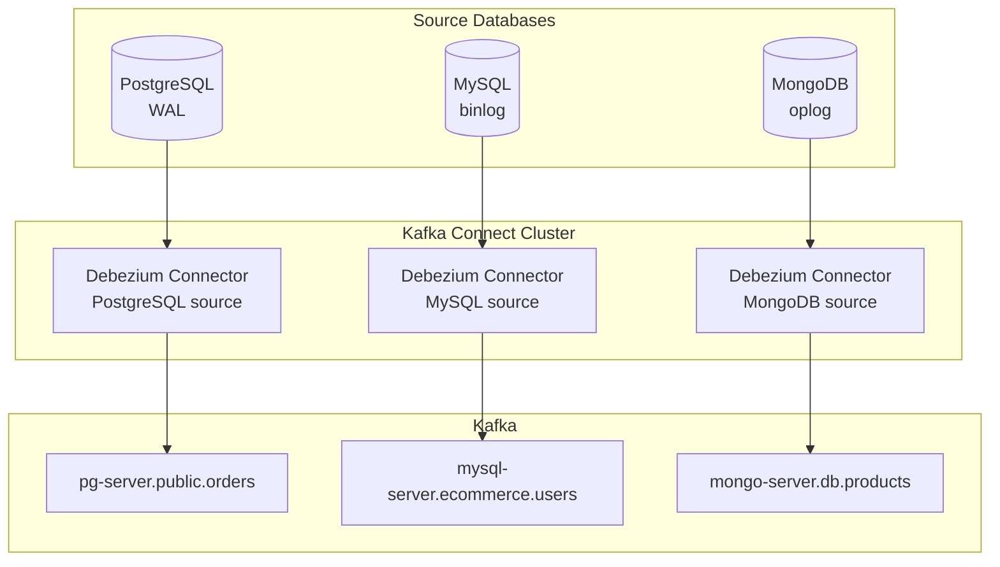
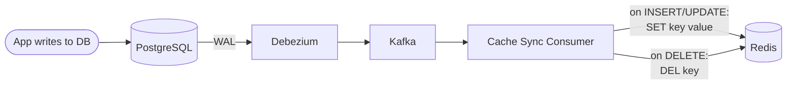
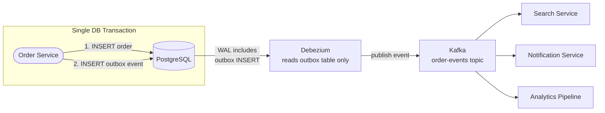
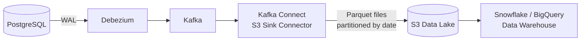
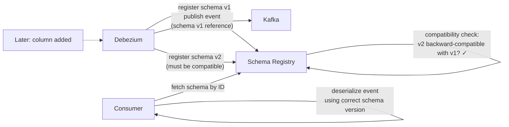
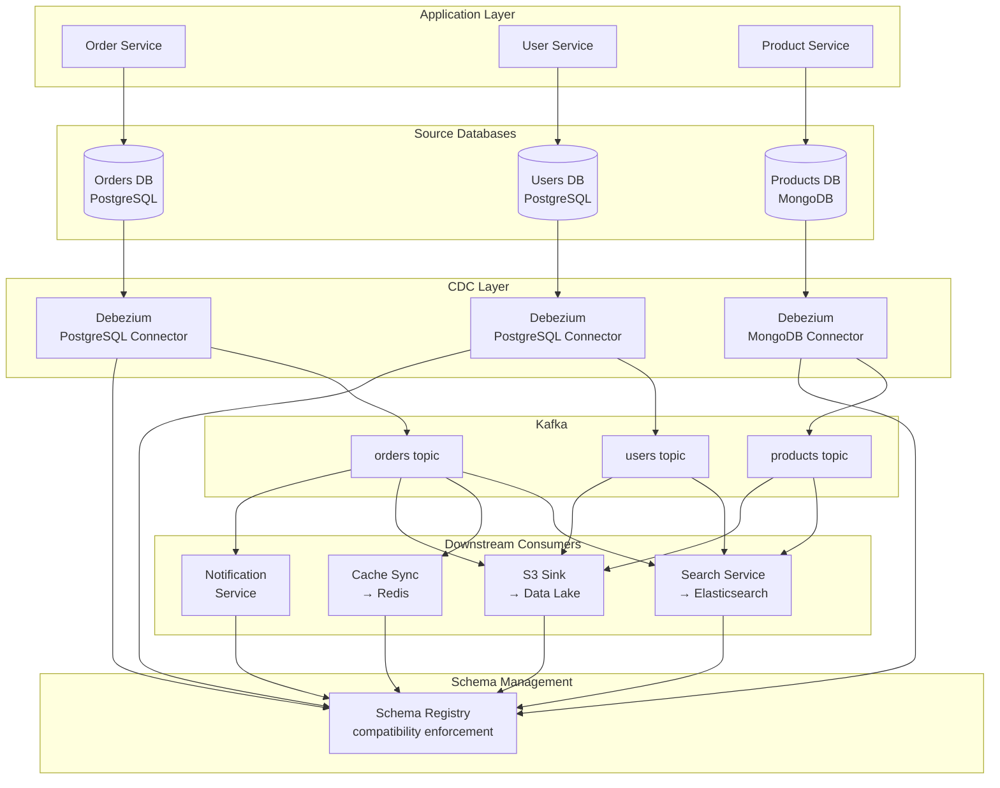

Your order service writes an order to PostgreSQL. A separate search service needs that order in Elasticsearch so users can search their order history. A cache service needs it in Redis for fast lookups. An analytics pipeline needs it in the data warehouse for reporting. The naive approach: the order service publishes an event to Kafka after every database write. But what happens when the database write succeeds and the Kafka publish fails? The order exists in the database but is invisible to search, cache, and analytics. Or worse — the Kafka publish succeeds but the database transaction rolls back. Now search shows an order that doesn't exist. **You can't reliably keep two systems in sync by writing to both from application code.** CDC solves this by reading changes directly from the database's own replication log — the single source of truth — and streaming them to downstream systems.

## The Problem: Dual Writes Are Unreliable

The "dual write" problem appears whenever application code tries to update two systems atomically:



```
Failure scenarios for dual writes:

  1. DB succeeds, Kafka fails:
     → Order in DB, not in search/cache/analytics
     → Data inconsistency until someone notices

  2. DB fails, Kafka succeeds:
     → Event published for an order that doesn't exist
     → Search shows a phantom order

  3. DB succeeds, Kafka succeeds, but app crashes before confirming:
     → App retries on restart → duplicate event published
     → Downstream systems process the order twice

  4. DB succeeds, app publishes to Kafka, then DB transaction rolls back:
     → Kafka has an event for a rolled-back transaction
     → This is the worst case — extremely hard to detect
```

**The outbox pattern** (covered in the [Outbox Pattern](../../distributed/outbox-pattern) post) solves this by writing the event to an outbox table in the same database transaction. But someone still needs to **read the outbox table and publish to Kafka**. This is exactly what CDC does — and it can do it for any table, not just the outbox.

## What CDC Does

Change Data Capture reads the database's internal **transaction log** (MySQL binlog, PostgreSQL WAL, MongoDB oplog) and streams every row-level change (INSERT, UPDATE, DELETE) as a structured event to a downstream system — typically Kafka.



**Why reading the transaction log is reliable:**

The transaction log is how the database itself ensures durability and replication. Every committed transaction is in the log. Every rolled-back transaction is not. By reading the log, CDC captures **exactly the committed changes** — no duplicates from retries, no phantom events from rolled-back transactions, no missed writes from failed publishes.

```
Application writes to DB → DB writes to WAL (for its own durability)
                          → CDC reads WAL (piggybacks on the DB's own mechanism)
                          → CDC publishes to Kafka

The application doesn't need to publish anything — CDC extracts events
from the database's internal log automatically.
```

## How Database Logs Work

### PostgreSQL: Write-Ahead Log (WAL)

PostgreSQL writes every change to the WAL **before** applying it to data pages. This is how it survives crashes — on recovery, it replays the WAL to reconstruct committed transactions.

CDC uses **logical replication** (PostgreSQL 10+) to read the WAL as structured change events:

```
WAL entry for an INSERT:

  LSN: 0/1A3B4C0    (Log Sequence Number — position in the WAL)
  Transaction: 42857
  Relation: public.orders
  Operation: INSERT
  New tuple: {
    id: 12345,
    user_id: 42,
    amount: 49.99,
    status: "pending",
    created_at: "2026-04-25T10:30:00Z"
  }
```

```sql
-- Enable logical replication in PostgreSQL
-- postgresql.conf:
--   wal_level = logical
--   max_replication_slots = 4

-- Create a replication slot for Debezium
SELECT pg_create_logical_replication_slot('debezium_slot', 'pgoutput');

-- Debezium connects as a replication client and reads from this slot
-- The slot tracks how far Debezium has read — no data loss if Debezium restarts
```

### MySQL: Binary Log (binlog)

MySQL's binlog records every data-modifying statement (or row change in ROW format). CDC reads the binlog in the same way a MySQL replica would.

```
binlog entry for an UPDATE:

  Position: mysql-bin.000042:1847
  Event: UPDATE_ROWS
  Table: ecommerce.orders
  Before: {id: 12345, status: "pending", amount: 49.99}
  After:  {id: 12345, status: "shipped", amount: 49.99}
```

### MongoDB: Oplog

MongoDB's oplog (operation log) is a capped collection that records every write operation. CDC tails this like a Kafka consumer tails a topic.

## Debezium: The Standard CDC Tool

Debezium is the most widely used open-source CDC platform. It runs as a **Kafka Connect connector** — a plugin in the Kafka Connect framework that continuously streams database changes to Kafka topics.



### Debezium Event Structure

Every change event contains the **before** state, the **after** state, the operation type, and metadata:

```json
{
  "schema": { ... },
  "payload": {
    "before": {
      "id": 12345,
      "status": "pending",
      "amount": 49.99
    },
    "after": {
      "id": 12345,
      "status": "shipped",
      "amount": 49.99
    },
    "source": {
      "connector": "postgresql",
      "db": "ecommerce",
      "schema": "public",
      "table": "orders",
      "lsn": 27396632,
      "txId": 42857,
      "ts_ms": 1714041000000
    },
    "op": "u",
    "ts_ms": 1714041000123
  }
}
```

| Field | Value | Meaning |
|-------|-------|---------|
| `op` | `"c"` | CREATE (INSERT) |
| `op` | `"u"` | UPDATE |
| `op` | `"d"` | DELETE |
| `op` | `"r"` | READ (initial snapshot) |
| `before` | Previous row state | `null` for INSERTs |
| `after` | New row state | `null` for DELETEs |
| `source.lsn` | Log Sequence Number | Position in the WAL — enables exactly-once tracking |

### Debezium Connector Configuration

```json
{
  "name": "orders-connector",
  "config": {
    "connector.class": "io.debezium.connector.postgresql.PostgresConnector",
    "database.hostname": "db-primary.internal",
    "database.port": "5432",
    "database.user": "debezium",
    "database.password": "${secrets.db_password}",
    "database.dbname": "ecommerce",
    "topic.prefix": "pg-server",
    "table.include.list": "public.orders,public.users",
    "slot.name": "debezium_orders",
    "plugin.name": "pgoutput",
    "snapshot.mode": "initial",
    "transforms": "route",
    "transforms.route.type": "io.debezium.transforms.ByLogicalTableRouter",
    "transforms.route.topic.regex": "(.*)orders(.*)",
    "transforms.route.topic.replacement": "order-events"
  }
}
```

### Initial Snapshot

When a CDC connector starts for the first time, the existing data in the table hasn't been through the log yet. Debezium performs an **initial snapshot** — it reads the entire table and emits each row as a `"r"` (read) event. After the snapshot completes, it switches to streaming mode and reads only new changes from the WAL.

```
Startup sequence:
  1. Lock table briefly to get a consistent snapshot point
  2. Read all existing rows → emit as "r" events to Kafka
  3. Note the current WAL position
  4. Release lock
  5. Start streaming changes from the noted WAL position → "c"/"u"/"d" events

  Result: Kafka topic contains the complete table state + ongoing changes
```

## Use Cases

### 1. Cache Invalidation



**Problem:** Cache-aside pattern requires the app to update Redis explicitly. If the app forgets (bug) or crashes before updating Redis, the cache is stale. Invalidation logic is scattered across every code path that writes to the DB.

**CDC solution:** A single consumer reads change events from Kafka and updates Redis automatically. On `INSERT`/`UPDATE`/snapshot-read events, the consumer writes the row data to a Redis hash keyed by the record's primary key (with a TTL). On `DELETE` events, it removes the key. Every database write — from any code path, any service, even manual SQL — flows through the WAL and reaches Redis. No code changes needed in the application.

### 2. Search Index Sync

**Problem:** Elasticsearch must reflect database changes within seconds. The app could call the Elasticsearch API after every DB write, but that's another dual-write problem.

**CDC solution:** Debezium streams changes to Kafka. An Elasticsearch sink connector (or a custom consumer) reads events and indexes documents on `INSERT`/`UPDATE`, and deletes documents on `DELETE`. The consumer maps the CDC event's `after` payload to an Elasticsearch document, using the row's primary key as the document ID.

### 3. Outbox Pattern with CDC

The cleanest combination: the application writes business data + an outbox event in a single database transaction. Debezium reads the outbox table and publishes the event to Kafka. No polling, no dual writes.



The application writes the business data (e.g., an order row) and an outbox event row in a **single database transaction**. Debezium is configured to capture only the `outbox_events` table and uses the **Outbox Event Router** transform to route events to the correct Kafka topic based on the `aggregate_type` field.

### 4. Data Lake / Warehouse Ingestion

CDC streams database changes to S3 (via Kafka Connect S3 Sink) in Parquet format, building a continuously-updated data lake:



This replaces nightly batch ETL with **near-real-time ingestion** — the warehouse is minutes behind the production database instead of hours.

## Schema Evolution

As the application evolves, database schemas change: columns are added, renamed, or removed. CDC events must handle this gracefully — old consumers receiving new-format events and new consumers receiving old-format events.

### The Problem

```
Week 1: orders table has columns (id, user_id, amount, status)
Week 3: add column "currency" (default: "USD")
Week 5: rename "amount" to "total_amount"

Consumer deployed in Week 1 receives a Week 5 event:
  {id: 123, user_id: 42, total_amount: 49.99, currency: "USD", status: "pending"}
  → Consumer code: event["amount"] → KeyError! Consumer crashes.
```

### Compatibility Rules

| Compatibility | Rule | Example |
|--------------|------|---------|
| **Forward compatible** | Old consumers can read new events (new events may have extra fields) | Add a column → old consumers ignore the new field |
| **Backward compatible** | New consumers can read old events (old events may lack some fields) | New consumer handles missing `currency` with a default value |
| **Full compatible** | Both directions work | Only add optional fields with defaults; never remove or rename |

### Schema Registry

Debezium integrates with **Confluent Schema Registry** (or Apicurio) to enforce compatibility rules:



Consumers should defensively handle schema changes: use `.get()` with defaults for new fields (forward compatibility), check for renamed fields by trying both old and new names (backward compatibility), and never assume a field exists.

**Rule of thumb:** Only make **additive** changes (add columns with defaults, add new tables). Never rename or remove columns in production. If you must, create a new column, backfill it, migrate consumers, then drop the old column — over weeks, not in one deploy.

## CDC vs Alternatives

| Approach | How it works | Pros | Cons |
|----------|-------------|------|------|
| **Application-level events** | App publishes to Kafka explicitly after DB write | Full control over event shape; no DB dependency | Dual-write problem; events can diverge from DB state |
| **Polling** | Consumer queries DB on a timer: `WHERE updated_at > last_check` | Simple; no log access needed | Latency = poll interval; misses deletes; `updated_at` must exist on every table; load on DB |
| **Database triggers** | DB trigger fires on INSERT/UPDATE/DELETE and writes to an event table | Guaranteed to capture every change | Triggers add write latency; complex to manage; DB-specific; hard to scale |
| **CDC (log-based)** | Read the database's transaction log directly | No application changes; captures all changes including manual SQL; no write overhead; exactly the committed changes | Requires DB log access; schema-coupled events; operational complexity (Debezium, Kafka Connect) |

## Production Considerations

### Replication Slot Management (PostgreSQL)

PostgreSQL replication slots track how far a consumer has read the WAL. If the consumer stops (Debezium crashes, network partition), the slot prevents PostgreSQL from removing unread WAL segments. **If Debezium is down for too long, WAL segments accumulate and fill the disk.**

```sql
-- Monitor replication slot lag
SELECT slot_name,
       pg_wal_lsn_diff(pg_current_wal_lsn(), confirmed_flush_lsn)
       AS lag_bytes
FROM pg_replication_slots;

-- Alert if lag exceeds threshold (e.g., 1 GB)
-- If Debezium is permanently stuck, drop the slot to prevent disk full:
-- SELECT pg_drop_replication_slot('debezium_orders');
-- (This means Debezium must re-snapshot when it restarts)
```

### Monitoring

| Metric | What to watch | Alert threshold |
|--------|--------------|-----------------|
| **Replication slot lag** | Bytes of unread WAL | > 500 MB → Debezium is falling behind |
| **Event latency** | Time from DB commit to Kafka publish | > 10 seconds → CDC pipeline stalled |
| **Connector status** | Debezium connector state (RUNNING/FAILED) | Any FAILED state → immediate alert |
| **Kafka consumer lag** | Downstream consumers falling behind CDC topic | Growing lag → consumer can't keep up |
| **Disk usage on DB server** | WAL accumulation from stalled replication slot | > 80% → risk of disk full |

### Handling Debezium Failures

```
Scenario: Debezium crashes at WAL position 1000

  1. Debezium records its last committed offset in Kafka Connect
  2. On restart, Debezium resumes from offset 1000
  3. Events 1000+ are re-read from the WAL and re-published to Kafka
  4. Downstream consumers receive duplicates for events 1000+
  5. Consumers must be IDEMPOTENT (deduplicate by event ID or source LSN)

  This is at-least-once delivery — same as the outbox pattern.
  Exactly-once requires idempotent consumers.
```

## End-to-End Architecture




**Interview tip:** When discussing how to keep multiple systems in sync (cache, search index, data warehouse), say: "I'd use Change Data Capture with Debezium reading the PostgreSQL WAL. Every committed row change — INSERT, UPDATE, DELETE — is captured from the transaction log and published to a Kafka topic. This avoids the dual-write problem because the application only writes to the database; CDC extracts events from the DB's own replication log, which guarantees we see exactly the committed changes. Downstream consumers (Elasticsearch for search, Redis for cache, S3 for the data lake) each read from the Kafka topic independently. For the outbox pattern, the app writes business data and an outbox event in one transaction; Debezium reads the outbox table and publishes to Kafka. Consumers must be idempotent because CDC provides at-least-once delivery — if Debezium restarts, it re-reads from the last committed WAL position and may republish events. Schema evolution is handled via Schema Registry with backward-compatible changes only."

