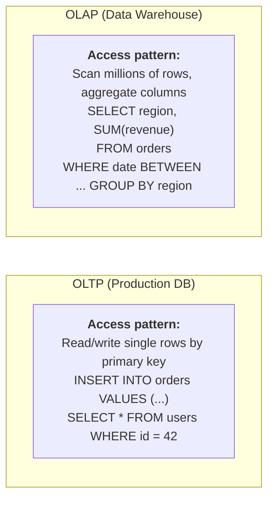
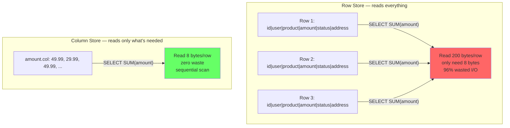
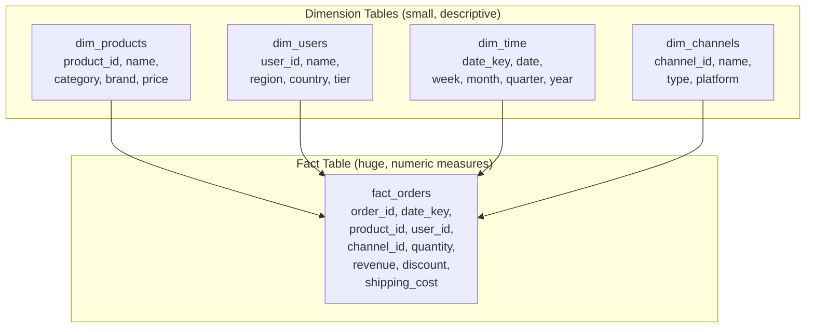
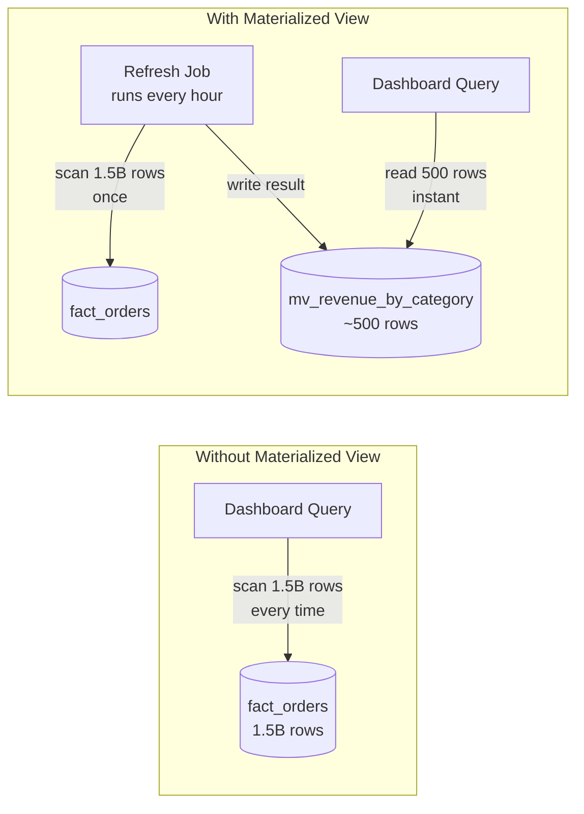
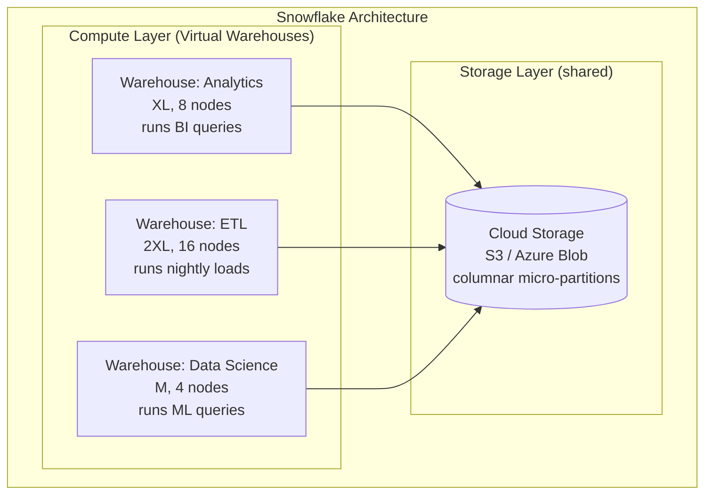
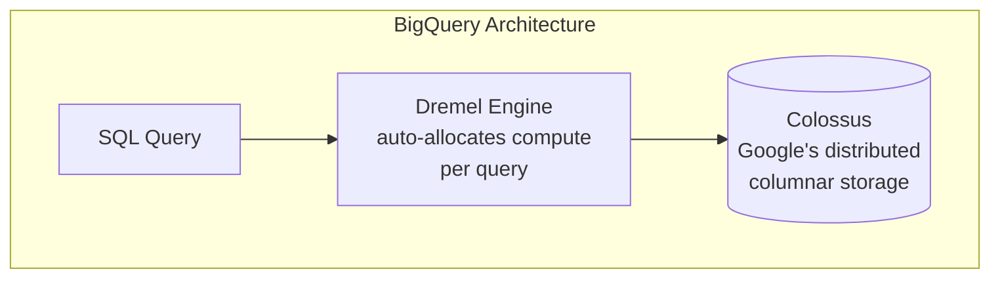
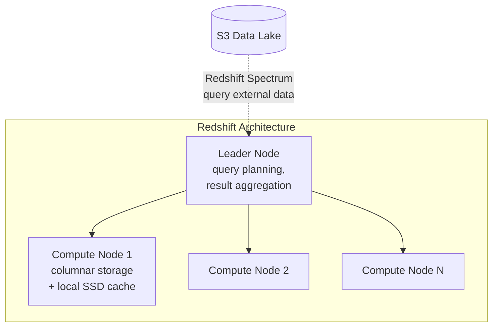
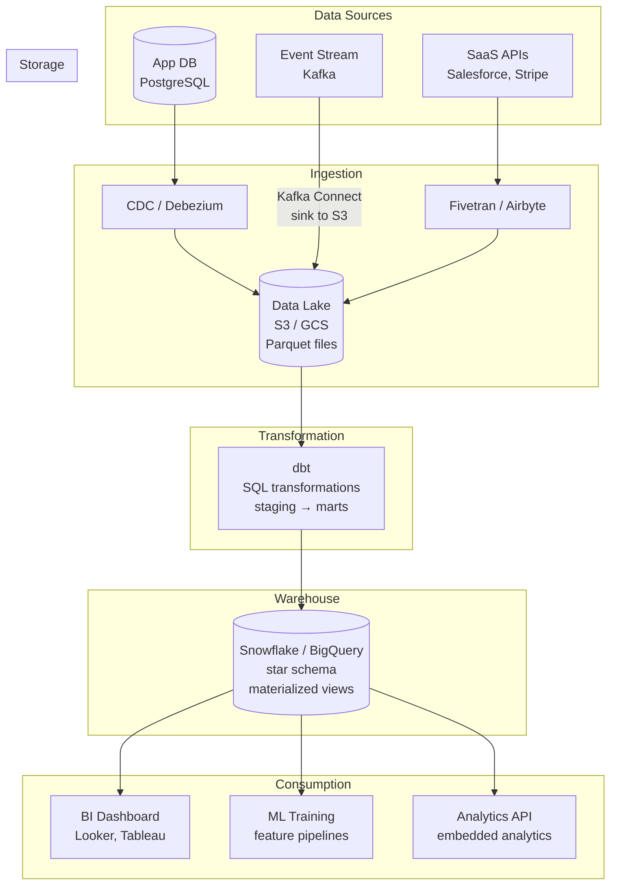

Your e-commerce platform's production PostgreSQL database handles 10,000 transactions per second. The analytics team wants to run a query: "What was the total revenue per product category per region for the last 12 months, broken down by week?" This query joins the `orders` table (2 billion rows) with `products` (500K rows), `users` (50M rows), and `regions` (200 rows), then groups by three dimensions and aggregates across 52 weeks. On the production database, this query takes **45 minutes** — during which it holds locks, saturates I/O, and slows every checkout transaction. The DBA kills the query. **The production database was never designed for this type of workload.** You need a separate system optimized for analytical queries — a data warehouse.

## OLTP vs OLAP: Two Fundamentally Different Workloads

The core insight: transactional workloads (OLTP) and analytical workloads (OLAP) have **opposite** access patterns, and a system optimized for one is terrible at the other.



| Property | OLTP (PostgreSQL, MySQL) | OLAP (Snowflake, BigQuery, Redshift) |
|----------|--------------------------|--------------------------------------|
| **Primary operation** | INSERT, UPDATE, DELETE single rows | SELECT with aggregations over millions of rows |
| **Query pattern** | Point lookups by primary key, small range scans | Full table scans, joins across large tables, GROUP BY |
| **Rows per query** | 1–100 | Millions–billions |
| **Columns per query** | All columns of the row (SELECT *) | 3–10 columns out of 50+ (SELECT revenue, region, date) |
| **Concurrency** | Thousands of short transactions/second | Tens of complex queries running for seconds–minutes |
| **Latency target** | < 10ms per query | Seconds to minutes per query (acceptable for analytics) |
| **Data freshness** | Real-time (current state) | Hours old (loaded via ETL/ELT) |
| **Storage format** | Row-oriented (entire row stored together) | Column-oriented (each column stored separately) |
| **Indexes** | B-tree, hash (essential for point lookups) | Minimal — full column scans are the norm |
| **Schema** | Normalized (3NF — minimize redundancy) | Denormalized (star/snowflake — minimize joins) |

### Why You Can't Use One System for Both

```
Running an OLAP query on an OLTP database:

  SELECT category, region, DATE_TRUNC('week', order_date), SUM(amount)
  FROM orders
  JOIN products ON orders.product_id = products.id
  JOIN users ON orders.user_id = users.id
  GROUP BY 1, 2, 3
  ORDER BY 4 DESC;

  Problems:
  1. Row storage: reads ALL columns of every order row, even though we only
     need 4 columns → 10× more I/O than necessary
  2. No columnar compression: 2 billion order amounts stored as individual
     8-byte floats → 16 GB just for the amount column
  3. Locks: long-running scan competes with transaction INSERT/UPDATE
  4. Buffer pool pollution: analytics scan evicts hot transactional data from cache
  5. Index useless: no index helps a full-table aggregation scan
```

## Columnar Storage: Why It's 10–100× Faster for Analytics

### The Problem Row Storage Creates for Analytics

In a row-oriented database, an entire row is stored contiguously on disk:

```
Row storage (PostgreSQL, MySQL):

  Page 1: [order_id=1, user_id=42, product_id=7, amount=49.99, status="shipped", address="123 Main St", ...]
  Page 2: [order_id=2, user_id=18, product_id=3, amount=29.99, status="delivered", address="456 Oak Ave", ...]
  Page 3: [order_id=3, user_id=42, product_id=7, amount=49.99, status="pending", address="123 Main St", ...]

  Query: SELECT SUM(amount) FROM orders
  → Must read EVERY column of EVERY row to extract just the 'amount' column
  → Reads 200 bytes per row when we only need 8 bytes (the amount)
  → 96% of I/O is wasted on columns we don't need
```

### How Columnar Storage Solves This

In a columnar database, each column is stored separately and contiguously:

```
Columnar storage (Redshift, BigQuery, Parquet):

  File: order_id.col  → [1, 2, 3, 4, 5, 6, ...]        (contiguous int64 values)
  File: user_id.col   → [42, 18, 42, 7, 18, 42, ...]    (contiguous int64 values)
  File: amount.col    → [49.99, 29.99, 49.99, 19.99, ...] (contiguous float64 values)
  File: status.col    → ["shipped", "delivered", "pending", ...]
  File: address.col   → ["123 Main St", "456 Oak Ave", ...]

  Query: SELECT SUM(amount) FROM orders
  → Read ONLY the amount.col file
  → Skip order_id, user_id, status, address entirely
  → Read 8 bytes per row instead of 200 → 25× less I/O
```



### Columnar Compression

Values in the same column tend to be similar — the `status` column might be 90% "shipped" and 10% "pending." This makes column data **highly compressible**:

```
status column (1 billion rows):

  Without compression:
    ["shipped", "shipped", "shipped", "pending", "shipped", ...]
    × 1 billion = ~8 GB (avg 8 bytes per string)

  With dictionary encoding:
    Dictionary: {0: "shipped", 1: "pending", 2: "returned"}
    Data: [0, 0, 0, 1, 0, 0, 0, 0, 1, 0, 2, 0, ...]
    → 1 byte per value instead of 8 → 1 GB (8× compression)

  With run-length encoding (if sorted):
    "shipped" × 900M, "pending" × 90M, "returned" × 10M
    → 3 entries instead of 1 billion → negligible size
```

| Compression technique | How it works | Best for |
|----------------------|-------------|----------|
| **Dictionary encoding** | Map distinct values to integers; store integers | Low-cardinality columns (status, country, category) |
| **Run-length encoding (RLE)** | Store (value, count) pairs for consecutive duplicates | Sorted columns with many repeats |
| **Delta encoding** | Store differences between consecutive values | Timestamps, monotonically increasing IDs |
| **Bit packing** | Use minimum bits needed (3 bits for 8 distinct values) | Small integer ranges |

**Production result:** Columnar storage with compression typically achieves **5–20× compression** over row storage. A 10 TB dataset in PostgreSQL becomes 500 GB–2 TB in a columnar warehouse — and queries only read the columns they need, so a query touching 5 out of 50 columns reads 10× less compressed data.

### The Trade-off: Writes Are Slower

```
Row store INSERT (fast):
  Write one row = append all columns to one location → one sequential write

Column store INSERT (slow):
  Write one row = update N separate column files → N random writes
  For a table with 50 columns: 50 separate file appends per row

  Solution: batch writes
  - Accumulate rows in memory (write buffer)
  - Periodically flush as a new column chunk (micro-batch)
  - This is why warehouses are loaded via bulk ETL, not row-by-row inserts
```

## Star Schema: Organizing Data for Analytics

### The Problem with Normalized Schemas in Analytics

A normalized OLTP schema minimizes redundancy through foreign keys and many small tables. Querying it requires multiple JOINs:

```sql
-- Normalized: 5 JOINs to answer "revenue by category by region"
SELECT c.name AS category, r.name AS region, SUM(oi.amount)
FROM order_items oi
JOIN orders o ON oi.order_id = o.id
JOIN products p ON oi.product_id = p.id
JOIN categories c ON p.category_id = c.id
JOIN users u ON o.user_id = u.id
JOIN regions r ON u.region_id = r.id
GROUP BY c.name, r.name;
```

Each JOIN is expensive on billions of rows. Star schema eliminates most JOINs by **pre-joining and denormalizing** the data.

### Star Schema Structure



| Component | What it contains | Size | Example |
|-----------|-----------------|------|---------|
| **Fact table** | Measurable events (transactions, clicks, impressions) with foreign keys to dimensions | Billions of rows | `fact_orders`: one row per order line item |
| **Dimension tables** | Descriptive attributes for filtering and grouping | Thousands to millions of rows | `dim_products`: product name, category, brand |

```sql
-- Star schema: same query, only 2 simple JOINs on small dimension tables
SELECT
    p.category,
    u.region,
    t.week,
    SUM(f.revenue) AS total_revenue
FROM fact_orders f
JOIN dim_products p ON f.product_id = p.product_id
JOIN dim_users u ON f.user_id = u.user_id
JOIN dim_time t ON f.date_key = t.date_key
WHERE t.year = 2025
GROUP BY p.category, u.region, t.week
ORDER BY total_revenue DESC;
```

**Why star schema is faster:**
- Fact table JOINs to small dimension tables (hash join in memory — fast)
- No chain of JOINs through intermediate tables
- Dimension tables fit entirely in memory (100K products × 200 bytes = 20 MB)
- Columnar storage on the fact table: `SUM(f.revenue)` reads only the revenue column

### Slowly Changing Dimensions (SCD)

A user changes their region from "US-West" to "US-East." Should historical orders show the old region or the new one?

| SCD Type | How it handles changes | Example |
|----------|----------------------|---------|
| **Type 1: Overwrite** | Update the dimension row in place | User's region becomes "US-East"; all historical orders now show "US-East" |
| **Type 2: Add new row** | Insert new row with new values + valid_from/valid_to dates | Two rows: "US-West" (2020–2025), "US-East" (2025–now). Historical orders JOIN to the correct version |
| **Type 3: Add new column** | Add `previous_region` column | One row with `region="US-East"`, `previous_region="US-West"`. Only tracks one change |

Type 2 is the most common in data warehouses because it preserves full history — essential for accurate historical reporting.

## Materialized Views

### The Problem They Solve

A dashboard shows "revenue by category for the last 30 days." This query scans 30 days × 50M orders/day = 1.5 billion rows every time someone loads the dashboard. With 100 dashboard users refreshing every minute, that's 100 full scans per minute — absurd.

### How They Work

A materialized view is a **precomputed, stored result** of a query. Instead of recomputing from scratch, the dashboard reads the stored result.



```sql
-- Create materialized view
CREATE MATERIALIZED VIEW mv_revenue_by_category AS
SELECT
    p.category,
    DATE_TRUNC('day', t.date) AS day,
    SUM(f.revenue) AS total_revenue,
    COUNT(*) AS order_count
FROM fact_orders f
JOIN dim_products p ON f.product_id = p.product_id
JOIN dim_time t ON f.date_key = t.date_key
WHERE t.date >= CURRENT_DATE - INTERVAL '30 days'
GROUP BY p.category, DATE_TRUNC('day', t.date);

-- Dashboard reads from the materialized view (instant)
SELECT * FROM mv_revenue_by_category
WHERE category = 'Electronics'
ORDER BY day;

-- Refresh periodically (hourly, or after new data loads)
REFRESH MATERIALIZED VIEW mv_revenue_by_category;
```

### Trade-offs

| Property | Regular query | Materialized view |
|----------|-------------|-------------------|
| **Freshness** | Always current | Stale by refresh interval (minutes–hours) |
| **Query latency** | Seconds–minutes (full scan) | Milliseconds (pre-computed) |
| **Storage cost** | None (computed on the fly) | Additional storage for the result |
| **Compute cost** | High per query | High per refresh, but amortized across many reads |
| **Best for** | Ad-hoc exploration, one-off queries | Dashboards, repeated queries, known access patterns |

## Managed Data Warehouse Services

### The Problem Self-Managed Warehouses Have

Running your own columnar warehouse (e.g., ClickHouse on EC2) means managing:
- Cluster sizing and scaling (add nodes for more data)
- Storage provisioning (disks fill up, need rebalancing)
- Query concurrency (too many concurrent queries → resource contention)
- Maintenance (compaction, vacuuming, index rebuilds)
- Availability (replication, failover, backup)

Managed services handle all of this. The three major options take fundamentally different architectural approaches.

### Snowflake: Separated Storage and Compute



**Key innovation:** Compute and storage scale independently. You can spin up a 16-node warehouse for a 2-hour ETL job, then shut it down — paying only for those 2 hours. Meanwhile, a small always-on warehouse serves dashboard queries against the same data.

| Property | Detail |
|----------|--------|
| **Storage** | Data stored in S3-like cloud storage in columnar micro-partitions; pay for TB stored |
| **Compute** | Virtual warehouses (EC2 clusters) spun up/down on demand; pay per second of compute |
| **Concurrency** | Multiple warehouses query the same data simultaneously without contention |
| **Scaling** | Add warehouses instantly for more concurrency; resize warehouses for faster individual queries |
| **Time travel** | Query data as it existed at any point in the last 90 days (undrop table, rollback) |

### BigQuery: Serverless



**Key innovation:** No cluster to manage. Submit a query, Google allocates compute automatically, you pay per TB scanned. No idle resources, no sizing decisions.

| Property | Detail |
|----------|--------|
| **Pricing** | $5 per TB scanned (on-demand) or flat-rate slots ($2K+/month for reserved compute) |
| **Scaling** | Automatic — Google allocates thousands of workers per query transparently |
| **Concurrency** | High — each query gets its own compute allocation |
| **Schema** | Supports nested/repeated fields (JSON-like) natively — no need to flatten |
| **Streaming inserts** | Real-time streaming ingestion (not just batch) — rows queryable in seconds |

### Redshift: Tight AWS Integration



| Property | Detail |
|----------|--------|
| **Architecture** | Shared-nothing MPP (Massively Parallel Processing); fixed cluster of nodes |
| **Storage** | Data stored on local disks of compute nodes (coupled) — or Redshift Serverless for separation |
| **Scaling** | Resize cluster (add nodes); Redshift Serverless auto-scales |
| **Spectrum** | Query data directly in S3 without loading it into Redshift — extends to data lake |
| **Best for** | AWS-heavy shops already using S3, Glue, EMR; tight integration with AWS ecosystem |

### Service Comparison

| Property | Snowflake | BigQuery | Redshift |
|----------|-----------|----------|----------|
| **Pricing model** | Compute (per-second) + storage (per-TB) | Per-TB scanned (or reserved slots) | Per-node-hour (or serverless) |
| **Storage-compute separation** | Yes (core design) | Yes (serverless) | Partial (Serverless mode) |
| **Auto-scaling** | Manual (but instant) | Fully automatic | Manual (or Serverless) |
| **Concurrency handling** | Multiple warehouses on same data | Automatic slot allocation | WLM queues; limited without Serverless |
| **Real-time ingestion** | Snowpipe (micro-batch, ~1 min) | Streaming inserts (seconds) | Limited (prefer batch COPY) |
| **Multi-cloud** | AWS, Azure, GCP | GCP only (cross-cloud via Omni) | AWS only |
| **Best for** | Multi-cloud, variable workloads, cost optimization | Serverless simplicity, GCP shops, ad-hoc analytics | AWS-native, predictable workloads |

## Data Warehouse in the Broader Architecture



### The Modern Data Stack

| Layer | Tool examples | Purpose |
|-------|--------------|---------|
| **Extract & Load (EL)** | Fivetran, Airbyte, Debezium | Move data from sources to data lake/warehouse |
| **Storage** | S3, GCS (Parquet format) | Cheap, durable storage for raw data |
| **Transform (T)** | dbt, Spark | Clean, model, and aggregate data into star schema |
| **Warehouse** | Snowflake, BigQuery, Redshift | Serve analytical queries with columnar storage |
| **BI / Visualization** | Looker, Tableau, Metabase | Dashboards, reports, ad-hoc exploration |
| **Orchestration** | Airflow, Dagster, Prefect | Schedule and monitor ETL/ELT pipelines |


**ELT, not ETL.** The modern approach loads raw data into the warehouse first (Extract-Load), then transforms it inside the warehouse using SQL (dbt). This is the opposite of traditional ETL, which transformed data before loading. ELT works because modern warehouses (Snowflake, BigQuery) have massive compute — it's cheaper to transform in the warehouse than to maintain a separate ETL cluster.


## When a Data Warehouse Is Overkill

Not every analytical need requires a warehouse:

| Scenario | Better alternative | Why |
|----------|-------------------|-----|
| Simple read replicas handle the load | PostgreSQL read replica | No new infra needed; works if queries are fast enough |
| Real-time dashboards (sub-second) | ClickHouse, Druid, Pinot | Optimized for real-time OLAP; warehouse is too slow for sub-second |
| Small data (< 10 GB) | PostgreSQL with good indexes | Row store is fine at this scale; columnar overhead not worth it |
| Key-value access patterns | Redis, DynamoDB | Warehouse is for scans and aggregations, not point lookups |


**Interview tip:** When analytics storage comes up, say: "I'd separate OLTP and OLAP workloads — the production database handles transactional reads and writes, and a columnar data warehouse handles analytical queries. Columnar storage reads only the columns a query needs, compresses similar values together, and scans terabytes in seconds — compared to row storage where an analytical query wastes 90%+ of I/O reading columns it doesn't need. I'd model the warehouse in a star schema: a central fact table with numeric measures surrounded by small dimension tables for filtering and grouping. For a managed solution, I'd choose Snowflake for its storage-compute separation — I can spin up dedicated compute for ETL without impacting dashboard queries. Data flows in via CDC (Debezium) into a data lake (S3 Parquet), transformed by dbt into star schema models, and served by the warehouse to BI tools."


## Test Your Understanding


**No — denormalization is intentional in warehouse schemas.** The star schema stores `city`, `state`, `country` directly in `dim_customer` even though they could be normalized. This is correct because:

1. **Query performance.** Each additional join in an analytical query adds latency. A dashboard query that joins fact → dim_customer → dim_address → dim_city does 3 joins instead of 1. At terabyte scale, extra joins are expensive.
2. **Query simplicity.** Analysts write `WHERE dim_customer.city = 'NYC'` instead of a 3-table join chain. Simpler queries mean fewer bugs and faster development.
3. **Redundancy is cheap.** Storage in a columnar warehouse is compressed and inexpensive. The "wasted" space from repeating city names is negligible after dictionary encoding.

**When snowflake schema makes sense:** When a dimension is truly massive (millions of rows) and updates frequently. Otherwise, star schema's query simplicity wins.



**This is a communication problem, not a technical one.** Materialized views trade freshness for performance. The fix is layered:

1. **Label the staleness.** Show "Data as of 1:00 PM" on every dashboard powered by materialized views. Users must know the freshness guarantee.
2. **Offer both options.** The live dashboard queries the streaming layer (Flink → Redis) with sub-second freshness. The materialized view powers BI reports optimized for complex joins and aggregations. Different use cases, different freshness SLAs.
3. **Tune refresh frequency.** If 90-minute staleness is unacceptable, reduce the refresh interval to 15 minutes. The trade-off: more frequent refreshes consume more compute credits.

**Key insight:** There's no free lunch. Fresh + fast + cheap — pick two. Materialized views optimize for fast + cheap at the cost of freshness.



**One shared warehouse causes resource contention that degrades every workload:**

1. **ETL blocks BI.** A 2-hour ETL job scanning 10TB of data consumes all compute. Dashboard queries that normally take 2 seconds now take 60 seconds because they're queued behind ETL scans.
2. **Ad-hoc kills predictability.** An analyst runs `SELECT * FROM fact_orders` (no WHERE clause, 5 billion rows). This query consumes the entire warehouse, spiking latency for every other user.
3. **No right size fits all.** ETL needs a large warehouse for 2 hours/day (then idle). BI needs a medium warehouse 8 hours/day. Ad-hoc needs a small warehouse intermittently. One size wastes money during off-peak and underperforms during peak.

**The 3-warehouse approach is actually cheaper** because each is sized for its workload and auto-suspends when idle. The large ETL warehouse runs 2 hours/day, not 24. Storage-compute separation makes this possible — all three read the same data; only compute is independent.

