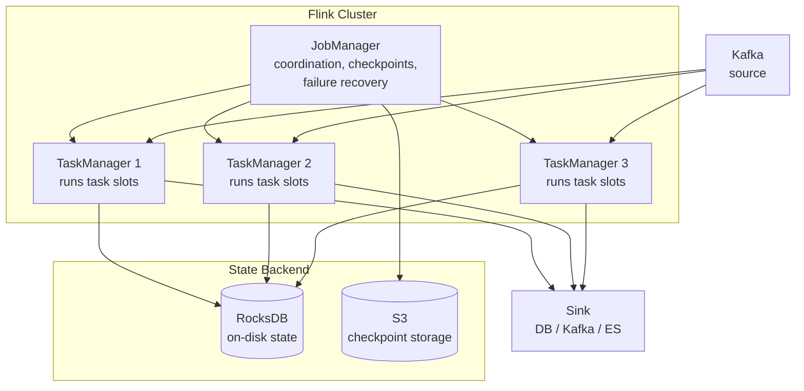
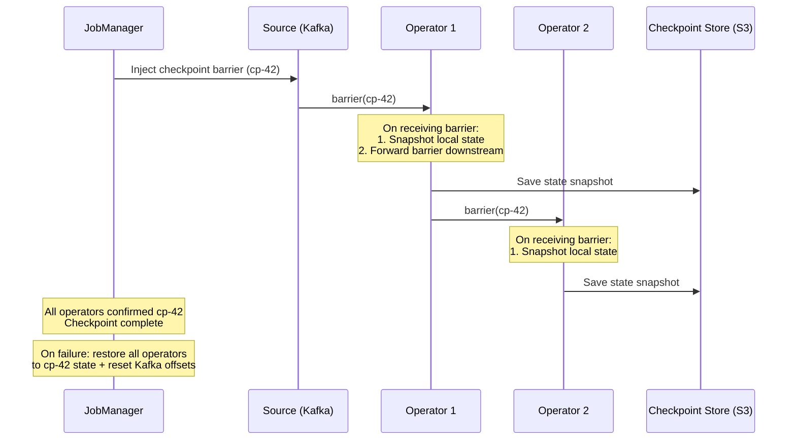
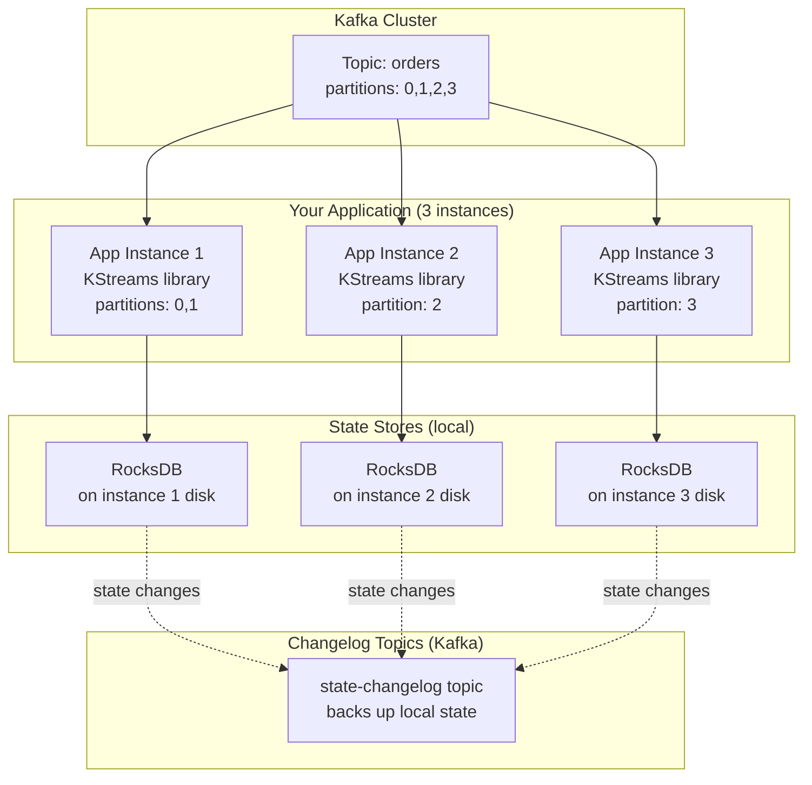
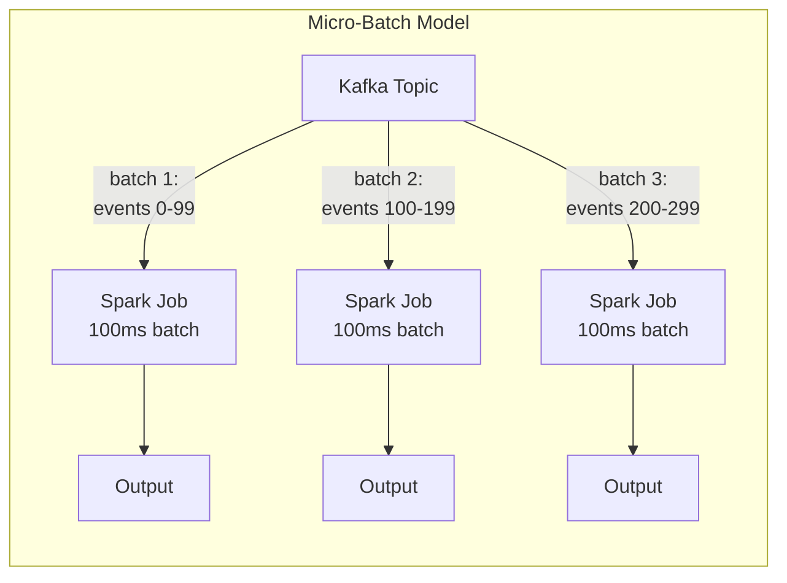
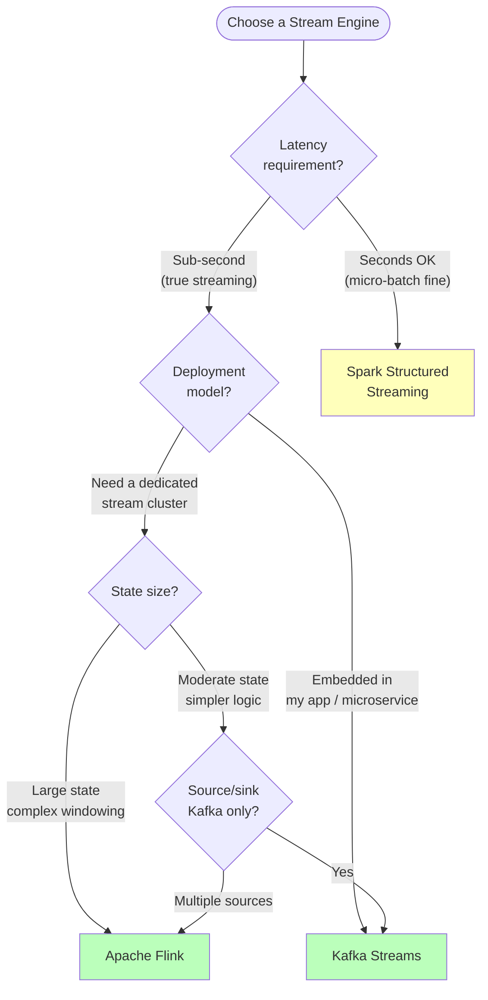

You've decided you need stream processing. Now the question is: **which engine?** Apache Flink, Kafka Streams, Spark Structured Streaming, and Apache Storm are the major options — and they make fundamentally different architectural decisions that determine what you can build, how you operate it, and where it breaks.

This is a deep dive into the internals, trade-offs, and selection criteria for each.

## The Core Problem Every Engine Solves

Every stream processing engine must answer the same five questions:

1. **How is state managed?** Aggregations (counts, sums, joins) require state that persists across events. Where is this state stored, and what happens to it when the processor crashes?
2. **How are exactly-once guarantees achieved?** If the processor crashes mid-event, how do you avoid processing it twice or losing it?
3. **How is out-of-order data handled?** Events arrive late due to network delays. How does the engine know when it's safe to finalize a window?
4. **How does it scale?** When throughput exceeds one machine's capacity, how is work distributed?
5. **How is it deployed and operated?** Does it need its own cluster, or does it run inside an existing one?

## Apache Flink

### Architecture

Flink is a **distributed, stateful stream processor** with a dedicated cluster. It treats streaming as the primary processing model — batch is just streaming over bounded data.



### State Management

Flink embeds state **locally in each TaskManager** using RocksDB (disk-backed key-value store) or the JVM heap. State is co-located with the processing — no network round-trip to an external store.

```java
// Flink stateful processing: count events per user in a 5-minute window
DataStream<Event> events = env
    .addSource(new FlinkKafkaConsumer<>("events", schema, props));

events
    .keyBy(event -> event.getUserId())
    .window(TumblingEventTimeWindows.of(Time.minutes(5)))
    .aggregate(new CountAggregate())
    .addSink(new RedisSink<>(redisConfig));
```

**Why local state matters:** At 1 million events per second, if each event requires a state lookup, local state (RocksDB, ~10µs read) is 100× faster than remote state (Redis, ~1ms round-trip). The difference between 10 seconds of total processing time and 1,000 seconds.

### Checkpointing: How Exactly-Once Works

Flink uses **Chandy-Lamport distributed snapshots** (called "aligned checkpoints") to achieve exactly-once:



**Checkpoint barriers** flow through the data stream like special events. When an operator receives a barrier, it snapshots its state. This creates a **consistent cut** across all operators — the snapshot represents a point where all operators have processed exactly the same set of input events.

**Recovery:** On failure, Flink restores all operators to the last completed checkpoint and resets Kafka consumer offsets to match. Events after the checkpoint are re-processed, but because state was also rolled back, the re-processing produces identical results — exactly-once.

### Event Time and Watermarks

Flink has first-class support for **event-time processing** — windows are based on when events *happened*, not when they *arrive*.

```python
# Flink watermark strategy (conceptual):
# "I expect events to be at most 10 seconds late"

class BoundedOutOfOrdernessWatermarks:
    def __init__(self, max_lateness_seconds=10):
        self.max_lateness = max_lateness_seconds
        self.max_event_time_seen = 0

    def on_event(self, event_time):
        self.max_event_time_seen = max(self.max_event_time_seen,
                                       event_time)

    def current_watermark(self):
        # "All events up to this time have probably arrived"
        return self.max_event_time_seen - self.max_lateness

# Window closes when watermark passes the window end time
# Late events (after watermark) → side output for separate handling
```

### When to Use Flink

| Strength | Detail |
|----------|--------|
| **Complex event processing** | Stateful pattern matching, joins between streams, session windows |
| **Large state** | RocksDB handles state larger than memory (TB-scale per node) |
| **Exactly-once** | Strongest exactly-once guarantees of any engine |
| **Event-time processing** | Watermarks + allowed lateness + side outputs for late data |
| **High throughput + low latency** | True per-event processing (not micro-batch) |

| Weakness | Detail |
|----------|--------|
| **Operational complexity** | Dedicated cluster (JobManager + TaskManagers), checkpoint tuning |
| **Deployment** | Needs YARN, Kubernetes, or standalone cluster — not embeddable |
| **Learning curve** | Rich but complex API; state, timers, watermarks require deep understanding |

## Kafka Streams

### Architecture

Kafka Streams is **not** a cluster — it's a **Java library** that runs inside your application. Each instance of your app is a Kafka Streams processor. Kafka's consumer group protocol handles work distribution automatically.



**Key insight:** Kafka Streams has **no separate cluster to manage**. You deploy it as part of your normal application deployment (Docker container, Kubernetes pod, EC2 instance). Scaling means adding more instances of your app — Kafka rebalances partitions automatically.

### State Management

State is stored locally in RocksDB (like Flink), but **backed by a Kafka changelog topic**. Every state mutation is also written to this topic. On recovery, a new instance rebuilds its state by consuming the changelog.

```java
// Kafka Streams: count orders per customer in real-time
StreamsBuilder builder = new StreamsBuilder();

KStream<String, Order> orders = builder.stream("orders");

KTable<String, Long> orderCounts = orders
    .groupBy((key, order) -> order.getCustomerId())
    .count(Materialized.as("order-counts"));

// The count state is:
// 1. Stored locally in RocksDB (fast reads)
// 2. Backed up to Kafka topic "app-order-counts-changelog"
// 3. Queryable via Interactive Queries (REST API on each instance)

// Expose state via REST API for other services
orderCounts.toStream().to("order-count-results");
```

### Exactly-Once in Kafka Streams

Because both input, output, and state changelog are **Kafka topics**, exactly-once is achieved using Kafka's **transactional API**: read from input topic + update state changelog + write to output topic are wrapped in a single Kafka transaction.

```
Exactly-once processing in Kafka Streams:

  1. Read batch of events from input topic (offsets 100-110)
  2. Process events, update local state store
  3. Begin Kafka transaction:
     a. Write state changes to changelog topic
     b. Write results to output topic
     c. Commit consumer offsets (100-110)
  4. Commit transaction

  If crash before commit: transaction aborted, offsets not committed
  On restart: re-read from offset 100, re-process → same result
```

### When to Use Kafka Streams

| Strength | Detail |
|----------|--------|
| **No separate cluster** | Runs as a library in your app — deploy like any microservice |
| **Kafka-native** | Tightest integration with Kafka; transactions span input/state/output |
| **Simple operations** | No cluster manager, no JobManager — just your app instances |
| **Interactive queries** | Query local state stores via REST API — turns each instance into a queryable cache |

| Weakness | Detail |
|----------|--------|
| **Kafka-only** | Source and sink must be Kafka topics (or use Connect for bridging) |
| **JVM-only** | Java/Kotlin library — no Python, no Go |
| **Limited windowing** | Event-time support exists but less sophisticated than Flink (no side outputs for late data until recent versions) |
| **State recovery time** | Rebuilding state from changelog can take minutes for large state stores |

## Spark Structured Streaming

### Architecture

Spark Structured Streaming treats a stream as an **infinitely growing table**. Internally, it processes data in **micro-batches** — collecting events for a short interval (100ms–minutes), then processing them as a small Spark batch job.



```python
from pyspark.sql import SparkSession
from pyspark.sql import functions as F

spark = SparkSession.builder.appName("StreamingAgg").getOrCreate()

# Read from Kafka as a streaming DataFrame
events = (
    spark.readStream
    .format("kafka")
    .option("kafka.bootstrap.servers", "kafka:9092")
    .option("subscribe", "page-views")
    .load()
    .select(
        F.from_json(F.col("value").cast("string"), schema)
        .alias("data")
    )
    .select("data.*")
)

# Windowed aggregation — same API as batch Spark
page_counts = (
    events
    .withWatermark("event_time", "10 seconds")
    .groupBy(
        F.window("event_time", "5 minutes"),
        "page_url",
    )
    .count()
)

# Write to sink continuously
query = (
    page_counts.writeStream
    .outputMode("update")
    .format("console")  # or "kafka", "jdbc", etc.
    .trigger(processingTime="10 seconds")  # micro-batch every 10s
    .start()
)
```

### When to Use Spark Structured Streaming

| Strength | Detail |
|----------|--------|
| **Unified batch + stream API** | Same DataFrame API for batch and streaming — one codebase |
| **Existing Spark investment** | If you already run Spark for batch, adding streaming is incremental |
| **Rich ecosystem** | SQL, ML, Graph — all usable in streaming context |
| **Exactly-once** | Micro-batch model makes exactly-once simpler (each batch is atomic) |

| Weakness | Detail |
|----------|--------|
| **Micro-batch latency** | Minimum ~100ms latency; typically seconds. True per-event latency impossible |
| **Not ideal for event-time** | Watermark support exists but less mature than Flink |
| **Resource overhead** | Spark's scheduling overhead per micro-batch — inefficient for very low latency |
| **Continuous processing mode** | Experimental (introduced in Spark 2.3, still not production-grade) |

## Apache Storm (Legacy)

Storm was the **first** distributed stream processor (2011, Twitter). It processes events one at a time with very low latency (~1ms). However, it has been largely superseded by Flink for most use cases.

| Property | Storm | Why it lost |
|----------|-------|-------------|
| **Processing model** | True per-event | Flink also does per-event with better APIs |
| **Exactly-once** | Trident layer (complex, slow) | Flink's checkpointing is simpler and faster |
| **State management** | External only (Redis, DB) | Flink/KStreams have built-in local state |
| **Windowing** | Manual implementation | Flink has rich built-in window semantics |
| **Ecosystem** | Declining community | Flink has growing adoption and investment |

**Verdict:** If you see Storm in a legacy system, plan a migration to Flink. For new systems, Storm is not recommended.

## Engine Selection Decision Framework



### Head-to-Head Comparison

| Property | Apache Flink | Kafka Streams | Spark Structured Streaming |
|----------|-------------|---------------|---------------------------|
| **Processing model** | True per-event | True per-event | Micro-batch |
| **Latency** | Low milliseconds | Low milliseconds | 100ms–seconds |
| **Deployment** | Dedicated cluster | Library in your app | Spark cluster |
| **State backend** | RocksDB / heap (local) | RocksDB (local) + Kafka changelog | In-memory / HDFS |
| **Exactly-once** | Checkpoints (Chandy-Lamport) | Kafka transactions | Micro-batch atomicity |
| **Event-time support** | Best-in-class (watermarks, lateness, side outputs) | Good (watermarks, grace periods) | Good (watermarks) |
| **Source/sink flexibility** | Any (Kafka, Kinesis, files, JDBC, ...) | Kafka only (Connect for bridging) | Any (Kafka, files, JDBC, ...) |
| **Language** | Java, Scala, Python (PyFlink) | Java, Kotlin | Python, Scala, Java, SQL |
| **Batch support** | Yes (DataSet API, Table API) | No | Yes (same API as streaming) |
| **Operational complexity** | High (dedicated cluster) | Low (just your app) | Moderate (Spark cluster) |
| **Best for** | Complex CEP, large state, multi-source | Kafka-centric microservices | Teams already on Spark |

### What Production Systems Use

| Company | Engine | Use case |
|---------|--------|----------|
| **Uber** | Flink | Real-time pricing, ETA estimation, dynamic surge |
| **Netflix** | Flink | Real-time personalization, A/B test event processing |
| **Alibaba** | Flink | 1B+ events/s for Singles' Day real-time analytics |
| **LinkedIn** | Kafka Streams + Samza | Near-real-time feed updates, notification triggering |
| **Spotify** | Flink + Spark | Flink for real-time metrics, Spark for batch ML |
| **Airbnb** | Spark Streaming | Search ranking feature updates, pricing signals |
| **Twitter** | Flink (migrated from Storm) | Real-time trend detection, content ranking |


**Interview tip:** When asked about stream processing engine choice, say: "For complex event processing with large state and sub-second latency — like fraud detection or real-time joins — I'd use Flink. It has the strongest exactly-once guarantees via distributed checkpointing, and RocksDB state can scale to terabytes per node. For simpler Kafka-centric microservices — like maintaining a real-time materialized view or enriching events — I'd use Kafka Streams because it's a library, not a cluster. I deploy it as a normal microservice and Kafka handles partition assignment. For teams already invested in Spark that need near-real-time (seconds, not milliseconds), Spark Structured Streaming lets them use the same DataFrame API for both batch and streaming. I'd avoid Storm for new systems — Flink has replaced it."

