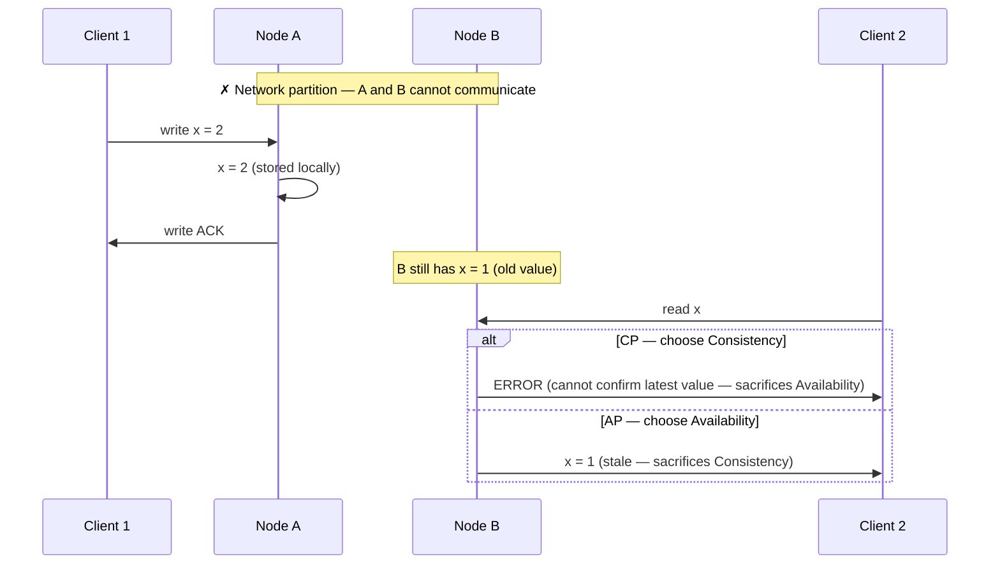

The CAP theorem states that a distributed system can satisfy at most two of three properties simultaneously: **Consistency**, **Availability**, and **Partition Tolerance**. During a network partition, you must choose between consistency and availability — you cannot have both.

## The Three Properties

### Consistency (C)

Every read returns the most recent write or an error. All nodes see the same data at the same time.

This is **linearizability** in CAP terms — the system behaves as if there is one copy of the data, and every operation takes effect atomically at some point between its start and completion. It is not the same as eventual consistency.


**CAP "consistency" ≠ ACID "consistency".** CAP's C means linearizability — every read sees the most recent write across all nodes. ACID's C means the database transitions between valid states (constraints satisfied). A system can be ACID-consistent (all constraints hold) while being CAP-inconsistent (replicas return stale data). Confusing the two in an interview is a common red flag.


```
Node A  ──── write x=2 ────►  Node A: x=2
                               Node B: x=2   ← must reflect the write immediately
                               Node C: x=2

Any read from any node must return x=2 after the write commits.
A read returning x=1 (old value) is a consistency violation.
```

### Availability (A)

Every request to a non-failing node receives a response — not an error, not a timeout. The response does not need to contain the most recent data; it just cannot be an error.

**Key nuance:** A system is available in the CAP sense even if it returns stale data, as long as it responds. A system that returns "503 Service Unavailable" or times out during a partition is not available.

### Partition Tolerance (P)

The system continues operating even when the network drops or delays messages between nodes. Nodes cannot communicate with each other during a partition, but the system keeps running.

**Partition tolerance is not optional.** Networks fail. Links go down. Switches lose packets. In any real distributed system deployed across multiple machines or datacenters, you must assume partitions will occur. P is not a choice — it is a requirement of being distributed.

This means the real choice is: **CP or AP**.

## Why You Can't Have All Three During a Partition

When a partition occurs, two nodes cannot communicate. A write has been applied to Node A but not yet to Node B.



The impossibility is simple: Node B cannot return `x = 2` because the partition prevents it from receiving the write. It has two choices:

1. **Refuse the read** (CP) — returns an error or blocks until the partition heals. The system remains consistent but gives up availability.
2. **Return stale data** (AP) — responds immediately with `x = 1`. The system remains available but serves an inconsistent response.

There is no third option. You cannot conjure the value `x = 2` on Node B without receiving it from Node A.

## CP Systems

CP systems choose **consistency over availability** during a partition. The minority partition — the side that cannot reach a quorum — stops accepting requests until the partition heals.

### ZooKeeper

ZooKeeper uses the **Zab** (ZooKeeper Atomic Broadcast) protocol. Writes require a quorum (majority) of nodes to acknowledge before committing. If the leader loses contact with a quorum, it steps down and the cluster becomes unavailable for writes until a new leader is elected with quorum support.

```
5-node ZooKeeper cluster, partition splits into [3, 2]:
  Majority (3 nodes): continues serving reads and writes
  Minority (2 nodes): refuses all requests — "not currently the leader"

During partition, the 2-node side is unavailable.
After partition heals, ZooKeeper guarantees all nodes see the same state.
```

**Use case:** Distributed coordination, leader election, configuration storage — where giving out stale configuration (e.g., wrong leader address) is worse than being temporarily unavailable.

### etcd

etcd uses [**Raft**](../../consensus/raft) consensus. Raft requires a majority quorum to commit any entry to the log. A minority partition cannot elect a leader and will reject all client requests with `etcdserver: request timed out`.

```
3-node etcd cluster, network splits into [2, 1]:
  2-node side: can elect leader, accepts reads/writes
  1-node side: cannot form quorum, rejects all requests
```

**Use case:** Kubernetes control plane (stores cluster state, service endpoints, secrets) — data must be correct even at the cost of temporary unavailability.

### HBase

HBase coordinates via ZooKeeper. The RegionServer that loses ZooKeeper connectivity is fenced off — other RegionServers take over its regions. A client hitting a fenced RegionServer gets an error until failover completes. HBase prioritizes not serving stale or conflicting data.

## AP Systems

AP systems choose **availability over consistency** during a partition. All nodes accept reads and writes, even though different partitions may diverge. After the partition heals, the system converges via reconciliation.

### Cassandra

Cassandra's consistency is **tunable per operation** using consistency levels. With `ONE` or `LOCAL_ONE`, Cassandra is AP: any node responds immediately, even if it hasn't replicated recent writes.

```
3-node Cassandra cluster, RF=3, partition splits [2, 1]:

  Write x=2 at CL=ONE:
    Coordinator writes to 1 available replica → ACK immediately
    Partitioned node still has x=1

  Read x at CL=ONE from partitioned node:
    Returns x=1 ← stale, but no error

  After partition heals:
    Anti-entropy repair (Merkle tree comparison) reconciles x=2 to all nodes
    Last-write-wins (LWW) timestamp determines the winner if conflicting writes occurred
```

Cassandra with `QUORUM` behaves more like CP — reads and writes require a majority. This illustrates that the CP/AP classification is not fixed; it depends on how you configure the system.

### DynamoDB

DynamoDB defaults to **eventually consistent reads** — AP behavior. A read after a write may return the old value from a replica that hasn't yet received the write.

`ConsistentRead=true` enables strongly consistent reads routed to the primary, but at higher latency and 2× read unit cost. Even then, if the primary is unavailable, strongly consistent reads fail rather than returning stale data — making that mode behave more like CP.

**Conflict resolution:** DynamoDB uses vector clocks (internally) and last-writer-wins semantics. Conditional writes (`PutItem` with `ConditionExpression`) let applications implement optimistic concurrency.

### CouchDB

CouchDB is explicitly designed for multi-master active-active replication (including mobile offline sync). Each document has a revision tree. When two replicas diverge due to a partition and both accept writes, CouchDB tracks both revision branches. On reconnection:

- One revision is deterministically chosen as the winner (by revision hash comparison)
- The "losing" revision is preserved as a conflict
- The application resolves the conflict if needed

This is the **merge-on-reconnect** AP model, maximizing availability at the cost of requiring conflict resolution logic.

## System Classification

| System | Default behavior | Reason |
|--------|-----------------|--------|
| **ZooKeeper** | CP | Zab requires quorum for all writes; minority partition rejects requests |
| **etcd** | CP | Raft quorum required; minority partition is read-only or unavailable |
| **HBase** | CP | Coordinated by ZooKeeper; consistency over availability |
| **Cassandra** | AP (default) | Tunable; `ONE` = AP, `QUORUM` = closer to CP |
| **DynamoDB** | AP (default) | Eventually consistent reads by default; strong reads = CP-like |
| **CouchDB** | AP | Multi-master with merge-on-reconnect; always accepts writes |
| **MongoDB** | CP (default) | Primary-only writes via Raft; secondary reads are optionally AP |
| **Spanner** | CP | TrueTime-based external consistency; minority partition unavailable |

## Common Misconceptions

### "You choose 2 out of 3"

The framing "pick two" implies P is optional. It isn't. Every distributed system spanning multiple machines must tolerate partitions — hardware fails, networks partition, VMs restart. The real choice is: **CP or AP when a partition occurs**.

During normal operation (no partition), well-designed systems appear to satisfy all three. CAP only forces a choice when something actually breaks.

### "CA systems exist"

"CA" (consistent and available, not partition tolerant) only applies to single-node systems — a traditional RDBMS running on one machine has no network partition to worry about. The moment you add a second node, you have a distributed system and partitions become possible.

When people say "MySQL is CA," they mean MySQL in a single-node deployment is not required to handle partitions. A replicated MySQL cluster must still choose between CP and AP behavior when a replica loses connectivity.

### "CAP consistency = ACID consistency"

CAP Consistency (C) = **linearizability** — every read reflects the most recent write globally.

ACID Consistency (C) = **invariants** — a transaction takes the database from one valid state to another (e.g., referential integrity, constraints).

These are different properties. An AP system can have full ACID transactions within a single node while still returning stale reads across nodes during a partition.

### "Cassandra is always AP"

Cassandra with `ALL` consistency level requires all replicas to respond. If one replica is unreachable (due to a partition or failure), the write or read fails — this is CP behavior. The classification depends on which consistency level you configure.

### "CAP applies all the time"

CAP's tradeoff is only forced when there is a **network partition**. In normal operation with all nodes connected, a system can be both consistent and available. Partitions are rare in well-maintained clusters — but they happen (planned maintenance, network hiccups, AZ failures).


In a system design interview, lead with the partition question: *"Does this component need to stay available during a partition, or must it refuse requests to avoid serving stale data?"* Inventory and payment systems (CP — never serve stale stock/balance), vs. social feeds and view counts (AP — stale data is acceptable). This framing shows you understand CAP as an operational decision, not just a theorem.


## CAP in Practice

The binary CP/AP framing is a simplification. Real systems are more nuanced:

| Approach | How it works |
|----------|-------------|
| **Tunable consistency** | Cassandra, DynamoDB let you choose per-operation — pay higher latency for stronger consistency on critical reads |
| **Read-your-writes guarantee** | Route reads that must be fresh to the primary (CP path); route stale-ok reads to replicas (AP path) |
| **Optimistic concurrency** | AP system accepts all writes; detect conflicts on read using version vectors; resolve in application |
| **Fencing tokens** | Accept writes on both sides of partition; use monotonic tokens to discard stale writers after reconnection |

The [PACELC](../pacelc) model extends CAP to describe the latency vs. consistency tradeoff that exists even in the **absence** of partitions — which is the more common operating condition.
