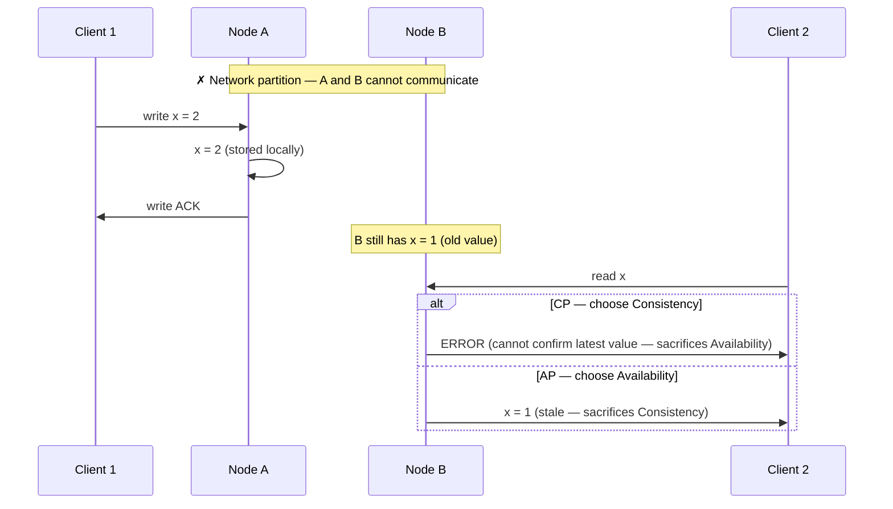

A fiber cut between us-east-1a and us-east-1b just isolated half your database cluster from the other half. Both halves are alive; both can serve traffic; neither can talk to the other. Right now your inventory service is being asked: "Is this product in stock?" — and both sides have to answer something. Do you return potentially stale stock counts (and risk overselling) or refuse the request entirely (and lose the sale)? **There is no third option** — and that is the heart of the CAP theorem. It forces every distributed system to declare, in advance, what it does when the network breaks.

The CAP theorem states that a distributed system can satisfy at most two of three properties simultaneously: **Consistency**, **Availability**, and **Partition Tolerance**. During a network partition, you must choose between consistency and availability — you cannot have both.

## The Three Properties

### Consistency (C)

Every read returns the most recent write or an error. All nodes see the same data at the same time.

This is **linearizability** in CAP terms — the system behaves as if there is one copy of the data, and every operation takes effect atomically at some point between its start and completion. It is not the same as eventual consistency.


**CAP "consistency" ≠ ACID "consistency".** CAP's C means linearizability — every read sees the most recent write across all nodes. ACID's C means the database transitions between valid states (constraints satisfied). A system can be ACID-consistent (all constraints hold) while being CAP-inconsistent (replicas return stale data). Confusing the two in an interview is a common red flag.


```
Node A  ──── write x=2 ────►  Node A: x=2
                               Node B: x=2   ← must reflect the write immediately
                               Node C: x=2

Any read from any node must return x=2 after the write commits.
A read returning x=1 (old value) is a consistency violation.
```

### Availability (A)

Every request to a non-failing node receives a response — not an error, not a timeout. The response does not need to contain the most recent data; it just cannot be an error.

**Key nuance:** A system is available in the CAP sense even if it returns stale data, as long as it responds. A system that returns "503 Service Unavailable" or times out during a partition is not available.

### Partition Tolerance (P)

The system continues operating even when the network drops or delays messages between nodes. Nodes cannot communicate with each other during a partition, but the system keeps running.

**Partition tolerance is not optional.** Networks fail. Links go down. Switches lose packets. In any real distributed system deployed across multiple machines or datacenters, you must assume partitions will occur. P is not a choice — it is a requirement of being distributed.

This means the real choice is: **CP or AP**.

## Why You Can't Have All Three During a Partition

When a partition occurs, two nodes cannot communicate. A write has been applied to Node A but not yet to Node B.


```mermaid
sequenceDiagram
    participant C1 as Client 1
    participant A as Node A
    participant B as Node B
    participant C2 as Client 2

    Note over A,B: ✗ Network partition — A and B cannot communicate

    C1->>A: write x = 2
    A->>A: x = 2 (stored locally)
    A->>C1: write ACK

    Note over B: B still has x = 1 (old value)

    C2->>B: read x

    alt CP — choose Consistency
        B->>C2: ERROR (cannot confirm latest value — sacrifices Availability)
    else AP — choose Availability
        B->>C2: x = 1 (stale — sacrifices Consistency)
    end
```

The impossibility is simple: Node B cannot return `x = 2` because the partition prevents it from receiving the write. It has two choices:

1. **Refuse the read** (CP) — returns an error or blocks until the partition heals. The system remains consistent but gives up availability.
2. **Return stale data** (AP) — responds immediately with `x = 1`. The system remains available but serves an inconsistent response.

There is no third option. You cannot conjure the value `x = 2` on Node B without receiving it from Node A.

## CP Systems

CP systems choose **consistency over availability** during a partition. The mechanism is always the same: **a write must reach a majority (quorum) before it commits.** A node that cannot reach a quorum refuses requests rather than risk serving stale data, until the partition heals.

```
5-node cluster, partition splits into [3, 2]:
  Majority side (3 nodes): can form quorum → serves reads and writes
  Minority side (2 nodes): cannot form quorum → refuses all requests

After the partition heals, all nodes converge on the same state.
```

You'll see this in coordination and metadata stores, where handing out stale data (a wrong leader address, a deleted config) is worse than briefly refusing requests:

| System | Quorum mechanism | Typical role |
|--------|-----------------|--------------|
| **ZooKeeper** | Zab atomic broadcast | Leader election, config, locks |
| **etcd** | [Raft](../../consensus/raft) | Kubernetes control-plane state |
| **HBase** | Coordinated via ZooKeeper | Fences off partitioned RegionServers |

## AP Systems

AP systems choose **availability over consistency** during a partition. Every node keeps accepting reads and writes, so partitions may diverge; after the partition heals, the system **reconciles** the conflicting versions. Two ideas matter more than any product:

- **Tunable consistency** — the CP/AP label isn't fixed. A quorum-based store behaves as AP when it answers from a single replica (fast, maybe stale) and as CP when it requires a majority (refuse rather than serve stale). The same cluster sits on different sides of CAP depending on the per-operation setting.
- **Reconciliation on reconnect** — because both sides accepted writes, the system must merge them: last-write-wins by timestamp, version/vector clocks to detect concurrent writes, or [CRDTs](../multi-region-design#crdts-conflict-free-replicated-data-types) where any merge order is correct. Availability *during* the partition is paid for with reconciliation complexity *after* it.

| System | Default | How it stays available |
|--------|---------|-----------------------|
| **Cassandra** | AP at `ONE`, CP-leaning at `QUORUM` | Tunable consistency level per operation |
| **DynamoDB** | AP (eventually consistent reads) | Strongly consistent reads are opt-in (CP-like) |
| **CouchDB** | AP | Multi-master, merge-on-reconnect via revision trees |

## System Classification

| System | Default behavior | Reason |
|--------|-----------------|--------|
| **ZooKeeper** | CP | Zab requires quorum for all writes; minority partition rejects requests |
| **etcd** | CP | Raft quorum required; minority partition is read-only or unavailable |
| **HBase** | CP | Coordinated by ZooKeeper; consistency over availability |
| **Cassandra** | AP (default) | Tunable; `ONE` = AP, `QUORUM` = closer to CP |
| **DynamoDB** | AP (default) | Eventually consistent reads by default; strong reads = CP-like |
| **CouchDB** | AP | Multi-master with merge-on-reconnect; always accepts writes |
| **MongoDB** | CP (default) | Primary-only writes via Raft; secondary reads are optionally AP |
| **Spanner** | CP | TrueTime-based external consistency; minority partition unavailable |

## Common Misconceptions

**"You pick 2 of 3."** The framing implies P is optional — it isn't. Any system spanning multiple machines must tolerate partitions, so the real choice is **CP or AP when one occurs**. With no partition, a system can satisfy all three at once.

**"CA systems exist."** CA only describes a single node, which has no partition to tolerate. "MySQL is CA" means *single-node* MySQL; the moment you add a replica, the primary–replica link can partition and you must choose CP or AP.

**"CAP-C = ACID-C."** CAP's C is **linearizability** (every read reflects the latest write globally); ACID's C is **invariant preservation** (constraints hold within a transaction). A system can be ACID-consistent on one node while returning stale cross-node reads during a partition.

**"Cassandra is always AP."** At `ALL` (or `QUORUM` when a partition drops below quorum) it refuses the operation rather than serve stale data — CP behavior. The label depends on the configured consistency level, not the product.

## CAP in Practice

The binary CP/AP framing is a simplification. Real systems are more nuanced:

| Approach | How it works |
|----------|-------------|
| **Tunable consistency** | Cassandra, DynamoDB let you choose per-operation — pay higher latency for stronger consistency on critical reads |
| **Read-your-writes guarantee** | Route reads that must be fresh to the primary (CP path); route stale-ok reads to replicas (AP path) |
| **Optimistic concurrency** | AP system accepts all writes; detect conflicts on read using version vectors; resolve in application |
| **Fencing tokens** | Accept writes on both sides of partition; use monotonic tokens to discard stale writers after reconnection |

The [PACELC](../pacelc) model extends CAP to describe the latency vs. consistency tradeoff that exists even in the **absence** of partitions — which is the more common operating condition.


**Interview tip:** I always lead with: "P is not optional — networks partition, so the real question is CP or AP per data type." Then I separate concerns: inventory, balances, and idempotency keys are CP (refuse the request rather than oversell or double-charge); feeds, view counts, and search indexes are AP (stale is fine, downtime isn't). I'm careful never to conflate CAP's C — which is **linearizability**, a single-object cross-replica freshness guarantee — with ACID's C, which is invariant preservation within a single node. And I follow up with [PACELC](../pacelc) because partitions are rare; the real cost most days is the latency-vs-consistency tradeoff on every read.


## Test Your Understanding


**CAP promises nothing about reconciliation.** Choosing A during the partition only guarantees both sides kept responding — it says nothing about how the divergent values get merged afterward. That is entirely your problem to solve at the application or storage layer.

The conflict-resolution strategy is what you actually have to design: **last-write-wins** (highest timestamp wins — but clock skew can silently discard a newer write), **vector clocks** (detect which writes were truly concurrent), **CRDTs** (data structures where any merge order is correct — counters, add-only sets), or **multi-version** (keep both, let the app/user resolve, as CouchDB does). The lesson: availability during a partition is not free — you pay for it later with reconciliation complexity.



**Because CA only describes a single-node system, which has no partition to tolerate.** A lone MySQL instance never faces a network split between nodes, so the CP/AP question is moot. The instant you add a replica, you have a distributed system, and the link between primary and replica *can* partition.

Now you must choose: does the replica keep serving reads when it loses contact with the primary (AP — risk stale data), or does it refuse reads to avoid serving staleness (CP — risk unavailability)? "CA" was never a deployment choice you could make for a distributed system — P is mandatory, so the real options are CP or AP.



**Overselling — and you can't un-sell.** With both sides accepting orders for the last unit in stock, each side sees stock available (neither can see the other's decrement during the partition), so both sell it. After the partition heals you discover you sold the same physical item twice. Reconciliation can detect the conflict but cannot reverse a shipped order or an honored promise to a customer.

This is exactly why inventory, balances, and seat reservations are CP: refusing the request (a lost sale, recoverable) is strictly better than serving a stale "in stock" answer (an oversell, not recoverable). The CP choice trades availability for correctness *on purpose*.



**At consistency level `ALL` (or `QUORUM` when a partition drops you below quorum), Cassandra refuses the operation rather than serve a potentially stale result — that's CP behavior.** With `ALL`, every replica must acknowledge; if one is unreachable due to a partition, the read or write fails.

The takeaway: **CP vs AP is not a fixed property of a database — it's a per-operation decision** for systems with tunable consistency. The same Cassandra cluster is AP at `ONE` (answer fast, maybe stale) and CP-leaning at `QUORUM`/`ALL` (refuse rather than risk staleness). Classifying a whole system as "AP" is a simplification; the honest answer is "AP at these consistency levels, CP at those."

