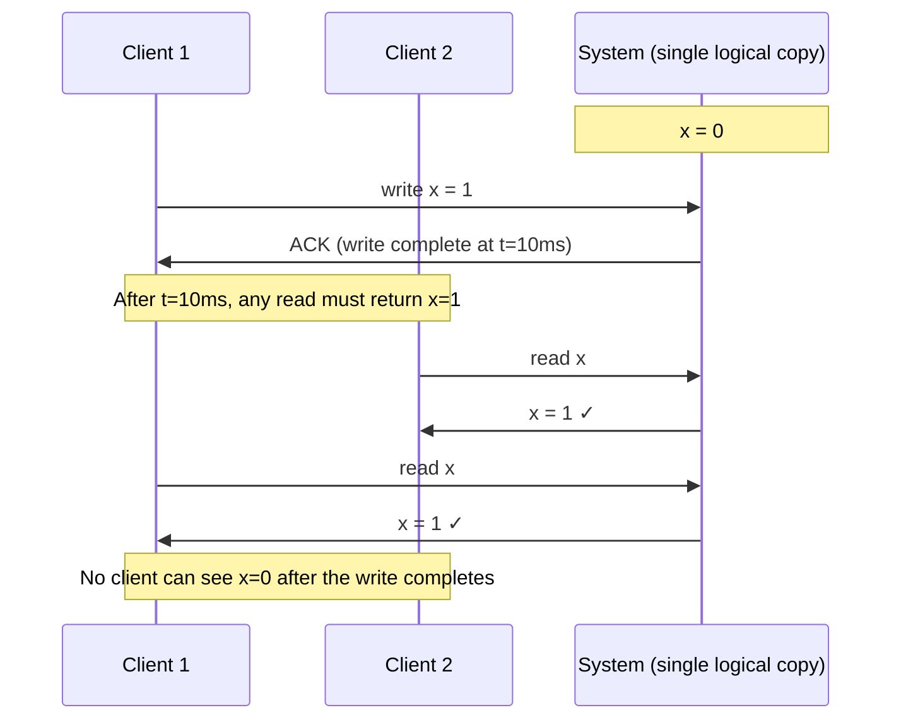
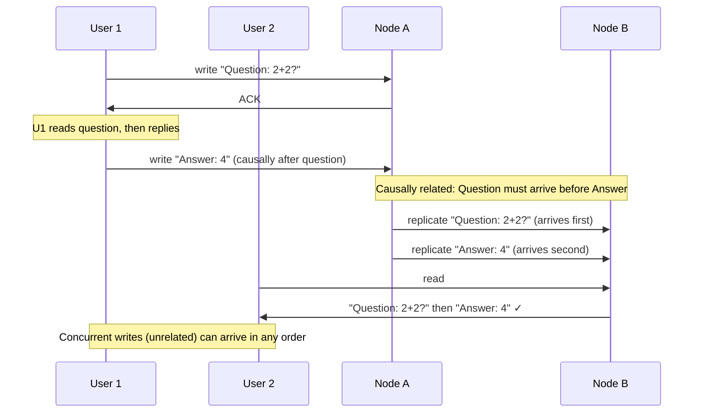

A consistency model defines the contract between a distributed system and its clients: which reads and writes are guaranteed to reflect which other reads and writes. The models form a spectrum from strongest (most expensive) to weakest (most performant).

```
Strongest ←──────────────────────────────────────────── Weakest

Linearizability > Sequential > Causal > Eventual
                                        + Session guarantees (practical middle ground)
```

## Linearizability (Strong Consistency)

Linearizability is the strongest single-object consistency model. The system behaves as if there is **one copy of the data** and every operation takes effect at a single instant between its invocation and its response.

**Properties:**
- Operations have a **global total order** consistent with real time
- If operation A completes before operation B begins, B must observe A's effects
- Every read returns the most recent write (from any client, anywhere)



**Why it's expensive:** To make every read reflect the globally latest write, the system must either:
- Route all reads through a single primary (adds latency for remote readers), or
- Use a consensus protocol (Raft, Paxos) so a quorum confirms the value before responding

**Used by:** Google Spanner (TrueTime-bounded), etcd, ZooKeeper, CockroachDB, PostgreSQL with synchronous replication + routing reads to primary.

**Common violation:** Two replicas returning different values for the same key at the same logical instant. Classic symptom: user writes a value, reloads the page, and sees the old value — the read was served by a lagging replica.

## Sequential Consistency

Sequential consistency is weaker than linearizability. Each process's operations appear in their **program order** to all observers, but there is no requirement that the interleaving matches real-world time.

**Properties:**
- All processes agree on the same global ordering of operations
- Each process's own operations appear in the order it issued them
- No real-time constraint — the agreed-upon order may not match wall-clock time

```
Process 1: write x=1 ─────────────── write y=2
Process 2:                     read y=2,  read x=0  ← sees y=2 but not yet x=1

Under linearizability: INVALID — x=1 happened before y=2; if you see y=2, you must see x=1
Under sequential consistency: VALID — P2's reads appear consistent with some interleaving
   Linearizable order: x=1, y=2, read-y, read-x
   Sequential order P2 sees: write-y, read-y, read-x, write-x (valid program order for P2)
```

**In practice:** Sequential consistency is rarely used as a standalone model in modern distributed databases. It appears in CPU memory models (x86 TSO, relaxed memory ordering) and some distributed shared-memory systems. Most systems skip directly from linearizability to causal consistency.

## Causal Consistency

Causal consistency preserves the order of **causally related** operations. If write A happened before write B and B was influenced by A (A causally precedes B), all nodes must see A before B. Concurrent operations (neither caused the other) can be seen in any order.

**Properties:**
- Causally related writes are seen in the same order by all nodes
- Concurrent (unrelated) writes may be seen in different orders by different nodes
- Weaker than sequential: only partial ordering required



**Detecting causality:** Systems use [**vector clocks**](../logical-clocks) or **logical timestamps** to track causal dependencies. A write carries the vector clock of its causal predecessors; a replica delays applying a write until all its causal predecessors have been applied.

**Used by:** MongoDB (causal sessions using `operationTime` and `clusterTime`), some CRDT-based systems, DynamoDB with vector clocks for conflict detection.

**The benefit:** Causal consistency avoids the coordination cost of linearizability while preserving the intuitive ordering that users expect (e.g., seeing a reply before the original post would be disorienting).

## Eventual Consistency

Eventual consistency is the weakest useful model. If **all writes stop**, all replicas will **eventually** converge to the same value. There is no guarantee of when, or what a read returns in the meantime.

**Properties:**
- No ordering or recency guarantee on reads
- Replicas may diverge arbitrarily during active writes
- Convergence happens through background anti-entropy (Merkle tree comparison, gossip)

```
Timeline:
  t=0: Write x=1 to Node A
  t=1: Write x=2 to Node B (concurrent — neither knows about the other)
  t=2: Read x from Node C → could return 0 (hasn't received any write yet), 1, or 2
  t=10: Anti-entropy runs → all nodes reconcile
         Last-write-wins: x=2 (if t=1 is newer) — Node A's write is overwritten
  t=∞: All nodes eventually agree on x=2 (or x=1, depending on conflict resolution)
```

**Conflict resolution strategies (because concurrent writes produce conflicts):**

| Strategy | How | Risk |
|----------|-----|------|
| **Last-write-wins (LWW)** | Highest timestamp wins | Clock skew can silently discard newer writes |
| **Multi-version (MVCC)** | Keep all conflicting versions; application resolves | Application complexity |
| **CRDT** | Data structure designed so any merge is correct (add-only sets, counters) | Limited to specific data types |
| **Vector clocks** | Track causal history; detect which conflicts are concurrent | Metadata overhead; still needs resolution policy |

**Used by:** Cassandra (`ONE` consistency level), DynamoDB (eventually consistent reads), DNS propagation, S3 cross-region replication lag window.

## Session Guarantees

Session guarantees are **client-scoped** consistency properties — they hold within a single client session but not globally across all clients. They are the practical middle ground between eventual and linearizability.

### Read Your Writes

After a client writes a value, all subsequent reads by **that client** see that value or a more recent value.

```
Client 1 writes x=1 → sees x=1 on next read ✓
Client 2 (independent session) may still see x=0 for a short window ← acceptable
```

**Implementation:** Track the write's LSN (log sequence number) per session. Route subsequent reads to replicas that have applied at least that LSN. See [Read Replicas & Replication Lag](../replication/read-replicas) for implementation patterns.

### Monotonic Reads

If a client reads a value at version V, all subsequent reads by that client return version V or a more recent version. Reads never go backward in time.

```
Client reads x=2 (from Replica A, which applied writes up to t=50)
Client's next read hits Replica B (which only applied writes up to t=30)

Without monotonic reads: client sees x=1 ← time travels backward ✗
With monotonic reads:    router detects Replica B is behind → routes to Replica A ✓
```

**Implementation:** Sticky replica routing — hash the client ID to a specific replica. If that replica fails, re-hash; brief inconsistency during failover is acceptable.

### Monotonic Writes

All writes from a single client are applied in the order they were issued. If client writes x=1 then x=2, no replica applies x=2 before x=1.

**Implementation:** Sequence numbers per client session. Replicas buffer writes until the preceding sequence number has been applied.

### Writes Follow Reads

If a client reads value V and then issues a write, that write is guaranteed to be applied after the state that produced V. The write "follows" the read causally.

```
Client reads x=5 (from replica at state S)
Client writes y=x+1=6 (causally depends on reading x=5)

Writes follow reads guarantees: y=6 is applied after state S
Without this: y=6 could be applied before x=5 was set → y reads as x+1 but x is still 0
```

**Implementation:** The client passes the read timestamp/LSN with the write; the write is applied only after that state is reached.

## Consistency Models in Practice

| Model | Guarantee | Latency | Used by | When to use |
|-------|-----------|---------|---------|-------------|
| **Linearizability** | Single-copy semantics, real-time order | Highest (quorum / primary routing) | etcd, ZooKeeper, Spanner, PostgreSQL primary | Locks, leader election, inventory, balance |
| **Sequential consistency** | Program order, global agreement | High | CPU memory models | Rarely used directly in distributed DBs |
| **Causal consistency** | Causal order preserved | Medium | MongoDB causal sessions, some CRDTs | Social features, comment threads, collaborative editing |
| **Eventual consistency** | Converges if writes stop | Lowest | Cassandra ONE, DynamoDB default, DNS | Feeds, view counts, product catalogs, search indexes |
| **Read-your-writes** (session) | Own writes immediately visible | Low–Medium | Most production databases | Profile updates, settings changes |
| **Monotonic reads** (session) | No backward time travel | Low | Sticky replica routing | Any replica read path |

## What Consistency Model Should You Choose?

The choice is per-data-type, not per-system:

```
Same application, different consistency requirements:

User feed posts:        Eventual consistency (EL) — stale is fine
User's own profile:     Read-your-writes (session guarantee) — must see own changes
Account balance:        Linearizability (EC) — must be accurate, always
Inventory count:        Linearizability (EC) — overselling costs money
Like counts:            Eventual consistency (EL) — off by a few is acceptable
Idempotency key check:  Linearizability (EC) — must not process duplicate payments
Session token valid:    Read-your-writes or linearizability — logout must take effect
Search index:           Eventual consistency (EL) — seconds of lag is fine
```


In a system design interview, the strongest signal is knowing which operations require linearizability and which tolerate eventual consistency. State it explicitly: "The balance read before a debit must be linearizable — I'll route it to the primary. The feed read can be eventually consistent — I'll read from the nearest replica." This shows you treat consistency as a per-operation decision with cost implications, not a binary system property.

