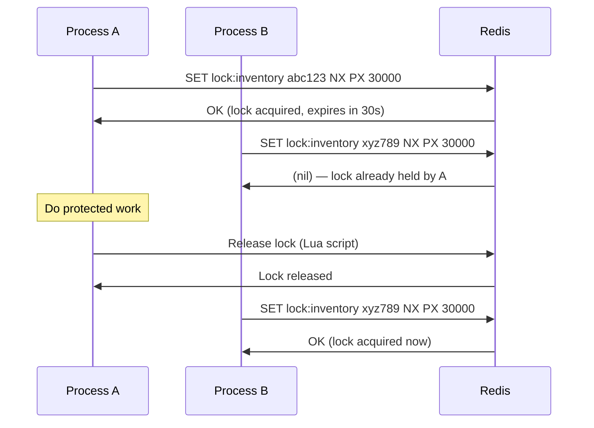
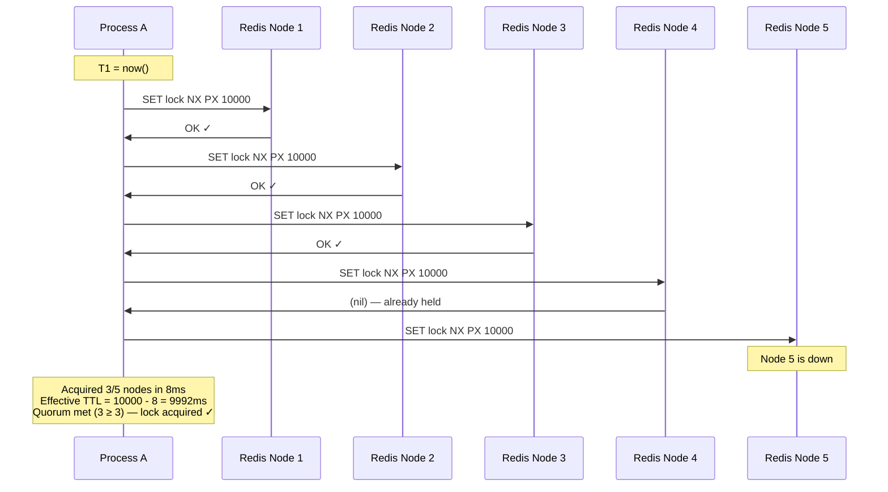
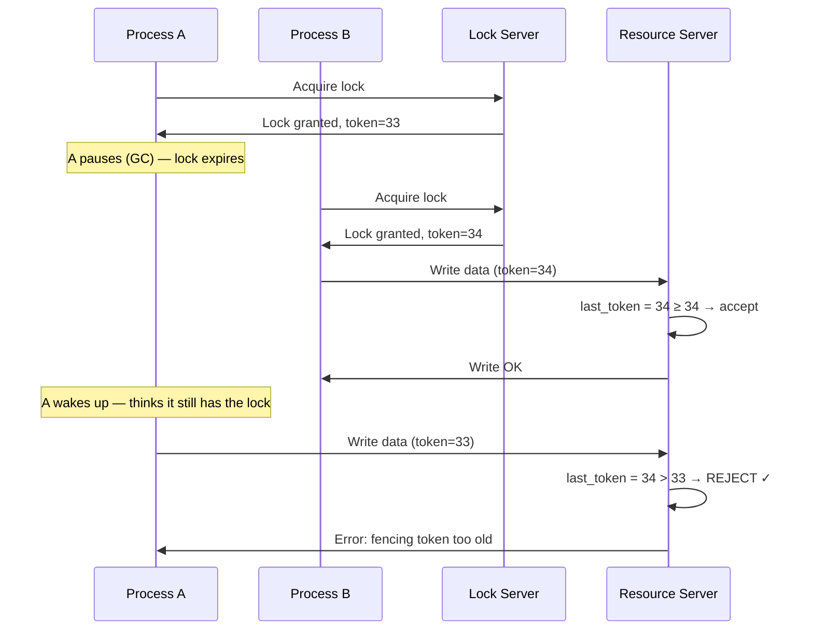
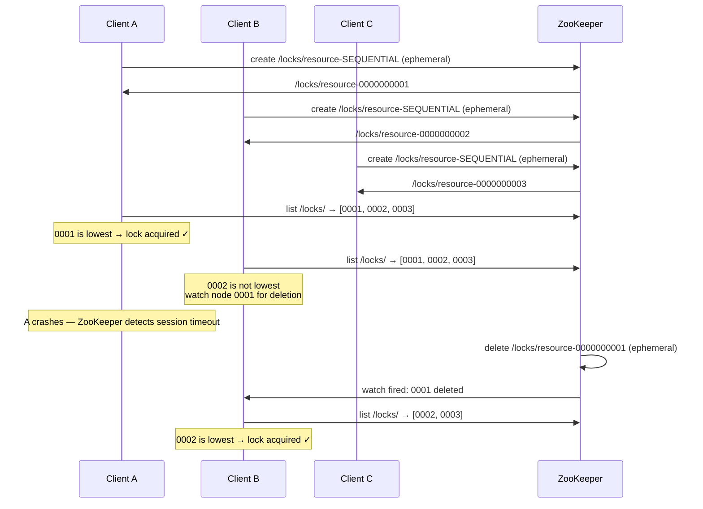

A distributed lock ensures that only one process across a cluster can enter a critical section at a time. The core problem: how do you coordinate access to a shared resource when the processes live on different machines and communicate only over a network that can fail?

## Why Distributed Locks Are Hard

A local mutex works because a single machine maintains authoritative state. In a distributed system:

- The lock server can crash or become unreachable
- The lock holder can pause (GC stop-the-world, OS scheduling, network stall) and miss its TTL
- Clocks on different machines drift relative to each other
- The network can partition — the lock holder can't tell if it still holds the lock

The fundamental tension is between **safety** (only one holder at a time) and **liveness** (the lock eventually becomes available if the holder fails).

## Redis SETNX: The Simple Case

The single-node Redis lock uses one atomic command:

```
SET lock_key <unique_value> NX PX <ttl_ms>
```

- **`NX`** — set only if the key does not exist (atomic check-and-set)
- **`PX <ttl_ms>`** — auto-expire the key after TTL milliseconds (releases lock if holder crashes)
- **`<unique_value>`** — a random UUID generated by the requester (critical for safe release)



### Why the Unique Value Matters

Without a unique value, Process A could accidentally release Process B's lock:

```
t=0s:  A acquires lock (TTL=30s)
t=28s: A is paused (GC stop-the-world)
t=30s: Lock TTL expires
t=31s: B acquires the same lock
t=32s: A wakes up, calls DEL lock:inventory
       → A just deleted B's lock — B is no longer protected
```

With a unique value, the release is safe — only the original holder can release:

```lua
-- Atomic Lua script: check-then-delete
-- Must be atomic to avoid TOCTOU race condition
if redis.call("get", KEYS[1]) == ARGV[1] then
    return redis.call("del", KEYS[1])
else
    return 0  -- not our lock, do nothing
end
```

```python
# Acquire
lock_value = str(uuid.uuid4())
acquired = redis.set("lock:inventory", lock_value, nx=True, px=30000)

# Release (run Lua script above)
release_lock(redis, "lock:inventory", lock_value)
```

### The TTL Expiry Problem

Even with a unique value, a process pause longer than the TTL causes two processes to be in the critical section simultaneously:

```
t=0s:   A acquires lock, TTL=30s
t=5s:   A starts slow database query
t=30s:  Lock TTL expires (A is still working — unaware)
t=31s:  B acquires the same lock
t=32s:  A and B are both in the critical section ← safety violation
t=35s:  A finishes and releases — releases B's lock!
```

**Lock renewal (heartbeating):** A background thread in Process A sends `PEXPIRE lock:inventory 30000` every 10 seconds while the lock is held. If A dies, the heartbeat stops and the lock expires normally. Libraries like Redisson (Java) handle this automatically.

**Risk:** If the lock renewal itself fails (Redis unreachable for 30 seconds), A continues working but the lock is gone. This is an inherent limitation of any TTL-based lock.

## Redlock: Multi-Node Quorum

Redlock addresses single-node Redis failure by spreading the lock across **N independent Redis nodes** (no replication between them). The lock is acquired only if a majority (N/2 + 1) grant it.

### Algorithm

```
Setup: 5 independent Redis nodes (N=5, quorum=3)

1. Record start time T1
2. For each of the 5 nodes, attempt:
     SET lock:resource <uuid> NX PX <ttl_ms>
   with a small per-node timeout (e.g., 5ms) to avoid blocking on slow nodes
3. Record elapsed time: elapsed = now() - T1
4. Lock is acquired IF:
   - Acquired on ≥ 3 nodes (quorum)
   - elapsed < TTL  (there is still valid lock time remaining)
5. Effective lock time = TTL - elapsed
6. To release: run the Lua delete script on ALL 5 nodes (regardless of which granted the lock)
```



**Why majority quorum provides safety:** If Process A holds the lock on nodes {1, 2, 3} and Process B tries to acquire, B cannot get 3 nodes — at best it gets nodes {4, 5} and fails to reach quorum. The sets overlap by at least one node.

### The Controversy: Clock Pause + Redlock

Martin Kleppmann's 2016 analysis showed that Redlock is still unsafe for **correctness-critical** operations even with quorum:

```
t=0:    A acquires Redlock on 3/5 nodes (TTL=10s)
t=9.9s: A is paused (OS scheduler, GC)
t=10s:  Locks on all 3 nodes expire
t=10.1s: B acquires Redlock on 3/5 nodes
t=10.2s: A wakes up — thinks it still holds the lock
t=10.3s: A and B are both in the critical section ← safety violation
```

No amount of quorum or TTL tuning can prevent a process from pausing longer than its TTL. Antirez (Redis creator) responded that this failure mode applies to any TTL-based lock and is acceptable for **efficiency** locks (e.g., avoid duplicate work) but not **correctness** locks (e.g., financial operations).

**Practical verdict:**
- Use Redlock for **coordinating background jobs** — if two workers occasionally both process the same task, it's an efficiency issue, not a correctness failure
- Use **fencing tokens** (below) when the correctness of the resource operation matters

## Fencing Tokens: The Correct Solution

A fencing token is a monotonically increasing number issued by the lock server. The **resource server** validates it — if a stale lock holder tries to write with an old token, the write is rejected.



**How it works:**
1. Lock server increments a counter on every lock grant
2. Lock holder includes the token with every resource operation
3. Resource server tracks the highest token it has seen
4. Any operation with a token ≤ last_seen_token is rejected as stale

**This is the only mechanism that provides safety regardless of how long a process pauses.** It requires the resource server to be aware of tokens — this is not always possible (e.g., a filesystem does not validate fencing tokens natively).

**ZooKeeper's zxid as a fencing token:** ZooKeeper's transaction ID (`zxid`) is monotonically increasing across the cluster. After acquiring a ZooKeeper lock, pass the zxid to your resource server as the fencing token.

## ZooKeeper: Stronger Guarantees via Ephemeral Sequential Znodes

ZooKeeper provides distributed locking with two key primitives that eliminate the TTL/expiry problem entirely:

- **Ephemeral nodes** — automatically deleted when the client session ends (crash, network failure, clean close). No TTL needed.
- **Sequential nodes** — ZooKeeper appends a monotonically increasing sequence number to the node name.

### Lock Implementation



**No thundering herd:** Each waiter watches only the node immediately before it — not all nodes. When a lock is released, only one waiter is notified. This prevents N-1 clients all waking up simultaneously when a lock is released.

**Automatic cleanup:** Ephemeral nodes require no cleanup code. If the lock holder's process or network dies, ZooKeeper's session expiration removes the node automatically — no TTL tuning needed.

### Comparison: Redis vs ZooKeeper

| Property | Redis SETNX | Redlock | ZooKeeper |
|----------|-------------|---------|-----------|
| **Setup complexity** | Very low | Medium (5 nodes) | High (separate cluster) |
| **Lock release on crash** | TTL expiry (delayed) | TTL expiry (delayed) | Immediate (ephemeral node) |
| **Fencing tokens** | No (must add separately) | No | Yes (zxid) |
| **Consistency model** | AP — loses lock on partition if Redis is majority-side | Quorum-based | CP — minority partition unavailable |
| **Throughput** | ~100k ops/s | Lower (5 round trips) | ~10–50k ops/s |
| **False safety window** | Yes (TTL-based) | Yes (TTL-based, smaller) | Minimal (session-based) |
| **Best for** | Efficiency locks, cache coordination | HA efficiency locks | Correctness locks, leader election |

## When NOT to Use Distributed Locks

Distributed locks are often reached for prematurely. Most of the problems they solve have better alternatives.

### Better Alternatives

| Problem | Naive approach | Better approach |
|---------|---------------|-----------------|
| Prevent double payment | Lock on payment operation | Idempotency key + DB unique constraint |
| Prevent inventory oversell | Lock on inventory check | `UPDATE inventory SET stock = stock - 1 WHERE stock > 0` (atomic decrement) |
| Only one worker processes a job | Lock on job ID | Message queue with single consumer per partition (Kafka partition, SQS FIFO) |
| Cache stampede | Lock on cache miss | Redis SETNX per cache key + probabilistic early refresh |
| Cron job deduplication | Distributed lock | DB `INSERT ... ON CONFLICT DO NOTHING` with row expiry |

### Optimistic Concurrency: No Lock at All

For read-modify-write patterns, optimistic concurrency is often safer and more performant than a lock:

```sql
-- Read: get current version
SELECT stock, version FROM inventory WHERE product_id = 42;
-- Returns: stock=10, version=7

-- Modify in application: new_stock = 10 - 1 = 9

-- Write: only update if version hasn't changed (no lock held!)
UPDATE inventory
SET stock = 9, version = 8
WHERE product_id = 42 AND version = 7;

-- Check rows_affected:
-- 1 row → success, no concurrent modification
-- 0 rows → version changed by another writer → retry
```

This is effectively a compare-and-swap. Under low contention it outperforms locks significantly (no waiting). Under high contention, retries increase — locks may be better.

### The Cost of Locks

Every lock acquisition is at minimum one network round trip:
- Redis SETNX: 1 RTT (~1ms local, ~10ms cross-region)
- Redlock: 5 parallel RTTs (duration of slowest)
- ZooKeeper: 1 RTT + session maintenance overhead

Locks also add failure modes: what if lock acquisition fails? what if the lock holder crashes mid-operation without releasing? what if the lock TTL is too short for heavy load? Each question requires code to handle.

**The rule:** If you can make the operation idempotent and use a DB constraint or atomic increment, do that instead. Use distributed locks only when you need to coordinate access to an external resource that doesn't support transactions or atomic operations.


A common interview mistake: proposing a distributed lock for every race condition. The follow-up question is always "what happens if the lock holder crashes after acquiring the lock but before completing the operation?" If the operation is not idempotent, a distributed lock just moves the problem — you still need to handle partial state. Design the operation to be idempotent first; add a lock only if you truly need mutual exclusion for the duration of execution (not just for deduplication).

