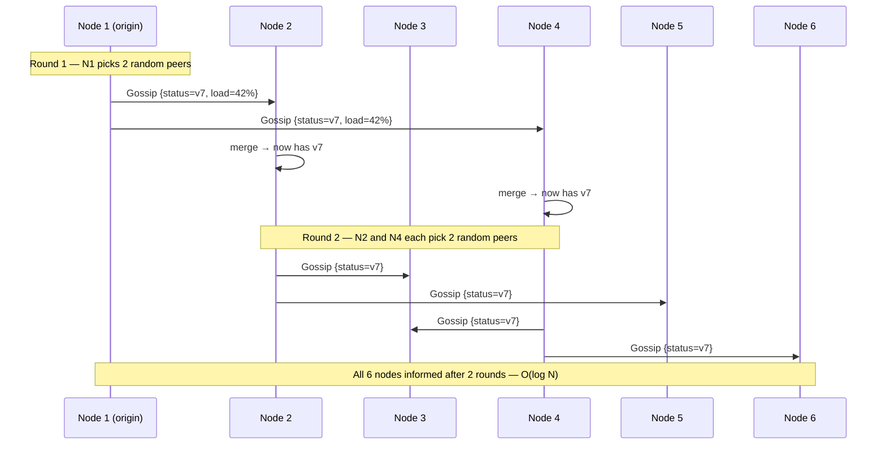
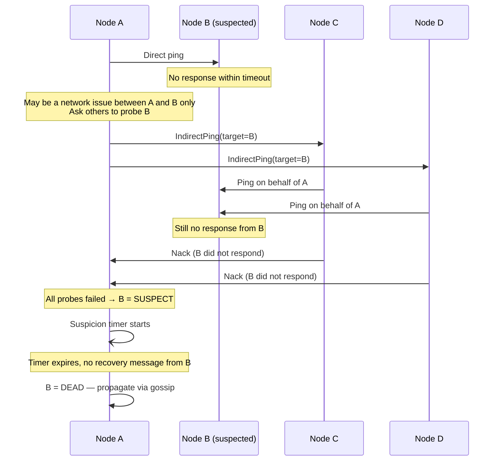

A gossip protocol (also called an epidemic protocol) is a peer-to-peer communication method where each node periodically selects a small number of random peers and exchanges state. Information spreads through the cluster the way a rumor spreads through a social network — exponentially, without any central coordinator.

Gossip trades **strong consistency** for **scalability and fault tolerance**: a single failure or network hiccup cannot stop propagation because there is no critical path. Every node is equally responsible for spreading information.

## The Fan-out Model

Each gossip **round** proceeds in three steps:
1. Node A selects N random peers (fan-out, typically N=3)
2. A sends a gossip message containing its current state to each peer
3. Receiving peers merge the incoming state with their own and become "infected"
4. In the next round, infected nodes spread to new random peers

**Convergence rate:** After each round, the number of informed nodes roughly multiplies by the fan-out factor. After k rounds, approximately:

```
informed = total × (1 − (1 − fanout/total)^k)
```

For a 1000-node cluster with fan-out=3, **~10 rounds** (about 10 seconds at 1 round/second) are enough to reach all nodes. This is O(log N) rounds.

**Message complexity:** Each node sends fan-out messages per round. Total messages per complete propagation: O(N log N) — far better than broadcasting to all nodes O(N²).



Gossip is resilient to node failures during propagation: if a peer is down, the message simply takes a different random path in the next round.

## Failure Detection

### Heartbeat with Fixed Timeout (Naive)

The simplest approach: every node sends periodic heartbeats; if no heartbeat arrives within a fixed timeout, the node is declared dead.

**Problem:** Network jitter, GC pauses, and temporary load spikes cause false positives. A fixed timeout that's too tight generates false positives. A timeout that's too loose means slow failure detection. There is no tuning that works well for all environments.

### Phi Accrual Failure Detector

Used by Cassandra and Akka. Instead of a binary alive/dead declaration, the phi accrual failure detector outputs a continuous **suspicion value φ (phi)** based on historical heartbeat timing.

**How it works:**
1. The detector maintains a sliding window of the last W heartbeat arrival intervals (e.g., last 1000 heartbeats)
2. It fits a statistical distribution (usually exponential or normal) to those intervals
3. When a new heartbeat is due, it computes:

```
φ = -log₁₀(probability of this delay if node is healthy)
```

4. The calling system chooses a φ threshold — typically 8–12 — to declare failure

```
Historical heartbeats arrive every 200ms ± 15ms:

  Current gap = 210ms → φ ≈ 0.5   → definitely alive
  Current gap = 300ms → φ ≈ 3.0   → mildly suspicious
  Current gap = 450ms → φ ≈ 8.0   → declare failure (false positive rate ≈ 0.003%)
  Current gap = 600ms → φ ≈ 15.0  → certainly dead
```

If the network becomes slower over time (higher jitter), the distribution adapts — the threshold to declare failure automatically rises. The detector becomes **less sensitive** during high-jitter periods and **more sensitive** when the network is stable. A fixed timeout cannot do this.

**Cassandra default:** `phi_convict_threshold = 8` (configurable). Lowering it speeds up failure detection but increases false positives. Raising it reduces false positives but slows detection.


**False positives trigger cascading failures.** If the phi threshold is too low, a brief GC pause or network blip marks a healthy node as dead. The cluster then rebalances data away from the "dead" node, generating massive I/O. When the node comes back, it must stream data back — doubling the recovery cost. In production, err on the side of slower detection (higher phi) rather than faster detection with false positives. Cassandra recommends `phi_convict_threshold = 8` for most deployments; cloud environments with variable latency often benefit from 10–12.


### SWIM: Scalable Weakly-consistent Infection-style Membership

Used by Consul and Serf. SWIM separates failure detection from membership propagation and adds **indirect probing** to reduce false positives caused by point-to-point network issues.



Indirect probing eliminates false positives caused by network asymmetry: if A can't reach B but C and D can, B stays alive. Only when all indirect probes also fail is B suspected.

**Suspicion mechanism:** When B is marked SUSPECT, B itself receives the suspicion gossip and can refute it by broadcasting an ALIVE message (incrementing its incarnation number). If B is genuinely dead it cannot refute, and the suspicion timer expires → DEAD.

## Uses in Production Systems

### Cassandra

Cassandra runs a gossip round every second. Each node gossips with 1–3 randomly selected peers.

**Exchanged state per node:**
- `STATUS`: NORMAL, LEAVING, JOINING, LEFT, REMOVING
- `LOAD`: disk usage percentage
- `SCHEMA`: hash of the current schema version
- `TOKENS`: virtual node token ranges
- `DC` / `RACK`: topology placement
- `GENERATION` + `VERSION`: logical clock for detecting stale state

**Gossip message flow:**
```
A → B: GossipDigestSyn   {A: gen=5,ver=12, C: gen=3,ver=8}
B → A: GossipDigestAck   {C: gen=3,ver=9 (B has newer), request full state for A}
A → B: GossipDigestAck2  {A full state}
```

This three-way handshake efficiently synchronizes only the deltas — if B already has the latest version of a node's state, it's not re-sent.

### Consul / Serf (SWIM)

Consul uses a two-tier architecture:
- **LAN gossip pool (Serf/SWIM)**: cheap O(log N) propagation for node membership and health status
- **Raft consensus**: strongly consistent storage for service catalog, KV store, ACLs

Serf handles: node join, node leave, node failure, user-defined events, queries. Consul builds service discovery and health checking on top of Serf's membership layer.

**Why not use Raft for everything?** Raft requires a quorum write for every membership change. In a 1000-node cluster, that's a bottleneck. Gossip handles membership at O(log N) cost and feeds failures up to Raft only when durable state needs updating.

### Metadata Propagation

Any system that needs to disseminate configuration or metadata to all nodes can use gossip:
- **DynamoDB (ring membership)**: nodes gossip about which nodes own which token ranges
- **Riak (ring state)**: ring ownership changes propagate via gossip
- **CockroachDB (node liveness)**: node liveness heartbeats gossiped to all nodes

## Anti-Entropy Repair with Merkle Trees

Gossip is probabilistic — it cannot guarantee every node receives every update. Replicas can diverge over time due to: dropped gossip messages, node downtime, clock skew on TTL expiry, or missed writes during failure.

**Merkle tree anti-entropy** complements gossip with a systematic repair mechanism.

### How Merkle Tree Repair Works

```
Replica A data:                     Replica B data:
  row_1: "alice" (v3)                row_1: "alice" (v3)
  row_2: "bob"   (v5)                row_2: "bob"   (v4) ← diverged
  row_3: "carol" (v2)                row_3: "carol" (v2)
  row_4: "dave"  (v7)                row_4: "dave"  (v7)
```

Building Merkle trees and comparing:

```
Step 1: Hash leaf nodes (individual rows or token ranges)

  Replica A tree:             Replica B tree:
        [Root_A]                    [Root_B]
       /        \                  /        \
   [H(1,2)]   [H(3,4)]        [H(1,2)']  [H(3,4)]
   /    \       /    \         /    \       /    \
[H1]  [H2]  [H3]  [H4]     [H1]  [H2']  [H3]  [H4]

H2 ≠ H2' because row_2 differs

Step 2: Compare root hashes → differ → not in sync
Step 3: Compare left subtrees → differ
Step 4: Compare individual leaves → H2 ≠ H2' → row_2 diverged
Step 5: Sync only row_2 (not all data)
```

Instead of comparing N rows (O(N) network round-trips), Merkle tree comparison finds the diverged partition in O(log N) comparisons.

**Cassandra `nodetool repair`:** Triggers a full Merkle tree anti-entropy exchange between replicas for a given token range. Cassandra recommends running repair on every node within the `gc_grace_seconds` window (default 10 days) to ensure tombstones are propagated before garbage collection. Unrepaired replicas can resurrect deleted data if a tombstone is GC'd before the replica sees it.

## Convergence Properties

| Property | Gossip behavior |
|----------|----------------|
| **Propagation speed** | O(log N) rounds — fast enough for most membership/metadata uses |
| **Fault tolerance** | No single point of failure; node failures during propagation just reroute |
| **Message overhead** | O(N log N) messages per propagation — scales to thousands of nodes |
| **Consistency** | Probabilistic eventual consistency — not suitable for coordination requiring strong consistency |
| **Accuracy** | Phi accrual / SWIM reduce false positives without sacrificing detection speed |

**What gossip is NOT suitable for:** distributed locking, leader election consensus, or any operation requiring linearizability. For those, use Raft (etcd) or ZooKeeper. Gossip handles the cheap, high-frequency dissemination tasks; consensus protocols handle the rare, critical decisions.


In a system design interview, when asked how Cassandra detects node failures or how Consul propagates membership, say: "gossip with phi accrual failure detection — every node exchanges state with a few random peers each second; phi accrual adapts the failure threshold based on historical heartbeat variance, avoiding false positives during high-jitter periods." This shows you understand why gossip beats fixed-timeout heartbeats in dynamic environments.

