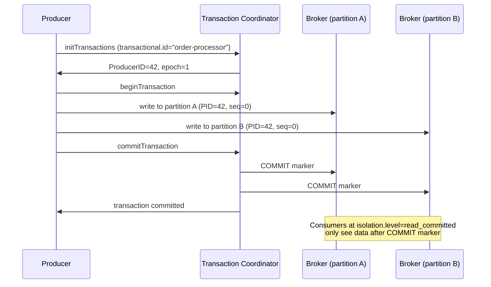

A user clicks "Pay $99" and the spinner hangs for 30 seconds. The mobile app times out and retries. But the original request actually succeeded — the network just dropped the response. Now the user has been charged $198 for one order. Or: a Kafka consumer processes an event, writes to a database, and crashes before committing the offset. On restart, Kafka redelivers the same event and the consumer charges the customer a second time. **Every distributed system has these failure modes**, and the only defense is to make every write operation idempotent so retries are safe by construction.

An operation is **idempotent** if applying it N times produces the same result as applying it once. Idempotency is the foundation of safe retry logic — without it, every network failure becomes a potential double-charge, double-insert, or duplicate event.

## The Retry Problem

Networks fail. Servers restart. Clients time out. When a client sends a request and doesn't receive a response, it cannot know whether:
- The request never arrived (safe to retry)
- The request arrived and was processed but the response was lost (dangerous to retry)

```mermaid
sequenceDiagram
    participant C as Client
    participant S as Server
    participant DB as Database

    C->>S: POST /payments/charge $100
    S->>DB: INSERT payment (amount=100)
    DB->>S: OK
    Note over S,C: Network failure — response lost

    C->>S: POST /payments/charge $100 (retry)
    S->>DB: INSERT payment (amount=100)
    DB->>S: OK
    S->>C: 200 OK

    Note over DB: $200 charged — user charged twice
```



Without idempotency, the client's correct behavior (retry on failure) causes a bug. The server has no way to distinguish a retry from a new request.

## Idempotency Keys

An idempotency key is a client-generated unique identifier that ties a request to its result. The server stores the result the first time it processes the request and returns the cached result on any duplicate.

```mermaid
sequenceDiagram
    participant C as Client
    participant S as Server
    participant DB as Database

    C->>S: POST /payments/charge\nIdempotency-Key: a3f9d7c2
    S->>DB: SELECT result WHERE key='a3f9d7c2'
    DB->>S: (no result — first time)
    S->>DB: INSERT payment; INSERT idempotency(key, result)
    DB->>S: OK
    S->>C: 200 OK (payment_id: p_123)

    Note over C: Network failure on first attempt — client retries

    C->>S: POST /payments/charge\nIdempotency-Key: a3f9d7c2 (same key)
    S->>DB: SELECT result WHERE key='a3f9d7c2'
    DB->>S: payment_id: p_123 (cached result)
    S->>C: 200 OK (payment_id: p_123) ← same response, no duplicate charge
```

**Key properties:**

- **Client-generated** — typically a UUID v4 or UUID v7 per request attempt
- **Server-stored** — the key + result is stored durably (database or Redis with persistence)
- **TTL-bounded** — keys expire after a window (Stripe: 24 hours; PayPal: 30 days)
- **Scope** — tied to a specific operation type; same key on different endpoints is a different idempotency record

**Race condition — two concurrent requests with the same key:**

```
Thread A: SELECT → no result → begin processing
Thread B: SELECT → no result → begin processing
Both threads process the same request twice
```

**Solution:** Acquire a lock before processing. Either:
- `INSERT INTO idempotency_keys (key) VALUES (?) ON CONFLICT DO NOTHING` — check rows affected; only proceed if 1 row inserted
- Redis `SET key "processing" NX PX 30000` — only one caller gets NX=1

**Used by:** Stripe (`Idempotency-Key` header), PayPal (`PayPal-Request-Id`), Braintree, most payment APIs. Non-payment APIs that involve writes (send email, create resource) also benefit.

## Delivery Guarantees

Every message-passing system — queues, event streams, RPCs — provides one of three delivery guarantees:

| Guarantee | Behavior | Loss? | Duplicates? | How |
|-----------|----------|-------|-------------|-----|
| **At-most-once** | Message delivered 0 or 1 times | Yes | No | Fire-and-forget; no retry on failure |
| **At-least-once** | Message delivered 1+ times | No | Yes | Retry until ACK; consumer must be idempotent |
| **Exactly-once** | Message delivered exactly 1 time | No | No | Coordination protocol; most expensive |

**At-most-once** is appropriate when loss is acceptable and duplicates are worse than gaps — UDP video streaming, metrics sampling where a dropped point doesn't matter.

**At-least-once** is the default for most reliable systems (Kafka with manual offset commit, SQS with visibility timeout, most HTTP retry logic). The consumer must tolerate or deduplicate duplicates.

**Exactly-once** requires coordination and is significantly more expensive. The claim "exactly-once delivery" often hides the caveat "exactly-once within a specific component" — true end-to-end exactly-once across heterogeneous systems requires careful design.

## Exactly-Once in [Kafka](../../messaging/kafka)

Kafka provides exactly-once semantics through two mechanisms that work together.

### Idempotent Producer (per-partition deduplication)

Each producer is assigned a **ProducerID (PID)** by the broker. Every message carries a monotonically increasing **sequence number** per `(PID, partition)` pair.

```
Producer → Broker: msg (PID=42, partition=3, seq=100, data=...)
Broker applies msg, advances expected_seq to 101

Producer retries (network timeout):
Producer → Broker: msg (PID=42, partition=3, seq=100, data=...)  ← same seq
Broker: seq=100 ≤ last_applied_seq=100 → duplicate, discard silently
Producer receives ACK as if it succeeded → no duplicate in the log
```

This prevents duplicates from producer retries **within a single session**. If the producer restarts, it gets a new PID and sequence numbering resets — deduplication window is per-session.

### Transactions (multi-partition atomicity)

Transactions allow a producer to atomically write to multiple partitions — either all writes commit or none do. A **Transaction Coordinator** (a special Kafka broker) manages the two-phase commit protocol.



**Consumer side:** Set `isolation.level=read_committed`. The consumer only reads messages that have been committed; messages from aborted transactions are invisible. This prevents consumers from processing partial transactions.

**Exactly-once stream processing (Kafka Streams):**
The consume → process → produce loop is made exactly-once by wrapping it in a transaction:
1. Consume message from input topic (don't commit offset yet)
2. Process and produce to output topic (inside transaction)
3. Commit input offset to `__consumer_offsets` topic **inside the same transaction**

The offset commit and the output write are atomic. If the process crashes, the transaction aborts; on restart the message is re-consumed but the output write (also aborted) is not visible — no duplicate in the output.

**Limitation:** Kafka's exactly-once only covers Kafka-to-Kafka. Writing to an external database in the processing step re-introduces the at-least-once problem — the DB write is not part of the Kafka transaction.

## Deduplication Patterns

### DB Unique Constraint

Insert a record of the processed event ID into a deduplication table. A unique constraint prevents duplicates at the database level.

```sql
CREATE TABLE processed_events (
    event_id  VARCHAR(64) PRIMARY KEY,
    processed_at TIMESTAMPTZ NOT NULL DEFAULT NOW()
);

-- On receiving event:
INSERT INTO processed_events (event_id) VALUES ($1)
ON CONFLICT (event_id) DO NOTHING
RETURNING event_id;
```


**Race condition in deduplication.** Two concurrent retries with the same idempotency key can both pass the "does this key exist?" check before either inserts. Use `INSERT ... ON CONFLICT` or `SETNX` (atomic check-and-set) — never a read-then-write pattern. Even with atomic inserts, ensure the business logic (e.g., charging a payment) is inside the same transaction as the dedup insert, or you risk charging twice with only one dedup record.


```sql
-- WRONG: read-then-write race
SELECT 1 FROM processed_events WHERE event_id = $1;  -- both threads see: not found
INSERT INTO processed_events (event_id) VALUES ($1);  -- both threads insert

-- If no row returned → duplicate, skip processing
-- If row returned → first time, proceed with business logic in same transaction
```

**Atomicity:** Wrap the deduplication insert and the business logic in the same transaction. If the business logic fails, the deduplication record is rolled back and the event can be reprocessed.

**Tradeoff:** Every event requires a DB write. The deduplication table grows indefinitely unless you periodically purge old records.

### Redis SETNX with TTL

Use Redis's atomic `SET key value NX PX ttl` to claim processing rights. Only one caller gets the lock; others skip.

```
# First occurrence of event_id=abc123:
SET dedup:abc123 "1" NX PX 86400000   → OK (returned 1 — proceed)

# Retry of same event:
SET dedup:abc123 "1" NX PX 86400000   → (nil) (returned nil — duplicate, skip)

# Key auto-expires after 24 hours
```

**Tradeoff:** Fast (sub-ms), automatic expiry. But Redis is not transactional with your database — if the business logic (DB write) succeeds and Redis fails before the SET, the event looks unprocessed and gets reprocessed. Use this pattern when your business operation is itself idempotent, or when you accept a small risk of duplicates.

### Bloom Filter for Fast Negative Check

A Bloom filter is a probabilistic data structure that answers "definitely not seen" or "maybe seen." Use it to short-circuit DB lookups for the vast majority of events that are genuinely new.

```
Incoming event_id → check Bloom filter
  "definitely not seen" (filter returns false) → process; add to filter + DB dedup table
  "maybe seen" (filter returns true) → check DB dedup table
    DB confirms not seen → false positive; process
    DB confirms seen → genuine duplicate; skip
```

**Tradeoff:** Eliminates DB lookups for new events (the common case). Bloom filters have false positives (1–3% at typical sizing) but never false negatives. Cannot remove entries — the filter only grows. Requires a persistent backing store or periodic rebuild if the process restarts.

**When to use:** High-volume event deduplication (billions of events) where hitting the DB on every event would be prohibitive. Combine with DB unique constraint for correctness; use Bloom filter only to reduce DB load.

## Making Non-Idempotent Operations Idempotent

HTTP methods have defined idempotency semantics:

| Method | Idempotent? | Why |
|--------|-------------|-----|
| `GET` | Yes | Read-only; no state change |
| `PUT` | Yes | Replaces resource state; calling twice leaves same result |
| `DELETE` | Yes | Resource is deleted; deleting again is a no-op (or 404) |
| `POST` | No | Creates a new resource each call |
| `PATCH` | Depends | Relative update (`balance += 100`) is not idempotent; absolute set (`balance = 100`) is |

**Converting POST to idempotent:** Attach an idempotency key and store the result.

**Converting PATCH to idempotent:** Use conditional updates with version numbers (optimistic concurrency), not relative increments.

```sql
-- Non-idempotent: relative increment
UPDATE accounts SET balance = balance + 100 WHERE id = 42;

-- Idempotent: conditional absolute update with deduplication
UPDATE accounts
SET balance = 600, last_transaction_id = 'txn_abc'
WHERE id = 42
  AND last_transaction_id != 'txn_abc';  -- no-op if already applied
```


In a system design interview, when you add a payment, inventory decrement, or any write that gets called over a network: immediately say "this must be idempotent." Explain: client generates idempotency key → server stores key+result → duplicate returns cached result. Then address the deduplication storage: Redis SETNX for speed, DB unique constraint for transactional safety. This signals you've thought about failure modes, not just the happy path.



**Interview tip:** I'd be careful never to claim "exactly-once delivery" as a network primitive — what you actually get is **at-least-once delivery plus an idempotent consumer**, which together produce exactly-once *processing*. For any non-GET endpoint that touches money, inventory, or external side effects, I'd require a client-supplied idempotency key (UUID v4), store the key + the response in the same DB transaction as the business write using `INSERT ... ON CONFLICT DO NOTHING`, and return the cached response on duplicates. Kafka's transactional producer plus `read_committed` consumers gives exactly-once semantics within Kafka, but the moment you write to an external database in the processing step, you're back to needing the inbox-table dedup pattern. The race I always call out: never read-then-write to check for duplicates — use atomic operations (`SETNX`, unique constraints) so two concurrent retries can't both pass the check.

