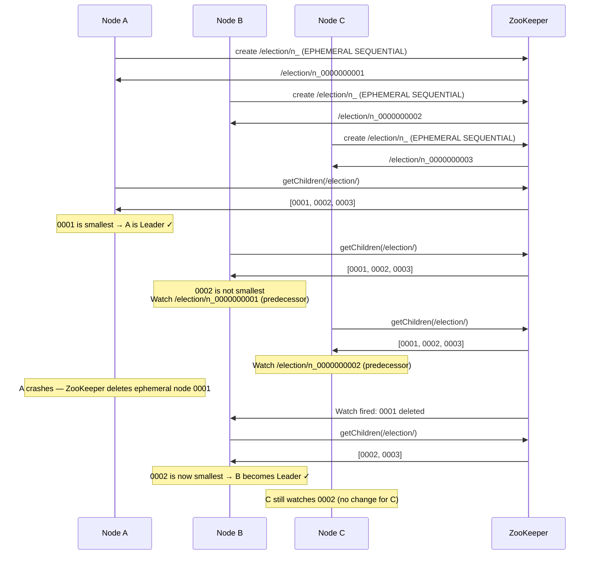
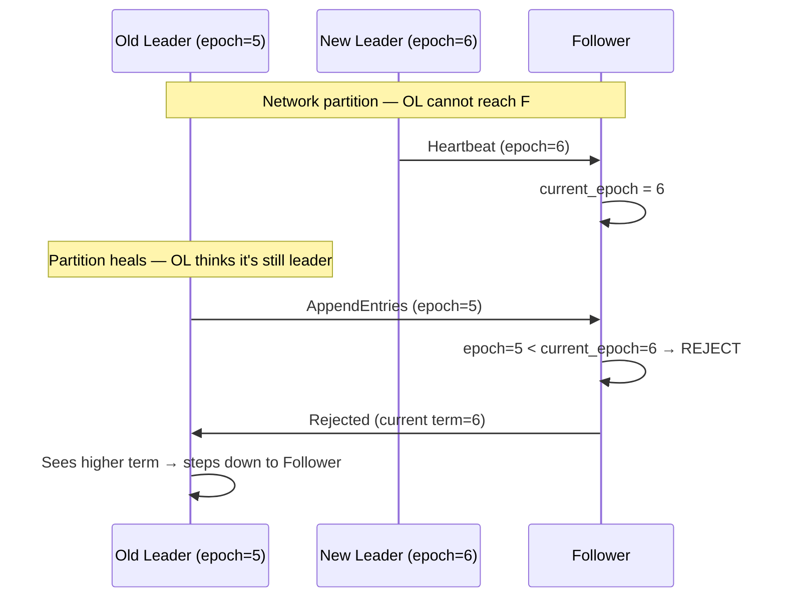

Leader election is the process by which a cluster of nodes agrees on exactly one node to act as the coordinator. The leader handles decisions that require a single authoritative source: accepting writes in a replicated database, assigning work in a distributed scheduler, or managing cluster topology.

The hard problem is not electing a leader — it's doing so safely when the old leader might still be alive but unreachable, and preventing two nodes from both believing they are the leader (**split-brain**).

## Bully Algorithm

The Bully algorithm is the simplest election protocol. The node with the highest ID wins.

**Algorithm:**
1. Any node that detects a missing leader sends `ELECTION` to all nodes with a higher ID
2. If no higher node responds within timeout → initiator declares itself leader, broadcasts `COORDINATOR` to all
3. If a higher-ID node responds → that node takes over the election (repeats step 1)
4. The highest-ID **alive** node wins

```
Nodes: A(1), B(2), C(3), D(4), E(5) — D is current leader and crashes

B detects D is down:
  B → C: ELECTION
  B → E: ELECTION
  C → E: ELECTION  (C also joins in)
  E receives ELECTION: "I have the highest ID"
  E → B: OK (stopping B's election)
  E → C: OK
  E runs its own election → no higher node responds
  E → A,B,C,D: COORDINATOR (I am the new leader)
```

**Why O(n²) messages:** In the worst case, the node with the lowest ID starts the election. It sends to n-1 nodes. Each of them sends to their higher-ID peers. Total messages: n(n-1)/2 = O(n²).

**Drawbacks:**
- A slow-but-alive high-ID node wins even if it is the worst candidate (high load, degraded disk)
- Message explosion in large clusters
- Not suitable for systems requiring log completeness on the leader (any committed entry must survive)

The Bully algorithm is a teaching concept. Production systems use Raft or ZooKeeper-based election.

## [Raft](../../consensus/raft) Leader Election

[Raft](../../consensus/raft) is the dominant consensus algorithm for modern distributed systems (etcd, CockroachDB, TiKV, Kafka KRaft). Its election protocol ensures the leader always has the most complete log.

### Terms and States

Raft divides time into **terms** — monotonically increasing integers. Each term begins with an election attempt. If a winner is elected, the term continues until the leader fails. If no winner (split vote), a new term starts immediately.

Every node is in one of three states:

```
Follower  → receives log entries; becomes Candidate on election timeout
Candidate → seeks votes; becomes Leader on majority, Follower on losing
Leader    → handles all writes; sends heartbeats to suppress new elections
```

### Election Timeout (Randomized)

Each follower has an election timeout randomly chosen from a range (e.g., 150–300ms). Randomization ensures nodes don't all become candidates simultaneously.

When a follower doesn't receive a heartbeat from the leader within its timeout:
1. It increments its current term (term = old_term + 1)
2. It transitions to **Candidate** and votes for itself
3. It sends `RequestVote` RPCs to all peers

### The Vote Grant Rule

A node grants its vote to a candidate **only if both conditions hold:**
1. It has not already voted in this term
2. The candidate's log is **at least as up-to-date** as the voter's log

Log up-to-dateness is determined by comparing:
- First: the **term** of the last log entry (higher term = more up-to-date)
- Tie-break: the **index** of the last log entry (longer log = more up-to-date)

This rule guarantees the elected leader has all committed entries. A node that is missing committed entries cannot get a majority of votes — at least one node in the majority will have seen those entries and will reject the vote.

```mermaid
sequenceDiagram
    participant S1 as Node 1 (Follower)
    participant S2 as Node 2 (Candidate)
    participant S3 as Node 3 (Follower)
    participant S4 as Node 4 (Follower)
    participant S5 as Node 5 (Follower)

    Note over S2: Election timeout fires (no heartbeat from leader)
    S2->>S2: term = term + 1, vote for self

    par RequestVote in parallel
        S2->>S1: RequestVote(term=6, lastLogIndex=42, lastLogTerm=5)
        S2->>S3: RequestVote(term=6, lastLogIndex=42, lastLogTerm=5)
        S2->>S4: RequestVote(term=6, lastLogIndex=42, lastLogTerm=5)
        S2->>S5: RequestVote(term=6, lastLogIndex=42, lastLogTerm=5)
    end

    S1->>S2: VoteGranted (haven't voted; S2's log ≥ mine)
    S3->>S2: VoteGranted
    S4->>S2: VoteGranted

    Note over S2: 4 votes (self + 3) — majority of 5 nodes
    Note over S2: Transitions to Leader for term=6

    S2->>S1: AppendEntries (heartbeat, term=6)
    S2->>S3: AppendEntries (heartbeat, term=6)
    S2->>S4: AppendEntries (heartbeat, term=6)
    S2->>S5: AppendEntries (heartbeat, term=6)

    Note over S1,S5: All nodes recognize S2 as leader — no new elections
```

### Split Vote

If two followers time out simultaneously and each gets roughly equal votes, neither reaches majority. Both term out, increment to the next term, and retry with new randomized timeouts. Randomization makes repeated splits statistically rare.

```
Term 5: S1 and S3 both time out simultaneously
  S1 gets votes from S2, S4 → 3/5 (majority) → S1 becomes leader

Term 5: If split: S1 gets S2, S3 gets S4, S5 votes for neither yet
  → neither reaches 3 votes → term expires
  Term 6 begins: S3 times out first (shorter random delay) → wins
```

## ZooKeeper-Based Election

ZooKeeper's ephemeral sequential znodes provide election semantics without implementing a consensus protocol yourself.

### Algorithm



**Key properties:**
- **No thundering herd**: each node watches only its immediate predecessor. One deletion notifies only one waiter.
- **Automatic cleanup**: ephemeral nodes are deleted when the ZooKeeper session expires (leader crash, network partition). No TTL tuning needed.
- **Monotonic sequence numbers**: the sequence number serves as a fencing token — the new leader's number is always higher than the old leader's.

## Split-Brain Prevention

Split-brain occurs when two nodes both believe they are the leader and accept writes independently. This is the most dangerous failure mode in a replicated system.

```
Network partition splits cluster into two sides:
  Side A: [Leader, Node1, Node2]  ← old leader is alive here
  Side B: [Node3, Node4, Node5]   ← new leader elected here

Both sides accept writes independently.
When partition heals: conflicting data on both sides — which writes win?
```

### Quorum (Most Reliable)

Require a **majority** (N/2 + 1) for any decision (write commit, leader election). A partitioned minority cannot form a quorum, so it cannot elect a leader or commit writes.

```
5-node cluster:
  Partition: [Leader, Node1] vs [Node2, Node3, Node4]

  [Leader, Node1] side: 2 nodes < quorum (3) → cannot commit writes, stalls
  [Node2, Node3, Node4] side: 3 nodes ≥ quorum → elects new leader, accepts writes

  When partition heals:
    Old leader sees new leader with higher term → steps down
    Old leader's uncommitted writes are discarded (they never got quorum)
```

This is the Raft/Paxos approach. It is correct by construction — the partitioned minority is unavailable (CP behavior) rather than risk split-brain.

### Epoch Numbers (Fencing)

Every new leader gets a monotonically increasing **epoch number** (also called a ballot, generation, or term). All messages include the sender's epoch. Any message with a stale epoch is rejected.



Epoch numbers (terms in Raft) prevent an old leader from writing after a new one is elected — even if the old leader never learned it was replaced.

### STONITH — Shoot The Other Node In The Head

STONITH is a fencing mechanism used in high-availability clusters for safety-critical systems. When a node is suspected of being a failed leader, it is **forcibly powered off** — via IPMI, BMC, cloud provider API, or network isolation — before the new leader starts accepting writes.

```
Old leader suspected dead:
  1. Cluster starts new election
  2. STONITH agent sends power-off command to old leader's hardware
  3. Old leader's power is cut (regardless of whether it's actually dead)
  4. New leader starts — guaranteed the old leader is not running
```

**Why this is necessary:** Without STONITH, a "failed" leader might be alive in a degraded state — running but unable to communicate with the rest of the cluster. It could still be serving stale reads, holding locks, or writing to shared storage. STONITH ensures "I will not accept any writes from the old leader" is enforced at the hardware level, not just the software level.

**Used by:** Pacemaker/Corosync clusters (Linux HA), PostgreSQL Patroni with `pg_ctl stop`, Kubernetes node eviction with `--grace-period=0`.

## Practical Systems

### Kafka: ZooKeeper Controller → KRaft

**Before KRaft (Kafka ≤ 3.2):** The first broker to create `/controller` ephemeral node in ZooKeeper becomes the Controller — the broker responsible for managing partition leadership, broker joins/leaves, and ISR (in-sync replica) list changes.

**KRaft (Kafka 3.3+):** Kafka replaced ZooKeeper with its own Raft implementation (`KRaft`). A dedicated quorum of 3–5 controller nodes runs Raft. The elected leader controller handles all metadata operations. Epoch numbers (called `leaderEpoch`) fence out stale controllers.

```
KRaft controller quorum (3 nodes):
  epoch=12: Controller node 1 is leader
  Controller node 1 crashes
  Controller nodes 2, 3 start election for epoch=13
  Node 2 wins (quorum: 2/3) → epoch=13 leader

  If node 1 recovers: sees epoch=13 > 12 → becomes follower
```

### Elasticsearch Master Node

Elasticsearch uses a Raft-based election (since 7.x) among nodes with `node.master: true` (master-eligible nodes). The elected master manages:
- Cluster state (index mappings, shard allocation, node membership)
- Shard assignment and rebalancing

```
Master-eligible nodes: [A, B, C] (minimum 3 for quorum=2)
A crashes:
  B and C elect B as master (2/3 quorum)
  B publishes new cluster state to all data nodes
  A recovers: receives cluster state with higher term → not master
```

### etcd Leader

etcd is a pure Raft implementation. The leader handles all writes; followers proxy writes to the leader and can serve reads (with optional linearizability for reads as well).

`etcd` exposes the Raft term and leader identity via the `/v3/maintenance/status` API. Client libraries handle automatic leader redirection — the client doesn't need to track the leader manually.

## Choosing an Election Mechanism

| Mechanism | Best for | Guarantees | Operational cost |
|-----------|---------|------------|-----------------|
| **Bully** | Teaching; very small clusters (≤5 nodes) | None for log completeness | Minimal |
| **Raft** | Replicated state machines (databases, KV stores) | Log completeness, linearizable reads | Moderate (embedded in system) |
| **ZooKeeper znodes** | Application-level coordination (not storage) | Session-based, CP | High (separate ZK cluster) |
| **etcd lease + watch** | Cloud-native leader election | Raft-backed, lease TTL | Low if etcd already present |


In a system design interview, when you say "one of the nodes will be the leader," follow up immediately with: "leader election uses Raft — any node with an election timeout fires first and gets a majority vote; epoch numbers prevent the old leader from writing after a new one is elected." This shows you understand the failure mode (split-brain) and the mechanism that prevents it (epoch fencing), not just the happy-path "one node is primary."

