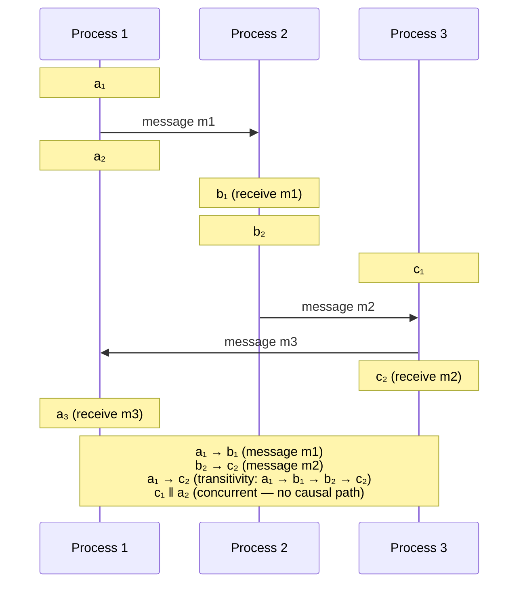
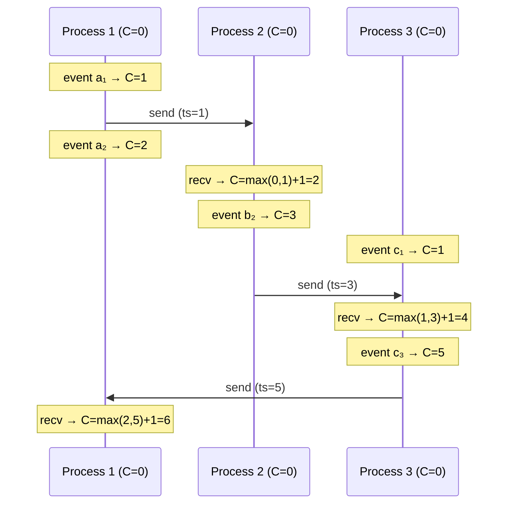
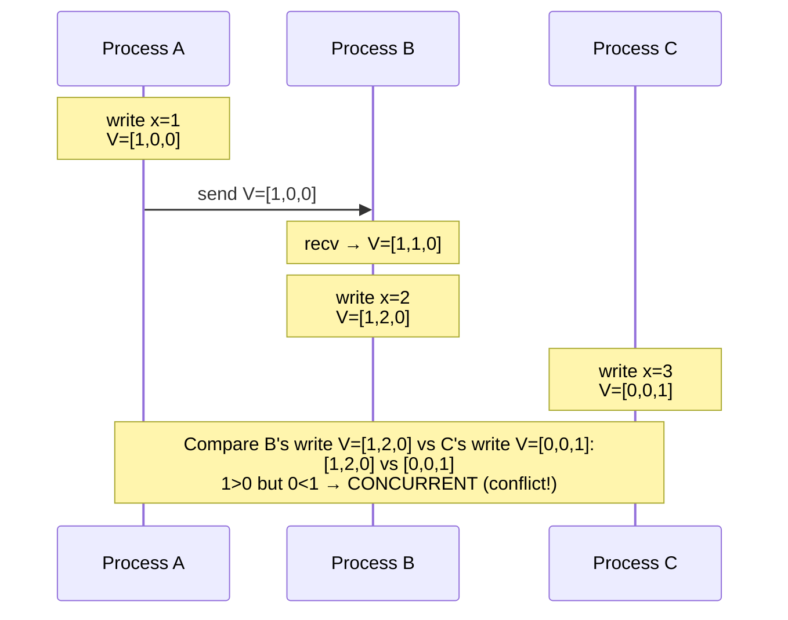
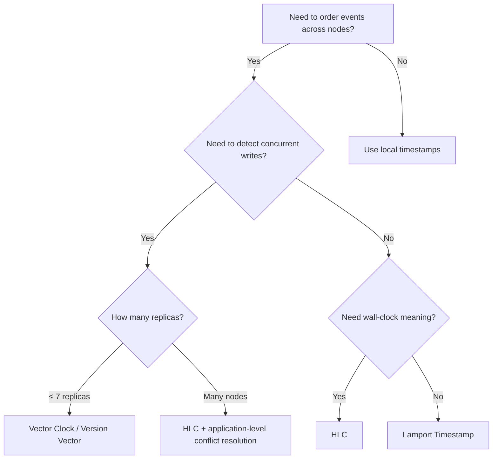

In a distributed system, there is no global clock. Each machine has its own physical clock that drifts independently. NTP synchronization keeps clocks within ~1–10ms of each other, but that error is large enough to make wall-clock timestamps unreliable for ordering events across machines.

Logical clocks solve this by tracking **causality** — which event could have influenced which — without relying on physical time.

## The Happens-Before Relation

Leslie Lamport defined a partial ordering of events called **happens-before** (→):

1. **Same process:** If a comes before b in the same process, then a → b
2. **Message passing:** If a is a send event and b is the corresponding receive, then a → b
3. **Transitivity:** If a → b and b → c, then a → c

If neither a → b nor b → a, the events are **concurrent** (a ‖ b). Concurrent events have no causal relationship — they happened independently and neither could have influenced the other.



## Lamport Timestamps

Each process maintains a single counter `C`:

**Rules:**
1. Before each local event: `C = C + 1`
2. Before sending a message: `C = C + 1`, attach `C` to the message
3. On receiving a message with timestamp `T`: `C = max(C, T) + 1`



### Properties

| Property | Holds? | Explanation |
|----------|--------|-------------|
| If a → b then L(a) < L(b) | **Yes** | Lamport timestamps respect causality |
| If L(a) < L(b) then a → b | **No** | c₁ has L=1, a₂ has L=2, but c₁ ‖ a₂ (concurrent) |

Lamport timestamps give you a **partial ordering consistent with causality**, but they cannot distinguish between "a happened before b" and "a and b are concurrent." Two events with different timestamps may still be concurrent.

### Total Ordering

To break ties (same Lamport timestamp on different processes), append the process ID: `(timestamp, processId)`. This produces a **total order** — every event gets a unique position. The total order is consistent with causality but is not unique (different tie-breaking choices yield different but equally valid orders).

**Used in:** Total order broadcast, distributed mutual exclusion, assigning sequence numbers in Kafka.

## Vector Clocks

Vector clocks fix Lamport's limitation by tracking the state of **every** process, not just a single counter.

Each process maintains a vector `V[1..n]` where `n` is the number of processes:

**Rules:**
1. Before each local event at process `i`: `V[i] = V[i] + 1`
2. Before sending a message at process `i`: `V[i] = V[i] + 1`, attach `V` to the message
3. On receiving a message with vector `V'` at process `i`: `V[j] = max(V[j], V'[j])` for all `j`, then `V[i] = V[i] + 1`

### Comparing Vectors

```
V1 ≤ V2   iff  V1[i] ≤ V2[i]  for ALL i
V1 < V2   iff  V1 ≤ V2  AND  V1 ≠ V2
V1 ‖ V2   iff  neither V1 < V2 nor V2 < V1
```

### Example with Concurrency Detection



**B's write** `[1,2,0]` and **C's write** `[0,0,1]` are concurrent — neither causally precedes the other. A system receiving both versions must resolve the conflict (last-write-wins, merge, or present both to the user).

### Properties

| Property | Holds? |
|----------|--------|
| If a → b then V(a) < V(b) | **Yes** |
| If V(a) < V(b) then a → b | **Yes** |
| V(a) ‖ V(b) iff a ‖ b | **Yes** |

Vector clocks give **perfect causal ordering** — they detect both causality and concurrency. This is strictly stronger than Lamport timestamps.

### Trade-off

Vector size is O(n) where n = number of processes. For a system with thousands of nodes, vectors become large. This limits vector clocks to systems with a bounded, small number of replicas (typically 3–7).

**Used in:** Amazon Dynamo (original paper), Riak (for conflict detection).

## Version Vectors

Version vectors are similar to vector clocks but are attached to **data objects** rather than individual events. They track which replicas have contributed to the current version of a specific piece of data.

```
User profile for user:42

Replica A writes: profile = {name: "Alice"}     → VV = {A:1}
Replica B reads from A, writes: profile = {name: "Alice", age: 30}  → VV = {A:1, B:1}

Meanwhile, Replica C (didn't see B's write):
Replica C writes: profile = {name: "Alice", city: "NYC"}  → VV = {A:1, C:1}

Read repair sees: {A:1, B:1} vs {A:1, C:1}
  B:1 > C:0 but C:1 > B:0 → CONCURRENT → conflict!
  Present both versions to application for merge
```

**Difference from vector clocks:** Vector clocks track all events on all processes. Version vectors track versions of a specific data item per replica. In practice, the implementation is nearly identical, but the conceptual scope is different.

**Used in:** Dynamo, Riak (per-key conflict detection), CouchDB.

## Hybrid Logical Clocks (HLC)

HLCs combine the best of physical and logical clocks: they are **monotonic**, **close to wall-clock time**, and **capture causality** — all with a fixed-size timestamp (not O(n) like vector clocks).

An HLC timestamp has two components:
- `l` (physical component): tracks the maximum known physical time
- `c` (logical component): breaks ties when physical clocks are equal

**Rules:**

```
On local event or send:
  l' = max(l, physical_clock())
  if l' == l:
    c = c + 1       // physical clock didn't advance — use logical
  else:
    c = 0           // physical clock advanced — reset logical
  l = l'

On receive message with (l_m, c_m):
  l' = max(l, l_m, physical_clock())
  if l' == l == l_m:
    c = max(c, c_m) + 1
  elif l' == l:
    c = c + 1
  elif l' == l_m:
    c = c_m + 1
  else:
    c = 0
  l = l'
```

### Properties

| Property | HLC | Lamport | Vector Clock |
|----------|-----|---------|-------------|
| Captures causality | Yes | Yes | Yes |
| Detects concurrency | No | No | **Yes** |
| Close to wall-clock | **Yes** | No | No |
| Fixed size | **Yes** (2 integers) | Yes (1 integer) | No (O(n)) |
| Monotonic | **Yes** | Yes | Yes |

HLCs sacrifice concurrency detection (which vector clocks provide) in exchange for fixed-size timestamps that are meaningful as real time. This makes them practical for systems with thousands of nodes.

**Used in:** CockroachDB (MVCC timestamps), MongoDB (oplog ordering), YugabyteDB, Google Spanner (uses TrueTime, a related concept with hardware-assisted bounded clock error).

## Choosing the Right Clock

| Clock Type | Use When | Real Systems |
|------------|---------|-------------|
| **Lamport** | Need a total order consistent with causality; concurrency detection not needed | Kafka offset ordering, distributed mutex |
| **Vector Clock** | Need to detect concurrent writes for conflict resolution; bounded number of replicas | Riak, Amazon Dynamo |
| **Version Vector** | Need per-object conflict detection in a multi-replica store | Dynamo, CouchDB |
| **HLC** | Need wall-clock-meaningful timestamps + causality in a large-scale system | CockroachDB, MongoDB, YugabyteDB |
| **TrueTime** | Have access to GPS + atomic clocks for bounded clock uncertainty | Google Spanner (proprietary hardware) |




**Interview framing:** "We'd use Hybrid Logical Clocks for MVCC timestamps — they're monotonic, close to wall-clock time, and fixed-size regardless of cluster size. CockroachDB uses this approach. If we need to detect concurrent writes for conflict resolution (like in a Dynamo-style system), we'd use vector clocks per key, but that only works with a small number of replicas per partition."

