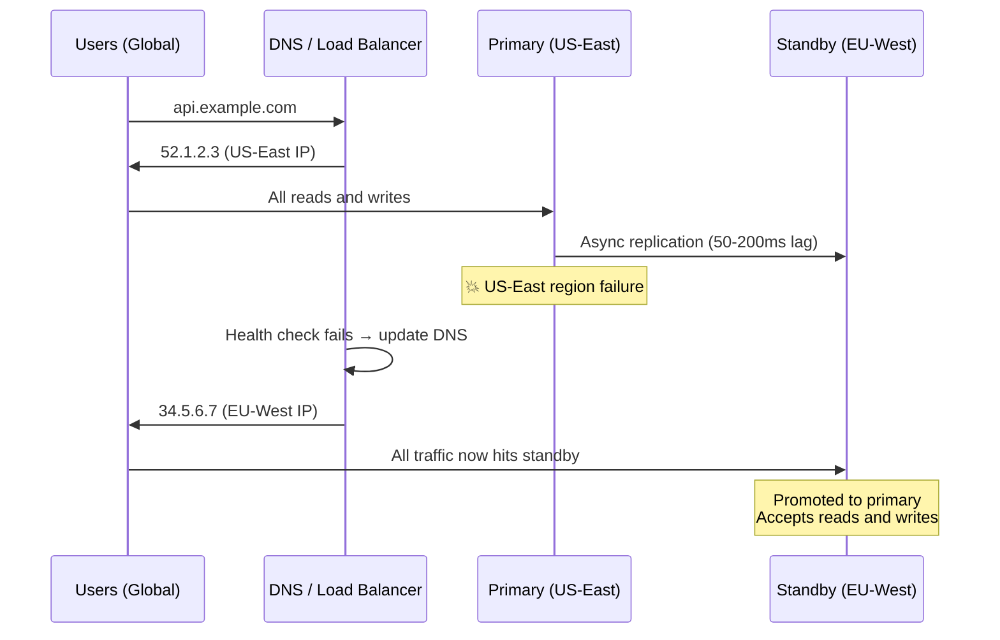
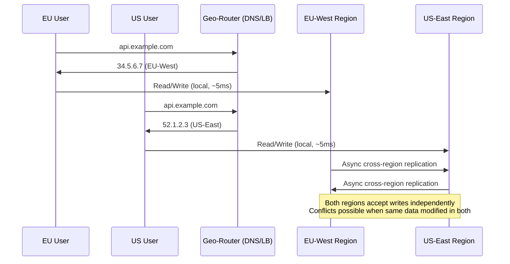
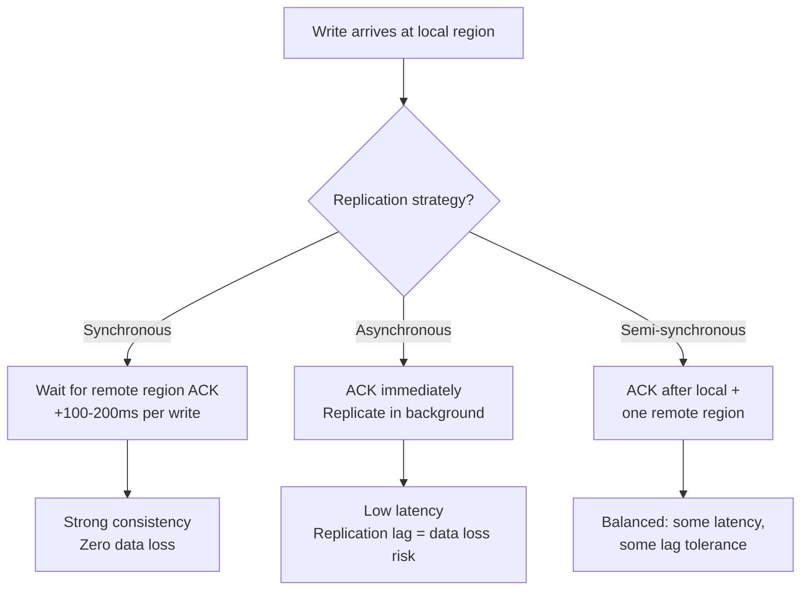
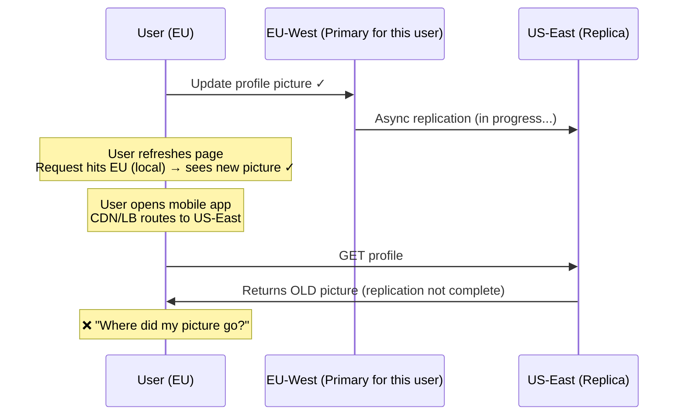
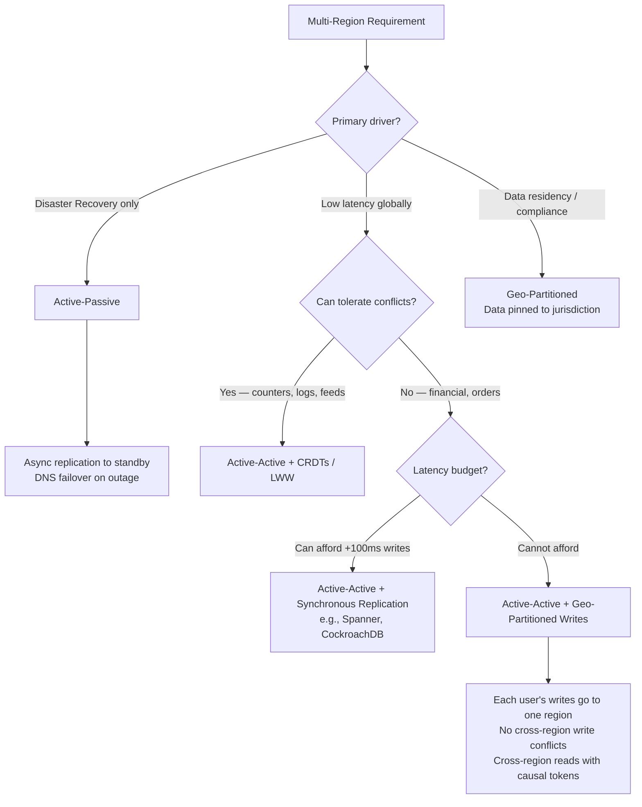

Multi-region architecture deploys an application across geographically separated datacenters to reduce latency, survive regional outages, and comply with data residency laws. The core tension is between **[consistency](../consistency-models)** (all regions see the same data) and **latency** (cross-region round trips cost 50–200ms) — the [PACELC](../pacelc) tradeoff at scale.

## Why Go Multi-Region?

| Driver | Detail |
|--------|--------|
| **Latency** | Users in Tokyo hitting a US-East server see ~150ms network RTT. A local region cuts this to ~5ms. |
| **Availability** | A single-region system has an availability ceiling of ~99.99% (one region's SLA). Multi-region with failover reaches 99.999%. |
| **Compliance** | GDPR requires EU user data processed in the EU. Brazil's LGPD, India's DPDP Act — all mandate data residency. |
| **Disaster recovery** | Fire, power outage, fiber cut, cloud provider outage — a second region keeps the business running. |

## Active-Passive

One region handles **all** traffic. The other region is a warm standby that receives replicated data but serves no user requests.



| Metric | Typical Value |
|--------|--------------|
| **RTO** (Recovery Time Objective) | 1–30 minutes (DNS TTL + promotion time) |
| **RPO** (Recovery Point Objective) | Seconds to minutes (async replication lag) |
| **Data loss on failover** | Up to the replication lag at the time of failure |
| **Cost** | Standby resources sit idle (30–50% of primary cost) |

**Pros:** Simple — no conflict resolution, one source of truth.
**Cons:** Standby is wasted capacity. Global users have high latency (all traffic goes to one region). Failover is manual or semi-automated.

## Active-Active

Multiple regions serve traffic simultaneously. Each region has its own database (or a partition of the global database). Users are routed to their nearest region.



| Metric | Typical Value |
|--------|--------------|
| **RTO** | Near-zero (traffic re-routes automatically) |
| **RPO** | Zero for local writes; replication lag for cross-region |
| **Latency** | Local region RTT (~5ms) |
| **Cost** | Both regions active — full capacity in each |

**Pros:** Low latency globally. Near-zero downtime on region failure.
**Cons:** Conflict resolution is hard. More expensive (no idle standby — both are fully provisioned). Operational complexity.

## Geo-Routing

How do users reach their nearest region?

### GeoDNS

The DNS server returns different IP addresses based on the client's geographic location (inferred from the resolver's IP or EDNS Client Subnet).

```
User in Paris → DNS returns EU-West IP (34.5.6.7)
User in NYC   → DNS returns US-East IP (52.1.2.3)
User in Tokyo → DNS returns AP-NE IP   (13.8.9.10)
```

**Limitations:** DNS TTL means failover is slow (minutes). Geographic inference is approximate (VPN users, corporate resolvers). No real-time latency awareness.

### Anycast

Multiple servers share the same IP address. BGP routing directs packets to the nearest server based on network topology.

```
All regions advertise: 198.51.100.1
User in Paris → BGP routes to EU-West (shortest AS path)
User in NYC   → BGP routes to US-East
```

**Used by:** Cloudflare, Google, all major CDNs. Best for stateless protocols (DNS, CDN). TCP Anycast requires careful handling of connection affinity.

### Latency-Based Routing

The load balancer actively measures latency to each region and routes users to the region with the lowest measured latency. More accurate than GeoDNS but requires health-check infrastructure.

**AWS Route 53:** Supports latency-based routing natively. Measures RTT from each region to the user's DNS resolver and returns the lowest-latency endpoint.

## Cross-Region Replication Strategies

The fundamental trade-off: synchronous replication across regions adds 50–200ms of latency to every write, while asynchronous replication creates a window where regions can diverge.



| Strategy | Write latency | Consistency | Data loss on failure |
|----------|-------------|-------------|---------------------|
| **Synchronous** | +100–200ms (cross-region RTT) | Strong (linearizable) | Zero |
| **Asynchronous** | Local only (~5ms) | Eventual | Up to replication lag |
| **Semi-synchronous** | +100–200ms (one remote ACK) | Strong within quorum | Zero if quorum survives |

**Google Spanner** uses synchronous replication with Paxos across regions. It accepts the latency cost (~10–50ms with TrueTime, higher for distant regions) in exchange for global strong consistency. Most systems cannot afford this trade-off and use asynchronous replication.

## Conflict Resolution in Active-Active

When two regions independently modify the same data before replication catches up, you have a **write conflict**. This is the hardest problem in multi-region design.

### Last-Write-Wins (LWW)

Use a timestamp to pick the "latest" write. The other write is silently discarded.

```
EU-West:  UPDATE users SET name='Alice' WHERE id=42   (ts=1000)
US-East:  UPDATE users SET name='Alicia' WHERE id=42  (ts=1001)

Conflict resolution: ts=1001 > ts=1000 → keep 'Alicia', discard 'Alice'
```

**Pros:** Simple, deterministic, no user intervention.
**Cons:** **Data loss.** The "losing" write is silently dropped. Clock skew can cause the "earlier" write to win. Acceptable for low-value data (last-seen timestamps, analytics counters), dangerous for high-value data (account balances, orders).


**LWW silently discards data — this is not a bug, it's the design.** If two users update the same row in different regions within the replication window, one update disappears with no error, no conflict notification, and no audit trail. For data where every write matters (financial transactions, inventory counts, user-facing content), LWW is not acceptable. Use CRDTs (below), application-level merge, or route all writes for a given entity to a single region.


### CRDTs (Conflict-Free Replicated Data Types)

Data structures that are **mathematically guaranteed** to converge when merged, regardless of the order updates are applied.

| CRDT | What it does | Merge operation | Example |
|------|-------------|-----------------|---------|
| **G-Counter** | Grow-only counter | Sum of per-node counts | Page view counter: EU adds 50, US adds 30 → total 80 |
| **PN-Counter** | Counter with increment/decrement | G-Counter pair (positive + negative) | Like count: +100 likes, -3 unlikes → 97 |
| **G-Set** | Grow-only set | Union | Tag set: EU adds "urgent", US adds "billing" → {"urgent", "billing"} |
| **OR-Set** | Set with add and remove | Add wins over concurrent remove | Shopping cart: add item A, concurrent remove of item A → keep A |
| **LWW-Register** | Single value, last-write-wins | Higher timestamp wins | User profile name field |

**Used by:** Redis CRDT (enterprise), Riak (data types), Cassandra counters (G-Counter internally), Figma (real-time collaboration).

**Limitation:** CRDTs work for specific data structures. You can't model arbitrary business logic as a CRDT. An "account balance" is not a simple counter — it has constraints (no negative balance) that CRDTs cannot enforce.

### Application-Level Merge

The application defines custom merge logic for conflicting writes.

```
EU-West:  shopping_cart = {items: [A, B]}
US-East:  shopping_cart = {items: [A, C]}

Application merge: union of items → {items: [A, B, C]}
```

**Pros:** Handles complex business logic (merge shopping carts, merge document edits).
**Cons:** Must be implemented per data type. Bugs in merge logic cause data corruption.

### Conflict Flagging

Detect the conflict, store both versions, and present them to the user (or an automated resolver) for resolution.

```
EU-West:  address = "123 Rue de Paris"
US-East:  address = "456 Fifth Ave"

Both stored with version vectors. On next read:
  "Conflict detected — which address is correct?"
  User picks one → conflict resolved
```

**Used by:** CouchDB, Riak (siblings), Git (merge conflicts).

## Read-Your-Writes in Multi-Region

After a user writes to their local region, an immediate read might hit a replica that hasn't received the write yet (asynchronous replication lag).



### Solutions

| Strategy | How | Trade-off |
|----------|-----|-----------|
| **Sticky routing** | Route all requests from a user to their write region (cookie, user-id hash) | Uneven load; defeats the purpose of multi-region for that user |
| **Read-from-primary** | After a write, read from the primary for N seconds | Higher latency for post-write reads |
| **Causal tokens** | Write returns a token (LSN/timestamp); read includes it; replica blocks until it reaches that point | Slight read latency; requires coordination |
| **Write-region affinity** | Each user is "homed" to a region; all their writes go there; reads can go anywhere with causal tokens | Requires user-to-region mapping |

## Data Sovereignty and Compliance

Multi-region design intersects with legal requirements:

```
GDPR (EU):         EU user data must be processed in the EU
LGPD (Brazil):     Brazilian user data requires consent and local processing
DPDP (India):      Certain categories of data must stay within India
HIPAA (US):        Health data requires specific controls regardless of location
```

### Geo-Partitioning

Partition data by geography so each user's data lives only in their legal jurisdiction:

```
User in Germany → data stored in EU-West only
User in US      → data stored in US-East only
User in Brazil  → data stored in SA-East only

Cross-region queries: route to the correct region based on user ID
Global analytics:     query each region separately, aggregate centrally
```

**CockroachDB** supports geo-partitioning natively: table rows can be pinned to specific regions based on a column value (e.g., `country`). Reads and writes for that row are served by the region that owns it.

## Architecture Patterns Summary




**Interview framing:** "For a globally distributed app, I'd use active-active with geo-partitioned writes — each user is homed to their nearest region, all their writes go there, so there are no write conflicts. Reads can go to any region using causal consistency tokens to ensure read-your-writes. For data that's truly global (product catalog, configuration), I'd use CRDTs or accept eventual consistency with LWW. Cross-region replication is async to keep write latency low, with semi-synchronous for critical data."

