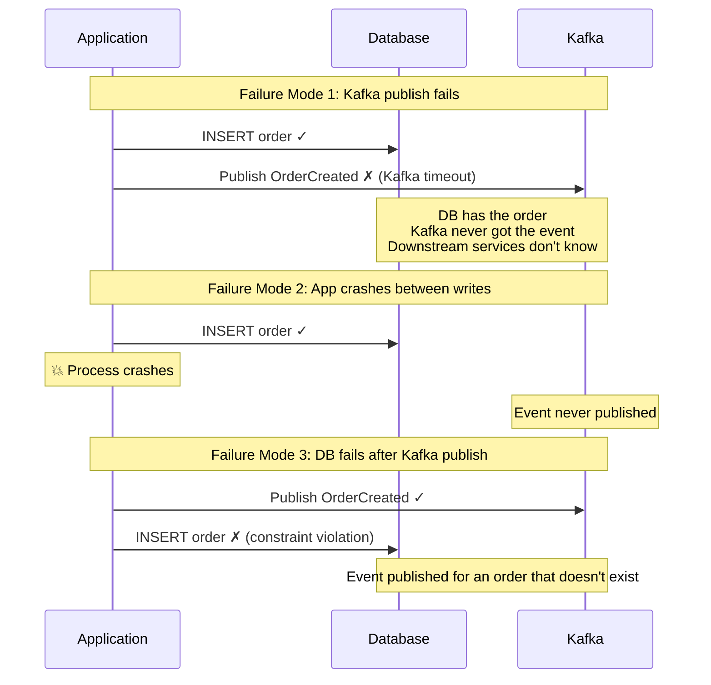
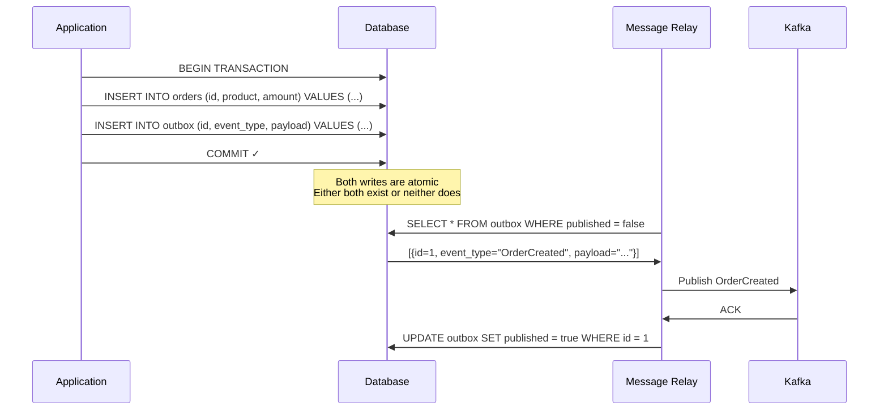
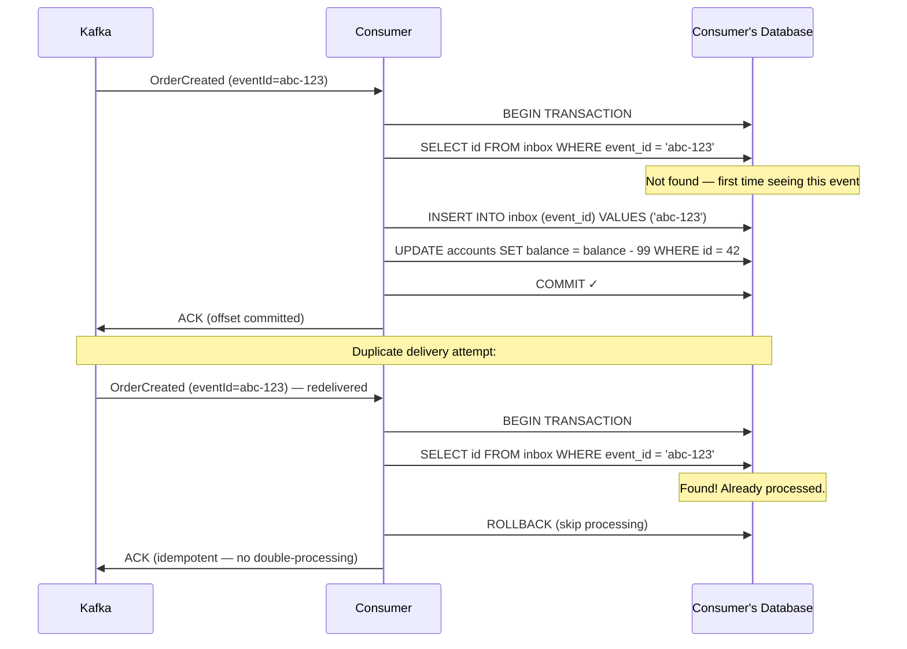
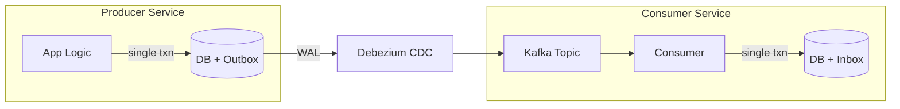

The Outbox Pattern solves the **dual-write problem**: how do you atomically update a database **and** publish an event to a message broker? The answer is — you don't. You write both to the database in a single transaction, and a separate process publishes the event later.

## The Dual-Write Problem

A common pattern in event-driven microservices: when business data changes, publish an event so other services can react.

```python
def create_order(order):
    db.save(order)                        # Step 1: write to database
    kafka.publish("OrderCreated", order)  # Step 2: publish to Kafka
```

This code has three failure modes, and **all of them break consistency**:



You cannot fix this by reordering the writes. Publishing first means events can exist without data. Writing first means data can exist without events. These are **two independent systems** — no amount of application-level retry logic makes them atomic.

## The Outbox Solution

Instead of publishing directly to [Kafka](../../messaging/kafka), write the event to an **outbox table** in the **same database transaction** as the business data:



**Why this works:** The database's own ACID transaction guarantees that the business data and the outbox row are written atomically. The event publication is decoupled into a separate, eventually-consistent process.

### Outbox Table Schema

```sql
CREATE TABLE outbox (
    id            UUID PRIMARY KEY DEFAULT gen_random_uuid(),
    aggregate_type VARCHAR(255) NOT NULL,    -- "Order", "Payment", "User"
    aggregate_id   VARCHAR(255) NOT NULL,    -- the business entity's ID
    event_type    VARCHAR(255) NOT NULL,     -- "OrderCreated", "OrderCancelled"
    payload       JSONB NOT NULL,            -- the full event data
    created_at    TIMESTAMP DEFAULT NOW(),
    published     BOOLEAN DEFAULT FALSE      -- used by polling relay
);
```

The `aggregate_type` + `aggregate_id` fields enable routing: events for the same aggregate go to the same Kafka partition, preserving ordering within an entity.

## Publishing: Polling vs CDC

### Polling Relay

The simplest approach: a background process periodically queries the outbox table.

```
Every 500ms:
  SELECT * FROM outbox WHERE published = false ORDER BY created_at LIMIT 100;
  For each row:
    Publish to Kafka
    UPDATE outbox SET published = true WHERE id = ?
```

| Pros | Cons |
|------|------|
| Simple to implement | Polling interval adds latency (up to 500ms) |
| Works with any database | Polling queries add load on the database |
| No external dependencies | Requires the `published` flag and cleanup |

### CDC with Debezium (Recommended)

**Change Data Capture** reads the database's internal replication log (PostgreSQL WAL, MySQL binlog) and streams changes to Kafka in near real-time.

```mermaid
sequenceDiagram
    participant App as Application
    participant DB as PostgreSQL
    participant WAL as WAL (Write-Ahead Log)
    participant Deb as Debezium Connector
    participant K as Kafka

    App->>DB: BEGIN; INSERT order; INSERT outbox; COMMIT;
    DB->>WAL: Write outbox INSERT to WAL

    Deb->>WAL: Read new WAL entries (logical replication slot)
    WAL->>Deb: INSERT on outbox table: {event_type="OrderCreated", payload="..."}

    Deb->>K: Publish to topic "outbox.events.Order"
    K->>Deb: ACK

    Deb->>Deb: Advance replication slot LSN
    Note over Deb: Position tracked — no duplicate on restart
```

**Why CDC is better than polling:**

| | Polling | CDC (Debezium) |
|---|---|---|
| **Latency** | Polling interval (100ms–1s) | Near real-time (10–50ms) |
| **Database load** | Periodic SELECT queries | Zero — reads the WAL passively |
| **Published flag** | Needed | Not needed — position tracked in WAL |
| **Delivery guarantee** | At-least-once (could miss on crash) | At-least-once (WAL is the source of truth) |
| **Cleanup** | Must delete old outbox rows | Can delete immediately after commit (Debezium reads WAL, not the table) |

**Debezium outbox routing:** Debezium has a built-in [Outbox Event Router](https://debezium.io/documentation/reference/transformations/outbox-event-router.html) that reads the outbox table structure and routes events to Kafka topics based on `aggregate_type`. No custom code needed.

## At-Least-Once Delivery

The relay (polling or CDC) may crash **after** publishing to Kafka but **before** recording that it published:

```
Relay reads outbox row → publishes to Kafka → 💥 crash before marking published

On restart: reads same row again → publishes to Kafka AGAIN → duplicate event
```

This is inherent to the pattern. The outbox guarantees **at-least-once** delivery, not exactly-once. Consumers **must be [idempotent](../idempotency)**.

## The Inbox Pattern (Consumer-Side Deduplication)

The consumer-side complement to the outbox. Each consumer maintains an **inbox table** to track which events it has already processed:



```sql
CREATE TABLE inbox (
    event_id    VARCHAR(255) PRIMARY KEY,
    processed_at TIMESTAMP DEFAULT NOW()
);

-- Optional: clean up old entries
DELETE FROM inbox WHERE processed_at < NOW() - INTERVAL '7 days';
```

The inbox check and the business logic execute in the **same database transaction** — the same atomic trick as the outbox.

## Complete Pipeline



```
Producer side:  Business write + outbox row in ONE transaction → atomicity
Transport:      Debezium reads WAL → publishes to Kafka → at-least-once
Consumer side:  Inbox dedup + business write in ONE transaction → exactly-once processing
```

The end-to-end guarantee is **effectively exactly-once**: at-least-once delivery (outbox + Debezium) combined with idempotent consumption (inbox) means every event is processed exactly once, even under failures.

## When to Use the Outbox Pattern

| Scenario | Use Outbox? | Why |
|----------|------------|-----|
| Service writes to DB and needs to notify other services | **Yes** | The canonical use case |
| [Saga](../saga-pattern) orchestrator sending commands | **Yes** | Orchestrator's state + outgoing command must be atomic |
| Service writes to DB and updates a cache | **Maybe** | CDC-based cache invalidation is simpler (no outbox table, just read the WAL) |
| Service only publishes events (no DB write) | **No** | No dual-write problem — publish directly |
| Service needs exactly-once Kafka production | **Consider** | Kafka's idempotent producer + transactions may suffice within a single Kafka pipeline |


**Interview framing:** "The order service writes the order and an outbox event in a single database transaction — atomicity is guaranteed by the database. Debezium tails the WAL and publishes the event to Kafka. Consumers are idempotent using an inbox table. This gives us effectively exactly-once delivery across service boundaries without distributed transactions."

