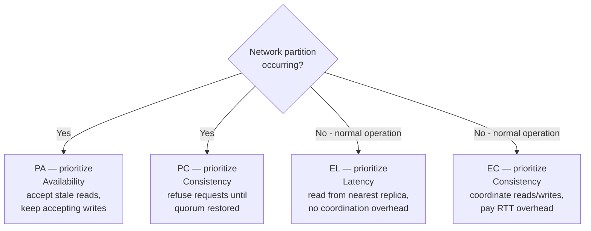

PACELC extends [CAP](../cap-theorem) by adding the tradeoff that exists in **normal operation** — when there is no partition. CAP forces a choice between Availability and Consistency only during a fault. PACELC says that even when the system is healthy, you must still choose between **Latency** and **Consistency** on every request.

```
If Partition:    choose A  (availability)  or  C (consistency)
Else:            choose L  (low latency)   or  C (consistency)
```

The Else clause is why PACELC is more useful than CAP in practice. Partitions are rare — a well-run cluster may experience one per year. But the latency vs. consistency tradeoff happens on every single read and write.

## The Framework



A system is classified as **PA/EL**, **PC/EC**, **PA/EC**, or **PC/EL** based on which side of each tradeoff it takes.

## Real-World System Classifications

| System | Classification | During partition | Normal operation |
|--------|---------------|-----------------|-----------------|
| **DynamoDB** (default) | PA/EL | Accepts writes on available nodes; may diverge | Eventually consistent reads (1 replica, low latency) |
| **Cassandra** (ONE) | PA/EL | Writes/reads from available replicas | Reads 1 replica — fast, potentially stale |
| **Cassandra** (QUORUM) | PA/EC | Writes succeed with majority; reads from majority | Reads majority — consistent, ~2–3× latency |
| **Google Spanner** | PC/EC | Rejects requests without quorum | TrueTime-bounded consistent reads; ~5ms+ latency always |
| **etcd / ZooKeeper** | PC/EC | Minority partition refuses requests | All reads/writes through leader — consistent, higher latency |
| **Riak** | PA/EL | Always available, vector clock conflicts | Low latency, eventual consistency |
| **MongoDB** (primary reads) | PC/EC | Primary-only writes; secondary reads optionally AP | Reads from primary — consistent |
| **CockroachDB** | PC/EC | Raft quorum required | Serializable isolation; consistent, ~2ms+ coordination |
| **Redis** (standalone) | PC/EL | Single node — partition = unavailability | In-memory, sub-ms — no replication latency overhead |

## Why the Else Clause Matters

Consider a 3-node database cluster with replication factor 3. A network partition affecting 1 node happens perhaps once a year. But **every read** must answer: should I wait for a quorum response, or return immediately from the closest replica?

```
Scenario: user reads their own profile
  EL choice: read from replica in same AZ → 1ms, may be 50ms behind primary
  EC choice: read from primary or quorum → 3ms, guaranteed fresh

At 100k reads/second, the difference is:
  EL: ~100,000 req/s × 1ms = 100 CPU-seconds of wait
  EC: ~100,000 req/s × 3ms = 300 CPU-seconds of wait
  EC costs 3× more compute for reads
```

For most reads (social feeds, product catalog, view counts) the stale-ok choice (EL) is correct and much cheaper. For a small subset (account balance, inventory check, idempotency key lookup) the consistent choice (EC) is required regardless of cost.

## Tunable Consistency: Cassandra as the Canonical Example

Cassandra exposes the PACELC tradeoff directly through consistency levels, configurable per-operation:

```
Read/write consistency level → PACELC position:

ONE    → EL: fastest (1 node), stale possible
TWO    → between EL and EC
QUORUM → EC: majority (ceil(RF/2)+1 nodes), consistent
ALL    → EC: all nodes must ACK, highest consistency, lowest availability
LOCAL_QUORUM → EC within one datacenter (cross-DC operations still async)
```

```
RF = 3 (3 replicas):

Write at QUORUM:
  Coordinator writes to all 3 replicas
  Waits for 2 ACKs → returns success
  1 replica can lag; still consistent for reads at QUORUM

Read at QUORUM:
  Coordinator asks 2 replicas
  Takes latest value (by timestamp)
  Guaranteed to overlap with the QUORUM write set → always sees latest write
```

**The overlap guarantee:** If W (write quorum) + R (read quorum) > N (replication factor), the read set always contains at least one node from the most recent write set. This is the mathematical basis for consistency in quorum systems.

```
RF=3, QUORUM: W=2, R=2
W + R = 4 > N = 3 ✓ → consistent

RF=3, ONE: W=1, R=1
W + R = 2 ≤ N = 3 ✗ → stale reads possible
```


**"Tunable consistency" does not mean free consistency.** Raising the consistency level from ONE to QUORUM increases read/write latency proportionally (you wait for more replicas). In a geo-distributed cluster, a QUORUM read may cross datacenter boundaries, adding 50–200ms. Per-operation tuning is powerful, but every consistency upgrade has a latency and availability cost — there is no setting that gives you strong consistency at ONE-level latency.


## DynamoDB: PA/EL with an Escape Hatch

DynamoDB defaults to eventually consistent reads (PA/EL) but offers `ConsistentRead=true` for strongly consistent reads (EC behavior) at 2× read unit cost and higher latency.

```
Eventually consistent read:  may return data up to ~1s old, 0.5ms p50
Strongly consistent read:    always current, 1–3ms p50, 2× RCU cost
Transactional read:          serializable, 2× RCU + coordination overhead
```

The default is EL because most DynamoDB workloads — session state, user preferences, product catalog — tolerate brief staleness. Applications opt into EC selectively for the operations that require it (inventory reservation, balance checks).

## Applying PACELC in System Design Interviews

CAP framing asks: "What happens during a failure?" PACELC framing asks: "What is the latency/consistency behavior of every operation?" The second question is almost always more relevant to design decisions.

**Decision framework for each data access:**

| Data | Stale OK? | PACELC choice | Example systems |
|------|-----------|--------------|----------------|
| Social feed posts | Yes (seconds) | EL | Cassandra/DynamoDB at ONE |
| Product description | Yes (minutes) | EL | CDN-cached, eventual |
| Like/view count | Yes (seconds) | EL | Redis INCR, async flush |
| User account balance | No | EC | Postgres primary, or DynamoDB strong read |
| Inventory quantity | No | EC | SQL with SELECT FOR UPDATE |
| Idempotency key | No | EC | Redis SETNX or DB unique constraint |
| Session token validity | No | EC | Read from primary or authoritative cache |

**How to use PACELC in an interview:**

Instead of saying "I'll use Cassandra because it's AP," say: "For the activity feed I'll use Cassandra at `LOCAL_ONE` — users can tolerate a few seconds of staleness and I want low read latency. For the balance ledger I'll use the primary replica at `LOCAL_QUORUM` or route to the SQL primary — staleness here has monetary consequences."

This framing shows you understand that consistency is a per-operation decision, not a system-level binary.


PACELC doesn't replace CAP — it generalizes it. When an interviewer asks about consistency tradeoffs, lead with the Else clause: the L/C tradeoff on every request. Then address the Partition clause: what the system does during a fault. Most real systems are rarely partitioned; the L/C tradeoff is the one you actually tune.

