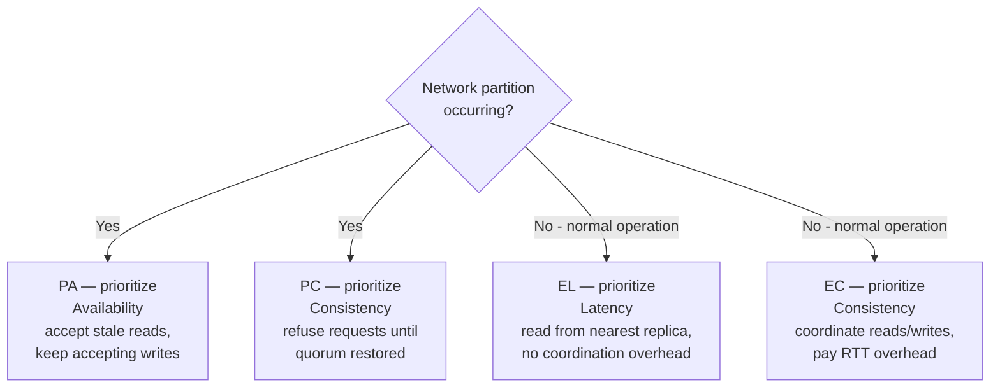

Your DynamoDB table is healthy. Every replica is online, no partitions, no failures — and yet on every single read you have to choose: do you accept a possibly-stale value from one replica in 0.5ms, or wait for a quorum and pay 2ms plus 2× the read cost for guaranteed freshness? CAP doesn't help here because there's no partition. **PACELC is the framing that does** — it says even in normal operation, every distributed system trades **Latency for Consistency** on every request, and that tradeoff happens millions of times more often than the rare partition CAP focuses on. Picking the right side of the Else clause, per data type, is the consistency conversation that actually shapes your bill.

PACELC extends [CAP](../cap-theorem) by adding the tradeoff that exists in **normal operation** — when there is no partition. CAP forces a choice between Availability and Consistency only during a fault. PACELC says that even when the system is healthy, you must still choose between **Latency** and **Consistency** on every request.

```
If Partition:    choose A  (availability)  or  C (consistency)
Else:            choose L  (low latency)   or  C (consistency)
```

The Else clause is why PACELC is more useful than CAP in practice. Partitions are rare — a well-run cluster may experience one per year. But the latency vs. consistency tradeoff happens on every single read and write.

## The Framework


```mermaid
flowchart TD
    Q{Network partition\noccurring?}
    Q -->|Yes| PA[PA — prioritize\nAvailability\naccept stale reads,\nkeep accepting writes]
    Q -->|Yes| PC[PC — prioritize\nConsistency\nrefuse requests until\nquorum restored]
    Q -->|No - normal operation| EL[EL — prioritize\nLatency\nread from nearest replica,\nno coordination overhead]
    Q -->|No - normal operation| EC[EC — prioritize\nConsistency\ncoordinate reads/writes,\npay RTT overhead]
```

A system is classified as **PA/EL**, **PC/EC**, **PA/EC**, or **PC/EL** based on which side of each tradeoff it takes.

## Real-World System Classifications

| System | Classification | During partition | Normal operation |
|--------|---------------|-----------------|-----------------|
| **DynamoDB** (default) | PA/EL | Accepts writes on available nodes; may diverge | Eventually consistent reads (1 replica, low latency) |
| **Cassandra** (ONE) | PA/EL | Writes/reads from available replicas | Reads 1 replica — fast, potentially stale |
| **Cassandra** (QUORUM) | PA/EC | Writes succeed with majority; reads from majority | Reads majority — consistent, ~2–3× latency |
| **Google Spanner** | PC/EC | Rejects requests without quorum | TrueTime-bounded consistent reads; ~5ms+ latency always |
| **etcd / ZooKeeper** | PC/EC | Minority partition refuses requests | All reads/writes through leader — consistent, higher latency |
| **Riak** | PA/EL | Always available, vector clock conflicts | Low latency, eventual consistency |
| **MongoDB** (primary reads) | PC/EC | Primary-only writes; secondary reads optionally AP | Reads from primary — consistent |
| **CockroachDB** | PC/EC | Raft quorum required | Serializable isolation; consistent, ~2ms+ coordination |
| **Redis** (standalone) | PC/EL | Single node — partition = unavailability | In-memory, sub-ms — no replication latency overhead |

## Why the Else Clause Matters

Consider a 3-node database cluster with replication factor 3. A network partition affecting 1 node happens perhaps once a year. But **every read** must answer: should I wait for a quorum response, or return immediately from the closest replica?

```
Scenario: user reads their own profile
  EL choice: read from replica in same AZ → 1ms, may be 50ms behind primary
  EC choice: read from primary or quorum → 3ms, guaranteed fresh

At 100k reads/second, the difference is:
  EL: ~100,000 req/s × 1ms = 100 CPU-seconds of wait
  EC: ~100,000 req/s × 3ms = 300 CPU-seconds of wait
  EC costs 3× more compute for reads
```

For most reads (social feeds, product catalog, view counts) the stale-ok choice (EL) is correct and much cheaper. For a small subset (account balance, inventory check, idempotency key lookup) the consistent choice (EC) is required regardless of cost.

## Tunable Consistency: Cassandra as the Canonical Example

Cassandra exposes the PACELC tradeoff directly through consistency levels, configurable per-operation:

```
Read/write consistency level → PACELC position:

ONE    → EL: fastest (1 node), stale possible
TWO    → between EL and EC
QUORUM → EC: majority (ceil(RF/2)+1 nodes), consistent
ALL    → EC: all nodes must ACK, highest consistency, lowest availability
LOCAL_QUORUM → EC within one datacenter (cross-DC operations still async)
```

```
RF = 3 (3 replicas):

Write at QUORUM:
  Coordinator writes to all 3 replicas
  Waits for 2 ACKs → returns success
  1 replica can lag; still consistent for reads at QUORUM

Read at QUORUM:
  Coordinator asks 2 replicas
  Takes latest value (by timestamp)
  Guaranteed to overlap with the QUORUM write set → always sees latest write
```

**The overlap guarantee:** If W (write quorum) + R (read quorum) > N (replication factor), the read set always contains at least one node from the most recent write set. This is the mathematical basis for consistency in quorum systems.

```
RF=3, QUORUM: W=2, R=2
W + R = 4 > N = 3 ✓ → consistent

RF=3, ONE: W=1, R=1
W + R = 2 ≤ N = 3 ✗ → stale reads possible
```


**"Tunable consistency" does not mean free consistency.** Raising the consistency level from ONE to QUORUM increases read/write latency proportionally (you wait for more replicas). In a geo-distributed cluster, a QUORUM read may cross datacenter boundaries, adding 50–200ms. Per-operation tuning is powerful, but every consistency upgrade has a latency and availability cost — there is no setting that gives you strong consistency at ONE-level latency.


## DynamoDB: PA/EL with an Escape Hatch

DynamoDB defaults to eventually consistent reads (PA/EL) but offers `ConsistentRead=true` for strongly consistent reads (EC behavior) at 2× read unit cost and higher latency.

```
Eventually consistent read:  may return data up to ~1s old, 0.5ms p50
Strongly consistent read:    always current, 1–3ms p50, 2× RCU cost
Transactional read:          serializable, 2× RCU + coordination overhead
```

The default is EL because most DynamoDB workloads — session state, user preferences, product catalog — tolerate brief staleness. Applications opt into EC selectively for the operations that require it (inventory reservation, balance checks).

## Applying PACELC in System Design Interviews

CAP framing asks: "What happens during a failure?" PACELC framing asks: "What is the latency/consistency behavior of every operation?" The second question is almost always more relevant to design decisions.

**Decision framework for each data access:**

| Data | Stale OK? | PACELC choice | Example systems |
|------|-----------|--------------|----------------|
| Social feed posts | Yes (seconds) | EL | Cassandra/DynamoDB at ONE |
| Product description | Yes (minutes) | EL | CDN-cached, eventual |
| Like/view count | Yes (seconds) | EL | Redis INCR, async flush |
| User account balance | No | EC | Postgres primary, or DynamoDB strong read |
| Inventory quantity | No | EC | SQL with SELECT FOR UPDATE |
| Idempotency key | No | EC | Redis SETNX or DB unique constraint |
| Session token validity | No | EC | Read from primary or authoritative cache |

**How to use PACELC in an interview:**

Instead of saying "I'll use Cassandra because it's AP," say: "For the activity feed I'll use Cassandra at `LOCAL_ONE` — users can tolerate a few seconds of staleness and I want low read latency. For the balance ledger I'll use the primary replica at `LOCAL_QUORUM` or route to the SQL primary — staleness here has monetary consequences."

This framing shows you understand that consistency is a per-operation decision, not a system-level binary.


PACELC doesn't replace CAP — it generalizes it. When an interviewer asks about consistency tradeoffs, lead with the Else clause: the L/C tradeoff on every request. Then address the Partition clause: what the system does during a fault. Most real systems are rarely partitioned; the L/C tradeoff is the one you actually tune.



**Interview tip:** I'd frame PACELC precisely as "during Partition: A or C; Else: Latency or Consistency" — and stress that the **Else clause matters more day-to-day** because partitions are rare but every read pays the L-vs-C cost. Concretely: DynamoDB and Cassandra-at-ONE are PA/EL (fast eventually-consistent reads), Spanner and CockroachDB are PC/EC (always consistent, always paying coordination), and Cassandra is the interesting case because its consistency level lets you pick PA/EL or PA/EC per operation. The mistake I'd avoid is treating consistency as a system-level setting — it's a per-operation decision, so feeds and view counts go EL on the cheap path, while balances and idempotency keys go EC even though they're 3× the cost. And I'd remind myself the math: R + W > N is what makes quorum reads consistent; ONE/ONE doesn't satisfy it.


## Test Your Understanding


**The coordination tax of strong consistency, paid on every single request even when the network is healthy.** Linearizability requires nodes to *agree on the current value before* acknowledging a read or write, and that agreement costs latency in two concrete ways:

1. **Network round-trips for quorum/consensus.** To make a write consistent, the coordinator must replicate it to a quorum (Raft/Paxos or synchronous replication) and wait for acknowledgments — multi-hop latency added to every write.
2. **The straggler problem.** A strongly consistent operation is only as fast as the slowest replica in the required set. One node with a GC pause, disk I/O hiccup, or CPU spike stalls the whole operation.

A PA/EL system sidesteps both by replicating **asynchronously**: the primary acks the client immediately and syncs replicas in the background. Latency stays low, but a window opens where a read can hit a replica that hasn't caught up — that's the consistency it traded away. Consistency is never free: you either pay it as downtime during partitions (CP) or as latency during normal operation (EC).



**Apply strong consistency selectively — only for this user, only for a short window — instead of globally.** The database stays PA/EL for everyone else. Two patterns:

- **Version/verification token (RYOW pinning):** the write returns a monotonic version (e.g. `version=105`). The client carries it on subsequent reads. If a read lands on Virginia and its local copy is only at `version=104`, the app layer knows it's stale and either reads strongly from the Mumbai master for that one request or blocks a few ms until replication catches up.
- **Temporary master-routing:** on write, set a flag in a globally replicated cache (`user_123_updated_at`). For the next few minutes (max replication lag), *all* reads for that user — any device, any region — are explicitly routed to the master region. After the flag expires, reads drop back to fast local replicas.

**Why not just sticky sessions by user?** Sticky routing works until the user switches devices or networks (phone on cellular → laptop on VPN) and lands on a different region — then the session breaks and they hit stale data. Version tokens and master-routing follow the *data*, not the connection, so they survive device switches.



**There is no setting that gives strong consistency at ONE-level latency — every consistency upgrade costs latency and availability.** Raising from `ONE` to `QUORUM` means waiting for more replicas to respond; in a geo-distributed cluster a `QUORUM` read may cross datacenter boundaries and add 50–200ms.

The consistency guarantee comes from the overlap rule: **R + W > N**, where N is the replication factor, W the write quorum, R the read quorum. When R + W > N, the read set is guaranteed to share at least one node with the most recent write set, so the read sees the latest write. With RF=3, `QUORUM` gives W=2, R=2 → 4 > 3 ✓ (consistent). `ONE` gives W=1, R=1 → 2 ≤ 3 ✗ (stale reads possible). You buy consistency with latency — the math just tells you the minimum price.

