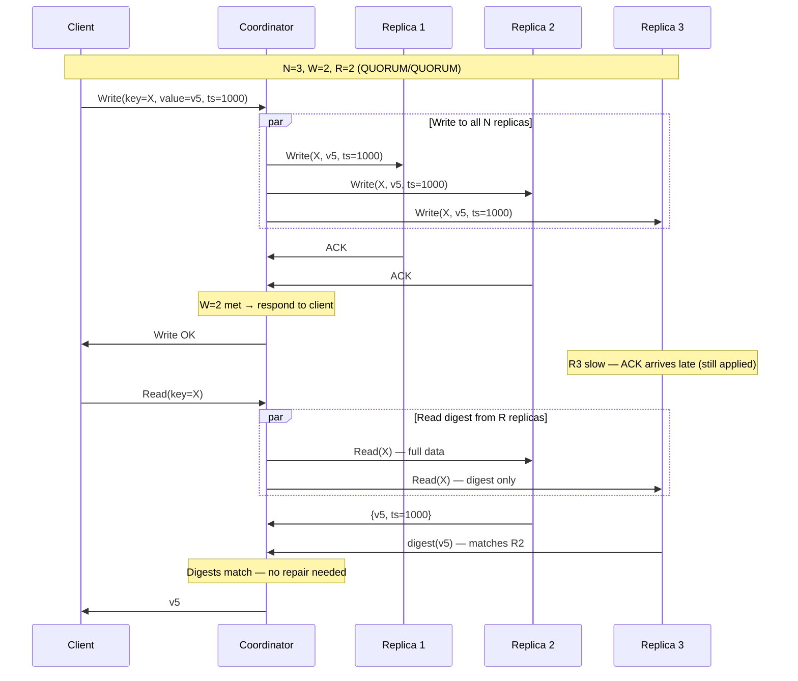
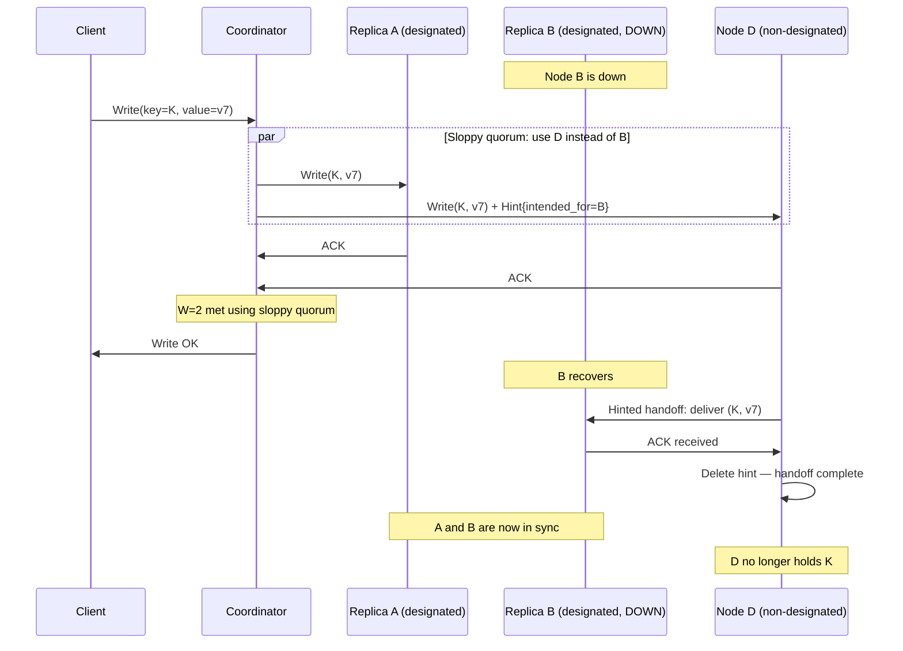
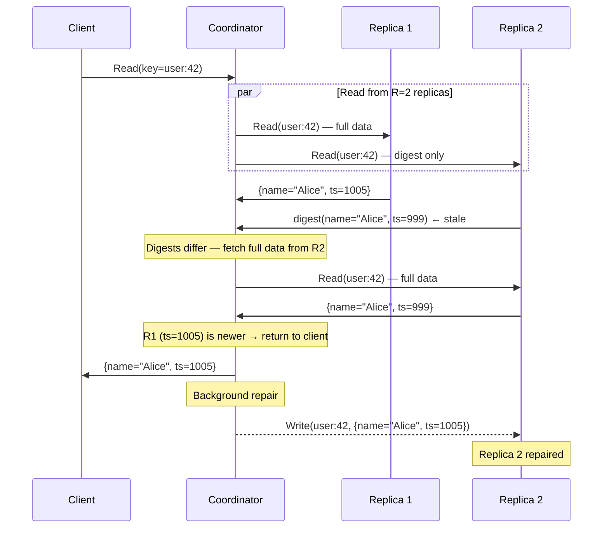

A quorum is the minimum number of nodes that must participate in an operation for the result to be considered valid. In a replicated system with N copies of the data, configuring how many nodes must acknowledge a write (W) and how many must respond to a read (R) lets you trade consistency for availability and latency — per operation if needed.

## The R + W > N Rule

**R + W > N** is the overlap guarantee: any set of R nodes that are read from must share at least one node with any set of W nodes that were written to.

```
N = 3 replicas: A, B, C
Write goes to W nodes: {A, B}      ← W = 2
Read goes to R nodes:  {B, C}      ← R = 2
                         ↑
                    B is in both sets

R + W = 4 > N = 3 → overlap guaranteed
The overlapping node (B) has the latest write → read sees it
```

If R + W ≤ N, no overlap is guaranteed. A write to {A} and a read from {B, C} can miss the write entirely — this is eventual consistency with no ordering guarantee.

**The intersection proof:** W nodes were written to. R nodes are being read from. Out of N total nodes, if you pick W and then pick R, the two sets must overlap when W + R > N (pigeonhole principle). That overlapping node holds the latest write, so the read will see it.

## Quorum Configurations

For N = 3 (the most common replication factor):

| Configuration | W | R | R+W | Guarantees | Use case |
|--------------|---|---|-----|-----------|---------|
| `ALL` writes, `ONE` read | 3 | 1 | 4 | Strong consistency | Read-heavy; write availability sacrificed |
| `QUORUM` / `QUORUM` | 2 | 2 | 4 | Strong consistency | Balanced; tolerates 1 failure |
| `ONE` write, `ALL` reads | 1 | 3 | 4 | Strong consistency | Write-heavy; read availability sacrificed |
| `ONE` / `ONE` | 1 | 1 | 2 | **None** (eventual) | Maximum performance; stale reads possible |

For N = 5:

| Configuration | W | R | Tolerates |
|--------------|---|---|-----------|
| `QUORUM` / `QUORUM` | 3 | 3 | 2 node failures |
| `ALL` / `ONE` | 5 | 1 | 0 node failures for writes |
| `TWO` / `TWO` | 2 | 2 | R+W=4 < N=5 — **no overlap guarantee** |

> The "TWO / TWO" row above is a common mistake. Two nodes confirmed a write and two nodes are read from, but out of five replicas those four slots can be entirely disjoint. Always verify R + W > N explicitly.

## Quorum Write and Read Flow



**Digest reads (Cassandra optimization):** The coordinator sends a full data request to one replica and digest-only requests to the rest. On a match, no repair is needed and network traffic is reduced. On a mismatch, the coordinator fetches full data from all replicas, determines the latest version, and repairs the stale replica.

## Sloppy Quorum and Hinted Handoff

A strict quorum requires W **designated** replicas to acknowledge a write. During a partial failure, fewer than W designated replicas may be available — causing the write to fail even though healthy nodes exist elsewhere in the cluster.

**Sloppy quorum** (used by DynamoDB, Cassandra `ANY`) relaxes this: if fewer than W designated replicas are reachable, accept writes on any W available nodes in the cluster. Those nodes temporarily store the data with a **hint** — a note recording which unavailable node the data truly belongs to.



**Trade-off:** During the window between the sloppy write and hinted handoff completion, a QUORUM read (R=2 from the designated {A, B, C}) may not see the write — it was on A and D, not two of the designated nodes. Sloppy quorum trades short-term consistency for higher write availability. Once handoff completes, the designated replicas are consistent and QUORUM reads work correctly.

**Cassandra consistency level `ANY`:** accepts a write even if only a hint is stored somewhere. The most available but weakest durability option — data isn't safe until hinted handoff completes.


**Sloppy quorum breaks the R + W > N guarantee.** With sloppy quorum, a write may land on non-designated nodes. A subsequent QUORUM read from the designated replicas will miss the write entirely — even with R + W > N — because the write is on a different set of nodes. Use sloppy quorum only when write availability is more important than immediate read consistency. For strong consistency, require strict quorum (`QUORUM` or `LOCAL_QUORUM` in Cassandra, not `ANY`).


## Read Repair

Even with R + W > N, replicas accumulate staleness over time: a replica that was briefly down may have missed a write; background compaction may not have run; anti-entropy repair may be overdue. Read repair is the mechanism that fixes divergence opportunistically — during reads — without waiting for scheduled repair jobs.

### How It Works



### Background vs Synchronous Repair

**Background read repair (Cassandra default):**
- The stale replica is patched **after** the client response is sent
- `read_repair_chance` (0.0–1.0): probability any given read triggers repair on disagreement. Default 0.1 (10%).
- Pros: no added read latency
- Cons: staleness persists until a triggered repair hits the diverged node

**Synchronous (blocking) read repair:**
- Coordinator waits for the repair write to ACK before responding to the client
- Stronger consistency guarantee: after the read returns, all R replicas are in sync
- Cons: adds latency proportional to the slowest replica being repaired
- In Cassandra: enabled by setting `read_repair = BLOCKING` at the table level

**Digest mismatch rate** is a useful operational metric. A high rate indicates replicas are diverging faster than repair can keep up — usually a sign of high write load, missed hints, or insufficient `nodetool repair` frequency.

## Examples in Production Systems

### Cassandra

Cassandra exposes quorum tuning at the individual operation level via consistency levels:

| Consistency Level | W or R count | Notes |
|------------------|-------------|-------|
| `ONE` | 1 | Fastest; no overlap guarantee with ONE writes |
| `TWO` | 2 | Fixed count, not relative to N |
| `THREE` | 3 | Fixed count |
| `QUORUM` | ⌊N/2⌋ + 1 | Strong consistency when both read and write use QUORUM |
| `LOCAL_QUORUM` | ⌊N_local/2⌋ + 1 | QUORUM within a single datacenter |
| `EACH_QUORUM` | QUORUM in every DC | Maximum cross-DC consistency |
| `ALL` | N | All replicas must respond |
| `ANY` | 1 (including hints) | Highest availability; weakest durability |

For a keyspace with `replication_factor = 3`, using `QUORUM` on both reads and writes means W=2, R=2, R+W=4 > 3 — strong consistency with tolerance for one node failure.

`LOCAL_QUORUM` is the standard choice for multi-datacenter deployments: it guarantees strong consistency within the local DC without waiting for cross-DC acknowledgments (which add 50–200ms of network latency).

### DynamoDB

DynamoDB offers two read consistency modes:
- **Eventually consistent reads** (default): read from one replica; may return stale data up to ~1 second old; half the read capacity cost
- **Strongly consistent reads**: read from a quorum of replicas; always returns the latest committed write; full read capacity cost

DynamoDB writes always go to a quorum internally (details not public, but consistent with R+W > N). The customer-facing choice is only on the read side.

DynamoDB also uses sloppy quorum with hinted handoff — if a designated replica is unavailable, a write is temporarily accepted by another node and handed off when the replica recovers.

### Riak

Riak makes R, W, DW (durable write — fsync'd to disk), and PR/PW (primary reads/writes — must use designated nodes, not sloppy) all tunable per-request:

```
PUT /bucket/key
  r=2&w=2         → QUORUM/QUORUM sloppy quorum
  pr=2&pw=2       → strict primary quorum (no sloppy nodes)
  dw=2            → 2 replicas must fsync before ACK
```

Setting `pr=2, pw=2` is the strictest mode — equivalent to disabling sloppy quorum, ensuring no hinted-handoff ambiguity at the cost of lower write availability.

## Choosing Quorum Parameters

```
Start with N = 3, QUORUM / QUORUM (W=2, R=2):
  → Tolerates 1 node failure for both reads and writes
  → Most common production setting

If reads are 10x more frequent than writes:
  → W = ALL (3), R = ONE (1), R+W = 4 > 3
  → Writes slower (all 3 must ACK), reads faster (any 1 node)
  → Only viable if write path is not latency-sensitive

If writes must never be lost:
  → W = ALL (3)
  → Accept that writes fail if any replica is unavailable

If maximum availability is needed (IoT, metrics ingestion):
  → W = ONE, R = ONE (eventual consistency)
  → Accept stale reads and potential data loss on node failure
```


In a system design interview, when choosing between strong and eventual consistency, frame it as a quorum choice: "We'll use QUORUM writes and QUORUM reads — with N=3 that's W=2, R=2, which guarantees the read set always overlaps the write set. For cross-datacenter we'd use LOCAL_QUORUM to avoid the cross-region latency penalty while keeping consistency within each DC." This shows you understand the mechanism, not just the label.

