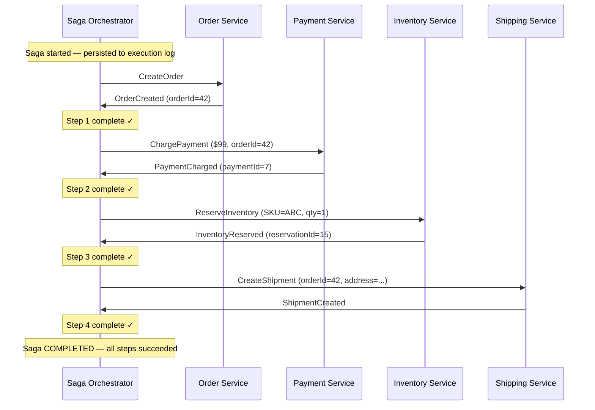
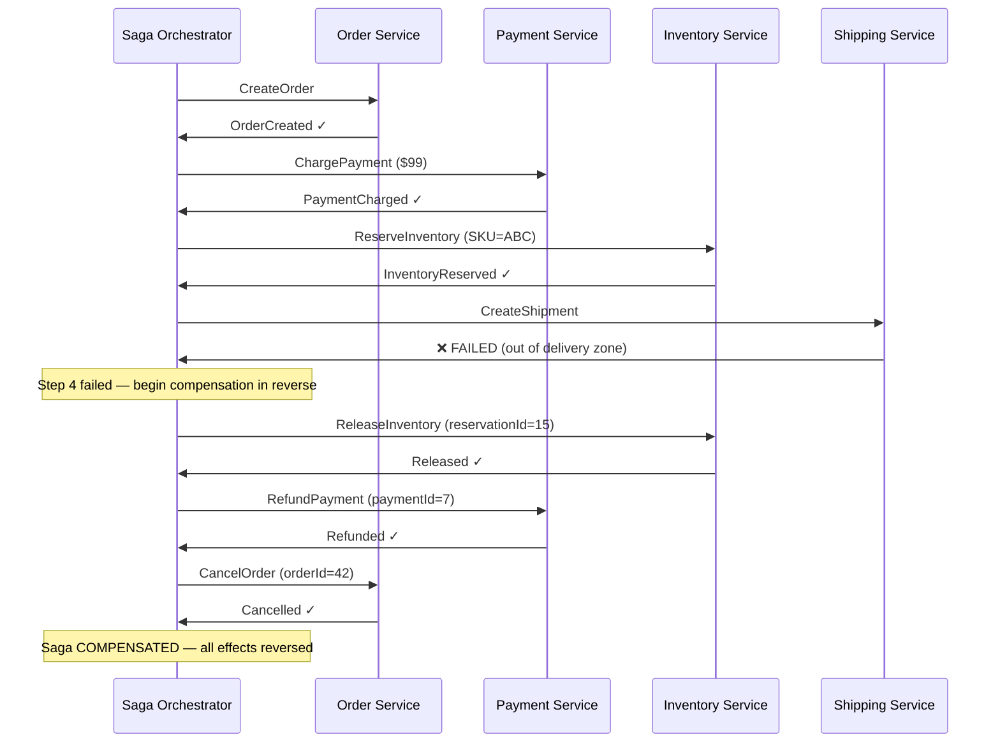
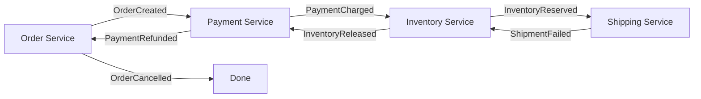

A Saga is a sequence of **local transactions** across multiple services, where each step has a **compensating transaction** that undoes its effect if a later step fails. It replaces distributed transactions (2PC) in microservice architectures where holding cross-service locks is impractical.

## Why Not [2PC](../../consensus/two-phase-commit) Across Services?

In a monolith, a single database transaction handles atomicity. In microservices, each service owns its database — there is no shared transaction manager.

| Approach | Problem |
|----------|---------|
| 2PC across services | Requires all services to support XA. Locks held across network boundaries. One slow service blocks all others. Tight coupling — the opposite of why you chose microservices. |
| "Just use one database" | Defeats the purpose of service autonomy. Schema coupling across teams. |
| **Saga** | Each service commits locally. Failures trigger compensating transactions. No distributed locks. |

## How a Saga Works

A saga breaks a business transaction into a series of steps T1 → T2 → ... → Tn, where each Ti is a local ACID transaction within one service. For each Ti, there is a compensating transaction Ci that semantically reverses Ti's effect.

```
Happy path:     T1 → T2 → T3 → T4 → SUCCESS

Failure at T3:  T1 → T2 → T3 ✗ → C2 → C1 → ABORTED
                              (compensate in reverse order)
```

Compensating transactions are **not** database rollbacks — they are new forward transactions that undo the business effect. A "refund" is a new charge of negative amount, not a DELETE of the original payment record.

## Orchestration vs Choreography

### Orchestration (Recommended)

A central **Saga Orchestrator** directs each step, sends commands to services, and manages the compensation flow.



**When a step fails — compensation kicks in:**



**Advantages of orchestration:**
- Clear, linear flow — easy to understand, test, and debug
- Single place to see the saga's state and step history
- Adding or reordering steps is straightforward
- Timeout and retry logic centralized

### Choreography (Event-Driven)

No central coordinator. Each service publishes events after completing its step, and other services react.



| | Orchestration | Choreography |
|---|---|---|
| **Coupling** | Services coupled to orchestrator | Services coupled to each other's events |
| **Visibility** | Orchestrator has full state | No single view — requires distributed tracing |
| **Complexity** | Grows linearly with steps | Grows combinatorially (each service must handle all event types) |
| **Cyclic deps** | Impossible (orchestrator is the hub) | Possible (A listens to B, B listens to A) |
| **Best for** | Complex multi-step business processes | Simple 2-3 step workflows |


In system design interviews, **default to orchestration**. Say: "We'll use a saga orchestrator because it gives us a single place to track the transaction state, handle retries, and trigger compensation. Choreography works for simple cases but becomes hard to reason about when the number of services grows."


## Compensating Transaction Rules

Compensating transactions are the hardest part of implementing sagas. They must follow strict rules:

### 1. [Idempotent](../idempotency)

A compensation may be retried if the orchestrator crashes and restarts. Calling `RefundPayment(paymentId=7)` twice must not issue two refunds.

```
First call:   RefundPayment(7) → creates refund, returns OK
Second call:  RefundPayment(7) → checks: refund already exists → returns OK (no-op)
```

### 2. Always Succeed (Eventually)

A compensation **cannot fail permanently**. If it does, the saga is stuck in an inconsistent state — some effects were applied but not all were reversed.

Design compensations to retry with exponential backoff. If a service is down, the orchestrator holds the compensation in a retry queue until the service recovers.

### 3. Semantically Reverse, Not Undo

| Step | Compensation | NOT |
|------|-------------|-----|
| Charge $99 | Refund $99 (new credit transaction) | DELETE FROM payments |
| Reserve 1 unit | Release reservation | DELETE FROM inventory |
| Send confirmation email | Send cancellation email | You can't unsend email |
| Ship package | Create return label + notify carrier | You can't un-ship |

Some effects are **not reversible** (email sent, SMS sent, physical shipment). In these cases, compensations are **corrective** — they issue a follow-up action rather than undoing the original.

### 4. Compensation Order

Compensate in **reverse order** of execution. This ensures that downstream services don't see inconsistencies — you undo the most recent effect first, just like unwinding a call stack.

## Saga Execution Log

The orchestrator persists its state to a durable store so it can recover after a crash:

```
saga_execution_log:
┌──────┬────────┬───────────┬──────────┬─────────────────────┐
│ saga │ step   │ service   │ status   │ response            │
├──────┼────────┼───────────┼──────────┼─────────────────────┤
│ S-42 │ 1      │ Order     │ DONE     │ orderId=42          │
│ S-42 │ 2      │ Payment   │ DONE     │ paymentId=7         │
│ S-42 │ 3      │ Inventory │ DONE     │ reservationId=15    │
│ S-42 │ 4      │ Shipping  │ FAILED   │ "out of zone"       │
│ S-42 │ C3     │ Inventory │ DONE     │ released            │
│ S-42 │ C2     │ Payment   │ PENDING  │ (orchestrator crash) │
└──────┴────────┴───────────┴──────────┴─────────────────────┘

On recovery: orchestrator reads log → sees C2 is PENDING → retries RefundPayment
```

## The Isolation Problem

Unlike 2PC, sagas do **not** provide isolation. Intermediate states are visible to concurrent transactions:

```
Timeline:
  T=0  Order created (status=PENDING)          ← other queries see PENDING order
  T=1  Payment charged                         ← money is gone
  T=2  Inventory reserved
  T=3  Shipping fails → begin compensation
  T=4  Inventory released                      ← but order still shows as PENDING
  T=5  Payment refunded
  T=6  Order cancelled

  Between T=1 and T=5, the user's payment is charged but the order isn't fulfilled.
  Between T=0 and T=6, another service querying orders sees an order that will be cancelled.
```

### Countermeasures

| Technique | How it works | Example |
|-----------|-------------|---------|
| **Semantic lock** | Mark resources as "pending" during the saga | Order status = `PENDING_FULFILLMENT` until saga completes |
| **Commutative updates** | Design operations so order doesn't matter | Counter increments are commutative — saga rollback just decrements |
| **Pessimistic view** | Reread current state before compensating | Before refunding, check if payment still exists (it might have been separately voided) |
| **Reread value** | Verify the data hasn't changed since the saga read it | Include version number in commands; reject if version mismatch |

## Saga vs 2PC — Decision Guide

```
Does the transaction span multiple services?
├── No → use a local ACID transaction
└── Yes
    ├── Are all services in the same database? → consider 2PC (XA)
    └── Different databases / different teams?
        ├── Can you tolerate temporary inconsistency? → Saga
        └── Need strict atomicity? → Redesign: merge services or use a shared database
```

| | 2PC | Saga |
|---|---|---|
| **Atomicity** | All-or-nothing, immediate | All-or-compensate, eventual |
| **Isolation** | Full (locks held) | None (intermediate states visible) |
| **Lock duration** | Entire protocol (seconds) | None (each step is local) |
| **Failure mode** | Blocking (coordinator crash) | Non-blocking (orchestrator recovers from log) |
| **Best for** | Same-database cross-shard | Cross-service business transactions |


**Common interview mistake:** Candidates often say "we'll use a saga to make this atomic." Sagas are **not** atomic in the traditional sense — they provide **eventual consistency** through compensation. The correct framing is: "We'll use a saga to coordinate this cross-service flow. The trade-off is temporary inconsistency during the saga execution window, which we mitigate with semantic locks and idempotent compensations."

