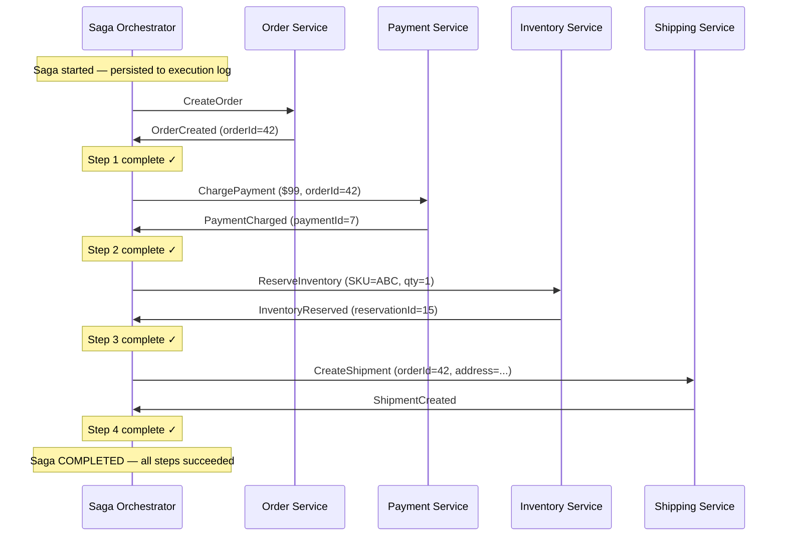
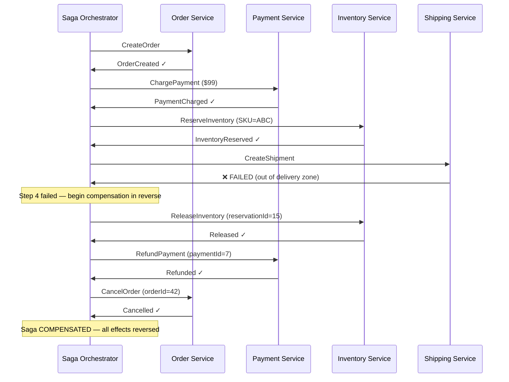
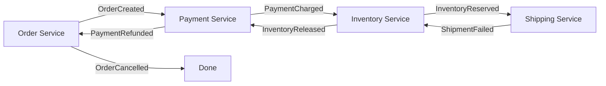

A user places an order. Behind the scenes you need to: create the order in the Order service, charge the card via the Payment service, reserve stock in the Inventory service, and dispatch a shipment via the Shipping service — and if any step fails partway through, you need to *undo* the earlier steps so the user isn't charged for an order that never ships. In a monolith, one ACID transaction handles this. Across microservices each owning their own database, **2PC is the wrong answer** — it requires XA support everywhere, holds cross-service locks during slow operations, and re-couples the services you decoupled. The Saga pattern is what you reach for instead: a chain of local transactions, each with a compensating action, orchestrated through to success or fully rolled back through compensation.

A Saga is a sequence of **local transactions** across multiple services, where each step has a **compensating transaction** that undoes its effect if a later step fails. It replaces distributed transactions (2PC) in microservice architectures where holding cross-service locks is impractical.

## Why Not [2PC](../../consensus/two-phase-commit) Across Services?

In a monolith, a single database transaction handles atomicity. In microservices, each service owns its database — there is no shared transaction manager.

| Approach | Problem |
|----------|---------|
| 2PC across services | Requires all services to support XA. Locks held across network boundaries. One slow service blocks all others. Tight coupling — the opposite of why you chose microservices. |
| "Just use one database" | Defeats the purpose of service autonomy. Schema coupling across teams. |
| **Saga** | Each service commits locally. Failures trigger compensating transactions. No distributed locks. |

## How a Saga Works

A saga breaks a business transaction into a series of steps T1 → T2 → ... → Tn, where each Ti is a local ACID transaction within one service. For each Ti, there is a compensating transaction Ci that semantically reverses Ti's effect.

```
Happy path:     T1 → T2 → T3 → T4 → SUCCESS

Failure at T3:  T1 → T2 → T3 ✗ → C2 → C1 → ABORTED
                              (compensate in reverse order)
```

Compensating transactions are **not** database rollbacks — they are new forward transactions that undo the business effect. A "refund" is a new charge of negative amount, not a DELETE of the original payment record.

## Orchestration vs Choreography

### Orchestration (Recommended)

A central **Saga Orchestrator** directs each step, sends commands to services, and manages the compensation flow.


```mermaid
sequenceDiagram
    participant O as Saga Orchestrator
    participant OS as Order Service
    participant PS as Payment Service
    participant IS as Inventory Service
    participant SS as Shipping Service

    Note over O: Saga started — persisted to execution log

    O->>OS: CreateOrder
    OS->>O: OrderCreated (orderId=42)
    Note over O: Step 1 complete ✓

    O->>PS: ChargePayment ($99, orderId=42)
    PS->>O: PaymentCharged (paymentId=7)
    Note over O: Step 2 complete ✓

    O->>IS: ReserveInventory (SKU=ABC, qty=1)
    IS->>O: InventoryReserved (reservationId=15)
    Note over O: Step 3 complete ✓

    O->>SS: CreateShipment (orderId=42, address=...)
    SS->>O: ShipmentCreated
    Note over O: Step 4 complete ✓

    Note over O: Saga COMPLETED — all steps succeeded
```

**When a step fails — compensation kicks in:**


```mermaid
sequenceDiagram
    participant O as Saga Orchestrator
    participant OS as Order Service
    participant PS as Payment Service
    participant IS as Inventory Service
    participant SS as Shipping Service

    O->>OS: CreateOrder
    OS->>O: OrderCreated ✓

    O->>PS: ChargePayment ($99)
    PS->>O: PaymentCharged ✓

    O->>IS: ReserveInventory (SKU=ABC)
    IS->>O: InventoryReserved ✓

    O->>SS: CreateShipment
    SS->>O: ❌ FAILED (out of delivery zone)

    Note over O: Step 4 failed — begin compensation in reverse

    O->>IS: ReleaseInventory (reservationId=15)
    IS->>O: Released ✓

    O->>PS: RefundPayment (paymentId=7)
    PS->>O: Refunded ✓

    O->>OS: CancelOrder (orderId=42)
    OS->>O: Cancelled ✓

    Note over O: Saga COMPENSATED — all effects reversed
```

**Advantages of orchestration:**
- Clear, linear flow — easy to understand, test, and debug
- Single place to see the saga's state and step history
- Adding or reordering steps is straightforward
- Timeout and retry logic centralized

### Choreography (Event-Driven)

No central coordinator. Each service publishes events after completing its step, and other services react.


```mermaid
flowchart LR
    OS[Order Service] -->|OrderCreated| PS[Payment Service]
    PS -->|PaymentCharged| IS[Inventory Service]
    IS -->|InventoryReserved| SS[Shipping Service]
    SS -->|ShipmentFailed| IS
    IS -->|InventoryReleased| PS
    PS -->|PaymentRefunded| OS
    OS -->|OrderCancelled| X[Done]
```

| | Orchestration | Choreography |
|---|---|---|
| **Coupling** | Services coupled to orchestrator | Services coupled to each other's events |
| **Visibility** | Orchestrator has full state | No single view — requires distributed tracing |
| **Complexity** | Grows linearly with steps | Grows combinatorially (each service must handle all event types) |
| **Cyclic deps** | Impossible (orchestrator is the hub) | Possible (A listens to B, B listens to A) |
| **Best for** | Complex multi-step business processes | Simple 2-3 step workflows |


In system design interviews, **default to orchestration**. Say: "We'll use a saga orchestrator because it gives us a single place to track the transaction state, handle retries, and trigger compensation. Choreography works for simple cases but becomes hard to reason about when the number of services grows."


## Compensating Transaction Rules

Compensating transactions are the hardest part of implementing sagas. They must follow strict rules:

### 1. [Idempotent](../idempotency)

A compensation may be retried if the orchestrator crashes and restarts. Calling `RefundPayment(paymentId=7)` twice must not issue two refunds.

```
First call:   RefundPayment(7) → creates refund, returns OK
Second call:  RefundPayment(7) → checks: refund already exists → returns OK (no-op)
```

### 2. Always Succeed (Eventually)

A compensation **cannot fail permanently**. If it does, the saga is stuck in an inconsistent state — some effects were applied but not all were reversed.

Design compensations to retry with exponential backoff. If a service is down, the orchestrator holds the compensation in a retry queue until the service recovers.

### 3. Semantically Reverse, Not Undo

| Step | Compensation | NOT |
|------|-------------|-----|
| Charge $99 | Refund $99 (new credit transaction) | DELETE FROM payments |
| Reserve 1 unit | Release reservation | DELETE FROM inventory |
| Send confirmation email | Send cancellation email | You can't unsend email |
| Ship package | Create return label + notify carrier | You can't un-ship |

Some effects are **not reversible** (email sent, SMS sent, physical shipment). In these cases, compensations are **corrective** — they issue a follow-up action rather than undoing the original.

### 4. Compensation Order

Compensate in **reverse order** of execution. This ensures that downstream services don't see inconsistencies — you undo the most recent effect first, just like unwinding a call stack.

## Saga Execution Log

The orchestrator persists its state to a durable store so it can recover after a crash:

```
saga_execution_log:
┌──────┬────────┬───────────┬──────────┬─────────────────────┐
│ saga │ step   │ service   │ status   │ response            │
├──────┼────────┼───────────┼──────────┼─────────────────────┤
│ S-42 │ 1      │ Order     │ DONE     │ orderId=42          │
│ S-42 │ 2      │ Payment   │ DONE     │ paymentId=7         │
│ S-42 │ 3      │ Inventory │ DONE     │ reservationId=15    │
│ S-42 │ 4      │ Shipping  │ FAILED   │ "out of zone"       │
│ S-42 │ C3     │ Inventory │ DONE     │ released            │
│ S-42 │ C2     │ Payment   │ PENDING  │ (orchestrator crash) │
└──────┴────────┴───────────┴──────────┴─────────────────────┘

On recovery: orchestrator reads log → sees C2 is PENDING → retries RefundPayment
```

## The Isolation Problem

Unlike 2PC, sagas do **not** provide isolation. Intermediate states are visible to concurrent transactions:

```
Timeline:
  T=0  Order created (status=PENDING)          ← other queries see PENDING order
  T=1  Payment charged                         ← money is gone
  T=2  Inventory reserved
  T=3  Shipping fails → begin compensation
  T=4  Inventory released                      ← but order still shows as PENDING
  T=5  Payment refunded
  T=6  Order cancelled

  Between T=1 and T=5, the user's payment is charged but the order isn't fulfilled.
  Between T=0 and T=6, another service querying orders sees an order that will be cancelled.
```

### Countermeasures

| Technique | How it works | Example |
|-----------|-------------|---------|
| **Semantic lock** | Mark resources as "pending" during the saga | Order status = `PENDING_FULFILLMENT` until saga completes |
| **Commutative updates** | Design operations so order doesn't matter | Counter increments are commutative — saga rollback just decrements |
| **Pessimistic view** | Reread current state before compensating | Before refunding, check if payment still exists (it might have been separately voided) |
| **Reread value** | Verify the data hasn't changed since the saga read it | Include version number in commands; reject if version mismatch |

## Saga vs 2PC — Decision Guide

```
Does the transaction span multiple services?
├── No → use a local ACID transaction
└── Yes
    ├── Are all services in the same database? → consider 2PC (XA)
    └── Different databases / different teams?
        ├── Can you tolerate temporary inconsistency? → Saga
        └── Need strict atomicity? → Redesign: merge services or use a shared database
```

| | 2PC | Saga |
|---|---|---|
| **Atomicity** | All-or-nothing, immediate | All-or-compensate, eventual |
| **Isolation** | Full (locks held) | None (intermediate states visible) |
| **Lock duration** | Entire protocol (seconds) | None (each step is local) |
| **Failure mode** | Blocking (coordinator crash) | Non-blocking (orchestrator recovers from log) |
| **Best for** | Same-database cross-shard | Cross-service business transactions |


**Common interview mistake:** Candidates often say "we'll use a saga to make this atomic." Sagas are **not** atomic in the traditional sense — they provide **eventual consistency** through compensation. The correct framing is: "We'll use a saga to coordinate this cross-service flow. The trade-off is temporary inconsistency during the saga execution window, which we mitigate with semantic locks and idempotent compensations."



**Interview tip:** When a workflow spans multiple services with their own databases, I reach for a Saga and explicitly *not* 2PC — distributed transactions across microservices recouple the services you intentionally decoupled. I'd default to **orchestration** over choreography because a central orchestrator gives you a single place to track saga state, retry, and trigger compensations; choreography only stays simple for 2–3 step flows before the implicit event graph becomes impossible to reason about. The two correctness rules I'd state unprompted: **compensating transactions must be idempotent** (orchestrator may retry them after crashes, so `RefundPayment(id)` called twice must produce one refund), and **they must always eventually succeed** — design with retry queues, not give-up paths. And I'd flag the tradeoff honestly: sagas give eventual consistency, not atomicity, so I'd use semantic locks (`status = PENDING_FULFILLMENT`) to hide intermediate states from concurrent readers.


## Test Your Understanding


**It must keep retrying the compensation until it eventually succeeds — and it must never give up or mark the saga as done.** Compensations follow the "always succeed (eventually)" rule. The orchestrator keeps the saga in a `COMPENSATING` state (persisted in the execution log), retries `RefundPayment` with exponential backoff, and parks it in a durable retry queue until the provider recovers — alerting a human after a threshold.

The thing it must **never** do is swallow the failed compensation and move on. That leaves the customer charged for an order that will never ship — the single worst outcome of a saga, because it's a silent money-losing inconsistency. A saga has no "partial abort" state: it's either fully completed or fully compensated.



**It's none of those — it's forward-action idempotency under at-least-once command delivery.** People associate idempotency with compensations (`RefundPayment` retried), but the *forward* steps need it just as much, because the orchestrator retries any command it didn't get a confirmed response for — whether it crashed, or just timed out.

Fix: attach an **idempotency key** to each saga step (e.g., `saga_id + step_number`, or `orderId + "charge"`). The Payment service records the key with the result; a retry with the same key returns the original result instead of charging again. The mental model: *every* message in a saga — commands and compensations, in both directions — is delivered at-least-once, so *every* handler must be idempotent.



**Lack of isolation — the "I" that sagas drop.** Sagas give you A-C-D but not I: intermediate states are visible to concurrent transactions, so the analytics query performed a **dirty read** of an order that was never confirmed.

The standard countermeasure is a **semantic lock**: mark the row `status = PENDING_FULFILLMENT` while the saga runs, and require readers to exclude (or specially handle) pending rows — only `CONFIRMED` orders count as revenue. Other countermeasures: **commutative updates** (so apply/compensate order doesn't matter), and **re-read / version checks** before acting. The catch with semantic locks is that the burden moves to *every* reader — they all have to know that "pending" means "don't trust this yet."



Sagas have a three-part structure (Richardson's taxonomy):

- **Compensatable transactions** — steps that can be semantically undone (`CreateOrder`, `ChargePayment` → refundable). They come *before* the pivot.
- **Pivot transaction** — the point of no return. Once it commits, the saga is guaranteed to run to completion. It is neither compensatable nor retriable — it's the boundary. (e.g., capturing a non-refundable payment, or handing the order to the warehouse.)
- **Retriable transactions** — steps *after* the pivot that are guaranteed to eventually succeed (`SendConfirmationEmail`, `UpdateReadModel`). They can be retried but never compensated.

Why it matters: **after the pivot you cannot roll back**, so every post-pivot step must be retriable — it can never fail in a way that demands compensation. The design rule that falls out: **put your risky, failure-prone, hard-to-reverse steps *before* the pivot**, where compensation is still possible, and make everything after the pivot trivially retriable.



**The compensation is a corrective action, not an undo: send a follow-up SMS — "Your previous shipment notification was sent in error; your order has been cancelled."** A compensating transaction is a *new forward transaction*, so when the original effect is an external, irreversible side effect, the only available compensation is a user-visible correction.

What it reveals: sagas can only **semantically reverse**, and some effects (emails, SMS, physical shipment, third-party API calls) have no clean reversal. The design response is to push irreversible/external effects **as late as possible** — ideally past the pivot, as retriable steps — so you almost never have to compensate them. If an irreversible effect must sit early in the saga, accept that its "compensation" will be a messy real-world correction.



On restart the orchestrator **replays from the durable execution log**: it sees `C3 = DONE` and skips it (a completed step is never re-run), and `C2 = PENDING`, so it retries `RefundPayment`. Double-release is avoided because status is persisted *around* each step, and even a re-run would be safe since compensations are idempotent.

This is exactly why sagas are **non-blocking** where 2PC blocks. In 2PC, if the coordinator crashes after participants vote YES, the participants hold their locks and wait — indefinitely — because they can't know the decision. A saga holds **no cross-service locks**; each step already committed locally. The orchestrator's only job on recovery is to read its log and continue forward or continue compensating. The log is the single source of truth, and there are no stranded locks anywhere.



**They created a cyclic event dependency: Payment → (PaymentCharged) → Loyalty → (PointsAwarded) → Payment.** In choreography there's no central view of the flow, so this cycle is invisible until it deadlocks or loops in production. Diagnosing it requires reconstructing the saga from distributed traces across every service, because no single component knows the saga's state.

Orchestration prevents it structurally: the orchestrator is the **hub**, and services only respond to its commands rather than to each other's events — so a cycle is impossible to introduce by accident, and the saga's entire state and step history live in one place. This is the concrete reason to default to orchestration as the number of steps and services grows; choreography only stays manageable for simple 2–3 step flows.

