**Scenario:** You're building a user registration system for a large-scale web service (e.g., Twitter or GitHub).

### 🤔 The Problem
When a new user enters a **desired username**:
- You must check if it's already **taken**.
- The **username store** could contain millions of entries.
- A direct DB lookup for every attempted username = unnecessary load.

### ❌ Without Optimization:
- Most usernames may already exist, triggering expensive DB reads.
- You want to avoid checking usernames that **definitely don't exist**.

### ✅ With Bloom Filter:
- Store all existing usernames in a Bloom filter.
- When a new user signs up: **Check the Bloom filter**.
    - If **“definitely not present”**: proceed with registration.
    - If **“might be present”**: check the DB for confirmation.

This cuts down DB lookups drastically when users try creative or uncommon usernames.

**Scenario: Caching with a Backend Database**

Let’s say you’re building a large-scale service like YouTube or Facebook. You use a caching layer (like Redis or Memcached) in front of your persistent database to reduce query latency.

### 🤔 The Problem
Every time a client requests data:
1. **Check Cache** → If hit, return.
2. **If Miss** → Query database.

But here's the catch:
- Many cache misses go on to query the DB for items that don’t exist at all (e.g., someone asks for a video that’s been deleted).
- These misses lead to **wasted DB lookups**, increasing load and latency.

### ✅ The Bloom Filter Solution
You use a **Bloom filter** to **pre-check** if an item is _definitely not_ in the dataset:
- If the Bloom filter says "no" ➜ skip cache and DB lookup entirely.
- If it says "maybe" ➜ proceed to cache and DB.

This drastically reduces expensive DB hits for missing keys.

## ⚙️ How Bloom Filters Work

A Bloom filter is a **probabilistic data structure** that answers: “Is element *x* possibly in the set?”

### Core Components:
- A **bit array** of size *m*, initialized with all bits as 0.
- **k independent hash functions** that map an element to *k* positions in the bit array.

### ✅ Insertion:
1. Hash the input using all *k* hash functions.
2. Set all the corresponding *k* bits in the array to 1.

### ❓ Query (Membership Check):
1. Hash the input using the same *k* functions.
2. Check if all the corresponding bits are 1.
   - If **any bit is 0** ➜ definitely **not** in the set.
   - If **all bits are 1** ➜ element **may be** in the set.

### 🔁 No Deletion (in standard Bloom filters)
To remove items, you’d need a **Counting Bloom Filter**, which uses counters instead of bits.

### Example
- Bit array size = 10, 3 hash functions: H1, H2, H3.
- alice hashes to bits 1, 4, 7
- bob hashes to bits 2, 4, 6
- carol hashes to bits 0, 4, 7

```mermaid
graph
  subgraph Bit Array
    B0["0"]
    B1["✅ 1"]
    B2["1"]
    B3["0"]
    B4["✅ 1"]
    B5["0"]
    B6["1"]
    B7["✅ 1"]
    B8["0"]
    B9["0"]
  end
  InsertAlice["Insert 'alice'"]
  InsertAlice -->|H1 = 1| B1
  InsertAlice -->|H2 = 4| B4
  InsertAlice -->|H3 = 7| B7
```

```mermaid
graph
  subgraph Bit Array
    B0["❌ 0"]
    B1["1"]
    B2["1"]
    B3["0"]
    B4["✅ 1"]
    B5["0"]
    B6["1"]
    B7["✅ 1"]
    B8["0"]
    B9["0"]
  end
  InsertAlice["Query 'Carol'"]
  InsertAlice -->|H1 = 0| B0
  InsertAlice -->|H2 = 4| B4
  InsertAlice -->|H3 = 7| B7
```

## 📉 Probabilistic Nature

- **False negatives**: _Never happen._ If it’s in the filter, it won’t say it’s not.
- **False positives**: _Can happen._ The filter may wrongly say an element exists due to overlapping bits from different insertions.

## ✨ Best Practices Recap (At-a-Glance)

- **Precompute capacity**: (*n*) to avoid overfilling the filter, which increases false positives.
- **Choose optimal *k***: Use $$k = \frac{m}{n} \ln 2$$ to balance accuracy vs performance.
- **Use fast, uniform hash functions**: e.g., MurmurHash, xxHash.
- **Watch load factor**: Too many insertions = higher false positives.
- **Store Bloom filters in memory** (e.g. Redis bloom filter module) for fast access in distributed systems.
- **Don't use for critical exactness** (e.g., login auth, password checks).
- **Combine with other structures**: Use Bloom filters for a quick "definitely not here" and then fall back to DB/cache.

## 🔁 Alternatives

| Structure               | Supports Deletion? | Memory Efficient | False Positives | Notes                                        |
|------------------------|-------------------|------------------|------------------|----------------------------------------------|
| **Bloom Filter**       | No                | ✅ Yes           | ✅ Yes           | Fast, scalable, simple                        |
| **Counting Bloom**     | ✅ Yes            | ⚠️ Slightly More| ✅ Yes           | Use counters instead of bits                  |
| **Cuckoo Filter**      | ✅ Yes            | ✅ Yes           | ✅ Lower rate    | Better for frequent insert/delete             |
| **Quotient Filter**    | ✅ Yes            | ✅ Cache-friendly| ✅ Yes           | Better for cache locality, newer structure    |
| **HashSet/Trie**       | ✅ Yes            | ❌ No            | ❌ No            | Precise but space-heavy                       |
