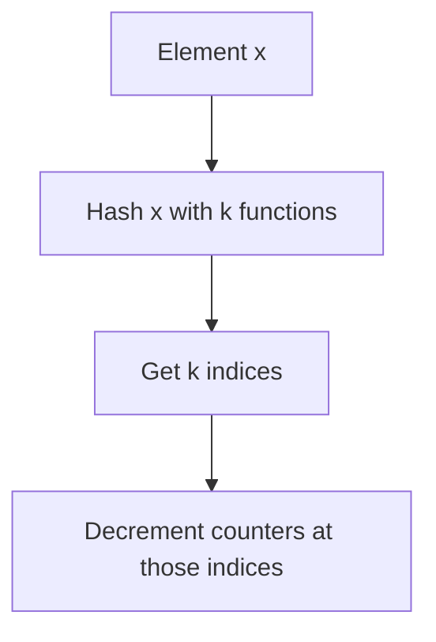

### ❓ The Membership Problem
In large-scale systems, we often need to answer:  
**“Is this item in the set?”**  
Examples:
- Is this URL malicious?
- Has this user already seen this ad?
- Is this file already cached?

### ⚠️ Challenge with Traditional Bloom Filters
Bloom filters are great for space-efficient membership testing, but they **don’t support deletions**. Once a bit is set, you can’t unset it without risking false negatives.

### 💡 Enter Counting Bloom Filters
CBFs solve this by replacing bits with **counters**, allowing:
- **Insertions** (increment counters)
- **Deletions** (decrement counters)
- **Membership checks** (verify counters > 0)

## 🏗️ Architecture & Internal Working

### 🔧 Components
- **Counter Array**: Instead of a bit array, CBF uses an array of small integers (e.g., 4-bit counters).
- **Hash Functions**: `k` independent hash functions map each item to `k` positions in the array.

### 🔁 Operations

#### ✅ Insertion


#### 🔍 Lookup
```mermaid
graph TD
    A[Element x] --> B[Hash x with k functions]
    B --> C[Get k indices]
    C --> D[Check if all counters > 0]
    D --> E[Return "Probably Present"]
```

#### ❌ Deletion


## 📊 Example

Let’s say we have:
- Counter array of size `m = 10`
- `k = 3` hash functions
- Insert element `"cat"`

Assume hash functions map `"cat"` to indices `[2, 5, 7]`.  
We increment counters at those positions:
```
Before: [0, 0, 0, 0, 0, 0, 0, 0, 0, 0]  
After : [0, 0, 1, 0, 0, 1, 0, 1, 0, 0]
```

To delete `"cat"`, we decrement the same counters.


## Implementation

```python
import mmh3         # pip install mmh3
from collections import defaultdict

class CountingBloomFilter:
    def __init__(self, size: int, hash_count: int):
        self.size = size                    # Size of counter array
        self.hash_count = hash_count        # Number of hash functions
        self.counters = [0] * size          # Counter array

    def _hashes(self, item: str):
        return [mmh3.hash(item, seed) % self.size for seed in range(self.hash_count)]

    def add(self, item: str):
        for i in self._hashes(item):
            self.counters[i] += 1

    def remove(self, item: str):
        for i in self._hashes(item):
            if self.counters[i] > 0:
                self.counters[i] -= 1

    def contains(self, item: str) -> bool:
        return all(self.counters[i] > 0 for i in self._hashes(item))

    def __str__(self):
        return str(self.counters)
```

## 🧠 Best Practices

- **Choose optimal `k` and `m`**: Use formulas to minimize false positives:
  - `k ≈ (m/n) * ln(2)`
- **Use good hash functions**: FNV, MurmurHash are popular.
- **Avoid counter overflow**: Use 4–8 bits per counter depending on expected frequency.
- **Monitor false positives**: They increase as the filter saturates.
- **Use CBFs for cache eviction, deduplication, or stream filtering**.


## 🔄 Alternatives

| Alternative            | Description                                                                 | Pros                          | Cons                          |
|------------------------|-----------------------------------------------------------------------------|-------------------------------|-------------------------------|
| **Standard Bloom Filter** | Bit array with no deletion support                                          | Very space-efficient          | No deletions                  |
| **Count-Min Sketch**      | Estimates frequency of items in a stream                                   | Tracks counts                 | Higher error rate             |
| **Cuckoo Filter**         | Stores fingerprints with support for deletion                              | Lower false positives         | More complex insert/delete    |
| **d-left Counting Bloom** | Optimized CBF using d-left hashing                                          | Space-efficient               | More complex implementation   |


## Interview Tip

If asked to design a **distributed cache**, you can use CBFs to:
- Track which items are cached
- Evict items safely
- Share compact cache summaries across nodes
