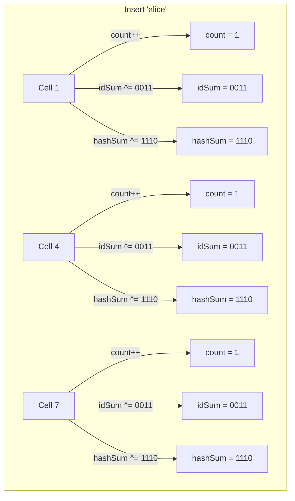
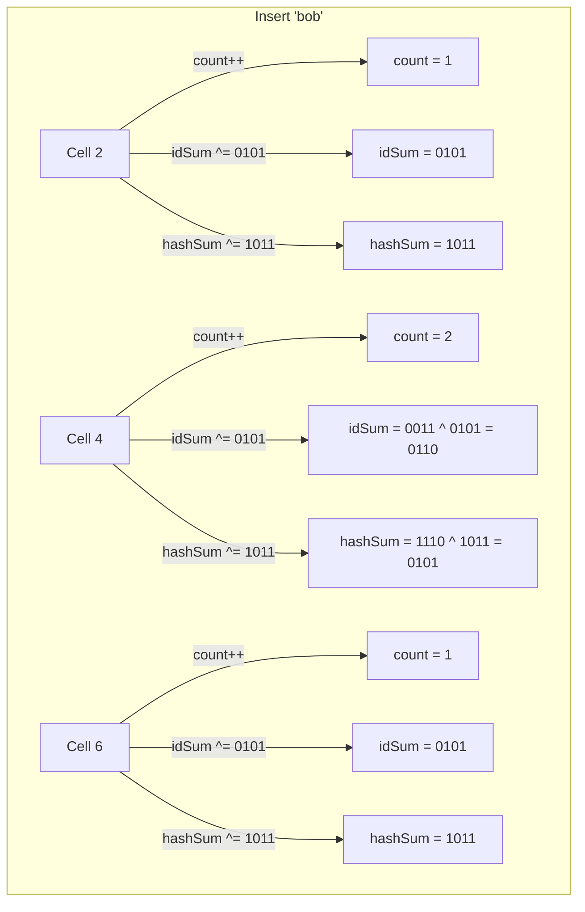
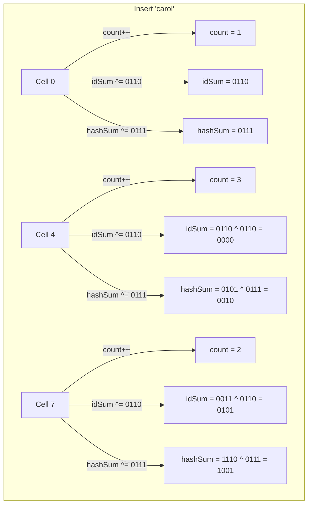

### ✅ Problem Statement
Traditional **Bloom Filters** are great for membership testing (“Is element *X* in this set?”), but:
- They **don’t allow deletion** (removal of items from the filter).
- They **don’t support listing elements** of the set.
- They can't compute **set difference** or recover exact contents.

These limitations are critical in distributed systems, data synchronization, database reconciliation, etc.

### ✅ Use Case
**Invertible Bloom Filters (IBFs)** are designed to:
- Reconcile sets across systems (e.g. detecting differences between two replicas).
- Track inserted and deleted items.
- Support *decoding* the set (retrieve actual items from filter).

Example: Reconciling missing or extra records in two databases efficiently over a network.


## 🧠 How IBFs Solve the Problem

IBFs extend standard Bloom Filters with **invertibility**—they not only test membership but can **reconstruct** the elements that caused differences between sets.

### 👇 Key Features
- **Supports deletion**
- **Supports set subtraction**
- **Supports decoding** of element list under some constraints
- **Efficient** in space and computation


## 🏗️ Architecture & Working (In Deep Detail)

An **Invertible Bloom Filter** is essentially an array of *cells*. Each cell holds:
- A count (`count`)
- An XOR of element IDs (`idSum`)
- An XOR of hash values of those IDs (`hashSum`)

You insert and delete items by updating the cells at multiple locations (using multiple hash functions). Crucially, each element “touches” multiple cells (like Bloom filters).

### 🧬 Data Structure of a Cell

```plaintext
Cell:
  count     → Integer
  idSum     → XOR of all inserted (or deleted) IDs
  hashSum   → XOR of hashes of IDs (to verify uniqueness)
```

---

### 💡 Operations

#### 1. Insert Operation

- Hash item with *k* hash functions.
- For each cell:
  - `count += 1`
  - `idSum ^= itemID`
  - `hashSum ^= hash(itemID)`

#### 2. Delete Operation

- Reverse the insert:
  - `count -= 1`
  - `idSum ^= itemID`
  - `hashSum ^= hash(itemID)`

#### 3. Decode Operation (Invert)

- Scan for cells with `count = ±1`.
- For each:
  - Confirm `idSum` matches `hashSum`
  - If match → recover element
  - Remove element by reversing insert/delete
- Repeat until no more recoverable cells


### Example

- **Cell array size**: 10  
- **Hash functions**: H1, H2, H3  
- Each cell stores:  
  - `count` (int)  
  - `idSum` (bitwise XOR of item IDs)  
  - `hashSum` (bitwise XOR of item hashes)

Let’s assign dummy values:

```plaintext
Item IDs:
- alice = 0b0011
- bob   = 0b0101
- carol = 0b0110

Hash(itemID):
- alice → 0b1110
- bob   → 0b1011
- carol → 0b0111
```

Hash outputs:

| Item   | H1 | H2 | H3 |
|--------|----|----|----|
| alice  | 1  | 4  | 7  |
| bob    | 2  | 4  | 6  |
| carol  | 0  | 4  | 7  |


## 🧩 Insert Alice



## 🧩 Insert Bob



## 🧩 Insert Carol




## 🔍 Decode Phase

We now try to find cells with `count = ±1` and where `idSum` == `hash(itemID)`. These are **"pure" cells**.

### Step-by-Step Decoding:

1. **Cell 0**: `count = 1`, `idSum = 0110`, `hashSum = 0111`
   - hash(0110) = 0111 → ✅ Match → Recover **carol**
   - Delete carol’s entries from cells 0, 4, 7

2. Repeating: now **Cell 2** has `count = 1`, `idSum = 0101`, `hashSum = 1011`
   - ✅ Match → Recover **bob**
   - Delete bob’s entries from cells 2, 4, 6

3. Again: **Cell 1**, `count = 1`, `idSum = 0011`, `hashSum = 1110`
   - ✅ Match → Recover **alice**
   - Delete alice from cells 1, 4, 7

Eventually all cells reach neutral state — decoding complete. ✅


## 🚀 Summary Table (For Quick Review)

| Action     | Cells Affected | Change                                                                 |
|------------|----------------|------------------------------------------------------------------------|
| Insert Alice | 1, 4, 7         | count += 1, XOR `idSum`, XOR `hashSum`                                |
| Insert Bob   | 2, 4, 6         | count += 1, XOR `idSum`, XOR `hashSum`                                |
| Insert Carol | 0, 4, 7         | count += 1, XOR `idSum`, XOR `hashSum`                                |
| Decode Phase | Any cell with `count=1` and `idSum==hashSum` | Recovered → Deleted → Cascading decode |

### Implementaion

```python
import hashlib
import random

class Cell:
    def __init__(self):
        self.count = 0
        self.idSum = 0
        self.hashSum = 0

    def is_pure(self):
        return abs(self.count) == 1 and self.hashSum == self.hash_item(self.idSum)

    @staticmethod
    def hash_item(item_id):
        h = hashlib.sha256(str(item_id).encode()).hexdigest()
        return int(h, 16)

class IBF:
    def __init__(self, size=10, num_hashes=3):
        self.size = size
        self.num_hashes = num_hashes
        self.cells = [Cell() for _ in range(size)]
        self.seeds = [random.randint(0, 10000) for _ in range(num_hashes)]

    def _hashes(self, item_id):
        return [
            hash((seed, item_id)) % self.size
            for seed in self.seeds
        ]

    def insert(self, item_id):
        h = Cell.hash_item(item_id)
        for idx in self._hashes(item_id):
            cell = self.cells[idx]
            cell.count += 1
            cell.idSum ^= item_id
            cell.hashSum ^= h

    def delete(self, item_id):
        h = Cell.hash_item(item_id)
        for idx in self._hashes(item_id):
            cell = self.cells[idx]
            cell.count -= 1
            cell.idSum ^= item_id
            cell.hashSum ^= h

    def decode(self):
        decoded_items = []
        changed = True

        while changed:
            changed = False
            for cell in self.cells:
                if cell.is_pure():
                    item_id = cell.idSum
                    decoded_items.append(item_id)
                    self.delete(item_id)  # simulate removal
                    changed = True
                    break  # restart scan after mutation

        return decoded_items

# 👀 Example usage
if __name__ == "__main__":
    ibf = IBF(size=10, num_hashes=3)

    # Demo items
    alice = 13
    bob = 21
    carol = 34

    # Insert items
    ibf.insert(alice)
    ibf.insert(bob)
    ibf.insert(carol)

    # Decode
    recovered = ibf.decode()
    print("Decoded Items:", recovered)
```

## 🧪 Best Practices

- ✅ Choose good hash functions — low collision probability.
- ✅ Ensure *enough cells* to reduce chance of undecodable filters.
- ✅ Keep `count`, `idSum`, and `hashSum` as compact as possible — space-efficient yet reliable.
- ✅ Use IBFs when exact reconciliation matters and bandwidth is limited.

---

## 🔄 Alternatives

| Technique              | Pros                              | Cons                              |
|------------------------|-----------------------------------|-----------------------------------|
| **Standard Bloom Filter** | Simple, fast membership testing | No deletion, no recovery          |
| **Counting Bloom Filter** | Allows deletion                 | No set listing or decoding        |
| **Cuckoo Filter**         | Supports deletion, compact      | Limited set operations            |
| **Merkle Trees**          | Exact reconciliation            | More overhead, less flexible      |

**IBFs** strike a balance between efficiency and invertibility, ideal for set reconciliation problems in distributed systems.

