### ✅ Problem Statement
Traditional **Bloom Filters** are great for membership testing (“Is element *X* in this set?”), but:
- They **don’t allow deletion** (removal of items from the filter).
- They **don’t support listing elements** of the set.
- They can't compute **set difference** or recover exact contents.

These limitations are critical in distributed systems, data synchronization, database reconciliation, etc.

### ✅ Use Case
**Invertible Bloom Filters (IBFs)** are designed to:
- Reconcile sets across systems (e.g. detecting differences between two replicas).
- Track inserted and deleted items.
- Support *decoding* the set (retrieve actual items from filter).

Example: Reconciling missing or extra records in two databases efficiently over a network.


## 🧠 How IBFs Solve the Problem

IBFs extend standard Bloom Filters with **invertibility**—they not only test membership but can **reconstruct** the elements that caused differences between sets.

### 👇 Key Features
- **Supports deletion**
- **Supports set subtraction**
- **Supports decoding** of element list under some constraints
- **Efficient** in space and computation


## 🏗️ Architecture & Working (In Deep Detail)

An **Invertible Bloom Filter** is essentially an array of *cells*. Each cell holds:
- A count (`count`)
- An XOR of element IDs (`idSum`)
- An XOR of hash values of those IDs (`hashSum`)

You insert and delete items by updating the cells at multiple locations (using multiple hash functions). Crucially, each element “touches” multiple cells (like Bloom filters).

### 🧬 Data Structure of a Cell

```plaintext
Cell:
  count     → Integer
  idSum     → XOR of all inserted (or deleted) IDs
  hashSum   → XOR of hashes of IDs (to verify uniqueness)
```

---

### 💡 Operations

#### 1. Insert Operation

- Hash item with *k* hash functions.
- For each cell:
  - `count += 1`
  - `idSum ^= itemID`
  - `hashSum ^= hash(itemID)`

#### 2. Delete Operation

- Reverse the insert:
  - `count -= 1`
  - `idSum ^= itemID`
  - `hashSum ^= hash(itemID)`

#### 3. Decode Operation (Invert)

- Scan for cells with `count = ±1`.
- For each:
  - Confirm `idSum` matches `hashSum`
  - If match → recover element
  - Remove element by reversing insert/delete
- Repeat until no more recoverable cells

---

### 📊 Architecture Flow

```mermaid
flowchart TD
    A[Start] --> B{Insert/Delete Item}
    B --> C1[Hash to k Cells]
    C1 --> D[Update Cells]
    D --> E{Decoding?}
    E -- Yes --> F[Find ±1 Count Cells]
    F --> G[Verify idSum vs hashSum]
    G --> H{Success?}
    H -- Yes --> I[Recover Element & Subtract]
    H -- No --> J[Stop]
    I --> F
    J --> K[End]
    E -- No --> K
```



### Example

## ⚙️ Setup

Let’s replicate the same parameters as your example:

- **Cell array size**: 10  
- **Hash functions**: H1, H2, H3  
- Each cell stores:  
  - `count` (int)  
  - `idSum` (bitwise XOR of item IDs)  
  - `hashSum` (bitwise XOR of item hashes)

Let’s assign dummy values:

```plaintext
Item IDs:
- alice = 0b0011
- bob   = 0b0101
- carol = 0b0110

Hash(itemID):
- alice → 0b1110
- bob   → 0b1011
- carol → 0b0111
```

Hash outputs:

| Item   | H1 | H2 | H3 |
|--------|----|----|----|
| alice  | 1  | 4  | 7  |
| bob    | 2  | 4  | 6  |
| carol  | 0  | 4  | 7  |


## 🧩 Insert Alice


## 🧩 Insert Bob

```mermaid
graph TD
  subgraph Insert 'bob'
    A0["Cell 2"] -->|count++| A1["count = 1"]
    A0 -->|idSum ^= 0101| A2["idSum = 0101"]
    A0 -->|hashSum ^= 1011| A3["hashSum = 1011"]

    B0["Cell 4"] -->|count++| B1["count = 2"]
    B0 -->|idSum ^= 0101| B2["idSum = 0110"] %% 0011 ^ 0101
    B0 -->|hashSum ^= 1011| B3["hashSum = 0101"] %% 1110 ^ 1011

    C0["Cell 6"] -->|count++| C1["count = 1"]
    C0 -->|idSum ^= 0101| C2["idSum = 0101"]
    C0 -->|hashSum ^= 1011| C3["hashSum = 1011"]
  end
```

## 🧩 Insert Carol

```mermaid
graph TD
  subgraph Insert 'carol'
    A0["Cell 0"] -->|count++| A1["count = 1"]
    A0 -->|idSum ^= 0110| A2["idSum = 0110"]
    A0 -->|hashSum ^= 0111| A3["hashSum = 0111"]

    B0["Cell 4"] -->|count++| B1["count = 3"]
    B0 -->|idSum ^= 0110| B2["idSum = 0000"] %% 0110 ^ 0110
    B0 -->|hashSum ^= 0111| B3["hashSum = 0010"] %% 0101 ^ 0111

    C0["Cell 7"] -->|count++| C1["count = 2"]
    C0 -->|idSum ^= 0110| C2["idSum = 0101"] %% 0011 ^ 0110
    C0 -->|hashSum ^= 0111| C3["hashSum = 1001"] %% 1110 ^ 0111
  end
```


## 🔍 Decode Phase

We now try to find cells with `count = ±1` and where `idSum` == `hash(itemID)`. These are **"pure" cells**.

### Step-by-Step Decoding:

1. **Cell 0**: `count = 1`, `idSum = 0110`, `hashSum = 0111`
   - hash(0110) = 0111 → ✅ Match → Recover **carol**
   - Delete carol’s entries from cells 0, 4, 7

2. Repeating: now **Cell 2** has `count = 1`, `idSum = 0101`, `hashSum = 1011`
   - ✅ Match → Recover **bob**
   - Delete bob’s entries from cells 2, 4, 6

3. Again: **Cell 1**, `count = 1`, `idSum = 0011`, `hashSum = 1110`
   - ✅ Match → Recover **alice**
   - Delete alice from cells 1, 4, 7

Eventually all cells reach neutral state — decoding complete. ✅


## 🚀 Summary Table (For Quick Review)

| Action     | Cells Affected | Change                                                                 |
|------------|----------------|------------------------------------------------------------------------|
| Insert Alice | 1, 4, 7         | count += 1, XOR `idSum`, XOR `hashSum`                                |
| Insert Bob   | 2, 4, 6         | count += 1, XOR `idSum`, XOR `hashSum`                                |
| Insert Carol | 0, 4, 7         | count += 1, XOR `idSum`, XOR `hashSum`                                |
| Decode Phase | Any cell with `count=1` and `idSum==hashSum` | Recovered → Deleted → Cascading decode |


## 🧪 Best Practices

- ✅ Choose good hash functions — low collision probability.
- ✅ Ensure *enough cells* to reduce chance of undecodable filters.
- ✅ Keep `count`, `idSum`, and `hashSum` as compact as possible — space-efficient yet reliable.
- ✅ Use IBFs when exact reconciliation matters and bandwidth is limited.

---

## 🔄 Alternatives

| Technique              | Pros                              | Cons                              |
|------------------------|-----------------------------------|-----------------------------------|
| **Standard Bloom Filter** | Simple, fast membership testing | No deletion, no recovery          |
| **Counting Bloom Filter** | Allows deletion                 | No set listing or decoding        |
| **Cuckoo Filter**         | Supports deletion, compact      | Limited set operations            |
| **Merkle Trees**          | Exact reconciliation            | More overhead, less flexible      |

**IBFs** strike a balance between efficiency and invertibility, ideal for set reconciliation problems in distributed systems.

