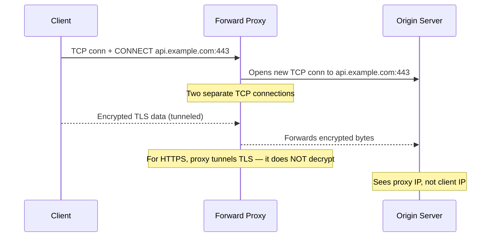
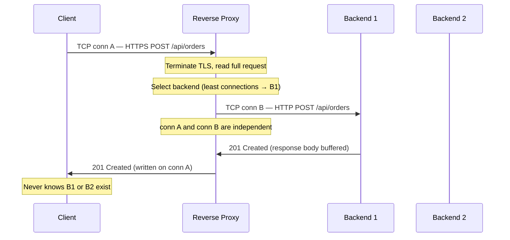

A proxy sits between two parties in a connection. The direction it faces determines the name.

| | Forward Proxy | Reverse Proxy |
|---|---|---|
| Sits in front of | Clients | Servers |
| Represents | Clients to the internet | Servers to clients |
| Client knows about it? | Yes (explicitly configured) | No (transparent) |
| Server knows about it? | No | Yes |
| Primary purpose | Privacy, filtering, egress control | Load balancing, TLS termination, caching |

## The Connection Model

The most important thing to understand about a Layer 7 proxy: **it terminates the incoming connection and opens a new connection to the backend**. It does not forward packets.

```
Client ──[TCP conn A]──► Reverse Proxy ──[TCP conn B]──► Backend
        (HTTPS)              ↑                (HTTP)
                     Terminates conn A
                     Reads full request
                     Makes routing decision
                     Opens new conn B
                     Sends new request
                     Buffers response
                     Writes response on conn A
```

This is fundamentally different from a Layer 4 (NAT) load balancer, which rewrites IP headers and forwards packets without reading them.

**What terminate-and-reoriginate enables:**
- TLS decryption: proxy reads plaintext, backends get HTTP
- Header inspection and rewriting: add `X-Forwarded-For`, strip internal headers
- Request buffering: full body received before backend connection opens
- Connection pooling: persistent TCP connections to backends, reused across many client requests
- Routing decisions: choose backend based on URL path, headers, cookies, body content
- Request normalization: reject or fix malformed HTTP before it reaches application code

**What it costs:**
- Two TCP connections per request instead of one
- Proxy must parse full HTTP — CPU overhead vs L4

## Forward Proxy



For HTTPS, a forward proxy uses the `CONNECT` method to establish a TCP tunnel. It does **not** decrypt the TLS traffic — it cannot inspect the request body or headers, only the target hostname from SNI.

**Use cases:**
- Corporate egress control: all outbound traffic through a proxy for logging and policy enforcement
- Content filtering: block domains or categories based on SNI/hostname
- Anonymity: client IP hidden from destination
- Bandwidth caching: repeated responses served from cache (e.g., OS package mirrors, Docker image caches)

**Common tools:** Squid, Nginx (forward proxy mode), Zscaler, Bluecoat

## Reverse Proxy



### Connection Pooling

Opening a TCP connection to a backend takes time (handshake + TLS if applicable). A reverse proxy maintains a **connection pool** to each upstream — a set of persistent, pre-warmed TCP connections ready to accept the next request.

```
Client requests (short-lived)       Backend connections (pooled, long-lived)
────────────────────────────────    ──────────────────────────────────────
Client 1 conn (closes after req) ─┐
Client 2 conn (closes after req) ─┤─► Pool: [conn1, conn2, conn3, ...]──► Backend
Client 3 conn (closes after req) ─┘         (reused, never closed)
```

Without pooling: every client request costs a new TCP + TLS handshake to the backend (~100–300ms).
With pooling: backend connections are reused — latency added by the proxy is microseconds.

### Request Buffering and Slow Client Protection

The proxy buffers the **full request body** from the client before opening a backend connection.

- A slow client uploading a large body holds the connection open. Without buffering, that slow upload holds a backend connection open for its entire duration — tying up a worker thread.
- With buffering, the backend connection is held only for the time to forward the complete buffered request — milliseconds.
- Primary defense against **Slowloris**: an attacker sends HTTP headers very slowly, never completing the request, to exhaust backend threads. The proxy absorbs this; the backend never sees it.


Request buffering requires memory proportional to body size. Large file uploads need explicit limits: `client_max_body_size` in Nginx, `timeout` in HAProxy. Without limits, a proxy can OOM under upload pressure.


### Health Checking

| Type | How | Behavior |
|------|-----|----------|
| **Active (proactive)** | Proxy sends periodic requests (HTTP GET `/health`) to each backend | Backend removed from rotation if N consecutive checks fail; re-added after M pass |
| **Passive (reactive)** | Proxy marks backend unhealthy after N consecutive request failures (5xx, timeout) | No extra traffic; slower to detect failure |

Active health checks require backends to expose a health endpoint that reflects actual readiness (DB connection alive, dependencies reachable) — not just an HTTP 200.

### Circuit Breaking

When a backend is returning errors or timing out, continuing to send traffic amplifies the failure.

Circuit breaker states:
- **Closed** (normal): requests flow through
- **Open** (tripped): proxy fast-fails requests immediately (no backend connection attempted) for a cooldown window
- **Half-open**: proxy sends a probe request; if it succeeds, returns to Closed

Without circuit breaking: one slow backend exhausts the proxy's connection pool → stalls all requests → takes down the proxy.

## TLS Termination

```
Client ──[TLS 1.3]──► Proxy ──[plaintext HTTP]──► Backend (internal network)
```

**SNI-based routing:** A single proxy terminates TLS for multiple domains on the same IP. The client includes the target hostname in the TLS ClientHello (`server_name` extension); the proxy selects the matching certificate before the handshake completes.

**OCSP Stapling:** The proxy fetches and caches the CA's revocation response and staples it to the TLS handshake — eliminating the browser's round trip to the CA.

**mTLS (mutual TLS):** Both parties present certificates. Used for service-to-service auth in zero-trust networks. The proxy can enforce mTLS on the backend leg even when the client leg is one-way TLS.

**TLS re-encryption:**
```
Client ──[TLS]──► Proxy ──[TLS]──► Backend
                    ↑
         Decrypt → inspect → re-encrypt
```
Required when the internal network is untrusted (zero-trust, regulated environments). The proxy holds both the inbound (client-facing) and outbound (backend-facing) certificates.

### Preserving Client IP

Because the proxy opens a new TCP connection, the backend sees the **proxy's IP**, not the client's.

**Layer 7 (HTTP):** Proxy adds `X-Forwarded-For`. Each proxy in a chain appends its IP:
```
X-Forwarded-For: 203.0.113.5, 10.0.0.1, 10.0.0.2
                 ↑ original   ↑ proxy 1  ↑ proxy 2 (closest to backend)
```


Never trust the leftmost IP in `X-Forwarded-For` for security decisions. A client can send `X-Forwarded-For: 1.2.3.4` and the proxy will append to it — not replace it. Read the IP added by the **first trusted proxy** (rightmost trusted entry). Better: configure the proxy to overwrite the header entirely using `X-Real-IP`, or use `Forwarded` (RFC 7239).


**Layer 4 (TCP passthrough):** No HTTP header is available. Use **PROXY protocol** — a text header prepended to the TCP stream by the L4 load balancer:
```
PROXY TCP4 203.0.113.5 10.0.0.1 56324 443\r\n
<actual TLS ClientHello bytes follow>
```
The backend (or L7 proxy downstream) reads and strips this header to recover the original client IP.

## Nginx and HAProxy Patterns

**Nginx — L7 reverse proxy with connection pooling:**
```nginx
upstream backends {
    least_conn;
    keepalive 32;          # pool: up to 32 idle connections per worker
    server 10.0.0.1:8080;
    server 10.0.0.2:8080;
}

server {
    listen 443 ssl;
    server_name api.example.com;

    ssl_certificate     /etc/ssl/api.crt;
    ssl_certificate_key /etc/ssl/api.key;
    ssl_stapling on;

    client_max_body_size 10m;

    location / {
        proxy_pass         http://backends;
        proxy_http_version 1.1;
        proxy_set_header   Connection        "";   # enable upstream keep-alive
        proxy_set_header   Host              $host;
        proxy_set_header   X-Forwarded-For   $proxy_add_x_forwarded_for;
        proxy_set_header   X-Forwarded-Proto $scheme;
        proxy_read_timeout 30s;
        proxy_send_timeout 30s;
    }
}
```

**HAProxy — L4 TCP passthrough with PROXY protocol:**
```
frontend https_in
    bind *:443
    mode tcp
    option tcplog
    default_backend app_servers

backend app_servers
    mode tcp
    balance roundrobin
    option tcp-check
    server app1 10.0.0.1:443 check send-proxy
    server app2 10.0.0.2:443 check send-proxy
```

`mode tcp` passes TLS bytes directly to backends — no decryption, no header inspection. `mode http` enables L7 features: ACL-based routing, cookie-based stickiness, header rewrites.

## API Gateway

An API Gateway is a **reverse proxy with application-layer logic**. Everything above applies, plus:

| Capability | Description |
|------------|-------------|
| **Authentication / authorization** | Validates JWT, API keys, OAuth tokens; rejects unauthorized requests before they reach any service |
| **Request aggregation** | Fan out one client request to multiple services, merge and return a single response |
| **Protocol translation** | Accept REST/JSON from clients, forward as gRPC to internal services |
| **Request/response transformation** | Rewrite headers, strip internal fields, inject correlation IDs, reshape payloads |
| **Rate limiting** | Per-client, per-endpoint quotas (token bucket, sliding window) |
| **Observability** | Centralized access logs, distributed trace injection, metrics for all API traffic |
| **Service discovery** | Resolves backend addresses dynamically from Consul, Kubernetes DNS, Eureka |

**Common tools:** Kong, AWS API Gateway, Apigee, Traefik, Envoy


An API Gateway is always a reverse proxy. A reverse proxy is not always an API gateway. The distinction is identity-aware, application-specific logic at the boundary. In a microservices architecture, the API Gateway is the **single ingress point** — clients call one host, the gateway routes to N services.


## System Design Placement

| Component | Place when | Owns |
|-----------|-----------|------|
| **Forward proxy** | Corporate egress, content filtering, anonymity | Between internal clients and external internet |
| **L4 load balancer** | TCP-level distribution, TLS passthrough, non-HTTP protocols | IP rewriting, port routing, connection distribution |
| **Reverse proxy / L7 LB** | HTTP traffic, TLS termination, routing by URL/header | Connection termination, request buffering, backend pooling |
| **API Gateway** | Microservices, external-facing API, auth at edge | All of the above + auth, rate limiting, aggregation |

```
DNS → L4 LB (optional, for HA of the proxy itself) → Reverse Proxy / API Gateway → Backend Services
```

The reverse proxy is the **first component clients reach after DNS resolution**. Backend services are never exposed to the internet directly.
