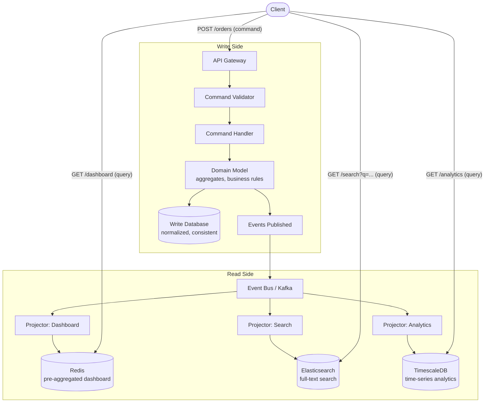
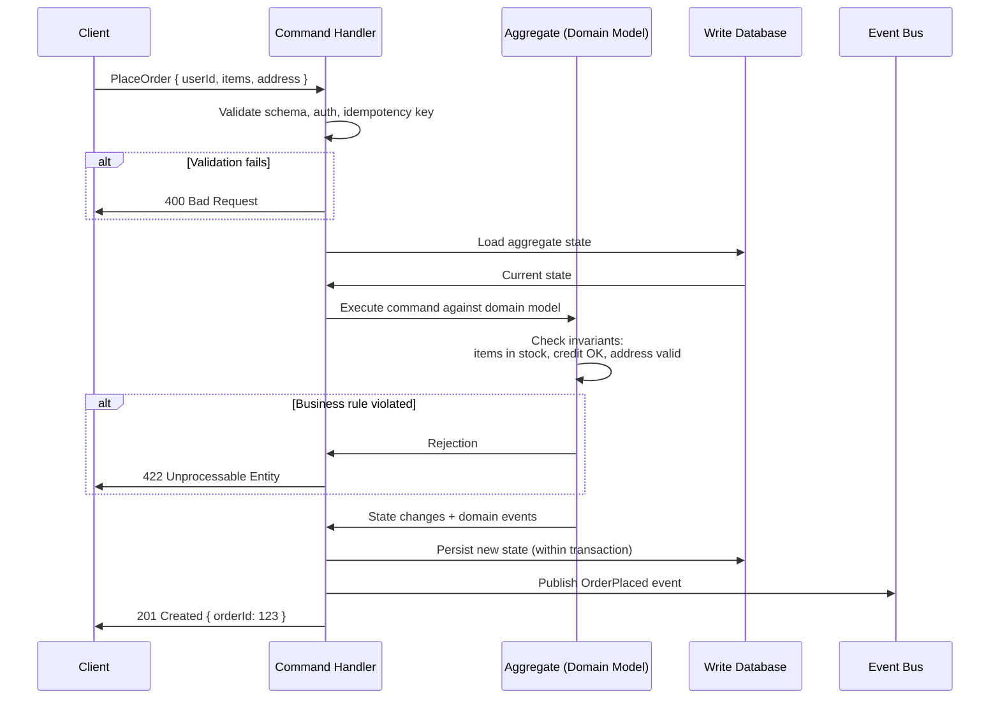
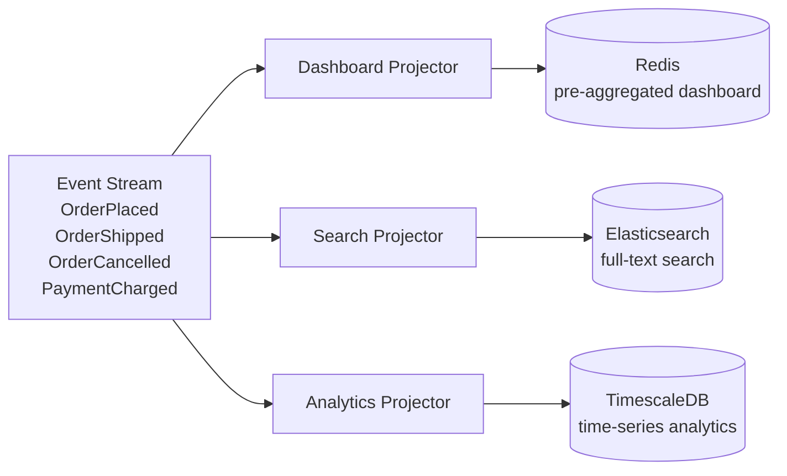
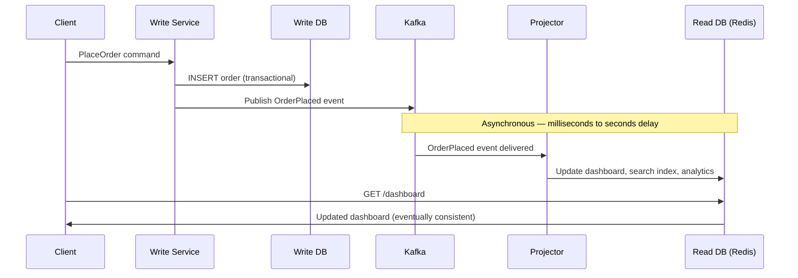
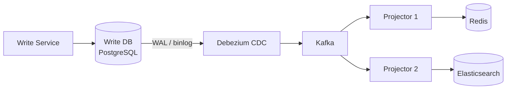
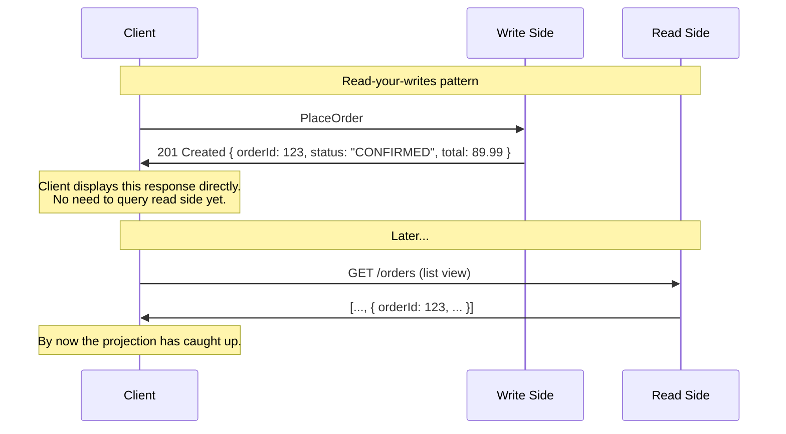
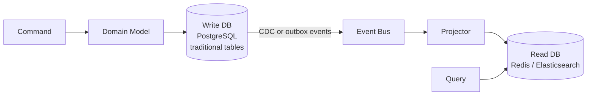
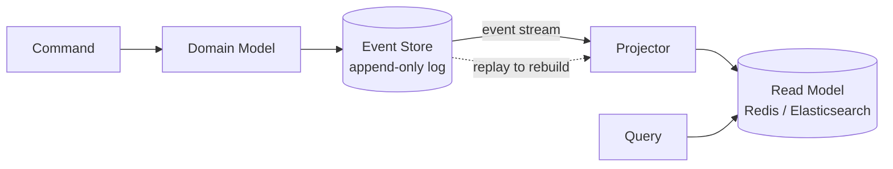

CQRS is an architectural pattern that splits a system into two distinct models: a **write model** (handles commands — state mutations) and a **read model** (handles queries — data retrieval). Instead of a single database schema serving both reads and writes, each side gets its own model, optimized for its specific workload.

## The Problem CQRS Solves

In a traditional CRUD architecture, the same data model serves both reads and writes. This works initially, but cracks appear at scale:

| Problem | Why It Happens |
|---------|---------------|
| **Read/write contention** | Writes acquire locks that block reads. A bulk data import stalls the dashboard. |
| **Schema compromises** | Normalization helps writes (no update anomalies) but hurts reads (expensive JOINs). Denormalization helps reads but creates update anomalies. You can't optimize for both. |
| **Scaling asymmetry** | Most systems are read-heavy (100:1 read/write ratio is common). You want to scale reads independently, but a single model forces you to scale both together. |
| **Query complexity** | The dashboard needs pre-aggregated data. The search page needs full-text search. The analytics page needs time-series queries. One schema cannot be optimal for all of these. |
| **Domain model pollution** | Write-side domain logic (validation, invariants) gets tangled with read-side presentation logic (formatting, aggregation). The model becomes a compromise that serves neither well. |

CQRS addresses every one of these problems by giving reads and writes their own models.

## Architecture Overview



The write side owns **truth** — it validates commands, enforces business rules, and persists state. The read side owns **presentation** — it builds optimized views for every query pattern the system needs.

## Write Side: Commands and Domain Logic

A **command** is an intent to change state — imperative ("do this"), directed at a specific handler, and can be **rejected** if it violates business rules. Commands differ from events in a critical way: a command (`PlaceOrder`) can fail; an event (`OrderPlaced`) is an immutable fact that already happened. For a detailed comparison, see [Event-Driven Architecture](../event-driven-architecture).

### Command Flow



### Write Model Design

The write model is optimized for **consistency and correctness**, not query speed:

```sql
-- Normalized: no duplicated data, referential integrity enforced
-- Write-optimized: narrow tables, minimal indexes

CREATE TABLE orders (
    order_id   BIGINT PRIMARY KEY,
    user_id    BIGINT NOT NULL REFERENCES users(id),
    status     VARCHAR(20) NOT NULL,
    total      NUMERIC(10,2) NOT NULL,
    created_at TIMESTAMPTZ DEFAULT NOW()
);

CREATE TABLE order_items (
    id         BIGINT PRIMARY KEY,
    order_id   BIGINT NOT NULL REFERENCES orders(order_id),
    product_id VARCHAR(50) NOT NULL,
    qty        INT NOT NULL,
    price      NUMERIC(10,2) NOT NULL
);
```

**Key principles:**
- **Normalized** — third normal form. No data duplication.
- **Minimal indexes** — only what's needed for loading aggregates by ID and enforcing uniqueness.
- **Transactional** — strong consistency within a single aggregate boundary.
- **Not query-friendly** — "total revenue by category for the last 30 days" requires multiple JOINs and is slow. That's the read model's job.

## Read Side: Projections

A **projection** (or **projector**) is a function that consumes events and builds/updates a read model. Queries go directly to the read model, bypassing all domain logic. Each projection produces a denormalized view optimized for a specific query pattern.



Each projector transforms the same event stream into a different shape:

```
Event: OrderPlaced { orderId: 123, userId: 42, items: [...], total: 89.99 }

Dashboard Projector → Redis:
  HSET user:42:dashboard recent_order "Order #123 - $89.99"
  HINCRBY user:42:dashboard total_orders 1

Search Projector → Elasticsearch:
  PUT /orders/_doc/123
  { "orderId": 123, "items": ["Blue T-Shirt", "Running Shoes"], "status": "confirmed" }

Analytics Projector → TimescaleDB:
  INSERT INTO daily_revenue (date, category, revenue, order_count)
  VALUES ('2025-03-15', 'apparel', 59.98, 1)
  ON CONFLICT (date, category) DO UPDATE SET revenue = revenue + EXCLUDED.revenue;
```

The read model is the **opposite** of the write model — denormalized, pre-joined, pre-aggregated. One query returns everything for the UI with zero JOINs. Data is duplicated intentionally (e.g., `user_name` copied from the users table).

### Projector Idempotency

Projectors must be **idempotent** — processing the same event twice must produce the same result. Kafka guarantees at-least-once delivery, so duplicates will happen.

```
Non-idempotent (broken):
  ON OrderPlaced → INCR user:42:order_count
  Delivered twice → order_count = 2 (wrong)

Idempotent (correct):
  ON OrderPlaced → HSET order:123 { status: "confirmed", total: 89.99 }
  Replaying the same event overwrites with the same value. Safe.
```

Prefer **upserts** over increments. When increments are unavoidable, track processed event IDs to deduplicate.

### Choosing the Right Read Store

| Query Pattern | Best Read Store | Why |
|--------------|----------------|-----|
| **Key-value lookups** (get order by ID) | Redis, DynamoDB | Sub-millisecond reads, simple access pattern |
| **Full-text search** (search products) | Elasticsearch, OpenSearch | Inverted index, relevance scoring, facets |
| **Time-series analytics** (revenue per day) | TimescaleDB, ClickHouse | Columnar storage, time-bucketed aggregation |
| **Graph queries** (recommendations) | Neo4j, Neptune | Traversal-optimized adjacency storage |
| **Aggregated dashboards** | Redis (pre-computed), Materialized views | Pre-aggregated — no computation at query time |
| **Geospatial queries** | PostGIS, Elasticsearch | Spatial indexing (R-tree, geohash) |


Every read store you add is another system to operate, monitor, and keep in sync. Start with one read model (often just a denormalized PostgreSQL table) and add specialized stores only when a measured query pattern demands it.


## Keeping Models in Sync

The critical challenge: when a command mutates the write model, the read model must eventually reflect that change.

### Event-Driven Projections (Recommended)

The write side publishes domain events. Projectors consume events asynchronously and update read models.



**Reliability concern:** What if the write succeeds but the event publish fails? Use the **Transactional Outbox Pattern**: write the event to an outbox table in the same database transaction as the state change, then a separate process publishes to Kafka. See [Outbox Pattern](../../distributed/outbox-pattern) for the full mechanism.

```
Within one database transaction:
  1. INSERT INTO orders (...) VALUES (...)
  2. INSERT INTO outbox (event_type, payload) VALUES ('OrderPlaced', '{...}')
  COMMIT

Outbox relay (CDC or polling):
  3. Read from outbox → publish to Kafka → mark as published
```

### Change Data Capture (CDC)

Instead of the application publishing events, a CDC tool (Debezium, AWS DMS) watches the write database's transaction log and streams changes to Kafka.



**Pros:** Application doesn't need to publish events — the DB log is the source of truth. Zero changes to existing write code.
**Cons:** Events are row-level changes, not domain events. A single `PlaceOrder` command might produce INSERT to `orders` + INSERT to `order_items` + UPDATE to `inventory`. The projector must reconstruct domain semantics from low-level DB mutations.

### Sync Approach Comparison

| Approach | Consistency | Complexity | When to Use |
|----------|-------------|------------|-------------|
| **Event-driven projections** | Eventual (ms–s) | Medium — need outbox or reliable event publish | Default choice for new CQRS systems |
| **CDC (Debezium)** | Eventual (ms–s) | Low on write side, higher on projectors | Retrofitting CQRS onto an existing system without changing write code |
| **Synchronous dual write** | **Inconsistent** | Low initially, catastrophic on failure | Never — this is an antipattern (no atomic cross-DB guarantee) |
| **Database-native views** | Strong (same DB) | Low | Simple cases where read model is in the same DB (materialized views) |

### Rebuilding Projections

A major benefit of event-driven projections: you can **rebuild a read model from scratch** by replaying events.

```
Scenario: Add a new field to the Elasticsearch index.

1. Deploy new projector code with the new field mapping
2. Create a new index: orders-v2
3. Reset the Kafka consumer offset to the beginning
4. Replay all events → projector rebuilds the entire index
5. Swap the alias: orders → orders-v2
6. Delete orders-v1

No migration scripts. No downtime. The event stream is the source of truth.
```

## Eventual Consistency

In every CQRS system with separate read/write stores, there is a **consistency window** — a period where the read model has not yet caught up to the write model.

```
T=0ms     Client sends PlaceOrder command
T=5ms     Write DB commits order
T=10ms    Event published to Kafka
T=30ms    Projector receives event
T=50ms    Redis read model updated
          ─── consistency window: T=5ms to T=50ms ───

T=60ms    Client queries → gets the order
```

### Handling the Consistency Window

| Strategy | How | When to Use |
|----------|-----|-------------|
| **Accept it** | UI shows "Order placed!" from the command response. List updates on next refresh. | Most cases — users don't notice 50ms delays |
| **Read-your-writes** | Return the result directly from the command. Client uses this response for immediate display. | User-facing flows where the creator needs instant reflection |
| **Causal consistency tokens** | Command returns a version token. Subsequent queries include it. Read side waits until it has processed that version. | Flows where another service must see the write before proceeding |
| **Optimistic UI** | Frontend renders the expected state immediately and reconciles when the read model catches up. | Modern SPAs where perceived latency matters most |



## CQRS With vs Without Event Sourcing

CQRS and event sourcing are often mentioned together but are **independent patterns**. You can use either without the other.

### CQRS Without Event Sourcing (Simpler)



The write side uses a **traditional relational database** with regular tables. State is stored as current values (UPDATE overwrites the old value). Events are published for projection purposes but the write DB is not an event store. **This is the version most teams should start with.**

### CQRS With Event Sourcing (Full)



The write side uses an **event store** — an append-only log. There is no "current state" table. Current state is derived by replaying events. The event store IS the event bus (or feeds into one). For event sourcing details, see [Event-Driven Architecture](../event-driven-architecture).

### Decision Matrix

| | CQRS without Event Sourcing | CQRS with Event Sourcing |
|---|---|---|
| **Write model** | Traditional DB (UPDATE in place) | Event store (append-only) |
| **Audit trail** | Requires separate audit logging | Built-in — the event stream IS the audit log |
| **Temporal queries** | Not possible without extra work | Native — replay events up to time T |
| **Rebuild projections** | Requires CDC replay or backup | Replay event stream from the beginning |
| **Complexity** | Medium | High |
| **Best for** | Read/write scaling, different read stores | Financial systems, regulatory audit, complex domains |

## When to Use CQRS

CQRS adds architectural complexity. The operational cost is real: for each read model, you add another database to provision, another projector to deploy, another place where data can be stale, and another system for on-call to investigate during incidents.

| Signal | Use CQRS | Skip CQRS |
|--------|----------|-----------|
| **Read/write ratio** | Extreme asymmetry (1000:1). Need to scale reads independently. | Balanced. Single DB handles both fine. |
| **Storage needs** | Reads need fundamentally different storage (Elasticsearch for search, Redis for dashboard, ClickHouse for analytics). | One PostgreSQL table with indexes returns results in 5ms. |
| **Query diversity** | Same data queried 5 different ways for 5 different pages, each needing its own denormalized view. | Uniform access patterns — a few simple queries. |
| **Domain complexity** | Rich business rules, invariants, validations on writes. Mixing query logic makes the model unmaintainable. | Simple CRUD — blog, TODO list, admin panel. |
| **Team structure** | Multiple teams own different read views (search team, analytics team) and evolve independently. | Small team, early-stage product. Operational overhead not justified. |
| **Consistency requirement** | Eventual consistency acceptable (most cases). Write side is still strongly consistent within an aggregate. | Every read must reflect every write instantly across the entire system. |

## Common Mistakes

| Mistake | Why It's Wrong | Instead |
|---------|---------------|---------|
| **Using CQRS for everything** | Most services are simple CRUD. CQRS adds unjustified complexity. | Use CQRS only for services with proven read/write asymmetry or diverse query needs. |
| **Dual writes without outbox** | Write DB and event bus can diverge silently. | Always use transactional outbox or CDC. |
| **Non-idempotent projectors** | At-least-once delivery means events will be duplicated. | Design projectors as idempotent (upsert, dedup by event ID). |
| **Querying the write model for reads** | Defeats the purpose — you're back to one model doing everything. | Clients must use the read model for queries, always. |
| **Too many read models too soon** | Each read store is operational burden. | Start with one denormalized PostgreSQL table. Add specialized stores when measured query patterns demand it. |
| **Ignoring projection lag monitoring** | If a projector falls behind, the read model silently serves stale data. | Monitor Kafka consumer lag per projector. Alert when lag exceeds your SLA. |


**Interview framing:** "For this system's order service, I'd use CQRS because we have very different read and write patterns: writes need ACID transactions with complex validation, but reads need full-text search across millions of orders and a real-time dashboard. The write side stores orders in normalized PostgreSQL. On commit, an outbox event goes to Kafka. Separate projectors build an Elasticsearch index for search and a Redis cache for the dashboard — each optimized for its query pattern, each scaling independently. The trade-off is eventual consistency between the write and read models, typically under 100ms, which is acceptable here since users see the confirmation immediately from the command response. If we ever need a new view — say, an analytics pipeline — we add a projector and replay the event stream. Zero changes to the write side."

