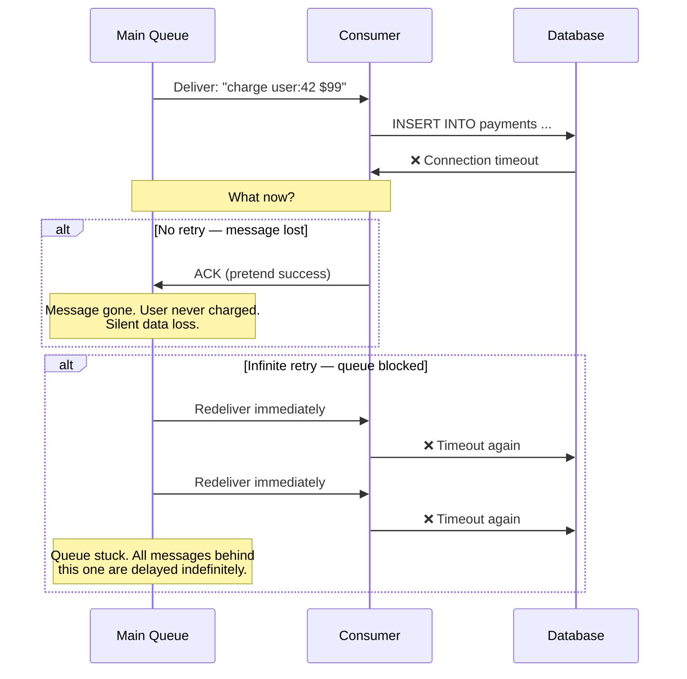
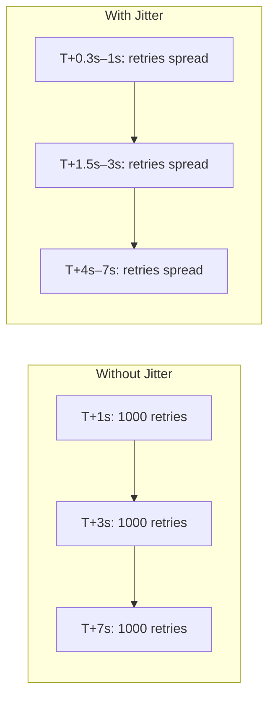
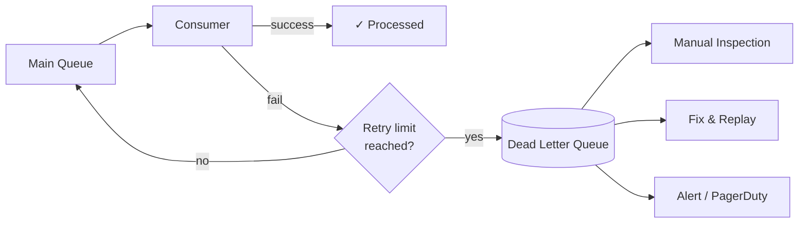
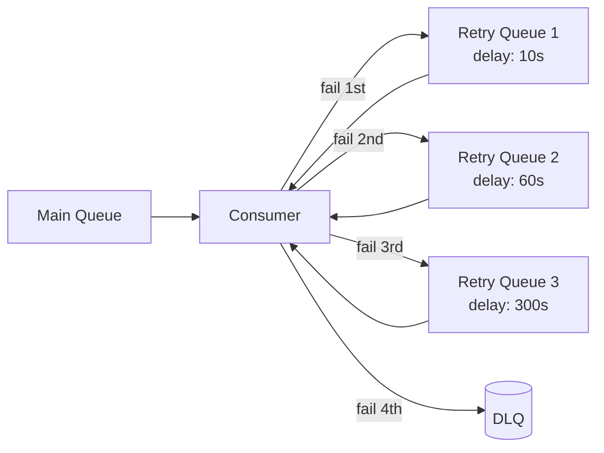
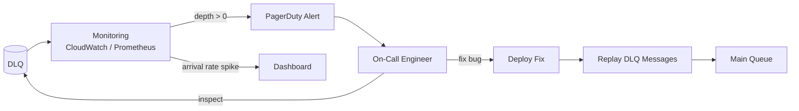

When a consumer fails to process a message — bad data, downstream timeout, transient bug — the system has two options: retry forever (blocking the queue) or drop the message (losing data). Neither is acceptable. **Dead Letter Queues (DLQs)** and **retry strategies** solve this by giving failed messages a structured path: retry with backoff, and if retries are exhausted, move the message to a separate queue for inspection rather than blocking or losing it.

## The Problem: What Happens When Processing Fails?

A consumer pulls a message from a queue, attempts to process it, and fails. Without a retry and DLQ strategy, every failure mode is bad:



Both outcomes are production incidents. Retry strategies control **how** we retry (with increasing delays and jitter). DLQs control **where** messages go when retries are exhausted.

## Retry Strategies

### Immediate Retry

The simplest approach: on failure, retry the message immediately. This works for truly transient errors (brief network blip) but fails for anything that takes time to recover (database overload, downstream service restart).

```
Attempt 1: process → ❌ fail
Attempt 2: process → ❌ fail (0ms later — same problem)
Attempt 3: process → ❌ fail (0ms later — still broken)
...
→ Hammers the failing dependency, making recovery harder
```

Immediate retry is almost never the right default. It turns a struggling downstream service into a fully overwhelmed one.

### Exponential Backoff

Wait longer between each retry. The delay grows exponentially: first retry after 1s, second after 2s, third after 4s, fourth after 8s.

```
delay = base_delay × 2^(attempt - 1)

Attempt 1: fail → wait 1s
Attempt 2: fail → wait 2s
Attempt 3: fail → wait 4s
Attempt 4: fail → wait 8s
Attempt 5: fail → wait 16s
                   ────────
                   Total: 31s of backoff before giving up
```

**Why exponential?** A linear backoff (1s, 2s, 3s, 4s) doesn't back off aggressively enough. An overloaded service needs load to drop significantly for recovery. Exponential backoff reduces retry pressure quickly, giving the downstream system time to recover.

**Cap the maximum delay.** Without a cap, `2^20` = 1,048,576 seconds (~12 days). Set a reasonable ceiling:

```
delay = min(base_delay × 2^(attempt - 1), max_delay)

With max_delay = 60s:
  Attempt 1: 1s
  Attempt 2: 2s
  ...
  Attempt 7: 64s → capped to 60s
  Attempt 8: 128s → capped to 60s
```

### Exponential Backoff with Jitter (Recommended)

Pure exponential backoff has a problem: when a downstream service recovers, all consumers retry at the same intervals. If 1000 consumers all failed at the same time, they all retry at T+1s, then all at T+3s, then all at T+7s — creating **synchronized retry storms** that re-overwhelm the service.



**Jitter** adds randomness to the delay, spreading retries across a time window:

```
Full jitter (recommended):
  delay = random(0, base_delay × 2^(attempt - 1))

Equal jitter:
  temp = base_delay × 2^(attempt - 1)
  delay = temp/2 + random(0, temp/2)

Decorrelated jitter:
  delay = random(base_delay, previous_delay × 3)
```

| Strategy | Behavior | When to Use |
|----------|----------|-------------|
| **Full jitter** | `random(0, exponential_delay)` — maximum spread | Default choice. Best for reducing correlated retry load. |
| **Equal jitter** | Half deterministic + half random — guaranteed minimum wait | When you need a minimum backoff floor but still want spread |
| **Decorrelated jitter** | Next delay based on previous delay, not attempt count — self-adapting | Long retry chains where spreading matters most |


AWS's analysis of exponential backoff strategies showed **full jitter** consistently outperforms other approaches in reducing total work and completion time under contention. Unless you have a specific reason to guarantee a minimum delay, use full jitter.


### Retry Budget

Exponential backoff controls **delay** between retries. A retry budget controls **how many retries happen across the system** within a time window, preventing retries themselves from becoming a denial-of-service attack on the downstream.

```
Retry budget: max 10% of total requests can be retries

Normal operation: 1000 req/s, 5 failures → 5 retries (0.5% — within budget)

Incident: 1000 req/s, 800 failures → retry budget allows 100 retries (10%)
  Remaining 700 failed messages → routed to DLQ without retry
  Prevents retries from doubling load on an already struggling service
```

Used by: Envoy proxy, gRPC retry policies, Linkerd. The retry budget is a circuit-breaker-like mechanism for retries specifically.

## Dead Letter Queues

A Dead Letter Queue is a separate queue where messages are routed after exhausting all retries. It isolates failures from the main processing pipeline.



### How DLQs Work in Practice

**SQS:**

```
Main Queue: orders-processing
  maxReceiveCount: 3        ← after 3 failed deliveries...
  deadLetterTargetArn: arn:aws:sqs:...:orders-dlq  ← ...move to DLQ

Flow:
  1. Message delivered to consumer → processing fails → NACK (visibility timeout expires)
  2. SQS increments ApproximateReceiveCount
  3. After 3rd failure: SQS moves message to orders-dlq automatically
  4. Main queue continues processing next messages — not blocked
```

**Kafka:**

Kafka has no built-in DLQ — consumers implement it. After N retries, the consumer publishes the failed message to a dedicated DLQ topic.

```
Consumer logic (Kafka):

for msg in consumer.poll():
    for attempt in range(1, MAX_RETRIES + 1):
        try:
            process(msg)
            consumer.commit(msg)
            break
        except TransientError:
            wait(backoff_with_jitter(attempt))
    else:
        # All retries exhausted
        dlq_producer.send("orders-dlq", msg)
        consumer.commit(msg)  # commit so main topic moves forward
```

**RabbitMQ:**

RabbitMQ uses **dead-letter exchanges (DLX)** — when a message is rejected, expires, or exceeds the queue's max-length, it's routed to the DLX, which delivers it to a DLQ.

```
Queue: orders-processing
  x-dead-letter-exchange: orders-dlx
  x-dead-letter-routing-key: orders-dlq

Message rejected (basic.nack with requeue=false) → routed to DLX → lands in DLQ
```

### Retry Queues (Staged Backoff)

For systems that need precise backoff timing, a common pattern is multiple retry queues with increasing delays:



In SQS, this is implemented with separate queues and visibility timeouts. In RabbitMQ, use DLX routing with per-queue message TTLs — when the TTL expires, the message is dead-lettered back to the main queue:

```
retry-queue-1:  TTL=10s,  DLX → main exchange   (retries after 10s)
retry-queue-2:  TTL=60s,  DLX → main exchange   (retries after 60s)
retry-queue-3:  TTL=300s, DLX → main exchange   (retries after 5min)
```

Each retry attempt routes to the next retry queue. After the last retry queue, failures go to the DLQ.

## Poison Messages

A **poison message** is a message that will **always** fail processing, regardless of how many times it's retried. The consumer crashes or throws an error every time it encounters this message.

| Cause | Example |
|-------|---------|
| **Malformed payload** | JSON parse error, missing required field, unexpected schema version |
| **Business logic violation** | References a user ID that doesn't exist, amount exceeds max, invalid state transition |
| **Consumer bug** | Null pointer exception on a specific data pattern that the code doesn't handle |
| **Size or resource limit** | Message payload too large for processing buffer; image too large to resize |

Without a DLQ, a poison message blocks the entire queue. The consumer receives it, fails, the message returns to the front of the queue, the consumer receives it again, fails again — indefinitely. All messages behind it are stuck.

```
Without DLQ:                     With DLQ:

  [poison] [msg2] [msg3]          [poison] [msg2] [msg3]
     ↓                               ↓
  Consumer: ❌ crash               Consumer: ❌ fail (attempt 1)
     ↓                               ↓
  [poison] [msg2] [msg3]          Consumer: ❌ fail (attempt 2)
     ↓                               ↓
  Consumer: ❌ crash               Consumer: ❌ fail (attempt 3)
     ↓                               ↓
  [poison] [msg2] [msg3]          → poison moved to DLQ
     ↓                               ↓
  ...forever                      [msg2] [msg3] → processed ✓
```

**Detection heuristic:** If the same message fails 3 consecutive times across different consumer instances, it's almost certainly a poison message, not a transient failure. Fast-track it to the DLQ.

## Idempotent Consumers

Retries mean the same message may be delivered multiple times. Every consumer in a retry pipeline **must** be idempotent — processing the same message N times produces the same result as processing it once.

This is covered in depth in [Idempotency & Exactly-Once Semantics](../../distributed/idempotency). The key patterns for DLQ/retry contexts:

| Pattern | How | Trade-off |
|---------|-----|-----------|
| **DB unique constraint** | `INSERT ... ON CONFLICT (message_id) DO NOTHING` — deduplicate at the DB level | Every message requires a DB write; dedup table grows |
| **Redis SETNX** | `SET dedup:{message_id} 1 NX PX 86400000` — claim processing rights atomically | Fast, auto-expires, but not transactional with your DB |
| **Upsert (idempotent by design)** | `HSET order:123 status "confirmed"` — same write applied twice yields same state | Best when possible; eliminates dedup infrastructure entirely |
| **Idempotency key in payload** | Message carries a unique operation ID; consumer checks before processing | Requires producer cooperation; most flexible |

The most robust approach: wrap deduplication and business logic in the same database transaction.

```sql
BEGIN;
  -- Claim this message (fails silently if already processed)
  INSERT INTO processed_messages (message_id, processed_at)
  VALUES ('msg-abc-123', NOW())
  ON CONFLICT (message_id) DO NOTHING;

  -- Only proceed if we actually inserted (first time)
  -- Check rows affected = 1 in application code
  INSERT INTO payments (user_id, amount, status)
  VALUES (42, 99.00, 'CHARGED');
COMMIT;
```

## Monitoring DLQs

A non-empty DLQ means messages are failing permanently. This is always a bug, a data issue, or a downstream dependency failure that outlasted the retry window.

### Key Metrics

| Metric | What It Tells You | Alert Threshold |
|--------|-------------------|-----------------|
| **DLQ depth** (message count) | How many messages have permanently failed | > 0 for critical queues; > N for tolerance-based |
| **DLQ arrival rate** | How fast new messages are arriving in the DLQ | Spike = new bug deployed or downstream outage |
| **Main queue retry rate** | Percentage of messages being retried vs processed successfully | > 5% sustained = something is wrong |
| **Consumer lag** (Kafka) | How far behind the consumer is from the head of the topic | Growing lag = consumer can't keep up (possibly due to retries) |
| **Oldest message in DLQ** | How long messages have been sitting unprocessed | > 24h = DLQ not being monitored |



### DLQ Reprocessing Workflow

After fixing the root cause, replay messages from the DLQ back to the main queue:

```
1. INVESTIGATE: Read messages from DLQ, identify failure pattern
   → All messages reference product_id=999 which doesn't exist
   → Root cause: product catalog sync bug

2. FIX: Deploy fix (product catalog sync corrected, missing products backfilled)

3. REPLAY: Move DLQ messages back to main queue
   SQS: Use AWS Lambda to read from DLQ and send to main queue
   Kafka: Produce DLQ topic messages back to main topic
   RabbitMQ: Shovel plugin moves messages between queues

4. VERIFY: DLQ empties as replayed messages process successfully
   Monitor for messages re-entering the DLQ (fix didn't cover all cases)
```


Never auto-replay DLQ messages without a fix in place. Auto-replay without a fix creates an infinite loop: main queue → fail → DLQ → replay → main queue → fail → DLQ. Always investigate first, deploy a fix, then replay.


## Platform Comparison

| Feature | SQS | RabbitMQ | Kafka |
|---------|-----|----------|-------|
| **Built-in DLQ** | Yes — `maxReceiveCount` policy routes to DLQ queue | Yes — dead-letter exchange (DLX) routes rejected/expired messages | No — consumer implements DLQ topic manually |
| **Retry backoff** | Visibility timeout (per-message or per-queue) | TTL + DLX chaining for staged delays | Consumer-side backoff logic |
| **Poison message protection** | Automatic after `maxReceiveCount` | Automatic via `x-death` header tracking | Consumer must track retry count (header or external store) |
| **Message metadata on DLQ** | `ApproximateReceiveCount`, original queue, timestamp | `x-death` header: queue, reason, count, time, routing key | Whatever the consumer includes when producing to DLQ topic |
| **Replay from DLQ** | Manual (Lambda or script reads DLQ → sends to main queue) | Shovel plugin or manual consume-and-republish | Produce from DLQ topic back to main topic |

## Common Mistakes

| Mistake | Why It's Wrong | Instead |
|---------|---------------|---------|
| **No DLQ configured** | Failed messages block the queue or are silently dropped | Always configure a DLQ. For Kafka, implement a DLQ topic in consumer code. |
| **Immediate retry without backoff** | Hammers the failing dependency, delays recovery | Use exponential backoff with full jitter. |
| **Retrying non-retryable errors** | 400 Bad Request will never succeed on retry; wastes time and delays other messages | Classify errors: retryable (timeout, 503) vs non-retryable (400, 422). Fast-track non-retryable to DLQ. |
| **No DLQ monitoring** | Messages rot in the DLQ for weeks; data loss goes unnoticed | Alert on DLQ depth > 0 for critical queues. Track oldest message age. |
| **Auto-replaying DLQ without a fix** | Creates an infinite fail → DLQ → replay → fail loop | Investigate, fix root cause, then replay. |
| **Non-idempotent consumers in retry pipeline** | Retries cause duplicate charges, double-sends, incorrect counts | Design every consumer to be idempotent from day one. |
| **Same retry strategy for all errors** | Transient errors (timeout) and permanent errors (bad data) need different handling | Classify errors. Retry transient errors with backoff. Route permanent errors directly to DLQ. |


**Interview framing:** "Every consumer in this system is designed to be idempotent — retries are safe. On failure, we use exponential backoff with full jitter to avoid synchronized retry storms. After 3 retries, the message goes to a dead letter queue. The DLQ is monitored — any message landing there triggers a PagerDuty alert because it means either a bug or a data issue that needs human investigation. After we fix the root cause, we replay DLQ messages back to the main queue. For Kafka consumers, we implement this in the consumer code since Kafka has no built-in DLQ; for SQS, we configure `maxReceiveCount` and a DLQ target. We also classify errors: transient errors (timeouts, 503s) get retried with backoff, but non-retryable errors (400, schema violations) skip retries and go straight to the DLQ."

