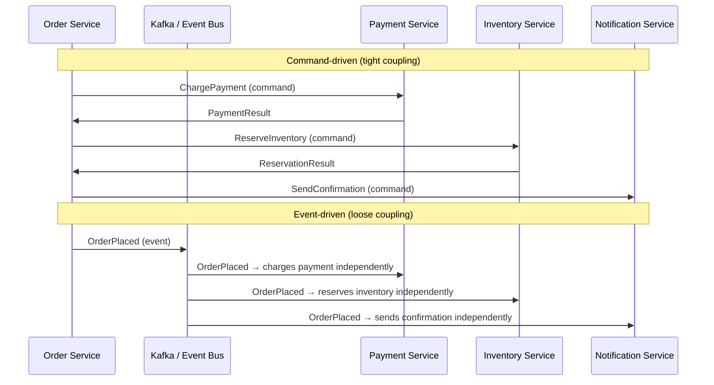
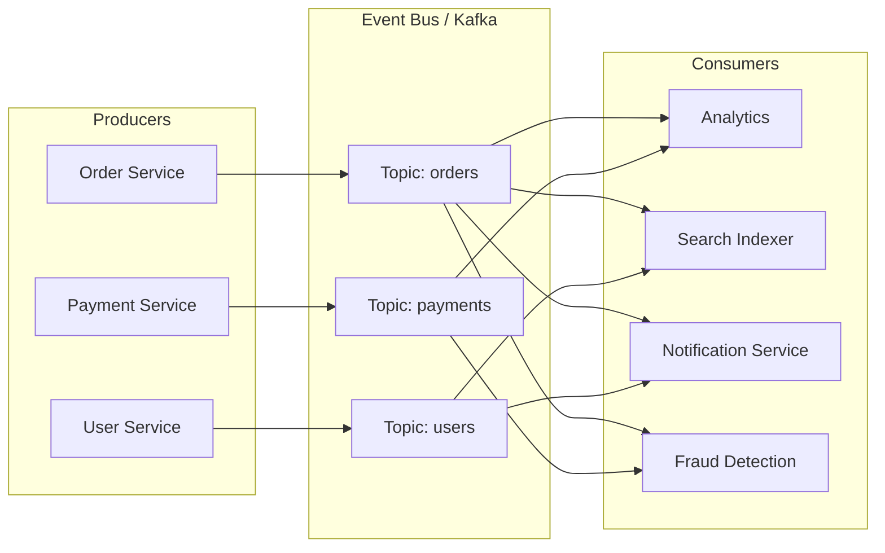
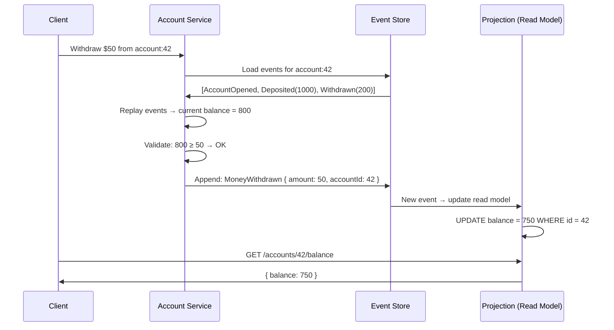
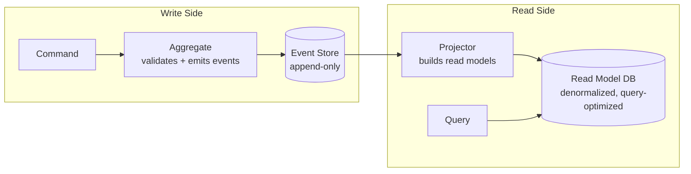

Event-Driven Architecture (EDA) is a design paradigm where services communicate by producing and consuming **events** — immutable facts about things that have happened. Instead of Service A calling Service B directly (synchronous RPC), Service A publishes an event and moves on. Any number of services can react independently.

This decoupling is the foundation of scalable microservice systems: producers don't know or care who consumes their events, and new consumers can be added without modifying the producer.

## Events vs Commands

This distinction is fundamental and frequently tested in interviews.

| | Event | Command |
|---|---|---|
| **Semantics** | A fact — something that **happened** | A request — something that **should happen** |
| **Tense** | Past tense: `OrderPlaced`, `PaymentCharged`, `UserRegistered` | Imperative: `PlaceOrder`, `ChargePayment`, `RegisterUser` |
| **Ownership** | Owned by the **producer** (the service that knows the fact) | Owned by the **consumer** (the service that will execute it) |
| **Coupling** | Loose — producer doesn't know who listens | Tight — sender knows the target service |
| **Failure** | Producer succeeds regardless of consumer failures | Sender must handle target failure (retry, timeout) |
| **Mutability** | Immutable — a fact cannot be changed after it happened | Mutable — can be retried, modified, cancelled |
| **Fan-out** | Natural — any number of consumers | Typically one target |



In the command-driven model, the Order Service **orchestrates** every downstream step and must handle each service's failures. In the event-driven model, the Order Service publishes one fact and downstream services react autonomously.


Events and commands are not mutually exclusive. Most real systems use both. Within a saga orchestrator, commands are appropriate (the orchestrator explicitly tells services what to do). Between bounded contexts, events are preferred (loose coupling). The question in an interview is always "what coupling do you want here?"


## Pub/Sub Pattern

Publish/Subscribe is the messaging pattern that implements event-driven communication. Producers publish to a **topic** (or channel); consumers subscribe to topics they care about.



### Key Properties

**Producer ignorance:** The Order Service publishes `OrderPlaced` without knowing that Analytics, Search, Notifications, and Fraud Detection all consume it. When the Fraud Detection team adds their consumer next quarter, zero changes are needed on the Order Service.

**Consumer independence:** Each consumer processes events at its own pace. If the Search Indexer falls behind (Elasticsearch is slow), it doesn't affect Notifications or Analytics. Each consumer group tracks its own offset in Kafka.

**Temporal decoupling:** The producer and consumer don't need to be running at the same time. Events are durably stored in Kafka (or SQS, SNS). A consumer that was down for maintenance catches up when it restarts.

### Pub/Sub Implementations

| System | Model | Retention | Best For |
|--------|-------|-----------|----------|
| **Kafka** | Persistent log, consumer groups | Configurable (days/forever) | High-throughput event backbone, replay |
| **AWS SNS → SQS** | SNS fans out to SQS queues | SQS: 14 days max | AWS-native, simple fan-out |
| **Google Pub/Sub** | Persistent, per-subscription delivery | 7 days default | GCP-native, auto-scaling |
| **Redis Pub/Sub** | Fire-and-forget (no persistence) | None — message lost if no subscriber is connected | Real-time notifications where loss is acceptable |
| **RabbitMQ (fanout exchange)** | Exchange copies to all bound queues | Until consumed | Low-latency, small-scale fan-out |

## Event Sourcing

Event sourcing takes the event-driven idea to its extreme: instead of storing the **current state** of an entity, you store the **complete sequence of events** that led to that state. Current state is derived by replaying events.

### Traditional CRUD vs Event Sourcing

```
Traditional (state-based):
  Account table: { id: 42, balance: 750, name: "Alice" }
  → You know the current balance but not HOW it got there

Event Sourcing:
  Event store for account:42:
    [1] AccountOpened    { balance: 0 }
    [2] MoneyDeposited   { amount: 1000 }
    [3] MoneyWithdrawn   { amount: 200 }
    [4] MoneyWithdrawn   { amount: 50 }
    → Current balance: replay → 0 + 1000 - 200 - 50 = 750
    → You know every transition that led to this state
```



### Event Store

The event store is an append-only log where events are immutable. Once written, an event is never modified or deleted.

```
Event Store (per aggregate):

account:42 stream:
┌────────┬──────────────────┬───────────────────────────┬──────────────┐
│ seq    │ event_type       │ payload                   │ timestamp    │
├────────┼──────────────────┼───────────────────────────┼──────────────┤
│ 1      │ AccountOpened    │ { owner: "Alice" }        │ 2025-01-15   │
│ 2      │ MoneyDeposited   │ { amount: 1000 }          │ 2025-01-15   │
│ 3      │ MoneyWithdrawn   │ { amount: 200 }           │ 2025-02-01   │
│ 4      │ MoneyWithdrawn   │ { amount: 50 }            │ 2025-03-10   │
└────────┴──────────────────┴───────────────────────────┴──────────────┘

Concurrency control: optimistic locking on sequence number.
  Append event at seq=5 succeeds only if current seq is still 4.
  If another write happened first (seq=5 already exists) → conflict → retry.
```

**Dedicated event stores:** EventStoreDB, Axon Server. **General-purpose alternatives:** PostgreSQL with an append-only events table + sequence constraint, Kafka with compacted topics.

### CQRS (Command Query Responsibility Segregation)

Event sourcing naturally splits reads and writes into separate models:



| Side | Optimized For | Storage |
|------|--------------|---------|
| **Write (Command)** | Consistency, validation, event generation | Event store (append-only, sequential) |
| **Read (Query)** | Fast queries, complex aggregations | Denormalized tables, materialized views, Elasticsearch |

The read model is a **projection** — a materialized view derived from events. You can build multiple projections from the same event stream: one for the user-facing API, one for admin dashboards, one for analytics. Each is optimized for its specific query patterns.

### Snapshots

For aggregates with many events (e.g., an account with 100,000 transactions), replaying all events on every command is expensive. Snapshots store the aggregate's state at a point in time:

```
Events:    [1] [2] [3] ... [9999] [10000] [10001] [10002]
                                    ↑
                            Snapshot at seq 10000:
                            { balance: 42350, ... }

To load current state:
  1. Load snapshot (seq 10000, balance 42350)
  2. Replay only events 10001, 10002
  Instead of replaying all 10002 events
```

## Benefits of Event-Driven Architecture

### Auditability

Every state change is recorded as an event. You have a complete, immutable audit trail without any additional logging infrastructure.

```
"Why does user:42 have balance $750?"
→ Replay event stream:
  AccountOpened(0) → Deposited(1000) → Withdrawn(200) → Withdrawn(50)
  Each event has timestamp, actor, metadata.
  Full provenance of every state transition.
```

### Temporal Queries

With event sourcing, you can answer "what was the state at time T?" by replaying events up to T. Traditional databases can only tell you the current state.

```
"What was user:42's balance on February 15?"
→ Replay events with timestamp ≤ Feb 15:
  AccountOpened(0) → Deposited(1000) → Withdrawn(200)
  Balance was $800 on February 15.
```

### Easy Fan-Out

Adding a new consumer requires zero changes to existing services. The new team subscribes to the relevant topics and starts consuming.

```
Month 1: Order Service → Kafka → [Analytics, Search]
Month 3: Fraud team adds a consumer → [Analytics, Search, Fraud Detection]
Month 5: ML team adds a consumer → [Analytics, Search, Fraud, ML Training Pipeline]

Order Service code: unchanged through all of this.
```

### Temporal Decoupling

Producers and consumers don't need to be available simultaneously. Events are durably stored and consumed when the consumer is ready.

## Challenges

### Eventual Consistency

In EDA, the write (event published) and the read (projection updated) are not synchronous. There is always a window where the read model is stale.

```
T=0:    User places order → OrderPlaced event published
T=5ms:  Event reaches Kafka
T=50ms: Analytics consumer processes event → dashboard updated
T=200ms: Search consumer processes event → Elasticsearch updated

Between T=0 and T=200ms, searching for the order returns nothing.
```

**Mitigation:**
- Accept the delay (most systems can tolerate 100ms–1s of staleness)
- Return the write result directly to the user (read-your-writes on the write path)
- Use causal consistency tokens for critical read-after-write scenarios

### Schema Evolution

Events are immutable — you can't change old events. But your schema will evolve. A consumer written today must handle events written a year ago.

```
Version 1 (Jan 2025):  OrderPlaced { orderId, userId, total }
Version 2 (Jun 2025):  OrderPlaced { orderId, userId, total, currency, discountCode }

Consumers must handle both versions.
```

**Strategies:**

| Strategy | How | Trade-off |
|----------|-----|-----------|
| **Additive-only changes** | Only add new optional fields; never remove or rename | Safest; limits schema flexibility |
| **Schema registry** (Confluent) | Enforce compatibility rules (backward, forward, full) on Avro/Protobuf schemas | Requires infrastructure; enforces discipline |
| **Upcasting** | Consumer transforms old events to current schema on read | Logic lives in consumers; each consumer handles migration independently |
| **Event versioning** | `OrderPlaced.v1`, `OrderPlaced.v2` — different event types | Explicit but proliferates event types |

### Debugging Complexity

In a synchronous system, a stack trace shows the full call chain. In EDA, there is no call stack — events flow asynchronously through topics and consumer groups.

```
Synchronous: Order → Payment → Inventory → Shipping
  One stack trace shows the entire flow. One log correlation ID.

Event-driven: OrderPlaced → (Kafka) → PaymentCharged → (Kafka) → InventoryReserved → (Kafka) → ...
  Each step is a separate process. No shared stack trace.
  Must correlate via traceId/correlationId in event metadata.
```

**Mitigation:**
- **Correlation ID:** Every event carries a `correlationId` (set by the initial request) and a `causationId` (the event that caused this one). Distributed tracing tools (Jaeger, Zipkin) visualize the full flow.
- **Event catalog:** A central registry documenting every event type, its schema, producers, and consumers. Without this, large EDA systems become opaque.
- **Dead Letter Queues:** Events that fail processing N times go to a DLQ for inspection rather than blocking the consumer.

### Ordering Across Topics

Events within a single Kafka partition are ordered, but events across different topics are not. If `OrderPlaced` and `PaymentCharged` are on separate topics, a consumer may see `PaymentCharged` before `OrderPlaced`.

**Mitigation:**
- Put causally related events on the same topic + partition key
- Use timestamps or sequence numbers to reorder at the consumer
- Design consumers to handle out-of-order events (buffer and wait, or process idempotently)

## EDA Patterns Summary

| Pattern | When | How |
|---------|------|-----|
| **Simple pub/sub** | Loose fan-out notification | Producer → Topic → N consumers |
| **Event sourcing + CQRS** | Full audit trail, temporal queries, separate read/write optimization | Event store → projections → read models |
| **Saga (choreography)** | Cross-service coordination without orchestrator | Services react to each other's events |
| **Saga (orchestration)** | Complex multi-step workflows | Orchestrator sends commands, receives events |
| **Event notification** | "Something happened, look it up yourself" | Thin event (just ID + type), consumer fetches details via API |
| **Event-carried state transfer** | Consumer needs the data, not just a notification | Fat event (full entity payload), consumer doesn't need to call back |


**Interview framing:** "I'd design this as an event-driven system. The Order Service publishes `OrderPlaced` to Kafka — that's an immutable fact, not a command. Payment, Inventory, and Notifications each subscribe independently as separate consumer groups. This gives us loose coupling: adding Fraud Detection next quarter requires zero changes to the Order Service. The trade-off is eventual consistency — the search index may be a few hundred milliseconds behind — which is acceptable for this use case. Events carry a `correlationId` for distributed tracing across the async flow."

