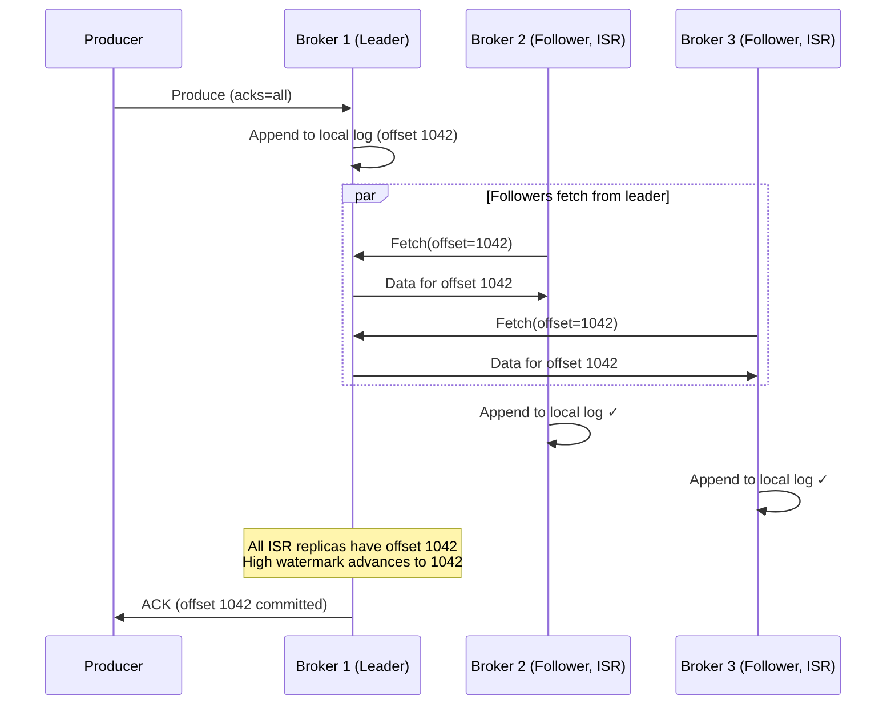
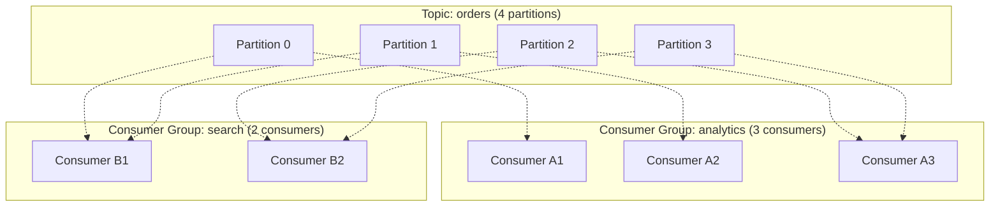
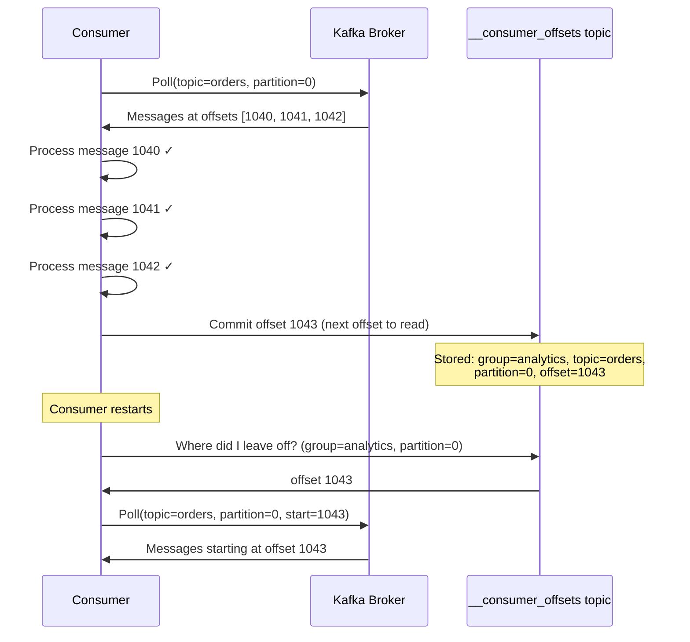
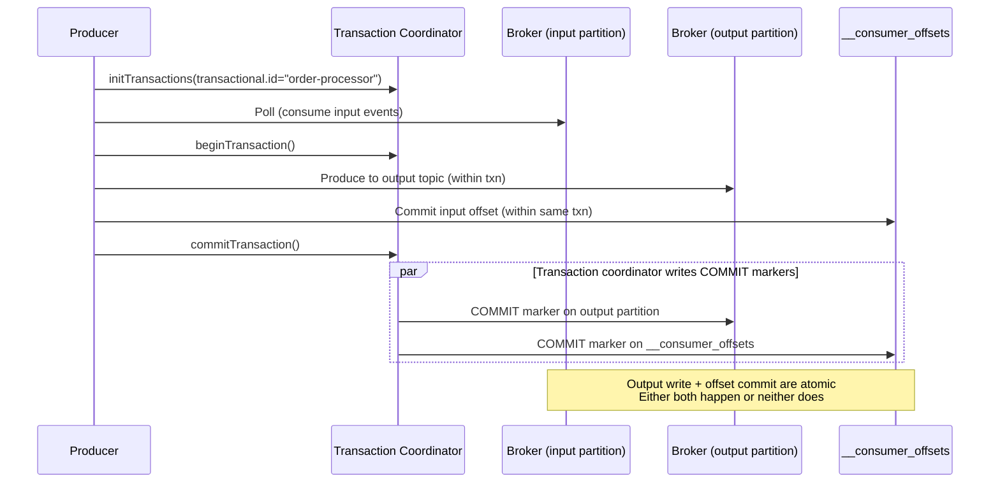

Your ride-sharing platform pushes a million GPS pings per second from drivers' phones. The pricing engine needs them to recompute surge in real time, the ETA service needs them to update arrival predictions, the data lake needs them archived for ML training, and the regulatory team needs a 7-year audit trail. They all need the same data, at different paces, with no chance of one slow consumer slowing down the others. This is the workload Kafka was built for.

Apache Kafka is a distributed, persistent, append-only commit log designed for high-throughput event streaming. It sits at the center of most modern event-driven architectures — acting as the durable backbone between services that produce events and the many systems that consume them.

This page covers Kafka's internals at the level expected in a FAANG system design interview.

## Architecture Overview

```mermaid
flowchart TD
    subgraph Kafka Cluster
        subgraph Broker 1
            P0L["Partition 0 (Leader)"]
            P2F["Partition 2 (Follower)"]
        end
        subgraph Broker 2
            P1L["Partition 1 (Leader)"]
            P0F1["Partition 0 (Follower)"]
        end
        subgraph Broker 3
            P2L["Partition 2 (Leader)"]
            P1F["Partition 1 (Follower)"]
        end
    end

    Prod[Producers] -->|writes go to partition leaders| P0L
    Prod --> P1L
    Prod --> P2L

    P0L -.->|replication| P0F1
    P1L -.->|replication| P1F
    P2L -.->|replication| P2F

    P0L --> CG[Consumer Groups]
    P1L --> CG
    P2L --> CG

    Ctrl[Controller<br/>KRaft quorum] ---|metadata, leader election| Broker 1
    Ctrl --- Broker 2
    Ctrl --- Broker 3
```

### Core Components

| Component | Role |
|-----------|------|
| **Broker** | A single Kafka server. Stores partition data on disk. Serves produce and fetch requests. |
| **Topic** | A named category of events (e.g., `orders`, `user-clicks`). Logical grouping only — data lives in partitions. |
| **Partition** | An ordered, immutable, append-only log of messages. The unit of parallelism and ordering. |
| **Replica** | A copy of a partition on another broker. One replica is the **leader** (handles reads + writes); others are **followers** (replicate from leader). |
| **Controller** | Manages cluster metadata: partition leadership, broker liveness, topic creation. Since Kafka 3.3, this is a Raft-based **KRaft** quorum (replacing ZooKeeper). |

**Key insight:** Producers and consumers **only interact with partition leaders**. Followers exist purely for durability — they replicate from the leader and take over if it fails.

## Partitions

A partition is a bounded, ordered, append-only sequence of messages. Each message within a partition gets a monotonically increasing **offset** — an immutable position number.

```
Topic: orders (3 partitions)

Partition 0: [0] [1] [2] [3] [4] [5] [6] ... [1042]  ← current head
Partition 1: [0] [1] [2] [3] [4] ... [987]
Partition 2: [0] [1] [2] [3] ... [1105]
                                     ↑
                            Each offset is unique
                            within its partition
```

### Ordering Guarantees

**Within a partition:** Strict total order. Message at offset 5 was written before offset 6, always.

**Across partitions:** No ordering. Offset 5 in partition 0 has no temporal relationship to offset 5 in partition 1.

This means: if you need messages for a specific entity (e.g., all events for `user:42`) to be processed in order, they must go to the **same partition**.

### Partition Assignment (Producing)

The producer decides which partition a message goes to:

```
1. Message has a key → hash(key) % num_partitions → deterministic partition
   key="user:42" → hash → partition 1
   key="user:42" → hash → partition 1  (always the same partition)

2. Message has no key → round-robin across partitions (or sticky partitioning for batching)

3. Custom partitioner → application logic determines partition
```

**Why keys matter:** All messages with the same key go to the same partition, guaranteeing ordering per key. This is how you ensure all events for a specific user, order, or session are processed in order.

### How Many Partitions?

```
Parallelism = min(partition_count, consumers_in_group)

Target throughput: 100 MB/s
Single consumer throughput: 10 MB/s
→ Need at least 10 partitions

Rule of thumb for Kafka:
  - Start with 6-12 partitions per topic for moderate throughput
  - High-throughput topics: 30-100+ partitions
  - Partition count can be increased (but not decreased) after creation
  - More partitions = more open file handles, longer leader election, higher memory
```


**Partition count cannot be decreased.** Increasing partitions changes the key-to-partition mapping (`hash(key) % N`), so existing keys may move to different partitions. This breaks ordering guarantees for in-flight data. Plan partition count carefully at topic creation time.


## Replication and ISR

Each partition has a configurable **replication factor** (typically 3). One replica is the leader; the rest are followers.

### In-Sync Replicas (ISR)

The ISR is the set of replicas that are "caught up" with the leader — their log end offset is within `replica.lag.time.max.ms` (default 30s) of the leader's.



### High Watermark

The **high watermark** is the offset up to which all ISR replicas have replicated. Consumers can only read up to the high watermark — this prevents them from reading data that might be lost if the leader fails before replication completes.

```
Leader log:      [1040] [1041] [1042] [1043] [1044]
Follower 1 log:  [1040] [1041] [1042] [1043]
Follower 2 log:  [1040] [1041] [1042]
                                  ↑
                          High watermark = 1042
                          (all ISR replicas have up to 1042)

Consumers can read: offsets ≤ 1042
Offsets 1043, 1044: not yet committed — invisible to consumers
```

### Leader Failure

When a partition leader fails, the controller elects a new leader from the ISR:

```
Before failure:
  Leader: Broker 1, ISR: [Broker 1, Broker 2, Broker 3]

Broker 1 crashes:
  Controller detects via heartbeat timeout
  New leader elected from ISR: Broker 2
  ISR updated: [Broker 2, Broker 3]

Broker 1 recovers:
  Truncates log to high watermark (discards unreplicated data)
  Fetches from new leader to catch up
  Rejoins ISR when caught up
```

**Unclean leader election** (`unclean.leader.election.enable=false` by default): If all ISR replicas are down, Kafka refuses to elect an out-of-sync replica as leader — the partition becomes unavailable rather than risk data loss. Setting this to `true` allows an out-of-sync replica to become leader, accepting potential data loss for availability.

## Consumer Groups

Consumer groups are Kafka's mechanism for both **fan-out** (multiple groups read independently) and **work distribution** (within a group, partitions are split among members).



**Rules:**
1. Each partition is assigned to **exactly one consumer** within a group
2. A consumer can be assigned **multiple partitions**
3. If consumers > partitions, some consumers sit idle
4. Each consumer group reads **all** messages independently

### Rebalancing

When a consumer joins, leaves, or crashes, partitions are **rebalanced** across the remaining consumers in the group.

```
Initial state: 4 partitions, 3 consumers
  A1: [P0]    A2: [P1]    A3: [P2, P3]

Consumer A2 crashes:
  Rebalance triggered
  A1: [P0, P1]    A3: [P2, P3]

New consumer A4 joins:
  Rebalance triggered
  A1: [P0]    A3: [P2]    A4: [P1, P3]
```

**Rebalancing is expensive:** During a rebalance, all consumers in the group stop processing briefly. This can cause latency spikes. Strategies to minimize impact:

| Strategy | How |
|----------|-----|
| **Static group membership** | Assign persistent `group.instance.id` to each consumer. On restart, the consumer reclaims its previous partitions without triggering a full rebalance. |
| **Cooperative sticky rebalancing** | Only revoke and reassign the partitions that need to move (Kafka 2.4+). Other consumers continue processing during rebalance. |
| **Over-provision partitions** | More partitions than consumers means rebalancing moves fewer partitions per event. |

## Offset Management

Each consumer group tracks its position in each partition via **offsets** stored in the internal `__consumer_offsets` topic.



### Commit Strategies

| Strategy | How | Risk |
|----------|-----|------|
| **Auto-commit** (`enable.auto.commit=true`) | Kafka commits offsets periodically (every 5s by default) | Messages processed but offset not yet committed → reprocessing on restart. Messages committed but not yet processed → data loss. |
| **Manual sync commit** (`commitSync()`) | Application commits after processing each batch | Slower (blocks until commit ACK). Safest — exactly matches processing progress. |
| **Manual async commit** (`commitAsync()`) | Non-blocking commit, fire-and-forget | Faster, but if commit fails silently, offsets may fall behind → reprocessing. |

**The at-least-once pattern (most common):**

```
while true:
  messages = consumer.poll()
  for msg in messages:
    process(msg)           # must be idempotent
  consumer.commitSync()    # commit after all messages in batch processed
```

If the consumer crashes between `process()` and `commitSync()`, the uncommitted messages are re-delivered on restart — hence "at-least-once."

### Offset Reset Policy

When a consumer group has no committed offset (new group, or offsets expired), `auto.offset.reset` determines where to start:

| Policy | Behavior | Use Case |
|--------|----------|----------|
| `earliest` | Start from the beginning of the partition | New service that needs all historical events |
| `latest` | Start from the current head (skip history) | Service that only cares about new events |
| `none` | Throw an exception | Fail-safe — force explicit offset management |

## Delivery Guarantees

### At-Most-Once

```
messages = consumer.poll()
consumer.commitSync()        # commit BEFORE processing
for msg in messages:
  process(msg)               # if crash here, messages are lost (already committed)
```

Messages may be lost but are never duplicated. Appropriate for low-value metrics where gaps are acceptable.

### At-Least-Once (Default)

```
messages = consumer.poll()
for msg in messages:
  process(msg)               # process first
consumer.commitSync()        # commit AFTER processing

# If crash between process and commit → message reprocessed on restart
```

Messages are never lost but may be duplicated. The consumer **must be idempotent** to handle redelivery.

### Exactly-Once (Kafka Transactions)

Kafka's exactly-once semantics combine three features:



**Three components working together:**

| Component | What it does |
|-----------|-------------|
| **Idempotent producer** (`enable.idempotence=true`) | Each message gets a sequence number per (ProducerID, partition). Broker deduplicates retried messages. Prevents duplicate writes from producer retries. |
| **Transactions** (`transactional.id`) | Wraps produce + offset commit in a single atomic transaction. Either both succeed or both are rolled back. |
| **Consumer isolation** (`isolation.level=read_committed`) | Consumer only reads messages from committed transactions. Uncommitted/aborted messages are invisible. |

**Scope limitation:** Kafka's exactly-once only covers **Kafka-to-Kafka** pipelines (consume from input topic → process → produce to output topic). If the processing step writes to an external database, that write is not part of the Kafka transaction. For external systems, combine with the outbox pattern or design the consumer to be idempotent.

## Producer Internals

### Batching and Compression

Producers don't send messages one at a time. They accumulate messages into **batches** per partition and send them together.

```
Producer buffer (per partition):

Partition 0 batch: [msg1, msg2, msg3] → compress → send as one request
Partition 1 batch: [msg4]             → compress → send as one request
Partition 2 batch: [msg5, msg6]       → compress → send as one request
```

| Config | Default | Effect |
|--------|---------|--------|
| `batch.size` | 16KB | Maximum batch size in bytes. Larger = better throughput, higher latency. |
| `linger.ms` | 0 | Wait time to fill a batch. `linger.ms=5` waits up to 5ms to accumulate more messages before sending. |
| `compression.type` | `none` | `gzip`, `snappy`, `lz4`, `zstd`. Compression happens at the batch level — more messages per batch = better compression ratio. |

**Throughput optimization:** Set `linger.ms=5-20` and `batch.size=64KB-1MB`. The producer waits a few milliseconds to accumulate a larger batch, compresses it, and sends one network request instead of many small ones. This trades a few ms of latency for 5–10x throughput improvement.

### Acknowledgement Modes

| `acks` | Behavior | Durability | Latency |
|--------|----------|-----------|---------|
| `0` | Fire and forget. Don't wait for any ACK. | Data loss possible — broker may never receive the message. | Lowest |
| `1` | Wait for leader ACK only. | Data loss if leader crashes before followers replicate. | Low |
| `all` (`-1`) | Wait for all ISR replicas to ACK. | No data loss as long as at least one ISR replica survives. | Highest |

**Production recommendation:** `acks=all` + `min.insync.replicas=2` (with replication factor 3). This means a write is only ACK'd when the leader + at least one follower have the data. If fewer than 2 replicas are in-sync, the producer gets an error rather than accepting data with insufficient durability.

## Storage: Why Kafka Is Fast

Kafka achieves millions of messages per second because of how it stores and serves data:

| Technique | How |
|-----------|-----|
| **Append-only writes** | Sequential disk I/O only. No random seeks. Sequential writes on modern SSDs: 500+ MB/s. |
| **Page cache** | Kafka delegates caching to the OS page cache. Recently written data is served from memory without Kafka managing a cache. |
| **Zero-copy** (`sendfile` syscall) | Data goes directly from page cache to network socket — never copied into Kafka's JVM heap. Eliminates two memory copies per fetch. |
| **Batching** | Messages are grouped, compressed, and sent as a single network request. Amortizes per-message overhead. |
| **Segment files** | Each partition is split into segment files (default 1GB). Old segments are deleted or compacted without affecting current writes. |

```
Partition 0 directory on disk:
  00000000000000000000.log     ← segment 1 (offsets 0-999)
  00000000000000001000.log     ← segment 2 (offsets 1000-1999)
  00000000000000002000.log     ← active segment (appending here)
  00000000000000000000.index   ← sparse offset → file position index
  00000000000000000000.timeindex  ← timestamp → offset index
```

The `.index` file maps offsets to byte positions in the `.log` file. It's sparse (not every offset) — Kafka binary-searches the index, then scans forward in the log. This allows O(1) lookups by offset despite the append-only log structure.


**Interview framing:** "I'd use Kafka as the event backbone — producers publish OrderCreated events with `key=orderId` so all events for the same order go to the same partition (ordering guarantee). Three consumer groups read independently: analytics for the data warehouse, search for Elasticsearch indexing, and notifications for email. We'd run with `acks=all`, `min.insync.replicas=2`, and `replication.factor=3` for durability. Consumers commit offsets manually after processing and are designed to be idempotent — that gives us at-least-once delivery with effective exactly-once semantics at the application level."



**Interview tip:** The mental model I'd anchor on is that the partition is Kafka's unit of both ordering and parallelism — one consumer per partition within a group, so `parallelism = min(partitions, consumers)`. I'd choose the partition key to reflect the entity that needs ordered processing (orderId, userId) and pick partition count for peak throughput plus headroom, since you can add but not remove. For durability I'd say `acks=all` + `min.insync.replicas=2` + `replication.factor=3`; for replay I'd lean on offset commits in `__consumer_offsets`; and if exactly-once is required I'd reach for the idempotent producer plus transactions, but only when the pipeline stays Kafka-to-Kafka — for external sinks I'd fall back to idempotent consumers and the outbox pattern.

