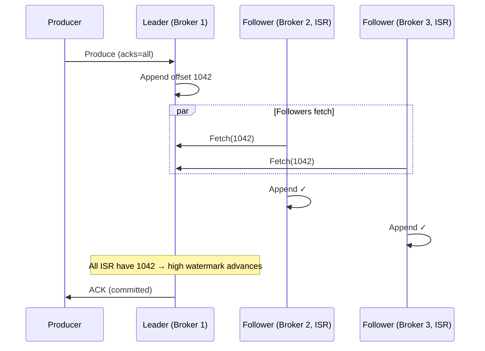
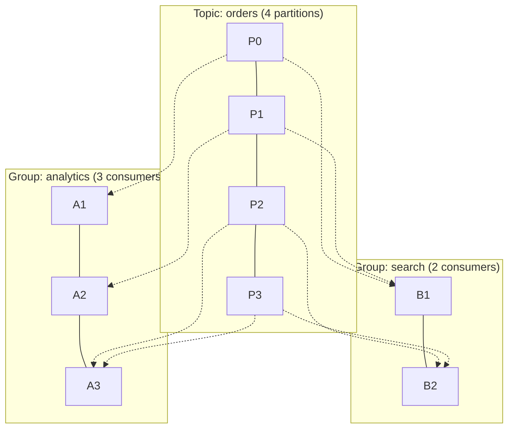

Your ride-sharing platform pushes a million GPS pings per second from drivers' phones. The pricing engine needs them for surge recomputation, the ETA service needs them for arrival predictions, the data lake needs them for ML training, and the regulatory team needs a 7-year audit trail. They all need the same data, at different paces, with no slow consumer blocking the others.

Apache Kafka is a distributed, persistent, append-only commit log for high-throughput event streaming. It sits at the center of most event-driven architectures — the durable backbone between producers and consumers.

## Architecture Overview

```mermaid
flowchart TD
    subgraph Kafka Cluster
        subgraph Broker 1
            P0L["Partition 0 (Leader)"]
            P2F["Partition 2 (Follower)"]
        end
        subgraph Broker 2
            P1L["Partition 1 (Leader)"]
            P0F1["Partition 0 (Follower)"]
        end
        subgraph Broker 3
            P2L["Partition 2 (Leader)"]
            P1F["Partition 1 (Follower)"]
        end
    end

    Prod[Producers] -->|writes to leaders| P0L
    Prod --> P1L
    Prod --> P2L

    P0L -.->|replication| P0F1
    P1L -.->|replication| P1F
    P2L -.->|replication| P2F

    P0L --> CG[Consumer Groups]
    P1L --> CG
    P2L --> CG

    Ctrl[Controller<br/>KRaft quorum] ---|metadata, leader election| Broker 1
    Ctrl --- Broker 2
    Ctrl --- Broker 3
```

| Component | Role |
|---|---|
| **Broker** | A single Kafka server. Stores partition data on disk, serves produce/fetch requests. |
| **Topic** | Named category of events (e.g., `orders`). Logical grouping — data lives in partitions. |
| **Partition** | Ordered, immutable, append-only log. The unit of parallelism and ordering. |
| **Replica** | Copy of a partition on another broker. One is the **leader** (handles reads + writes); others are **followers** (replicate from leader, take over on failure). |
| **Controller** | Manages cluster metadata: partition leadership, broker liveness. Since Kafka 3.3, this is a [Raft](../consensus/raft.md)-based **KRaft** quorum (replacing ZooKeeper). |

Producers and consumers **only talk to partition leaders**. Followers exist purely for durability.

## Partitions & Ordering

Each message in a partition gets a monotonically increasing **offset** — an immutable position number.

```
Topic: orders (3 partitions)

Partition 0: [0] [1] [2] [3] ... [1042]  ← current head
Partition 1: [0] [1] [2] ... [987]
Partition 2: [0] [1] [2] ... [1105]
```

**Within a partition:** Strict total order. Offset 5 was written before offset 6, always.
**Across partitions:** No ordering guarantee. Offset 5 in P0 has no temporal relationship to offset 5 in P1.

### Partition Assignment (Producing)

```
1. Message has a key → hash(key) % num_partitions → deterministic partition
   key="user:42" → always goes to the same partition → ordering per user

2. Message has no key → round-robin (or sticky partitioning for batching)

3. Custom partitioner → application logic decides
```

**Why keys matter:** All messages with the same key go to the same partition, guaranteeing per-key ordering. This is how you ensure all events for a specific user or order are processed in order.

### How Many Partitions?

```
Parallelism = min(partition_count, consumers_in_group)

Target: 100 MB/s throughput, single consumer handles 10 MB/s → need ≥ 10 partitions
```

Rule of thumb: start with 6–12 for moderate throughput; 30–100+ for high-throughput topics.


**Partition count can be increased but never decreased.** Increasing changes `hash(key) % N`, so existing keys may move to different partitions — breaking ordering for in-flight data. Plan partition count carefully at creation.


## Replication & ISR

Each partition has a configurable **replication factor** (typically 3). The **ISR (In-Sync Replica set)** is the set of replicas whose log end offset is within `replica.lag.time.max.ms` (default 30s) of the leader's.



### High Watermark

The **high watermark** is the offset up to which all ISR replicas have replicated. Consumers only read up to the high watermark — preventing them from seeing data that could be lost if the leader fails before replication completes.

```
Leader:     [1040] [1041] [1042] [1043] [1044]
Follower 1: [1040] [1041] [1042] [1043]
Follower 2: [1040] [1041] [1042]
                             ↑
                     High watermark = 1042
                     Consumers can read ≤ 1042
```

### Leader Failure

Controller detects failure via heartbeat timeout → elects new leader from ISR → recovering broker truncates to high watermark and catches up.

**Unclean leader election** (`unclean.leader.election.enable=false` default): if all ISR replicas are down, Kafka refuses to elect an out-of-sync replica — partition becomes **unavailable** rather than risk data loss. Setting `true` trades data loss risk for availability.

## Consumer Groups

Consumer groups provide **fan-out** (multiple groups read independently) and **work distribution** (within a group, partitions split among members).



**Rules:** Each partition → exactly one consumer within a group. A consumer can own multiple partitions. If consumers > partitions, extras sit idle. Each group reads **all** messages independently.

### Rebalancing

When a consumer joins, leaves, or crashes, partitions are redistributed. **Rebalancing is expensive** — all consumers in the group briefly stop processing.

| Mitigation | How |
|---|---|
| **Static group membership** | Persistent `group.instance.id` — on restart, consumer reclaims its partitions without full rebalance |
| **Cooperative sticky rebalancing** | Only revoke partitions that need to move (Kafka 2.4+). Others keep processing. |
| **Over-provision partitions** | More partitions than consumers → rebalancing moves fewer partitions per event |

## Offset Management

Each consumer group tracks its position per partition via **offsets** stored in the internal `__consumer_offsets` topic.

| Strategy | How | Risk |
|---|---|---|
| **Auto-commit** | Kafka commits every 5s by default | Gap between processing and commit → reprocessing or data loss on crash |
| **Manual sync** (`commitSync()`) | App commits after processing each batch | Safest, but blocks until commit ACK |
| **Manual async** (`commitAsync()`) | Non-blocking, fire-and-forget | If commit fails silently, offsets fall behind → reprocessing |

**The standard at-least-once pattern:**
```
while true:
    messages = consumer.poll()
    for msg in messages:
        process(msg)           # must be idempotent
    consumer.commitSync()      # commit AFTER processing
```

If the consumer crashes between `process()` and `commitSync()`, uncommitted messages are re-delivered — hence "at-least-once."

### Offset Reset Policy

When a consumer group has no committed offset (new group, or offsets expired):

| `auto.offset.reset` | Behavior |
|---|---|
| `earliest` | Start from the beginning — new service needs full history |
| `latest` | Start from current head — only care about new events |
| `none` | Throw exception — fail-safe, force explicit management |

## Delivery Guarantees

| Guarantee | How | When |
|---|---|---|
| **At-most-once** | Commit offset *before* processing. Crash = message lost. | Low-value metrics where gaps are OK |
| **At-least-once** | Commit offset *after* processing. Crash = message reprocessed. Consumer must be idempotent. | **Default for most systems** |
| **Exactly-once** | Idempotent producer + transactions + `read_committed` consumers. Atomic offset commit + output write. | Kafka-to-Kafka pipelines only |

### Exactly-Once: How It Works

Three components combine:

| Component | What it does |
|---|---|
| **Idempotent producer** (`enable.idempotence=true`) | Each message gets a sequence number per (ProducerID, partition). Broker deduplicates retried messages. |
| **Transactions** (`transactional.id`) | Wraps produce + offset commit in a single atomic transaction. Both succeed or both roll back. |
| **Consumer isolation** (`isolation.level=read_committed`) | Consumer only sees messages from committed transactions. Uncommitted/aborted messages are invisible. |


**Scope limitation:** Kafka's exactly-once only covers **Kafka-to-Kafka** pipelines (consume → process → produce). If processing writes to an external database, that write is outside the Kafka transaction. For external systems, use the [outbox pattern](../distributed/outbox-pattern.md) or make the consumer [idempotent](../distributed/idempotency.md).



Producers accumulate messages into **batches** per partition before sending:

| Config | Default | Effect |
|---|---|---|
| `batch.size` | 16KB | Max batch size. Larger = better throughput, higher latency. |
| `linger.ms` | 0 | Wait time to fill a batch. `5–20ms` trades tiny latency for 5–10x throughput. |
| `compression.type` | `none` | `snappy`, `lz4`, `zstd`. Compression at batch level — more messages = better ratio. |

**Ack modes:**

| `acks` | Behavior | Durability |
|---|---|---|
| `0` | Fire and forget | Data loss possible |
| `1` | Leader ACK only | Loss if leader crashes before follower replication |
| `all` | All ISR ACK | No loss while ≥1 ISR survives |

**Production recommendation:** `acks=all` + `min.insync.replicas=2` + `replication.factor=3`. Write is only ACK'd when leader + ≥1 follower have the data.



| Technique | How |
|---|---|
| **Append-only writes** | Sequential disk I/O only. No random seeks. 500+ MB/s on SSDs. |
| **Page cache** | OS page cache serves recent data from memory — Kafka doesn't manage its own cache. |
| **Zero-copy** (`sendfile` syscall) | Data goes from page cache directly to network socket, never enters JVM heap. Eliminates 2 memory copies per fetch. |
| **Batching** | Messages grouped, compressed, sent as one network request. Amortizes per-message overhead. |
| **Segment files** | Partition split into 1GB segments. Old segments deleted/compacted without affecting writes. |

```
Partition 0 on disk:
  00000000000000000000.log       ← segment (offsets 0-999)
  00000000000000001000.log       ← segment (offsets 1000-1999)
  00000000000000002000.log       ← active segment
  00000000000000000000.index     ← sparse offset → byte position
  00000000000000000000.timeindex ← timestamp → offset
```

The `.index` file is sparse — Kafka binary-searches it, then scans forward in the `.log`. This gives O(1) offset lookups despite the append-only structure.



**Interview tip:** "I'd use Kafka as the event backbone. Producers publish `OrderCreated` events with `key=orderId` so all events for the same order land in the same partition (ordering guarantee). Three consumer groups read independently: analytics, search indexing, and notifications. I'd run `acks=all` + `min.insync.replicas=2` + `replication.factor=3` for durability. Consumers commit offsets manually after processing and are idempotent — that gives at-least-once delivery with effective exactly-once at the application level. Parallelism = `min(partitions, consumers)`, so I'd size partitions for peak throughput plus headroom."


## Test Your Understanding


One partition = one consumer per group. You lose **all** parallelism. Throughput is capped at what a single consumer can handle.

In practice, you design your partition key so ordering matters *within a key* (per-user, per-order), not globally. If you truly need global ordering (rare), consider whether you can relax the requirement to "causal ordering" and use techniques like [logical clocks](../distributed/logical-clocks.md) instead.



**Producers:** Broker 1 is still alive but can't replicate to Brokers 2 and 3 — ISR shrinks to just [Broker 1]. If `min.insync.replicas=2`, writes fail with `NotEnoughReplicasException` because only 1 replica is in-sync. The producer gets errors and must retry or buffer.

**Meanwhile:** The controller (on the KRaft quorum, which Brokers 2 and 3 can still reach) detects Broker 1 is unreachable and elects a new leader from ISR members it can see. But if Broker 1 was the only ISR member reachable to itself, it's a split-brain scenario.

**Consumers:** Consumer reads are also affected — they can only read up to the high watermark, which can't advance without ISR replication.

**Key insight:** `acks=all` + `min.insync.replicas=2` is a **CP** configuration (in CAP terms) — it chooses consistency (no data loss) over availability (partition becomes unavailable when quorum can't be met).



The message is redelivered (at-least-once). The DB write happens **again**, potentially creating a duplicate row.

**Fixes:**
1. **Idempotent consumer:** Use a unique message ID (or `topic+partition+offset`) as a deduplication key in Postgres. Insert with `ON CONFLICT DO NOTHING` or check before writing.
2. **Outbox pattern:** Write the result + the offset into the *same* Postgres transaction. A separate process reads committed results and publishes downstream. The offset in Postgres becomes the source of truth, not `__consumer_offsets`.
3. **Kafka transactions don't help here** because the Postgres write is outside Kafka's transactional boundary. Exactly-once only applies to Kafka-to-Kafka pipelines.



**Adding more consumers (>12):** Useless. With 12 partitions, only 12 consumers can be active. Extra consumers sit idle — they're just standby for failover.

**Adding more partitions (e.g., 24):** Increases parallelism (now 24 consumers can be active). But:
- `hash(key) % N` changes — existing keys remap to different partitions. In-flight data loses ordering guarantees during the transition.
- More partitions = more file handles, longer leader elections, higher controller memory.
- **Partition count cannot be decreased.** This is a one-way door.

**Better alternatives before adding partitions:**
- Optimize consumer processing (batch DB writes, async I/O)
- Use `linger.ms` and `batch.size` on the producer to reduce per-message overhead
- Check if consumers are I/O-bound rather than Kafka-bound



The new consumer starts reading from offset 0 and must process **all 500 million messages** before it catches up to real-time. This could take hours or days depending on processing speed.

**Strategies:**
1. **Compacted topics:** If the topic uses `cleanup.policy=compact`, Kafka retains only the latest value per key. The new consumer reads a smaller dataset (one message per key, not full history).
2. **Snapshot + stream:** Materialize the current state into a snapshot (e.g., a database dump or compacted topic), have the new service bootstrap from the snapshot, then start consuming from a recent offset.
3. **Parallel bootstrap:** Temporarily scale the new consumer group to many instances to chew through the backlog faster, then scale down.
4. **Retention policy:** If the topic has `retention.ms` or `retention.bytes` configured, old messages are already deleted. The consumer only processes what's retained.

**The real question:** Should an event-sourced topic retain 2 years of raw events? Usually yes for audit, but the consumer doesn't need to replay all of them — separate the "audit log" retention from the "bootstrap" mechanism.



The **`transactional.id`** bridges this gap. When a producer starts with a configured `transactional.id`, it calls `initTransactions()`. Kafka's transaction coordinator maps the `transactional.id` to an internal **ProducerID + epoch**. If the producer crashes and restarts:

1. The new producer instance calls `initTransactions()` with the same `transactional.id`
2. The coordinator increments the epoch (fencing the old producer)
3. Any incomplete transactions from the old epoch are aborted
4. The new producer gets a fresh ProducerID + new epoch but the `transactional.id` provides continuity

**Without `transactional.id`:** A restarted producer gets a brand new ProducerID, and the broker can't correlate it with the old one — sequence number deduplication only works within a single ProducerID's lifetime. This is why the idempotent producer alone gives at-least-once (not exactly-once) across restarts. Transactions + `transactional.id` are required for true exactly-once.



**No.** Consumer groups are completely independent. Each group maintains its own offset per partition in `__consumer_offsets`. Consumer A and Consumer B read from the same partition leader, but:

- They have separate offset tracking
- They poll at their own pace
- A slow consumer in one group cannot back-pressure a consumer in another group
- They can even be at completely different offsets (A at offset 100, B at offset 50,000)

This is Kafka's key advantage over traditional message queues (where a message is consumed by one consumer and deleted). The persistent log allows multiple consumer groups to read independently at different speeds — which is exactly why it works for the GPS scenario in the opening: pricing, ETA, data lake, and audit all read the same data independently.

