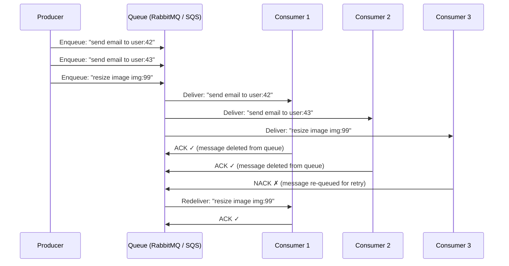
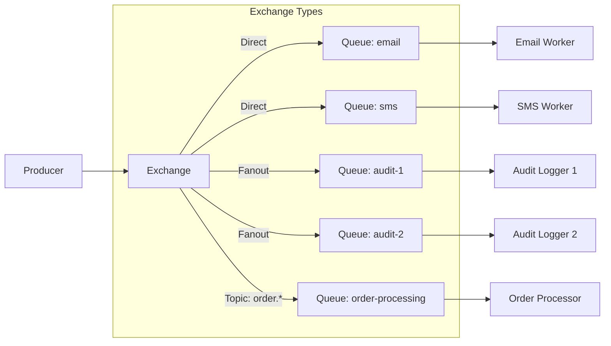
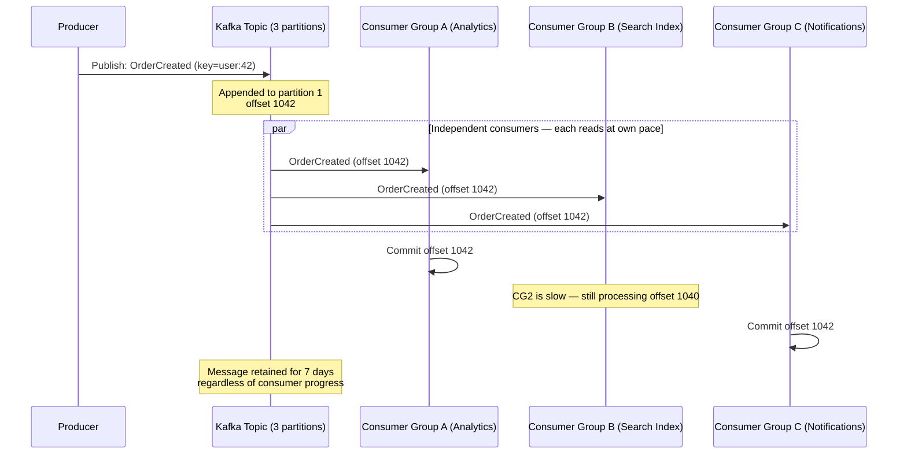
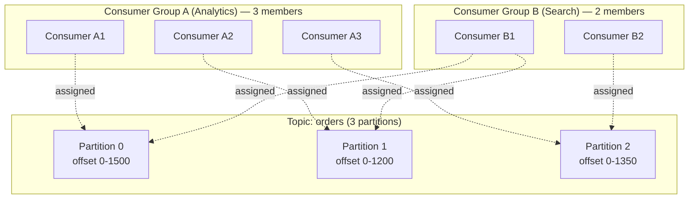
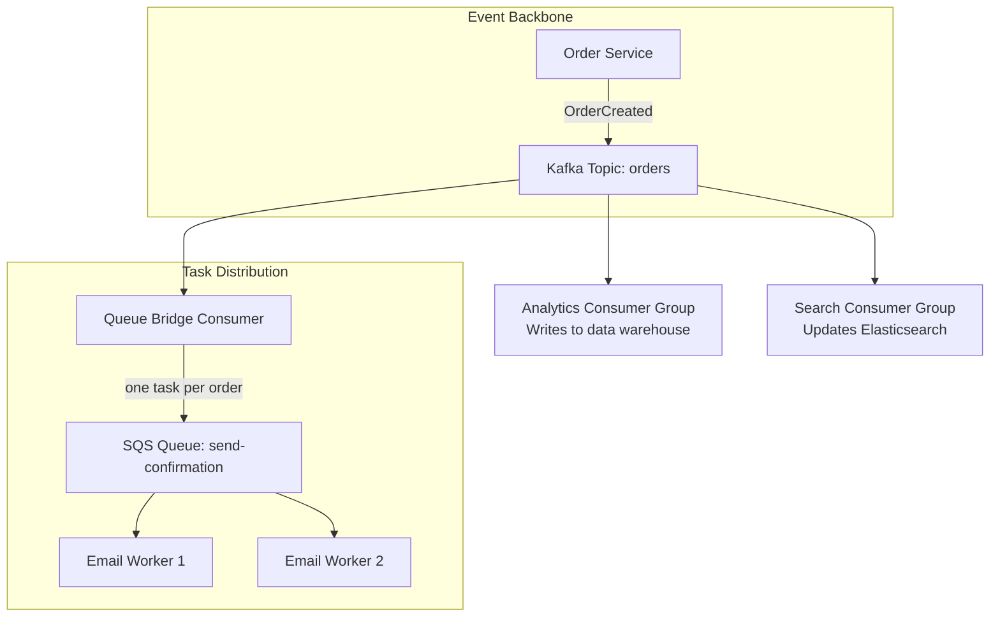

Message queues and event streams both decouple producers from consumers, but they have fundamentally different semantics. A **message queue** distributes work — each message goes to exactly one consumer and is deleted after acknowledgement. An **event stream** is a persistent log — messages are retained, and multiple independent consumers can each read the entire stream at their own pace.

Choosing the wrong one causes architectural pain: a queue where you need fan-out means duplicating messages to N queues; a stream where you need single-consumer task processing means building consumer-group coordination that a queue gives you for free.

## Message Queue (RabbitMQ, SQS)

A message queue is designed for **work distribution**: a producer enqueues a task, and exactly one consumer dequeues and processes it.



### Key Properties

| Property | Behavior |
|----------|----------|
| **Delivery** | Each message delivered to exactly one consumer (competing consumers pattern) |
| **Retention** | Message deleted after consumer ACK |
| **Ordering** | FIFO within a single queue (best-effort in SQS standard; strict in SQS FIFO) |
| **Replay** | Not possible — message is gone after ACK |
| **Scaling** | Add more consumers to process faster (horizontal work distribution) |
| **Back-pressure** | Queue depth grows when consumers are slow — natural buffer |

### RabbitMQ Specifics

RabbitMQ adds **exchanges** between producers and queues, supporting multiple routing patterns:



| Exchange Type | Routing | Use Case |
|--------------|---------|----------|
| **Direct** | Routes to queue whose binding key exactly matches the routing key | Task routing by type (`email`, `sms`, `push`) |
| **Fanout** | Broadcasts to all bound queues (ignores routing key) | Notifications to all services |
| **Topic** | Pattern matching on routing key (`order.*`, `#.error`) | Event filtering by category |
| **Headers** | Routes based on message header attributes | Complex routing logic |

RabbitMQ also supports **publisher confirms** (producer gets ACK when message is durably written) and **consumer prefetch** (limit how many unacked messages a consumer holds — prevents one slow consumer from hoarding all messages).

### SQS Specifics

| Feature | SQS Standard | SQS FIFO |
|---------|-------------|----------|
| **Throughput** | Unlimited | 300 msg/s (3000 with batching) |
| **Ordering** | Best-effort (may reorder) | Strict FIFO per message group |
| **Deduplication** | None (at-least-once) | Content-based or explicit dedup ID (exactly-once within 5-min window) |
| **Visibility timeout** | Message hidden from other consumers while being processed; returned to queue on timeout | Same |
| **Dead Letter Queue** | After N failed attempts, message moved to DLQ for investigation | Same |

SQS FIFO's **message group ID** allows parallel processing of independent groups while maintaining order within each group:

```
Message Group: "user:42" → messages for user 42 processed in order
Message Group: "user:43" → messages for user 43 processed in order (independently)

Both groups process in parallel, each group strictly ordered.
```

## Event Stream (Kafka, Kinesis)

An event stream is a **persistent, ordered, append-only log**. Messages are not deleted after consumption — they're retained for a configurable period (or forever). Multiple consumers can read the same data independently.



### Key Properties

| Property | Behavior |
|----------|----------|
| **Delivery** | Each consumer group gets every message; within a group, each partition is consumed by one member |
| **Retention** | Configurable: time-based (7 days default) or size-based; can be infinite (compacted topics) |
| **Ordering** | Strict within a partition; no ordering across partitions |
| **Replay** | Reset consumer offset to any point → re-process historical events |
| **Scaling** | Add partitions (parallelism = min(partitions, consumers in group)) |
| **Back-pressure** | Consumer lag grows (offset falls behind head); Kafka stores messages regardless |

### Kafka Partitioning and Consumer Groups



**Within a consumer group:** Each partition is assigned to exactly one consumer. If there are more consumers than partitions, some consumers sit idle. If a consumer dies, its partitions are **rebalanced** to surviving consumers.

**Across consumer groups:** Each group maintains its own offset per partition. Group A's progress is completely independent of Group B's. This is how Kafka achieves fan-out without duplicating messages.

### Kafka Retention and Replay

```
Topic: orders, retention = 7 days

Partition 0:
  offset 0 ─────── offset 500 ─────── offset 1500
  │                 │                  │
  (7 days ago)      (3 days ago)       (now, head)
  ↑                                    ↑
  expired, will be    Consumer Group A: offset 1490 (nearly caught up)
  garbage collected   Consumer Group B: offset 800 (3 days behind — replaying)
```

**Replay use cases:**
- Bug fix: replay events through a corrected consumer to rebuild a search index
- New service: a new consumer group starts from offset 0, processing all historical events
- Disaster recovery: rebuild a downstream database from the event stream

### Compacted Topics

For topics where you only care about the **latest value per key** (not the full history), Kafka supports **log compaction**:

```
Before compaction:
  offset 1: key=user:42, value={name:"Alice"}
  offset 2: key=user:43, value={name:"Bob"}
  offset 3: key=user:42, value={name:"Alice Smith"}   ← newer for user:42
  offset 4: key=user:43, value=null                    ← tombstone (delete)

After compaction:
  offset 3: key=user:42, value={name:"Alice Smith"}    ← latest value retained
  (user:43 deleted — tombstone processed)
```

Used for: Kafka Connect source connectors (CDC snapshots), Kafka Streams changelog topics, configuration distribution.

## Head-to-Head Comparison

| Dimension | Message Queue (RabbitMQ/SQS) | Event Stream (Kafka/Kinesis) |
|-----------|-------|--------|
| **Mental model** | Task inbox — work items consumed and deleted | Append-only log — events retained and replayed |
| **Consumer semantics** | Competing consumers (one takes the message) | Consumer groups (each group gets all messages) |
| **Retention** | Until ACK'd | Time/size-based or indefinite |
| **Replay** | No | Yes (reset offset) |
| **Ordering** | Per-queue FIFO | Per-partition FIFO |
| **Fan-out** | Requires exchange fanout / SNS → SQS | Native via consumer groups |
| **Throughput** | Thousands–tens of thousands msg/s | Millions msg/s (per cluster) |
| **Latency** | Sub-millisecond (RabbitMQ) | Low milliseconds (Kafka batch optimization) |
| **Message size** | Flexible (RabbitMQ: configurable; SQS: 256KB) | Default 1MB (configurable) |
| **Complexity** | Low (RabbitMQ) / Very low (SQS) | High (cluster ops, partitioning, rebalancing) |

## When to Use a Queue

Queues excel at **task distribution** — work that should be done exactly once by one worker.

| Use Case | Why Queue |
|----------|----------|
| **Background jobs** (send email, generate PDF, resize image) | One worker processes one job. Job is done after ACK. No replay needed. |
| **Rate limiting / throttling** | Queue buffers bursts; consumers pull at their own pace |
| **Request-reply** (RPC over messaging) | RabbitMQ's reply-to + correlation-id pattern; temporary response queue |
| **Delayed processing** | SQS delay queues (up to 15 min); RabbitMQ dead-letter exchange with TTL |
| **Work that must not duplicate** | Queue's single-consumer delivery prevents two workers processing the same task |

## When to Use a Stream

Streams excel at **event distribution** — facts about what happened that multiple systems need to react to.

| Use Case | Why Stream |
|----------|-----------|
| **Audit log / event sourcing** | Immutable, ordered record of everything that happened. Replay to rebuild state. |
| **Fan-out to multiple systems** | Order created → analytics, search indexer, notification service, fraud detection — each reads independently |
| **Real-time analytics** | Kafka Streams / Flink consume events for windowed aggregations, anomaly detection |
| **Change Data Capture (CDC)** | Debezium → Kafka → multiple downstream consumers (cache invalidation, search sync, data lake) |
| **Inter-service communication (event-driven architecture)** | Services publish domain events; other services consume what they need |

## Hybrid Patterns

Most production systems use **both** — Kafka for the durable event backbone, queues for specific work distribution.



**Pattern: Kafka → SQS bridge**

Kafka retains the event and fans it out to all interested consumer groups. One of those consumers is a "bridge" that enqueues a task into SQS for work that needs single-consumer, exactly-once-delivery semantics (sending a confirmation email). The email workers pull from SQS — no risk of two workers sending the same email.

**Why not just use Kafka for everything?**
- Kafka consumers within a group already get per-partition single delivery — but rebalancing can cause duplicates (at-least-once)
- SQS visibility timeout + DLQ provides simpler retry/failure semantics for task processing
- SQS FIFO provides exactly-once within a 5-minute window with zero application code
- Operational simplicity: SQS is fully managed with no cluster to run

**Why not just use SQS for everything?**
- No replay — once consumed, the message is gone
- No fan-out without SNS → multiple SQS queues (complex topology)
- No consumer groups — each system needs its own queue with duplicated messages
- No ordering guarantees in standard SQS; FIFO has throughput limits

## Delivery Guarantees Across Both

| System | Default Guarantee | Exactly-Once Option |
|--------|------------------|-------------------|
| **RabbitMQ** | At-least-once (publisher confirms + consumer ACK) | No native exactly-once; use idempotent consumers |
| **SQS Standard** | At-least-once (may deliver duplicates) | No |
| **SQS FIFO** | Exactly-once (dedup within 5-min window) | Yes (built-in) |
| **Kafka** | At-least-once (default) | Idempotent producer + transactions (within Kafka) |
| **Kinesis** | At-least-once | No native exactly-once; use idempotent consumers |

Regardless of the system, **design consumers to be idempotent**. Network failures, rebalancing, and retries can always cause duplicates at the application level — even when the broker provides exactly-once semantics internally.


**Interview framing:** "For the notification fan-out, I'd use Kafka — one OrderCreated event is consumed independently by analytics, search, and notifications. For the actual email sending, I'd bridge from Kafka to SQS — that gives us single-consumer delivery with dead-letter queues for failed sends. Kafka handles the durable event log and fan-out; SQS handles the task distribution with simpler retry semantics."

