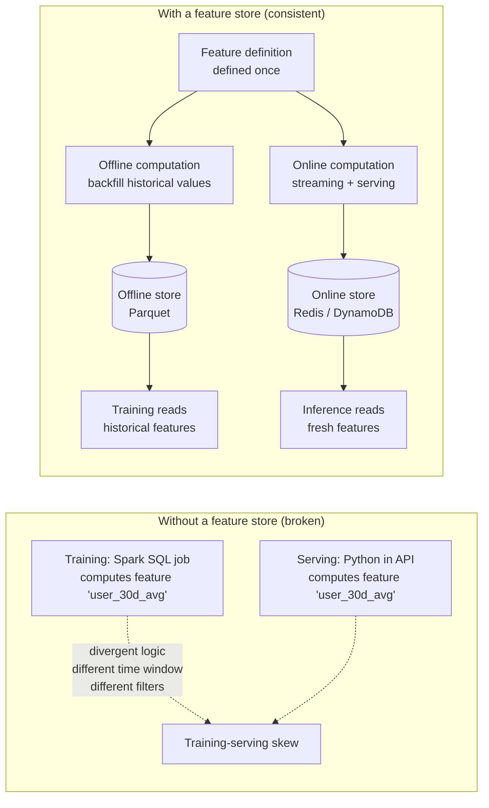
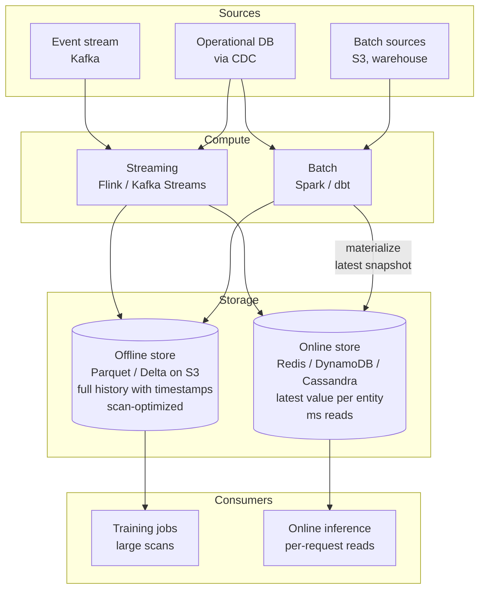
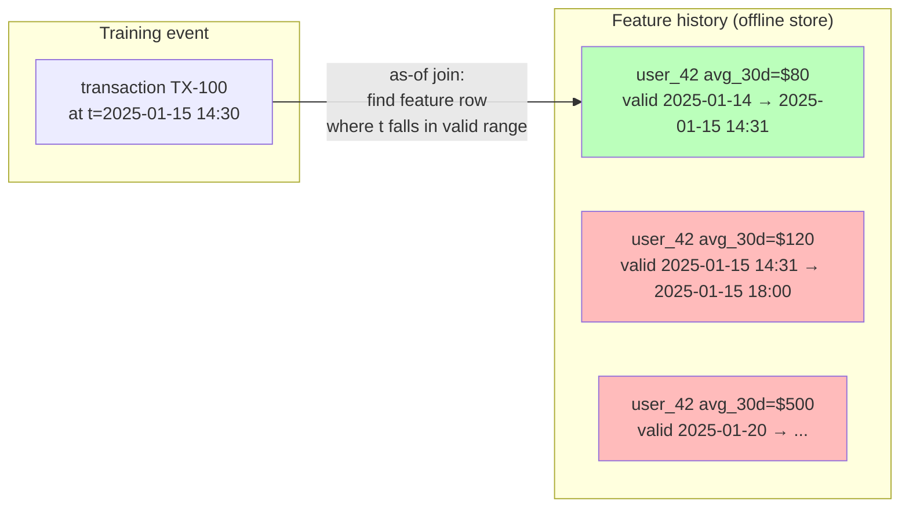
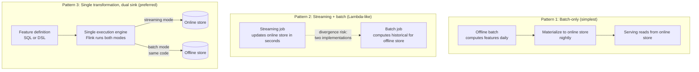
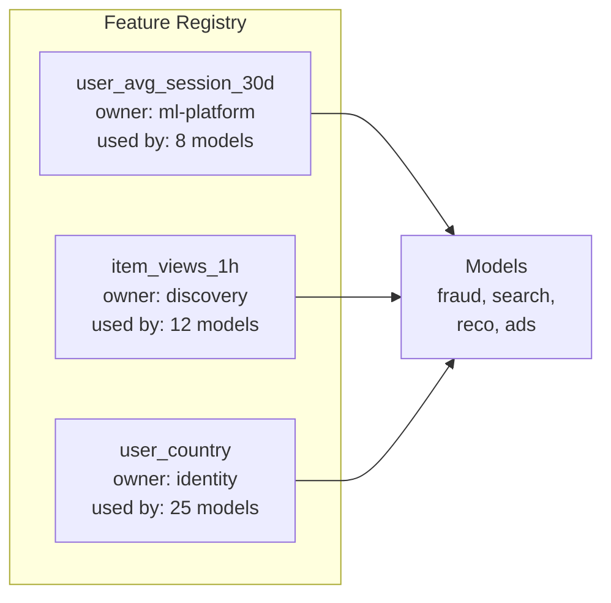
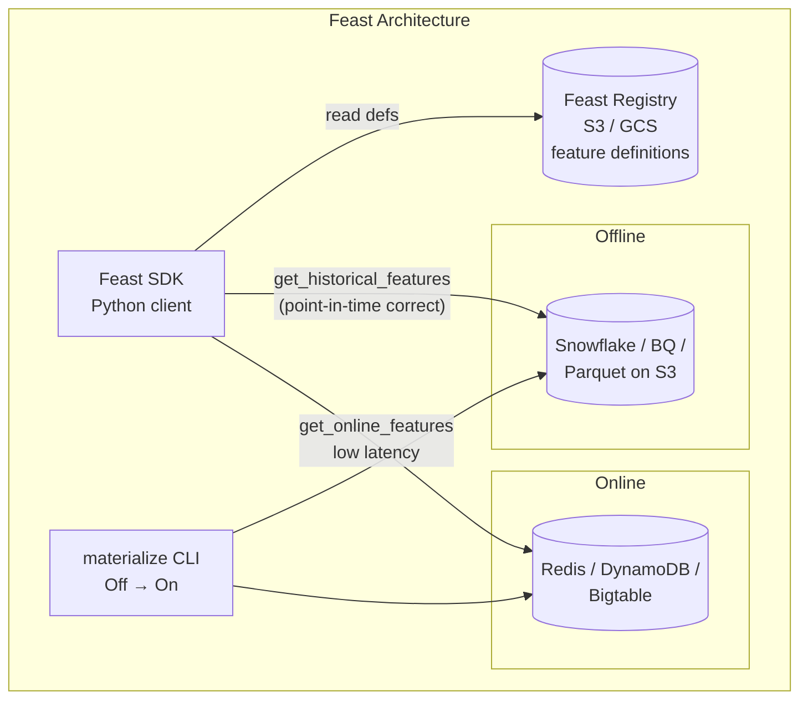

A data scientist trains a fraud model offline using a feature called `user_avg_txn_amount_30d` computed in a Spark job over historical data. Accuracy in offline evaluation: 94%. The model ships to production and a backend engineer rewrites the same feature in Python against a real-time stream — but they use a 30-day window from `transaction.created_at` instead of `transaction.completed_at`, and they include refunded transactions where the offline pipeline excluded them. Production accuracy drops to 78%. **The model is fine; the features it sees in production are not the features it was trained on.** This is **training-serving skew**, and it is the single most common cause of broken ML in production. A feature store is the system that solves it: a single place where features are defined once, computed consistently, and served identically to training and to inference.

## What a Feature Store Solves



A feature store provides four things:

1. **A registry** — features are named, versioned, and have an authoritative definition.
2. **An offline store** — historical feature values for training (rows × features × timestamp).
3. **An online store** — the latest feature value per entity, served at low latency for inference.
4. **A guarantee** — the *definition* of a feature is identical across training and serving, so the model sees the same distribution at both.

## The Two-Store Architecture

The fundamental insight: **training and serving have opposite access patterns.** Training scans millions of rows; serving needs one row in a millisecond. No single storage system is good at both.



### Online Store

Holds the **latest value of each feature per entity** (per user, per item, per session). Optimized for point reads.

| Property | Detail |
|----------|--------|
| **Access pattern** | `GET (entity_id, feature_name)` → latest value |
| **Latency target** | p99 < 10ms (often <2ms with co-located reads) |
| **Throughput** | 100K–1M reads per second |
| **Storage layout** | Key-value or wide-column; key = entity_id, value = feature row |
| **Storage choices** | Redis (lowest latency), DynamoDB (managed, scales), Cassandra (high write throughput), Bigtable |
| **Sizing** | One row per entity per feature view; for 100M users × 100 features × 200 bytes = 2 TB |

```python
# At inference time the API fetches features for one entity
features = online_store.get_online_features(
    feature_refs=[
        "user_features:avg_session_duration_7d",
        "user_features:txn_count_24h",
        "user_features:days_since_last_login",
    ],
    entity_rows=[{"user_id": 42}],
)
# Returns one row, ~5ms p99
```

### Offline Store

Holds **full history of feature values with timestamps** for training and backfills. Optimized for scans.

| Property | Detail |
|----------|--------|
| **Access pattern** | Scan many entity-rows × feature columns × historical time range |
| **Latency target** | Minutes (training jobs run for hours; per-row latency irrelevant) |
| **Storage layout** | Columnar files (Parquet, Delta, Iceberg) on object storage, partitioned by date |
| **Storage choices** | S3 + Parquet, Delta Lake, Apache Iceberg, BigQuery, Snowflake |
| **Sizing** | Full history is large: 100M users × 100 features × daily values × 2 years = 100s of TB; columnar compression mitigates |

## Point-in-Time Correctness

This is the single most important correctness property a feature store must guarantee — and the easiest to silently get wrong.

### The Label Leakage Problem

You're training a fraud model. For each historical transaction (with a known `is_fraud` label), you want to attach features like "user's average transaction amount over the prior 30 days."

```
Naive (buggy) approach:
  Join training data with current feature values

Example training row:
  transaction_id: TX-100
  transaction_time: 2025-01-15 14:30
  is_fraud: true (decided after investigation completed on 2025-01-20)

  Joined with TODAY's feature value:
    user_avg_txn_30d = $500   ← computed using ALL transactions through today

  But on 2025-01-15 at 14:30, the TRUE feature value was $80
  → Model trains on $500, sees $80 in production → garbage predictions
```

The model has been trained on **information from the future** — features that include the very transaction it's trying to predict, plus other events that hadn't happened yet at prediction time.

### The Fix: As-Of Joins

For each training row at time `t`, the feature store joins to **the feature value as it was at time `t`** — not the latest value, and not a value computed using events after `t`.



The offline store keeps a **timeline** for each (entity, feature) pair, recording when each value was computed. The as-of join finds the value that *was current* at the training event's timestamp — never a future value.

```python
# Conceptual pseudocode for an as-of join
def as_of_join(training_events, feature_history):
    for event in training_events:
        # Find feature row where event.t is in [valid_from, valid_to)
        feature_row = feature_history.find_valid_at(
            entity_id=event.entity_id,
            timestamp=event.event_time,
        )
        yield merge(event, feature_row)
```

### Real Implementations

- **Feast `get_historical_features`:** takes a DataFrame of (entity_id, event_timestamp) rows and returns the same DataFrame enriched with feature values that were valid at each event_timestamp.
- **Tecton:** automatically performs as-of joins through its DSL — feature pipelines are defined declaratively with their valid-time semantics.
- **Spark / dbt with explicit logic:** use a `LEFT JOIN ... ON entity_id = entity_id AND feature.valid_from <= event_time < feature.valid_to`.


**Label leakage is silent.** A model with leakage shows excellent offline metrics (AUC 0.99 is a classic red flag) and disastrous production performance. Always sanity-check any feature whose offline computation could include the prediction event itself or events from after the prediction time.


## Training-Serving Consistency

Even with point-in-time correctness, you can still have skew if the **transformation logic** differs between offline batch and online streaming.

### Three Consistency Patterns



| Pattern | Pros | Cons | When to use |
|---------|------|------|-------------|
| **Batch-only** | Simplest; one implementation | Features can be 24h stale | Slow-changing features (demographics, lifetime aggregates) |
| **Streaming + batch (separate impls)** | Fresh online features | Two codebases — high skew risk | When you must, but invest heavily in tests |
| **Single engine, dual sink** | One implementation; same code path | Engine complexity (Flink with batch + stream) | Modern best practice; what Tecton, Chronon, etc. provide |

### Defensive Practices

| Practice | What it catches |
|----------|----------------|
| **Schema enforcement** | Type mismatches between training and serving |
| **Logged training-serving comparisons** | Periodically log inference features and compare statistics to training distribution |
| **Shadow scoring** | Run the model offline against the production feature stream and compare to online inference logs |
| **Feature unit tests** | Test the feature definition with fixed inputs → fixed expected outputs in CI |
| **Distribution monitoring** | Alert on drift in feature mean / variance / null rate |

## Feature Freshness vs. Cost

How often you recompute a feature is a per-feature design decision with real cost implications.

| Feature | Required freshness | Compute cadence | Storage |
|---------|-------------------|-----------------|---------|
| User country | Months (rarely changes) | Daily batch | Online + offline |
| User lifetime spend | Hours OK | Hourly batch | Online + offline |
| Transactions in last 5 minutes | Seconds (fraud!) | Streaming, real-time | Online + offline (snapshot to offline) |
| Item popularity (last hour) | 5–15 min | Micro-batch | Online + offline |
| Embedding from a heavy model | Daily | Daily batch over GPUs | Offline; refresh online during deploy |

**The cost lever:** running streaming aggregations on millions of events per second is 10–100× more expensive per feature than running a daily batch. Default to batch; promote to streaming only when freshness drives measurable model quality.

## Feature Reuse and Governance



A mature feature store is also a **discovery and governance layer**:

- **Discoverability:** searchable catalog of all defined features with descriptions, owners, freshness, and downstream consumers.
- **Lineage:** which raw sources flow into a feature; which models consume it.
- **Deprecation:** safely retire a feature without breaking dependent models — registry shows blast radius.
- **Access control:** sensitive features (PII-derived) can be gated; consumers track who's reading them.
- **Cost attribution:** know which model is paying for which streaming aggregation.

## Architectures by Tool

### Feast (Open Source)



- **Lightweight** — runs on your existing warehouse + KV store; no separate cluster.
- **No transformations** — Feast doesn't compute features; you bring transformed data in. (Though `feast.transform` and on-demand transforms are emerging.)
- Best for teams that already have Spark/dbt pipelines and want a serving layer + registry on top.

### Tecton (Managed)

- **End-to-end** — owns the transformation engine (built on Flink + Spark) and both stores.
- **Declarative DSL** — define a feature once; Tecton generates batch + streaming pipelines automatically.
- **Strong point-in-time correctness** — as-of joins built in.
- Best for teams that want to outsource the full feature platform.

### Vertex AI Feature Store / SageMaker Feature Store

- **Cloud-native managed services** — tight integration with the rest of GCP / AWS ML stacks.
- **Online store** managed (Bigtable / DynamoDB-backed); offline is BigQuery / S3 Parquet.
- Best for teams already deep in one cloud with simpler feature engineering needs.

### Chronon (Airbnb open source) / In-house systems

- Often built on Spark + Flink + Kafka + Redis + Hive/Delta.
- "Single definition, dual execution" pattern with Flink running batch and streaming modes from the same SQL.
- Best for orgs at scale where managed services are too expensive or limiting.

| Tool | Hosting | Computes features? | Strongest for |
|------|---------|-------------------|--------------|
| **Feast** | Self-hosted, lightweight | No (BYO pipelines) | Teams with mature data infra wanting registry + serving |
| **Tecton** | Managed | Yes (Flink + Spark) | Full-stack managed feature platform |
| **Vertex AI / SageMaker** | Managed (cloud-native) | Limited | Cloud-locked teams |
| **Chronon (Airbnb)** | Self-hosted | Yes (Flink + Spark) | Large orgs needing single-definition consistency |

## When You Don't Need a Feature Store

| Scenario | Better alternative |
|----------|-------------------|
| Single model, no real-time inference | Just a Spark job + Parquet snapshots |
| Few features, all computed in the model server at request time | In-process feature transformations |
| One team, one data warehouse, no streaming | dbt models materialized to a serving table |
| Prototype / research | Skip the feature store; introduce when you have ≥3 models sharing features |

The feature store earns its complexity at **organizational scale**: many models, many teams, many features, real-time inference, and the need to keep training and serving consistent across all of them.


**Interview tip:** When asked about feature stores, lead with the problem they solve: "The point of a feature store is to eliminate training-serving skew — features are defined once and served identically to both training and inference. Architecturally there are two stores: an offline store like Parquet on S3 holds full history with timestamps for training, and an online store like Redis or DynamoDB holds the latest value per entity for low-latency inference. The critical property is point-in-time correctness: when training, the store joins each labeled event to the feature value that was current at that event's timestamp, never a future value — otherwise you get label leakage and a model that looks great offline but fails in production. The cleanest implementations use a single execution engine like Flink that runs the same feature definition in both batch and streaming modes, so offline and online values can never diverge. Feast is the lightweight self-hosted option, Tecton is the full managed platform; cloud providers offer Vertex AI Feature Store and SageMaker. The feature store earns its keep when you have multiple models sharing features and need consistency across teams."

