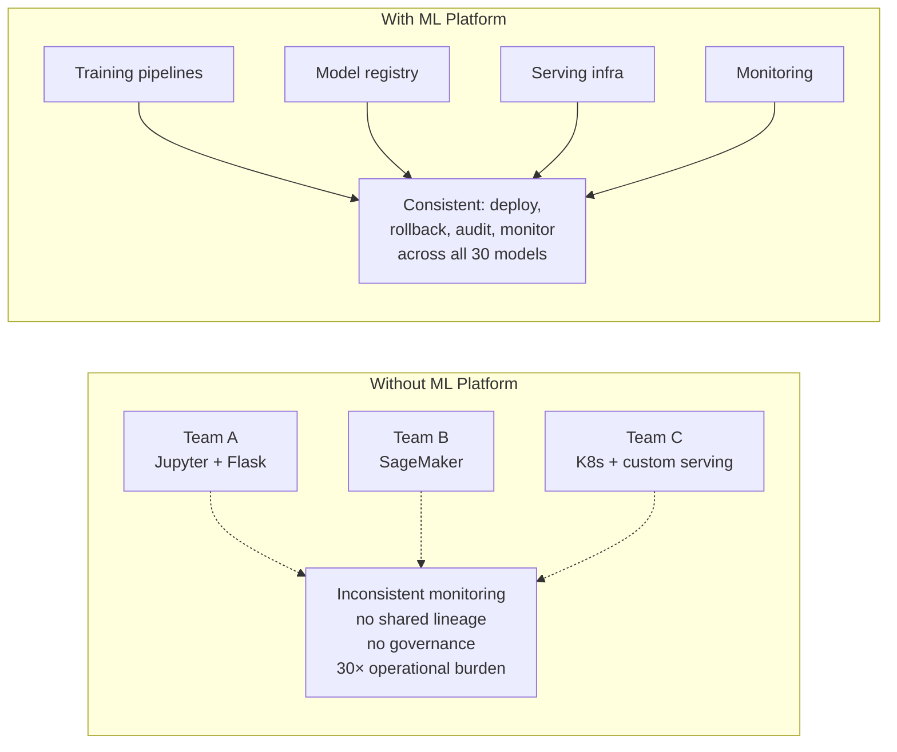
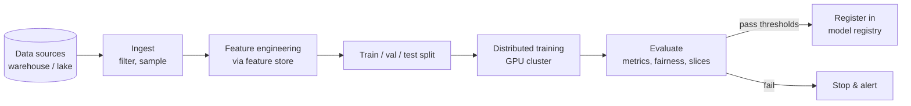
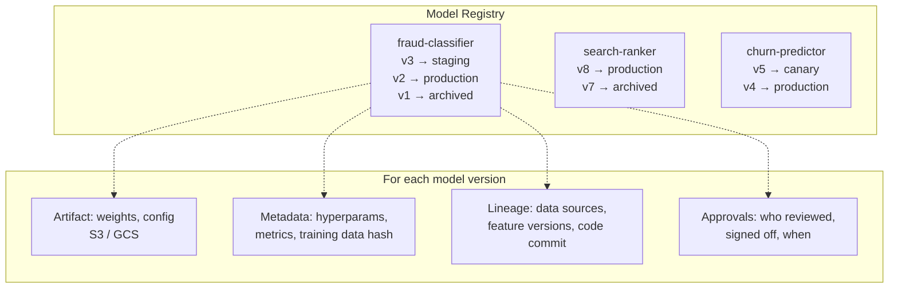
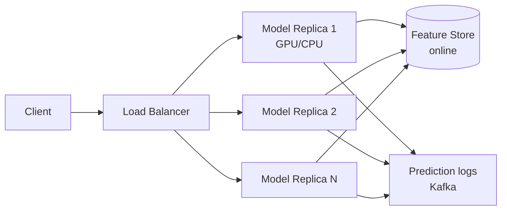
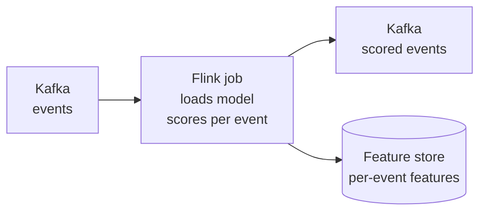
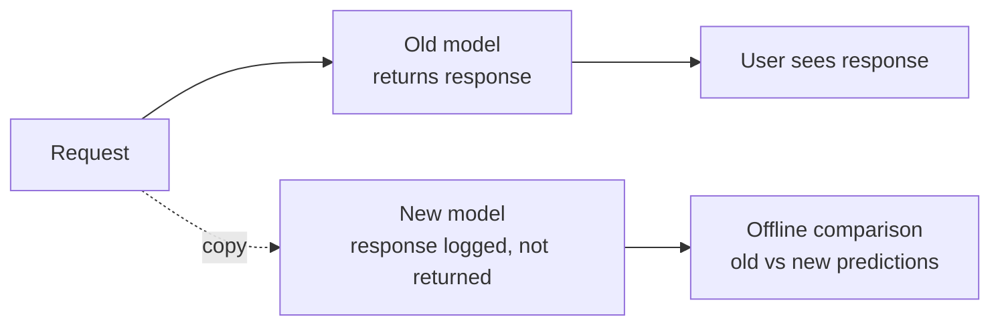
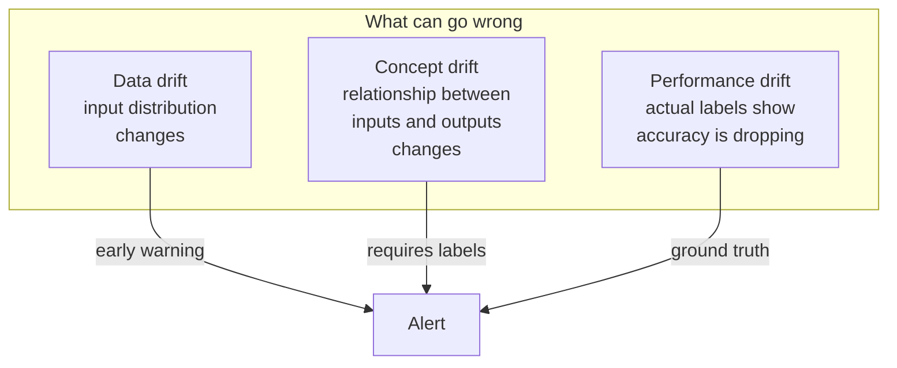
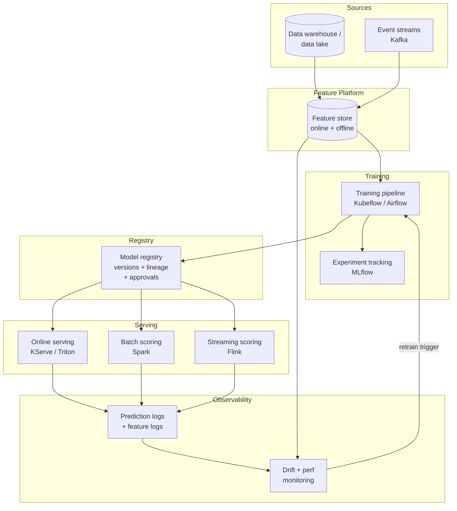

A company has 30 ML models in production: a fraud classifier, a recommender, a search ranker, a churn predictor, a dozen of risk scores, several LLM-based summarizers. Each was built by a different team. One uses Jupyter notebooks for training; another uses a custom Airflow DAG. One serves through a Flask app on EC2; another through SageMaker; another through a Kubernetes deployment of FastAPI. Each team rebuilt monitoring, deployment, model versioning, and feature pipelines from scratch. **Now a regulator asks: "Show me which version of which model produced the prediction that denied this loan three months ago, and which training data it used."** Nobody can answer. **An ML platform is the shared infrastructure that turns ad-hoc model development into a repeatable, governed, observable process** — so that training, serving, monitoring, and rollout look the same regardless of which team or model.

## What an ML Platform Provides



A platform provides **shared infrastructure** for the lifecycle stages every model goes through:

| Stage | What the platform provides |
|-------|---------------------------|
| **Data → features** | Feature store with shared definitions, point-in-time correctness |
| **Training** | Pipeline orchestration, distributed compute, experiment tracking, reproducibility |
| **Registration** | Versioned model registry with metadata, lineage, approval workflows |
| **Deployment** | Standard serving runtimes (online, batch, streaming) with canary, shadow, rollback |
| **Monitoring** | Drift detection, performance tracking, alerting — same dashboards for every model |
| **Governance** | Lineage graphs, approval gates, audit logs for compliance |

## Training Pipeline

A reproducible, automated path from data to a trained model artifact.



### Orchestration

| Tool | Strengths | Best for |
|------|-----------|----------|
| **Airflow** | Mature, huge ecosystem, simple DAG model | Generic data + ML pipelines; what most companies start with |
| **Kubeflow Pipelines** | Kubernetes-native, ML-aware (artifact tracking, caching), supports parallel trials | Kubernetes shops; large training jobs |
| **Metaflow (Netflix)** | Pythonic, opinionated, excellent UX for data scientists | Small/medium teams wanting low friction |
| **Argo Workflows** | Lightweight Kubernetes-native DAG engine | Teams already on K8s without Kubeflow's complexity |
| **Vertex AI Pipelines / SageMaker Pipelines** | Managed; integrate with cloud ML services | Cloud-native teams |

### Reproducibility Requirements

A trained model is reproducible only if **all of these are versioned**:

```
For a single training run, the registry records:
  - Code version (git commit hash + branch)
  - Data version (data lake snapshot or query as-of date)
  - Feature definitions version (from feature store registry)
  - Hyperparameters
  - Random seed
  - Container image (ML libraries, CUDA version, OS)
  - Hardware (GPU type, count)
  - Output: model artifact + evaluation metrics + run logs
```

Without all of these, "rerun this training a year from now and get the same model" is impossible — and impossible reproduction means impossible debugging.

### Experiment Tracking

| Tool | Strengths |
|------|-----------|
| **MLflow** | Open source, language-agnostic, integrates with anything; tracks runs, metrics, artifacts |
| **Weights & Biases** | Polished UX, strong visualization, hosted SaaS |
| **Neptune.ai** | Similar to W&B; flexible self-hosting |
| **Comet** | Strong on real-time dashboards |

The pattern is consistent: log every experiment's hyperparameters, metrics, and artifacts; compare runs visually; promote winners.

## Model Registry

The single source of truth for every model artifact in the organization.



### What a Registry Tracks

| Field | Why it matters |
|-------|---------------|
| **Model name + version** | Stable identifier downstream services pin to |
| **Stage** | `staging`, `canary`, `production`, `archived` — gates deployment |
| **Artifact location** | S3/GCS path to weights + config |
| **Metrics** | Offline: AUC, RMSE, fairness slices. Online: ongoing performance |
| **Lineage** | Which dataset, which feature versions, which code commit |
| **Hyperparameters** | Full training config |
| **Owner / approver** | Who built it, who approved promotion |
| **Container image** | Reproducible inference environment |
| **Schemas** | Input feature schema + output schema (so consumers can validate) |

### Promotion Workflow

```
Newly trained → staging
  ↓ (offline metrics pass + automated checks pass)
staging → canary (1–5% of traffic)
  ↓ (online metrics match offline; no guardrail regression)
canary → production (full traffic)
  ↓ (replaced by next version)
production → archived (kept for audit, not served)
```

Every transition is **logged with a reason and approver**, generating an audit trail. For regulated domains (lending, healthcare, hiring) this audit trail is a hard requirement.

### Tools

| Tool | Notes |
|------|-------|
| **MLflow Model Registry** | Open source, paired with MLflow tracking; common starting point |
| **Vertex AI Model Registry** | Managed on GCP; tight Vertex Pipelines integration |
| **SageMaker Model Registry** | Managed on AWS; integrated with SageMaker pipelines and endpoints |
| **In-house** | Many large orgs build a custom registry on top of Postgres + S3 to fit their governance needs |

## Model Serving

The runtime that turns a registered model into served predictions. Three serving modes cover almost every production model.

### Online Serving (Real-Time Inference)

Per-request prediction behind a REST or gRPC endpoint. Used for recommendations, fraud scoring, search, ads — anything user-facing.



| Concern | Approach |
|---------|----------|
| **Latency target** | p99 typically <100ms end-to-end; tighter for ads, looser for batch-like calls |
| **Throughput** | Horizontal scaling: more replicas; autoscale on QPS or queue depth |
| **Hardware** | CPU is fine for trees and small models; GPU for DNNs; specialized accelerators (TPU, Inferentia, Triton) for heavy DL |
| **Batching** | Dynamic micro-batching: collect requests for ~5–20ms, batch through one GPU forward pass — 10× higher throughput at slightly higher tail latency |
| **Frameworks** | TensorFlow Serving, TorchServe, NVIDIA Triton Inference Server, Seldon Core, KServe, BentoML, Ray Serve |
| **Caching** | Cache predictions for stable inputs; useful for content recos where the same user requests the same items repeatedly |

### Batch Serving (Offline Scoring)

Score millions of records on a schedule. Used for: nightly user segment refreshes, lookalike audience generation, ML-derived columns in the warehouse.

```python
# Conceptual: Spark batch scoring
df = spark.read.parquet("s3://data/users/")
df_with_features = df.join(feature_table, on="user_id")
predictions = model.transform(df_with_features)
predictions.write.parquet("s3://predictions/churn_score/dt=2025-05-02/")
```

| Concern | Approach |
|---------|----------|
| **Latency** | Hours acceptable |
| **Throughput** | Spark / Beam parallelism over partitions |
| **Cost** | Spot / preemptible instances; GPU only if model truly needs it |
| **Output** | Written to warehouse / lake; downstream services read snapshots |

### Streaming Serving (Per-Event Inference)

A streaming consumer applies the model to each event as it arrives. Used for: real-time fraud, content moderation triage, real-time personalization.



| Concern | Approach |
|---------|----------|
| **Latency** | Single-digit to tens of ms per event |
| **Model loading** | Loaded once into the streaming worker; refreshed on a schedule or via control message |
| **Scaling** | Partition events; scale streaming workers with partitions |
| **State** | Streaming engine maintains feature state (windowed aggregates) co-located with scoring |

### Choosing the Right Mode

| Need | Use |
|------|-----|
| User-facing prediction during a request | **Online** |
| Score-everyone, refresh occasionally | **Batch** |
| React to events with very low latency, every event scored | **Streaming** |
| Hybrid (most cases) | **Online + Batch** — batch produces stable snapshots; online layers personalization on top |

## Deployment Strategies

Replacing a production model is a high-risk operation. Four strategies, in order of safety:

### 1. Shadow Mode



Run the new model in parallel; **discard its output**. Log predictions and compare distributions to the production model. Catches:
- Latency regressions (new model too slow)
- Distributional drift (new model predicts very differently than old)
- Crashes / errors that wouldn't appear in offline eval

Costs 2× compute but is the safest first step. Run for a few days before any user-facing test.

### 2. Canary

Route 1–5% of traffic to the new model; the rest to the old one. Monitor:
- **Online metrics** (CTR, conversion, revenue per request) match offline expectations
- **Guardrails** (latency p99, error rate, fairness slices) don't regress
- **Sample ratio** is what was configured (sanity check)

Gradually increase: 5% → 10% → 25% → 50% → 100% over hours or days, depending on traffic volume needed for statistical significance.

### 3. A/B Test

Like canary, but **with a longer evaluation window** designed for hypothesis testing on a north-star metric. Typical: 50/50 split for 1–2 weeks.

| Strategy | Goal | Duration | Sample size |
|----------|------|----------|-------------|
| **Shadow** | "Does it work at all in prod?" | Hours–days | All traffic, output discarded |
| **Canary** | "Does it cause acute regressions?" | Hours–days | 1–10% |
| **A/B test** | "Does it move the north-star metric?" | 1–4 weeks | 50/50 typical |
| **Full rollout** | After A/B win | Permanent | 100% |

### 4. Rollback

Every promotion path must have a fast rollback. The previous model version stays warm in the registry; a single config change returns serving traffic to it.


**Rollback is the most underinvested part of ML deployment.** Teams build elaborate canary frameworks but discover at 3am that rolling back a model takes 30 minutes because the previous artifact isn't cached on the serving nodes. Rollback should be one config flip and effective within the time it takes a feature flag to propagate (seconds).


## Monitoring: Three Kinds of Drift

Models in production silently degrade. Detecting *why* requires monitoring three different things.



### 1. Data Drift (Input Distribution Drift)

The features the model sees at inference time differ from what it trained on. Doesn't require labels — just compare distributions.

| Metric | What it detects | Tools |
|--------|----------------|-------|
| **PSI (Population Stability Index)** | Numeric / categorical feature distribution shift; >0.2 is significant | Standard in finance; easy to compute |
| **KL divergence / JS divergence** | Distribution drift, more sensitive | More math; same idea |
| **Mean / variance / null rate per feature** | Cheap and catches obvious upstream breakage | Always log, always alert |
| **Schema check** | New column, missing column, type change | Catch immediately at the API boundary |

```
Example: PSI on `user_country` feature
  Training: US 60%, IN 20%, BR 10%, other 10%
  Production (week 4): US 30%, IN 50%, BR 5%, other 15%
  PSI = sum over buckets of (prod% - train%) × ln(prod% / train%) ≈ 0.4
  Alert: model trained mostly on US users now serves mostly IN users
```

### 2. Concept Drift (Output Drift)

The relationship between features and the label has changed — even with the same input distribution, the right answer is now different. Examples: a fraud pattern evolves, a price-elasticity model sees post-pandemic shopping behavior, an LLM's expected response changes after a UX update.

Detection requires **labels**, which usually arrive late. Proxies:
- Drift in the **predicted label distribution** (e.g., fraud rate predicted by model rises 3×)
- Drift in **prediction confidence** (model becomes less confident)
- A/B-tested **online metrics** (CTR, conversion) decline

### 3. Performance Drift (Ground Truth Available)

Once labels arrive (clicks, fraud confirmations, returns), measure accuracy directly.

| Metric | Use |
|--------|-----|
| **Accuracy / AUC / RMSE over rolling window** | Direct performance |
| **Calibration** | Are predicted probabilities accurate? P(model says 80% → actually true 80%)? |
| **Sliced metrics** | Performance on segments (region, age, device) — catches fairness regressions |
| **Latency p50/p95/p99** | Serving health |

### Alerting Discipline

| Alert | Severity |
|-------|----------|
| Schema mismatch / null rate spike | P0 — page immediately |
| Latency p99 regression | P1 — page during business hours |
| Data drift on critical feature (PSI > 0.2) | P2 — investigate within day |
| Sliced accuracy drop on protected group | P0 (legal/compliance) |
| Slow accuracy decay | P3 — retrain queue |

## End-to-End Architecture



The closed loop matters: **monitoring feeds back into retraining**. When drift is detected, a new training run is automatically triggered (or queued for human approval), and the cycle repeats.

## Build vs. Buy

| Component | Build it yourself | Use a managed service |
|-----------|-------------------|----------------------|
| **Feature store** | At very large scale or unusual semantics | Most teams: Feast or Tecton |
| **Training orchestration** | Rarely worth it | Airflow / Kubeflow / SageMaker Pipelines |
| **Model registry** | When governance is custom (regulated industries) | MLflow / Vertex AI / SageMaker |
| **Serving** | When latency / cost / hardware needs are extreme | KServe, Triton, BentoML, SageMaker Endpoints |
| **Monitoring** | When you need very specific metrics | Evidently, Arize, WhyLabs, Fiddler |

**Rule of thumb:** for the first 5–10 models, lean entirely on managed/open-source pieces wired together. Build custom platform components only when a specific pain point can't be solved by configuration of existing tools.

## Production Examples

| Company | Platform notes |
|---------|---------------|
| **Uber Michelangelo** | Pioneer of the in-house ML platform — feature store, training, registry, serving, monitoring as one product |
| **Airbnb Bighead / Chronon** | Strong feature consistency; Chronon enforces single-definition batch + streaming |
| **Meta FBLearner Flow** | Workflow-graph training; one of the earliest internal ML platforms |
| **Netflix Metaflow + custom serving** | Very pythonic training UX; custom Lambda/EC2 serving for personalization |
| **Spotify Hendrix** | Built on Kubeflow + Beam; emphasis on standardized monitoring |
| **Google Vertex AI / TFX** | Managed equivalent of internal "TFX" used inside Google |


**Interview tip:** Frame the ML platform around **what can go wrong without one** and the **lifecycle stages it standardizes**. Say: "An ML platform turns one-off model development into a repeatable governed process. The key components are a training pipeline (orchestrated in Kubeflow or Airflow) that pulls features from a feature store and produces a versioned artifact, a model registry that records the artifact along with its lineage — code commit, data snapshot, feature versions, hyperparameters, and approver — so any production prediction can be traced back to its origin, and a serving layer that supports online (real-time, KServe / Triton), batch (Spark scoring jobs), and streaming (Flink consumers) modes from the same registered artifact. Deployment uses shadow mode first to catch latency or distributional regressions, then canary at 1–5% of traffic, then a 1–2 week A/B test before full rollout, with one-click rollback. Monitoring tracks three kinds of drift: data drift via PSI on input features, concept drift via prediction distribution shifts, and performance drift via accuracy on labels once they arrive — with alerting that pages on schema breakage or fairness regressions and feeds back into automated retraining triggers. The platform earns its complexity once you have several production models — one team's bespoke setup is fine; thirty teams' bespoke setups are an audit and outage waiting to happen."


## Test Your Understanding


**Shadow mode (dark launch) runs the new model in parallel with the current production model, scoring every request with both, but only serving predictions from the current model.** The new model's predictions are logged but not acted upon.

After 1-3 days in shadow mode, compare:
1. **Prediction distribution:** Does the new model's output distribution match the old model's? A sudden shift in the score distribution signals a problem.
2. **Latency:** Does the new model meet the P99 latency SLA?
3. **Disagreement rate:** How often do the two models disagree? High disagreement on known-good cases = regression.

**The deployment pipeline should enforce:** shadow mode (1-3 days) → canary (1-5% traffic, 1-2 days) → A/B test (50/50, 1-2 weeks with statistical significance) → full rollout. Each stage has automated gates: if the false positive rate exceeds threshold, the pipeline halts and rolls back automatically.



**Data drift or concept drift.** Two common causes:

1. **Data drift:** The distribution of input features has shifted. Example: a new marketing campaign drives a different user demographic; feature distributions (age, location, device) no longer match what the model was trained on. Detect via **Population Stability Index (PSI)** on input features — alert when PSI > 0.2.

2. **Concept drift:** The relationship between features and labels has changed. Example: user preferences shifted (seasonal trends, cultural events). The same features now predict different outcomes. Detect by monitoring **prediction-to-label agreement** once labels arrive (e.g., clicks within 24 hours of recommendation).

**Platform requirements:**
- Compute PSI daily on all input features; alert on drift.
- Track prediction distribution shifts (mean, variance, percentiles) in real-time.
- Trigger automated retraining when drift exceeds thresholds.
- Maintain a "freshness SLA" per model (e.g., retrain weekly for recommendation, daily for fraud).



**Schema validation at the serving boundary.** The platform must enforce:

1. **Named features, not positional.** Never reference features by column index. Use a feature store or feature schema that maps feature names to values. The serving pipeline requests `user_age` by name, not by position.
2. **Schema contract in the model registry.** When a model is registered, its expected input schema (feature names, types, ranges) is stored as metadata. At serving time, the infrastructure validates that the incoming feature vector matches the registered schema before passing it to the model.
3. **Type and range checks.** If `user_age` is expected to be an integer in [0, 150] and the serving pipeline sends the string "US", the request should fail loudly, not silently produce garbage predictions.

**The one-click rollback** the platform provides is the immediate mitigation: revert to the previous model version while the schema issue is fixed. Without it, the 0.5% error rate continues for hours while engineers debug.

