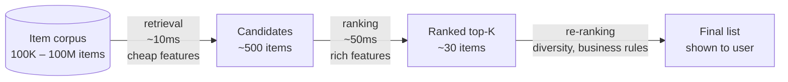
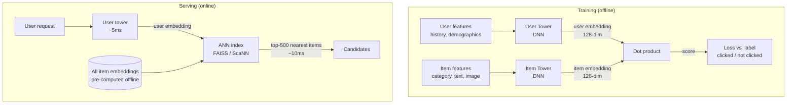
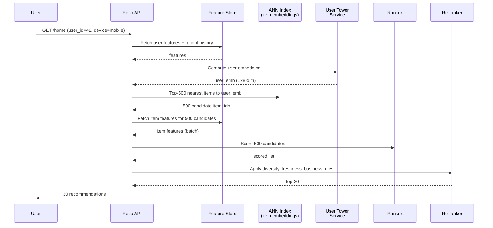
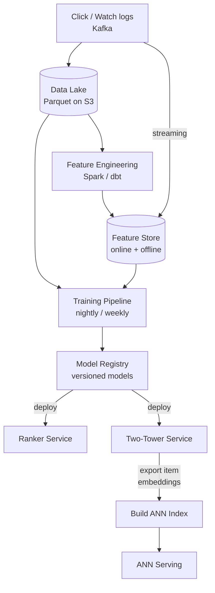

A user opens Netflix. From a catalog of 100,000 titles, the home page shows 30 recommendations — and 80% of what people watch comes from these recommendations. The system must decide *which 30 of 100,000* in under 200ms, personalized to this specific user, against this specific time of day, on this specific device. **Scoring all 100,000 titles with a heavy ML model on every page load is impossible** — even at 1ms per scoring call, that's 100 seconds. The fundamental architectural pattern that makes recommendation feasible is the **two-stage funnel: retrieval narrows the corpus, ranking sorts the survivors.**

## The Two-Stage Architecture



| Stage | Input size | Output size | Model complexity | Latency budget | Optimizes for |
|-------|-----------|-------------|------------------|----------------|---------------|
| **Retrieval (candidate gen)** | Millions of items | ~500–1000 | Cheap: ANN lookup, embedding similarity, simple rules | <20ms | Recall — don't miss good items |
| **Ranking** | ~500 candidates | ~30–100 | Heavy: gradient-boosted trees or DNN with hundreds of features | <100ms | Precision — order them well |
| **Re-ranking / policy** | ~30 ranked | ~30 final | Rules + light models | <10ms | Diversity, freshness, fairness, business constraints |

**Why two stages?** A heavy ranking model with rich features (user history, item metadata, context) is too slow to apply to millions of items. A cheap retrieval model can shortlist reasonable candidates in milliseconds, leaving the heavy model to do precise ordering on a small set. This is the same divide-and-conquer pattern as search: an inverted index does retrieval, BM25 + learning-to-rank does ordering.

## Retrieval Stage

The job of retrieval is to take a user (and context) and produce a few hundred candidate items from a corpus that may be millions or billions of items, with high recall and very low latency.

### Approach 1: Two-Tower Embedding Model (Modern Default)

Train a neural network with **two towers** — one that maps users to a 128-dimensional embedding, another that maps items to the same 128-dimensional space — such that the dot product of (user, item) embeddings predicts engagement (click, watch, purchase).



**Why this is fast:**
- **Item embeddings are pre-computed offline** for all 100M items and loaded into an Approximate Nearest Neighbor (ANN) index — a few GB in memory.
- At request time, only the **user tower** is run (one forward pass, ~5ms).
- The user embedding is then used to query the ANN index for the top-500 nearest items in ~5–10ms.
- Total: ~15ms instead of running 100M dot products.

**Approximate Nearest Neighbor (ANN)** algorithms — HNSW (Hierarchical Navigable Small World), IVF (Inverted File), product quantization — give 95%+ recall at 100–1000× the speed of exact search.

| ANN Library | Approach | Best For |
|-------------|----------|----------|
| **FAISS** (Meta) | IVF + product quantization | Largest scale, GPU-friendly, batch search |
| **ScaNN** (Google) | Anisotropic quantization | Best recall-vs-speed trade-off for inner product |
| **HNSW** (open source) | Graph-based navigation | Best latency for moderate corpora; used in Pinecone, Weaviate, OpenSearch |
| **Annoy** (Spotify) | Random projection trees | Simple, file-based, easy to rebuild |

### Approach 2: Multiple Retrieval Sources (Production Reality)

In production, retrieval is rarely one model — it's a **union of multiple sources**, each capturing a different signal:

```
Final candidate set = union of:
  - Two-tower ANN: ~300 items (personalized to user history)
  - Collaborative filtering: ~100 items ("users who liked X also liked Y")
  - Trending / popular: ~50 items (cold-start safety net)
  - Content-based: ~50 items (similar to items user recently engaged with)
  - Editorial / business rules: ~20 items (curated, sponsored, must-show)

Deduplicate → ~500 unique candidates → send to ranker
```

This redundancy is intentional — each source has different failure modes, and the ranker decides which actually win.

## Ranking Stage

Given ~500 candidates, score each one with a model that uses many more features than retrieval could afford.

### Feature Categories

| Category | Examples | Where it comes from |
|----------|----------|---------------------|
| **User features** | Age, country, language, subscription tier, account age, device type | User profile DB / feature store |
| **User history** | Last 100 items watched, average watch time, genre preferences, time-of-day patterns | Feature store (computed offline + streaming) |
| **Item features** | Category, tags, popularity, freshness (hours since published), creator, embedding | Item metadata + offline batch |
| **Context features** | Time of day, day of week, current device, network speed, page surface | Request payload |
| **User × item interactions** | "Has user watched anything from this creator?", "How many items in this category has user clicked this week?" | Computed at request time from user + item features |
| **Cross features** | category × time_of_day, device × content_type | Feature engineering |

### Model Choices

| Model | Strengths | Weaknesses | Used by |
|-------|-----------|-----------|---------|
| **Gradient-boosted trees** (XGBoost, LightGBM) | Strong baselines, handle mixed dense/sparse features, fast inference, easy to debug | Don't easily use raw embeddings; harder to scale beyond ~1000 features | Many production rankers; common starting point |
| **Deep & Wide (Google)** | Combines memorization (wide linear) with generalization (deep DNN) | More infra; longer training | Google Play, YouTube |
| **DLRM (Meta)** | Embeddings for sparse features + DNN; designed for ranking at scale | Complex to train | Meta Ads, Instagram |
| **Transformer-based** (BERT4Rec, SASRec) | Capture sequential user behavior | Higher latency; need careful serving | TikTok, modern recommenders |

**Production starting point:** Gradient-boosted trees on hundreds of features. Simple to operate, strong baseline, easy to interpret. Move to DNN only when GBT plateaus.

### Training Objective: Click-Through Rate Is Not Enough

A naive model trained on `predict(clicked)` will recommend clickbait — content that gets clicks but disappoints. Real systems use **multi-objective learning**:

```
Final score = w₁ × P(click) + w₂ × P(complete watch) + w₃ × P(rating ≥ 4) - w₄ × P(skip in <10s)
```

Each `P(...)` is a head of a multi-task model. Weights are tuned via A/B tests against a long-term north-star metric (subscriber retention, revenue, daily active users) — not the proxy metric the model directly optimizes.


**Beware proxy metrics.** Optimizing CTR aggressively often *reduces* long-term engagement because clickbait erodes user trust. Always validate model improvements against a north-star metric (D7 retention, sessions per week) over a long enough A/B window — typically 2–4 weeks.


## Re-ranking and Business Rules

Even a perfectly trained ranker outputs a list that may need adjustments before showing to the user:

| Adjustment | Why | Example |
|------------|-----|---------|
| **Diversity** | All-similar list feels boring and risky (one bad recommendation looks like all bad) | MMR (Maximal Marginal Relevance) — penalize items too similar to already-selected items |
| **Freshness** | Boost newly added content to seed engagement signal | Multiplicative boost decaying over 7 days from publish |
| **Already-seen filtering** | Don't re-recommend items the user has already consumed | Filter against user's recent watch history |
| **Fairness / exposure** | Long-tail items need impressions to gather signal; small creators need reach | Inject N items per page from underexposed slate |
| **Business rules** | Sponsored content, regional licensing, age restrictions | Hard filter for licensing; soft slot for promoted content |
| **Position bias correction** | Slot 1 gets clicks regardless of quality; training labels are biased | Inverse propensity weighting in training |

## End-to-End Request Flow



**Latency budget for ~200ms total:**
- Feature fetch (user + 500 items): ~30ms (parallel batched reads)
- User tower forward pass: ~5ms
- ANN lookup: ~10ms
- Ranker scoring 500 items: ~50ms (batched)
- Re-ranking: ~5ms
- Network + serialization: ~50ms

## A/B Testing and Online Evaluation

Offline metrics (AUC, NDCG) only correlate weakly with real impact. Every model change must be validated by an online A/B test.

### Experiment Setup

```
Hash(user_id) % 100 →
  bucket 0–49:  control (current model)
  bucket 50–99: treatment (new model)

Run for at least 1–2 weeks
Track: CTR, watch time, D1/D7 retention, revenue
Decide: ship if treatment wins on north-star metric AND no regression on guardrails
```

### Common Pitfalls

| Pitfall | What goes wrong | Mitigation |
|---------|----------------|-----------|
| **Novelty effect** | Users click new things just because they're new; effect fades after 1–2 weeks | Run experiments for ≥2 weeks; look at trends, not just averages |
| **Selection bias** | Only engaged users see new model often enough to react | Stratify by activity tier; report effect per tier |
| **Network effects** | Treatment users influence control users (e.g., "trending" lists shared across buckets) | Cluster-randomized experiments — bucket by household, region, or community |
| **Multiple comparisons** | Run 50 experiments, ~2-3 will look significant by chance | Bonferroni correction or sequential testing (e.g., always-valid p-values) |
| **Guardrail metrics** | Model improves CTR but tanks watch-completion | Monitor a basket of metrics; require no regression on key guardrails |
| **Sample ratio mismatch** | Treatment bucket has 51% of users, not 50% — invalidates comparison | Run SRM check before reading any results |

### Statistical Significance

For a binary metric (CTR), required sample size to detect a relative lift `Δ` at baseline `p`:

```
n ≈ 16 × p × (1-p) / (Δ × p)²   per arm

Example: baseline CTR = 5%, want to detect 2% relative lift (5.0% → 5.1%)
n ≈ 16 × 0.05 × 0.95 / (0.001)² ≈ 760,000 users per arm

Practical takeaway: detecting small but real lifts requires millions of impressions.
```

## Cold Start

The hardest production problem in recommendation. Two flavors:

### New User Cold Start

A user with no interaction history breaks the personalization model — there's no behavior to learn from.

| Strategy | How it works | When to use |
|----------|-------------|-------------|
| **Popular / trending** | Show globally popular items as default | Always — strong fallback for the first session |
| **Onboarding survey** | Ask user to pick 3–5 interests on signup | High-friction surfaces; high-value users |
| **Demographic priors** | Use country, age, language to seed preferences | Low-friction; respect privacy |
| **Contextual bandit** | Treat first sessions as exploration; arms = content categories | When you have enough cold-start traffic to learn |
| **Implicit signals** | Use referrer, device, time of signup as weak features | Always — costs nothing |

### New Item Cold Start

A newly uploaded item has no clicks, watches, or ratings — collaborative filtering can't place it.

| Strategy | How it works |
|----------|-------------|
| **Content-based features** | Use the item's text, image, audio embeddings (e.g., CLIP, BERT) — these don't require interaction data |
| **Creator priors** | New item from a popular creator inherits a prior based on creator's average performance |
| **Forced exploration** | Reserve a slot in every user's feed for new items; bandit-style allocation to gather signal |
| **Two-tower with content features** | Item tower includes text/image embeddings, so new items get reasonable embeddings before any interactions |

## Offline Pipeline

Real-time serving sits on top of a heavy offline data pipeline:



**Refresh cadence:**

| Component | Cadence | Why |
|-----------|---------|-----|
| Item embeddings | Daily–weekly | Items don't change quickly; rebuild index nightly |
| User embeddings | Real-time or hourly | User behavior shifts within a session — recent activity matters |
| Ranker model | Weekly | Multi-day training; A/B test before promotion |
| Trending lists | 5–15 minutes | Captures news cycles, viral content |
| User history features | Streaming | Last-action-aware features need sub-minute freshness |

## Production Examples

| Company | Notable approach |
|---------|------------------|
| **YouTube** | Two-tower retrieval + DNN ranker with multi-task heads (CTR, watch time, satisfaction surveys); session-based features |
| **Netflix** | Heavy content-based features for cold start; row-level personalization (which row appears at top + what's in it); offline-online consistency |
| **TikTok** | Sequential models on watch behavior; very fast feedback loop — model retrains on hours-old data; aggressive exploration for new content |
| **Spotify** | Two-tower for retrieval; collaborative filtering for "Discover Weekly"; audio embeddings for cold-start track placement |
| **Meta (Instagram, Reels)** | DLRM-style ranker; multi-objective with explicit user controls (close friends, "see less of this") |
| **Amazon** | "Customers who bought X also bought Y" was the original collaborative filtering at scale; now neural rankers with rich session features |


**Interview tip:** When asked to design a recommendation system, lead with the two-stage architecture: "I'd split this into a retrieval stage that narrows millions of items to ~500 candidates in under 20ms — using a two-tower model where item embeddings are pre-computed offline and served from an ANN index like FAISS or ScaNN — followed by a heavy ranking stage that scores those 500 candidates with hundreds of features in ~50ms using a gradient-boosted tree or DNN. I'd train on multi-objective labels — clicks alone optimize for clickbait, so I'd combine click, dwell time, and explicit signals like ratings. Cold start is handled with content-based features for new items and popularity fallbacks for new users. Every change is validated by a 1–2 week A/B test against a north-star metric like retention, with guardrails on watch completion to catch clickbait regressions. Behind serving, a feature store keeps online and offline features consistent, and a daily training pipeline retrains the model with the latest interaction data."

