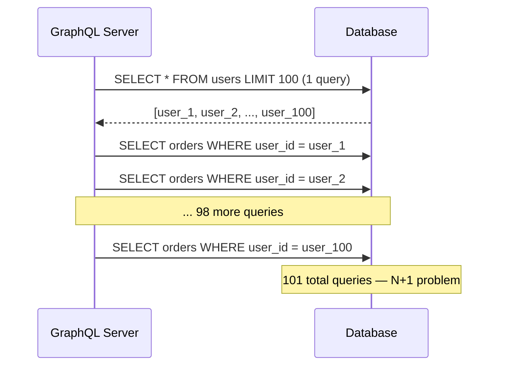
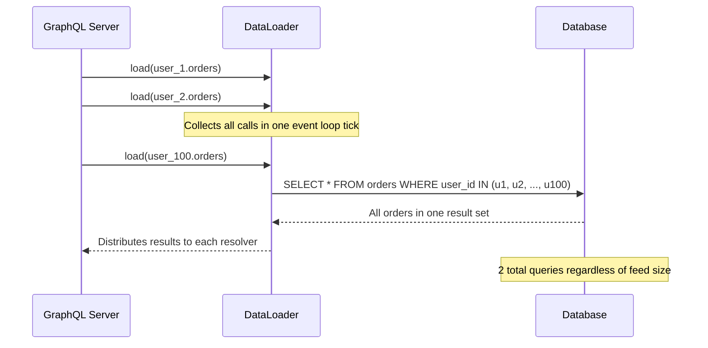

You're designing the APIs for a new product. The mobile team wants to fetch exactly the fields they render to save bytes on metered connections. The backend team wants compile-time-safe contracts and streaming for the order pipeline that processes 100K events/sec. The third-party developers integrating your API want a familiar REST-over-JSON surface they can hit from `curl`. Three teams, three different right answers — REST, gRPC, and GraphQL each solve a different problem, and shipping all three is the standard FAANG pattern.

Three dominant API paradigms used at FAANG — each optimized for a different problem. Knowing when to reach for each is a system design interview staple.

## At a Glance

| | REST | gRPC | GraphQL |
|---|---|---|---|
| **Transport** | HTTP/1.1 or HTTP/2 | HTTP/2 (required) | HTTP/1.1 or HTTP/2 |
| **Wire format** | JSON (text) | Protocol Buffers (binary) | JSON (text) |
| **Schema** | OpenAPI (optional) | `.proto` (required) | SDL (required) |
| **Payload size** | Large (verbose JSON) | Small (binary, ~3–10× smaller) | Variable (client-specified) |
| **Latency** | Moderate | Low | Moderate to high (resolver fan-out) |
| **Streaming** | SSE / chunked | ✅ Native (4 patterns) | ✅ Subscriptions (WebSocket) |
| **Caching** | ✅ Easy (HTTP cache headers) | ❌ Hard (POST-only, no URL) | ❌ Hard (POST-only, dynamic queries) |
| **Browser support** | ✅ Native | ⚠️ Requires gRPC-Web proxy | ✅ Native |
| **Type safety** | Optional (OpenAPI codegen) | ✅ Enforced at compile time | ✅ Schema-validated at runtime |
| **Versioning** | URL path (`/v2/`) or header | Field addition (backward compat) | Schema evolution with `@deprecated` |

## REST

REST (Representational State Transfer) maps operations to HTTP verbs on resource URLs. The server is stateless — no session state between requests.

**HTTP verb semantics:**

| Verb | Semantics | Idempotent | Safe |
|------|-----------|-----------|------|
| GET | Read | ✅ | ✅ |
| POST | Create / trigger | ❌ | ❌ |
| PUT | Replace (full update) | ✅ | ❌ |
| PATCH | Partial update | ❌ (unless designed so) | ❌ |
| DELETE | Delete | ✅ | ❌ |

**Idempotency** matters at scale — retrying a safe/idempotent operation is always safe. Retrying a POST (non-idempotent) may create duplicate records. Use idempotency keys (`Idempotency-Key: <uuid>`) for POST endpoints that should be retry-safe (payment APIs, order creation).

**HTTP caching** is REST's biggest advantage — `GET` responses are cacheable by default. Reverse proxies (Nginx, Varnish) and CDNs cache based on URL + headers automatically. `ETag` and `Last-Modified` enable conditional requests to avoid sending unchanged data.

**Over-fetching and under-fetching:** A single REST endpoint returns a fixed shape. A mobile client asking for a user's name gets the full user object (over-fetch). Assembling a feed requires multiple round trips to `/users`, `/posts`, `/comments` (under-fetch). This is the problem GraphQL was designed to solve.

**Versioning trap:** URL versioning (`/v1/`, `/v2/`) duplicates controller logic and is hard to deprecate. Header versioning (`Accept: application/vnd.api.v2+json`) is cleaner but less visible. Additive changes (new optional fields) avoid versioning entirely — prefer this when possible.

## gRPC

gRPC uses HTTP/2 as the transport and Protocol Buffers as the serialization format. The API contract lives in a `.proto` file; client and server code is generated from it.

**Proto definition:**

```protobuf
service OrderService {
  rpc GetOrder (GetOrderRequest) returns (Order);           // Unary
  rpc StreamOrders (StreamRequest) returns (stream Order); // Server streaming
  rpc UploadItems (stream Item) returns (UploadResult);    // Client streaming
  rpc Chat (stream Message) returns (stream Message);      // Bidirectional
}

message Order {
  string order_id = 1;
  int64  created_at = 2;
  repeated LineItem items = 3;
}
```

**Four communication patterns:**

| Pattern | Client sends | Server sends | Use case |
|---------|-------------|-------------|---------|
| Unary | 1 request | 1 response | Standard RPC call |
| Server streaming | 1 request | stream of responses | Live feed, large result set |
| Client streaming | stream of requests | 1 response | File upload, telemetry ingest |
| Bidirectional | stream | stream | Chat, collaborative editing |

**Why binary matters at scale:** A JSON payload of 1 KB becomes ~100–300 bytes in Protobuf. At 100k RPS, that's 70–90 MB/s of bandwidth saved. More importantly, binary parsing is significantly faster than JSON — fewer CPU cycles per request.

**Deadlines and cancellation:** gRPC has first-class deadline propagation. A client sets a deadline; the server checks `ctx.Done()` and cancels in-progress work. Deadlines cascade through service calls — if the root request deadline expires, all downstream gRPC calls are cancelled. This prevents cascading slow-drain failures.

```go
ctx, cancel := context.WithTimeout(context.Background(), 500*time.Millisecond)
defer cancel()
resp, err := client.GetOrder(ctx, &pb.GetOrderRequest{OrderId: "123"})
```

**Browser limitation:** Browsers cannot speak HTTP/2 trailers, which gRPC requires. **gRPC-Web** solves this with a JavaScript client that communicates with an Envoy proxy (or Nginx module) that translates to native gRPC. This adds an extra hop and loses bidirectional streaming.

## GraphQL

GraphQL exposes a single endpoint. The client sends a query specifying exactly which fields it needs. The server returns only those fields.

```graphql
# Client query — asks only for what it needs
query {
  user(id: "u_123") {
    name
    avatar
    recentOrders(limit: 3) {
      id
      total
      status
    }
  }
}
```

The server resolves each field via a **resolver function**. Fields can be resolved from different data sources (databases, microservices, caches).

**N+1 problem:** A naive resolver for `recentOrders` fires one DB query per user. Fetching a feed of 100 users triggers 1 (users) + 100 (orders) = 101 queries.



**Fix: DataLoader batching.** DataLoader collects resolver calls within a single event loop tick, batches them into one query, then distributes results.



**Caching is hard:** REST uses URL-based HTTP caching naturally. GraphQL queries are POST requests — no URL to cache on. Solutions:

| Approach | How it works |
|----------|-------------|
| **Persisted queries** | Client registers query hash; server stores query by hash. GET `/graphql?queryId=abc123` — now cacheable by CDN |
| **Response cache** (Apollo) | Cache full query responses by hash in Redis |
| **CDN caching** | Only works with persisted queries over GET; dynamic queries cannot be CDN-cached |
| **Fragment caching** | Cache individual resolver results, not full responses |

**Schema federation (Apollo Federation):** Large orgs split the schema across teams. Each service owns its subgraph. The gateway stitches subgraphs into a unified schema at query time. Netflix, Shopify, and Twitter use this pattern to let product teams own their own GraphQL types independently.


GraphQL introspection — the ability to query the schema itself — is useful in development but should be disabled in production for public APIs. It exposes your full data model and can be used to map attack surface.


## Decision Guide

| Scenario | Recommendation | Reason |
|----------|---------------|--------|
| Public-facing API (third-party developers) | REST | Familiar, widely tooled, easy to cache, works in every HTTP client |
| Internal microservice communication | gRPC | Binary efficiency, compile-time contracts, deadline propagation, streaming |
| Mobile BFF (Backend for Frontend) | GraphQL | Mobile clients fetch exactly the fields they render — avoids over-fetch on metered connections |
| Multi-client (web, iOS, Android, TV) | GraphQL | One schema serves all clients; each client queries its own shape |
| High-throughput data pipeline | gRPC | Binary payload, streaming, low CPU overhead |
| Real-time data (live scores, collaborative) | gRPC bidirectional or WebSocket over REST | Native streaming patterns |
| Startup / small team | REST | Simplest to build, debug, and evolve; no codegen step |
| Service mesh (Istio, Linkerd) | gRPC | Sidecar proxies speak HTTP/2 natively; richer observability (per-RPC metrics) |


These are not mutually exclusive. A common pattern at FAANG: **gRPC** between internal microservices, **REST** for the public API gateway, and **GraphQL** as the BFF layer that aggregates internal gRPC calls into client-optimized responses.



**Interview tip:** "I'd use all three for different layers. REST for the public API — HTTP caching, every client supports it, third-party devs can `curl` it. gRPC between internal services — Protobuf is 3–10× smaller than JSON, contracts are compile-time-checked, and deadlines propagate through the call graph. GraphQL as the mobile BFF — clients fetch exactly the fields they render. Two pitfalls: GraphQL's N+1 requires DataLoader from day one, and caching is hard because it's POST-only — solve with persisted queries over GET."


## Test Your Understanding


**Recursive resolution explosion.** Each `friends` field triggers a resolver that fetches N friends. Two levels deep: if each user has 100 friends, that's 1 (root) + 100 (first level) + 10,000 (second level) = **10,101 resolver calls**. Even with DataLoader batching, you're still doing 100 batched DB queries at the second level.

**Fix:**
1. **Query depth limiting** — reject queries deeper than N levels (e.g., max depth = 3)
2. **Query complexity analysis** — assign a cost to each field and reject queries exceeding a threshold
3. **Pagination on `friends`** — force `friends(first: 10)` so each level is bounded
4. **Disable introspection in production** — prevents attackers from mapping your schema and crafting expensive queries



gRPC over HTTP/2 **multiplexes** all RPCs over a single TCP connection. When the downstream is slow, in-flight requests accumulate on that connection. The upstream holds buffers for all pending responses, and since HTTP/2 flow control can allow a large amount of data in flight, memory grows until OOM.

**gRPC's fix: deadline propagation.** Set a deadline on the root request: `context.WithTimeout(ctx, 500*time.Millisecond)`. If the deadline expires, gRPC **cancels the RPC and all downstream RPCs in the chain**. The slow downstream receives a cancellation and stops work. This prevents pile-up.

With REST, each request is typically on a separate connection with a socket timeout. Slow responses hit the timeout and the connection is dropped. gRPC's multiplexed connection doesn't have this natural backpressure — deadlines are the substitute.



**Operational cost of URL versioning:**
- 3 sets of controllers/handlers, potentially 3 separate deployments or code paths
- Bug fixes must be backported to all active versions
- Deprecation is hard — clients cling to old versions indefinitely
- API documentation must be maintained for each version

**Better strategy:** Make changes **additively**. Adding a new field to a response is non-breaking — existing clients ignore unknown fields. Adding an optional query parameter or request field is non-breaking. Only **removing, renaming, or changing the type** of a field is breaking.

For the rare breaking change, use **header versioning** (`Accept: application/vnd.api.v2+json`) or **content negotiation** rather than URL paths. This keeps a single routing layer while letting the server respond differently based on the version header.



GraphQL is designed for **client-facing flexibility** — letting diverse clients request exactly what they need. Internal services have fixed, known contracts. Using GraphQL between services adds:

1. **Resolver overhead** — each field resolved individually, with N+1 risk, even when the server could return a fixed shape in one query
2. **No compile-time safety** — GraphQL queries are strings validated at runtime. gRPC's Protobuf catches schema mismatches at compile time.
3. **No native streaming** — GraphQL subscriptions use WebSockets, which are more complex than gRPC's native bidirectional streaming
4. **Caching penalty** — POST-only, dynamic queries can't be CDN-cached
5. **Extra parsing** — GraphQL query parsing + validation adds latency vs a direct RPC call

**The right split:** gRPC between internal services (compile-time contracts, binary efficiency, deadlines). GraphQL as the BFF (Backend for Frontend) layer that **aggregates** internal gRPC calls into client-optimized responses.



**The problem:** Browsers cannot speak native gRPC. gRPC requires HTTP/2 **trailers** (metadata sent after the response body), and browser fetch/XHR APIs don't expose HTTP/2 trailers.

**Solution 1: gRPC-Web.** A JavaScript client library that communicates with a **gRPC-Web proxy** (Envoy or Nginx module). The proxy translates between gRPC-Web (base64-encoded, trailers-in-body) and native gRPC. Limitation: **no bidirectional streaming** — only unary and server streaming work.

**Solution 2: REST/JSON gateway.** Tools like `grpc-gateway` auto-generate a REST API from your `.proto` definitions. The gateway translates REST requests to gRPC calls. The browser speaks REST; the gateway speaks gRPC to backends. This loses gRPC's binary efficiency but gives full browser compatibility with no special client library.

