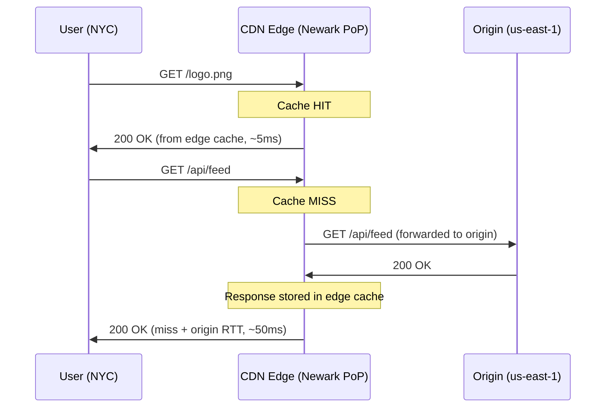
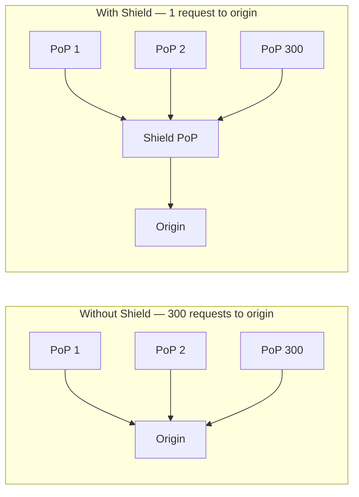

A CDN is a globally distributed network of servers (Points of Presence, PoPs) that cache and serve content close to the user. Every request that hits a CDN edge instead of your origin saves a round trip that might otherwise cross continents.

## How a Request Flows Through a CDN



The edge returns a cache hit in single-digit milliseconds. A cache miss adds one extra hop to origin but still benefits from persistent connections and optimized routing.

### Cache Outcomes

| Outcome | Meaning | Response header |
|---------|---------|-----------------|
| **HIT** | Served from edge cache | `X-Cache: HIT` |
| **MISS** | Not in cache — fetched from origin, then cached | `X-Cache: MISS` |
| **BYPASS** | Intentionally not cached (e.g., authenticated request) | `X-Cache: BYPASS` |
| **EXPIRED** | In cache but TTL elapsed — revalidated with origin | `Age: 0` |
| **STALE** | Served stale while revalidation happens in background (`stale-while-revalidate`) | |

## Pull CDN vs Push CDN

| | Pull CDN | Push CDN |
|---|---|---|
| **How it works** | CDN fetches from origin on first cache miss | You upload content to CDN storage in advance |
| **Cache warm-up** | Cold on first request — origin takes the hit | Pre-warmed — first request is always a cache hit |
| **Best for** | Web assets, APIs, unknown access patterns | Large files (videos, firmware), predictable downloads |
| **Drawback** | First user after TTL expiry hits origin | Must push updates manually; stale content if you forget |
| **Examples** | Cloudflare, CloudFront (default) | CloudFront S3 origins, Akamai NetStorage |

Most web applications use pull CDNs. Push CDNs are used for video-on-demand and software distribution where you control the upload schedule.

## Cache Invalidation

Three mechanisms for removing stale content before TTL expires:

**TTL expiry** — set `Cache-Control: max-age=N`. Content is evicted automatically after N seconds. Simple, zero operational cost, but you wait out the TTL on bad deploys.

**Explicit purge** — call the CDN's purge API to evict by URL, tag, or prefix.

```
# Cloudflare — purge by URL
curl -X POST "https://api.cloudflare.com/client/v4/zones/{zone_id}/purge_cache" \
  -H "Authorization: Bearer $TOKEN" \
  --data '{"files":["https://example.com/logo.png"]}'

# CloudFront — create invalidation
aws cloudfront create-invalidation \
  --distribution-id E1234 \
  --paths "/static/*"
```

**Cache-busting via versioned URLs** — embed a content hash in the filename. The URL changes on every deploy, so the old cached version and new version coexist without conflict.

```
# Old deploy
<script src="/static/main.abc123.js">

# New deploy — different URL, no purge needed
<script src="/static/main.def456.js">
```

Cache-busting is the most reliable strategy for immutable assets (JS bundles, CSS, images). Use explicit purge for content you can't version (HTML pages, API responses).

## Cache Key and Vary

The cache key is what the CDN uses to decide if a cached response can serve a new request. By default it's the full URL.

**Vary header** — tells the CDN to cache separate copies per request header value:

```
Vary: Accept-Encoding          # separate copies for gzip vs br vs identity
Vary: Accept-Language          # separate copy per locale
Vary: Authorization            # effectively disables caching (each token is unique)
```


`Vary: Authorization` or `Vary: Cookie` on dynamic endpoints means every unique token or session gets its own cache entry. The CDN fills up with uncacheable responses. Gate these responses with `Cache-Control: private` instead — the CDN will bypass and let the browser cache handle it.


## Origin Shield (Tiered Caching)

Without origin shield, every PoP has its own cache. A cache miss on 300 PoPs means 300 simultaneous requests to origin for the same resource (thundering herd after a deploy or TTL expiry).



Origin shield adds a mid-tier cache layer. Edge PoPs that miss check the shield before hitting origin. One request to origin fills the shield; edge PoPs fill from the shield.

| Provider | Term |
|----------|------|
| CloudFront | Origin Shield |
| Cloudflare | Tiered Cache |
| Fastly | Shielding |
| Akamai | Tiered Distribution |

## Dynamic Content Acceleration

CDNs accelerate non-cacheable requests through network-level optimizations — the CDN still terminates the connection at the edge.

| Technique | What it does |
|-----------|-------------|
| **Persistent origin connections** | CDN PoP keeps a warm TCP connection to origin. Client avoids full TCP + TLS handshake to origin. |
| **Route optimization** | CDN uses private backbone or BGP optimization to route traffic faster than public internet |
| **TLS session resumption** | CDN terminates TLS at the edge (short RTT); reuses session ticket on CDN→origin leg |
| **Protocol upgrade** | Client ↔ CDN uses HTTP/2 or HTTP/3; CDN ↔ origin uses HTTP/2 over a pooled connection |

This is why API requests benefit from a CDN even when the response is not cached — the CDN PoP is the wall clock proximity optimization.

## CDN for Video Streaming

Video streaming is the highest-bandwidth CDN use case. The protocols (HLS, DASH) are designed around CDN caching.

**HLS (HTTP Live Streaming)** and **DASH (Dynamic Adaptive Streaming over HTTP)** both split video into small segments (2–6 seconds each) served as regular HTTP files. Each segment is independently cacheable.

```
manifest.m3u8         ← playlist file; short TTL (5–10s for live, longer for VOD)
  ├── seg-001.ts      ← video segment; immutable once written — long TTL (hours)
  ├── seg-002.ts
  └── ...
```

| Asset | Cache behavior |
|-------|---------------|
| Manifest (`*.m3u8`, `*.mpd`) | Short TTL — updates as new segments are added (live) or long TTL (VOD) |
| Segments (`*.ts`, `*.m4s`) | Immutable — infinite TTL, purge never needed |
| Thumbnail sprites | Long TTL |

**Multi-bitrate variant selection** — the manifest lists multiple quality levels (360p, 720p, 1080p, 4K). The player picks the variant based on available bandwidth. Each variant's segments are cached independently at the edge. The CDN does not participate in bitrate selection — it just serves whichever variant the player requests.


For live streaming, the most recent segments are requested by every viewer within a few seconds of each other — exactly the thundering herd scenario. Origin shield is critical: without it, every PoP independently fetches the latest segment from origin for every viewer burst.


## Security at the Edge

| Capability | How CDNs use it |
|------------|----------------|
| **DDoS absorption** | CDN's aggregate bandwidth (Cloudflare: 280+ Tbps) absorbs volumetric attacks before they reach origin |
| **WAF** | Rules applied at edge — block SQLi, XSS, bad bots before request reaches your app |
| **Bot management** | Fingerprint and rate-limit scrapers, credential stuffing bots at the PoP |
| **TLS termination** | CDN handles TLS negotiation; origin can accept plain HTTP on a private network |
| **IP allowlisting at origin** | Lock origin to accept traffic only from CDN IP ranges — prevents origin bypass attacks |
