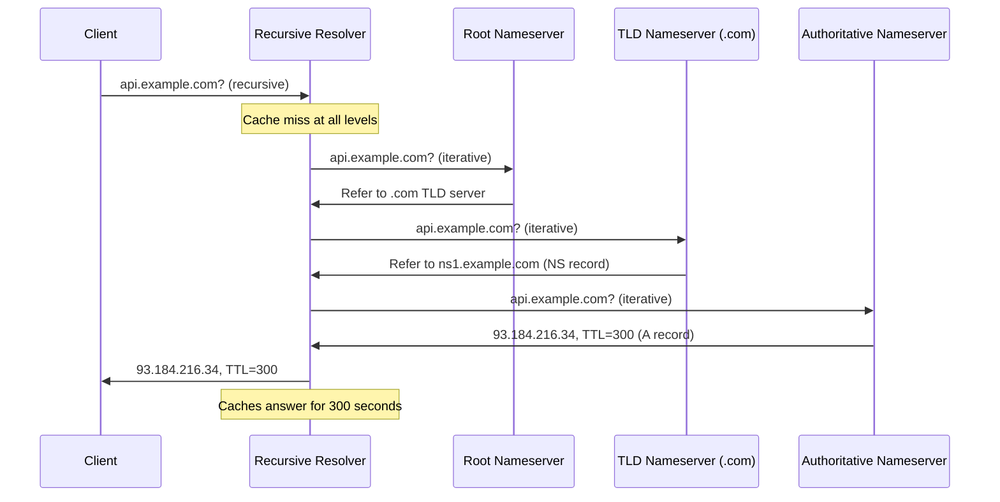
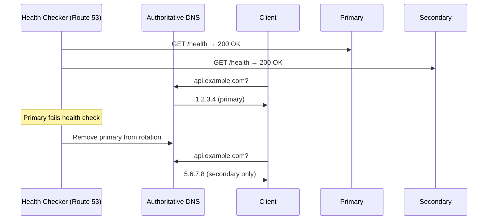

DNS (Domain Name System) is a globally distributed, hierarchical database that maps human-readable names to IP addresses (and other data). It is consulted before every network connection — including HTTP requests, database connections, and microservice calls.

## Namespace Hierarchy

DNS names are read right to left, from least specific to most specific. Each label separated by a dot is a level in the tree.

```
api.example.com.
 ↑       ↑    ↑  ↑
 │       │    │  └─ root (implicit trailing dot)
 │       │    └──── TLD (top-level domain)
 │       └───────── second-level domain (registered by owner)
 └───────────────── subdomain / hostname
```

| Level | Name | Controlled by |
|-------|------|---------------|
| Root (`.`) | Unnamed; single dot | ICANN — 13 root server clusters |
| TLD | `.com`, `.org`, `.io`, `.uk` | Registry operators (Verisign for .com) |
| Second-level domain | `example.com` | Domain registrant |
| Subdomain | `api.example.com` | Domain owner (you) |

## Resolution Chain

A DNS query travels through up to four distinct actors before returning an answer.



### Actors

| Actor | What it is | Role |
|-------|-----------|------|
| **Stub resolver** | Library in the OS or browser | Sends queries to the recursive resolver; caches results in process memory |
| **Recursive resolver** | ISP DNS or public resolver (8.8.8.8, 1.1.1.1) | Receives recursive queries from clients; walks the hierarchy; caches results |
| **Root nameserver** | 13 logical clusters (a.root-servers.net through m.root-servers.net) | Returns NS records for TLD servers; doesn't know the answer, only who to ask |
| **TLD nameserver** | Operated by registry (Verisign, ICANN) | Returns NS records for the authoritative nameserver of the domain |
| **Authoritative nameserver** | Operated by domain owner or their DNS provider | Holds the actual zone records; returns the final answer |

### Query Types

**Recursive query** — the resolver takes full responsibility for returning a complete answer or an error. The client sends one query and waits. The resolver does all the iterative work.

**Iterative query** — the server returns the best answer it has (a referral, if it doesn't know the answer). The resolver is responsible for following referrals and querying the next server in the chain.

In practice: client → recursive resolver is **recursive**. Recursive resolver → root/TLD/authoritative is **iterative**.

### Caching at Every Level

Each layer caches responses for the duration of the TTL:

| Cache layer | Where | Scope |
|-------------|-------|-------|
| Browser DNS cache | Per tab/process | Expires based on TTL (Chrome caps at 1 min for short TTLs) |
| OS resolver cache | `/etc/resolv.conf`, `nscd`, `systemd-resolved` | Per machine |
| Recursive resolver cache | ISP / 8.8.8.8 / 1.1.1.1 | Shared across all clients using that resolver |
| Authoritative server | Zone data | Source of truth; does not cache |


DNS propagation delay is not a single timer — it is the sum of all cached TTLs across all resolvers that have cached the old record. When you change a DNS record, clients on a resolver that cached the old answer wait up to the old TTL before seeing the new one. Lower your TTL 24–48 hours before a planned change.


## Record Types

| Type | Full Name | Data | Purpose |
|------|-----------|------|---------|
| **A** | Address | IPv4 address | Hostname → IPv4 (`api.example.com → 93.184.216.34`) |
| **AAAA** | IPv6 Address | IPv6 address | Hostname → IPv6 |
| **CNAME** | Canonical Name | Another hostname | Alias → target name (follows the chain to get the IP) |
| **NS** | Name Server | Hostname of nameserver | Delegates a zone to specific nameservers |
| **MX** | Mail Exchanger | Hostname + priority | Routes email to the correct mail server |
| **TXT** | Text | Arbitrary string | SPF, DKIM, DMARC, domain ownership verification |
| **SRV** | Service | Host, port, priority, weight | Service discovery with explicit port (`_http._tcp.example.com`) |
| **PTR** | Pointer | Hostname | Reverse DNS — IP → hostname (used in email anti-spam) |
| **SOA** | Start of Authority | Primary NS, serial, timers | Zone metadata; one per zone; serial number drives zone transfers |
| **CAA** | Certification Authority Authorization | CA name | Restricts which CAs may issue certificates for the domain |

### CNAME Gotchas

**CNAME at the zone apex is forbidden** (RFC 1034). The zone apex (naked domain, e.g., `example.com`) must have an SOA and NS record. A CNAME there would conflict. This means you cannot CNAME `example.com` to a CDN.

Workarounds:
- **ALIAS / ANAME records**: proprietary extension (Route 53, Cloudflare) — resolves the CNAME target and returns its A record at the apex
- **Cloudflare CNAME flattening**: resolves CNAME chain and returns A record, looks like a normal A record to clients

**CNAME chains**: a CNAME can point to another CNAME. Resolvers follow the chain (up to 8 hops in most implementations). Each hop adds a lookup. Keep chains short.

**CNAME and other records cannot coexist**: a name that has a CNAME record cannot have any other record type at the same name.

### MX Priority

```
example.com MX 10 mail1.example.com
example.com MX 20 mail2.example.com
```

Lower priority number = higher preference. `mail1` handles all mail normally. `mail2` only receives if `mail1` is unreachable.

### TXT Records for Email Authentication

| Record | What it does |
|--------|-------------|
| **SPF** (`v=spf1 ...`) | Authorizes which servers may send email for the domain |
| **DKIM** (`v=DKIM1; k=rsa; p=...`) | Public key used to verify email signatures |
| **DMARC** (`v=DMARC1; p=reject; ...`) | Policy for handling SPF/DKIM failures (none, quarantine, reject) |

All three are TXT records. Without them, email from your domain is rejected or flagged as spam by modern mail servers.

### SRV Record Format

```
_service._proto.name  TTL  IN  SRV  priority  weight  port  target
_https._tcp.api.example.com. 300 IN SRV 10 20 443 server1.example.com.
```

Used by Kubernetes (kube-dns), gRPC name resolution, SIP, XMPP.

## TTL and Caching

TTL (Time To Live) is the number of seconds a resolver may cache a response before discarding it and re-querying.

| TTL | Effect | Use when |
|-----|--------|----------|
| 0 | Never cached; every query hits the authoritative server | Never use in production (kills authoritative server, violates RFC) |
| 60s | Very fresh; high query volume | Active migration; failover in progress |
| 300s (5 min) | Good balance for dynamic records | CDN origins, load-balanced endpoints, APIs |
| 3600s (1 hr) | Moderate caching | Stable but changeable records |
| 86400s (24 hr) | Heavy caching; minimal DNS load | Static IPs, mail server records |

**Negative TTL (NXDOMAIN caching):** When a name does not exist, the resolver caches the negative response for the duration of the SOA's minimum TTL. This prevents repeated lookups for non-existent names. Important for microservices: if a service crashes and its DNS record is removed, clients that already received NXDOMAIN will cache that failure.

**TTL strategy for planned changes:**
1. Lower TTL to 60s, 24–48 hours before the change
2. Make the DNS change
3. Wait 60s for propagation
4. Raise TTL back to its normal value

## GeoDNS

GeoDNS returns different records based on the geographic location of the client (or their resolver).

```
Client in US  → resolver 8.8.8.8 (geo: US)  → api.example.com A 1.2.3.4   (US endpoint)
Client in EU  → resolver 1.1.1.1 (geo: EU)  → api.example.com A 5.6.7.8   (EU endpoint)
Client in AP  → resolver (geo: APAC)         → api.example.com A 9.10.11.12 (APAC endpoint)
```

The authoritative server looks up the resolver's IP in a geo-IP database and returns the appropriate A record.

**Problem:** the resolver's IP ≠ the client's IP. A corporate proxy or a public resolver (8.8.8.8) may be geographically distant from the actual end user. A client in Singapore using 8.8.8.8 (US) would be routed to the US endpoint.

**EDNS Client Subnet (ECS):** RFC 7871 extension. The resolver forwards a prefix of the client's IP (`/24` for IPv4) to the authoritative server, allowing more accurate geo-routing.

```
Recursive resolver → Authoritative: "client is from 203.0.113.0/24"
Authoritative:      returns nearest endpoint for 203.0.113.x
```


ECS improves geo-accuracy but leaks client location to the authoritative server and its operators. Privacy-focused resolvers (1.1.1.1 in privacy mode) disable ECS. Cloudflare's authoritative DNS uses a proprietary geo-routing mechanism that doesn't require ECS.


## DNS-Based Load Balancing and Failover

### Round-Robin DNS

Return multiple A records for the same name. Clients pick one (usually the first in the list). Resolvers rotate the order.

```
api.example.com  A  1.2.3.4
api.example.com  A  5.6.7.8
api.example.com  A  9.10.11.12
```

**Limitations:**
- Clients and resolvers cache the full record set and pick the same IP for the TTL duration — rotation is not guaranteed
- No health awareness: a failed backend stays in rotation until manually removed
- Uneven load: clients with long-running connections persist on one backend

### Weighted Routing (Route 53 Weighted Records)

Assign weights to records. Traffic is distributed probabilistically in proportion to weight.

```
api.example.com  A  1.2.3.4  weight=70   (70% of traffic)
api.example.com  A  5.6.7.8  weight=30   (30% of traffic)
```

Used for canary deployments: send 5% of traffic to new version, gradually increase.

### Health-Check-Based Failover

DNS provider runs active health checks against each endpoint. Unhealthy endpoints are removed from DNS responses.




DNS failover is bounded by TTL. Clients that already cached the old IP continue hitting the failed endpoint until their cached entry expires. For zero-downtime failover, combine short TTLs (60s) with health checks AND implement retries with fallback at the application layer. DNS alone is not fast enough for sub-minute failover.


### Anycast DNS

The same IP address is advertised from multiple geographic locations via BGP. The network routes each client to the nearest PoP (point of presence) advertising that IP.

```
1.1.1.1 is advertised from:
  - Ashburn, VA (US East)
  - Los Angeles, CA (US West)
  - Frankfurt, DE (EU)
  - Singapore (APAC)
  - ...200+ more locations

Client query → routed by BGP to nearest PoP → answered locally
```

Used by: Cloudflare (1.1.1.1), Google (8.8.8.8), root nameservers. Provides low latency and resilience — a PoP going down just reroutes clients to the next nearest.

## Security

| Attack / Mechanism | Description |
|-------------------|-------------|
| **DNS spoofing / cache poisoning** | Attacker injects a forged DNS response into a resolver's cache; subsequent clients get the wrong IP |
| **DNSSEC** | Cryptographically signs zone records; resolvers verify signatures using public keys published in DNS; prevents spoofing but does not encrypt |
| **DNS amplification (DDoS)** | Attacker spoofs victim's IP as source; sends small DNS queries to open resolvers; large responses (ANY queries) flood the victim — amplification factor up to 70× |
| **DNS over TLS (DoT)** | Encrypts DNS queries between stub resolver and recursive resolver on TCP port 853; prevents eavesdropping and tampering by the network |
| **DNS over HTTPS (DoH)** | Same as DoT but over HTTPS port 443; harder to block; used by browsers (Firefox, Chrome) |
| **Split-horizon DNS** | Authoritative server returns different records based on whether the query comes from inside or outside the network (internal service discovery vs public IPs) |
