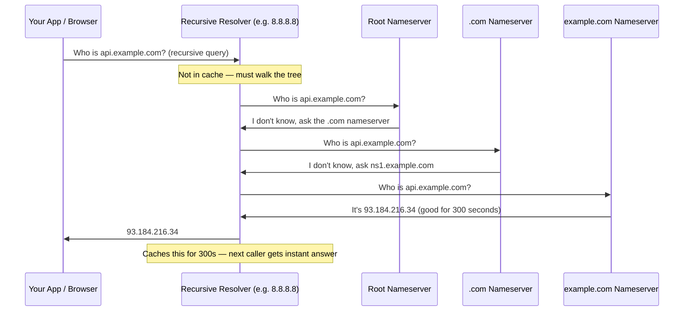

Every network call your application makes — whether to an external API, a database, a microservice, or a CDN — starts with a DNS lookup. DNS translates a hostname into an IP address. Understanding it explains why deploys don't propagate instantly, why some users are routed to different servers than others, and why changing a DNS record is not the same as changing a config value.

## What Happens When You Hit Enter

You type `api.example.com` in a browser or make an HTTP call from code. Before a single byte of your request is sent, the OS needs an IP address. Here's the lookup chain:



Five actors, four network hops, one answer. In practice the full chain takes 50–150ms the first time. After that, the recursive resolver caches the result — subsequent callers get the answer in under 1ms.

### The Four Actors

**Your stub resolver** is a library baked into the OS. It checks a local cache first, then forwards to a recursive resolver. It doesn't know how to walk the DNS tree itself.

**The recursive resolver** (Google's 8.8.8.8, Cloudflare's 1.1.1.1, or your ISP's resolver) does all the work. It walks root → TLD → authoritative, caches every answer it gets along the way, and returns the final result to you. Shared by millions of clients — this is why the cache hit rate is so high.

**Root nameservers** only know which servers are authoritative for each TLD (`.com`, `.io`, `.net`). There are 13 logical root clusters, operated by different organizations, distributed globally via anycast. They never answer with an IP address — just a referral.

**The authoritative nameserver** is where your actual DNS records live. You configure it through your DNS provider (Cloudflare, Route 53, etc.). It is the only server that knows the real answer for your domain.

### The Caching Layer That Burns Engineers

Every answer carries a TTL (Time To Live). Resolvers cache the answer for exactly that many seconds.

```
api.example.com → 93.184.216.34  TTL=3600
                                      ↑
                        This answer is cached for 1 hour.
                        Every resolver that looked it up won't check again for 1 hour.
                        If you change the IP, some clients won't see it for up to 1 hour.
```

Cache layers exist at every level:

| Layer | Scope | Notes |
|-------|-------|-------|
| Browser | Per process | Chrome caps TTL at 60s even if the record says longer |
| OS (`nscd`, `systemd-resolved`) | Per machine | `sudo systemd-resolve --flush-caches` to clear |
| Recursive resolver | Shared across all clients on that resolver | Can't flush it — you have to wait for TTL expiry |
| Authoritative server | Source of truth | No caching — always returns current data |


"DNS propagation" isn't a single event with a known duration. It's the process of every cached copy of your old record expiring across every resolver that has it. A resolver that cached your record 1 second before you changed it will keep the old answer for a full TTL. This is why the rule exists: **lower your TTL 24–48 hours before any planned change**, then make the change.


## Record Types

| Type | Maps | Real use |
|------|------|---------|
| **A** | hostname → IPv4 | `api.example.com → 1.2.3.4` — the most common record |
| **AAAA** | hostname → IPv6 | Same as A but for IPv6 |
| **CNAME** | hostname → another hostname | Point `www.example.com` to your CDN's hostname |
| **NS** | zone → nameservers | Tells the world which servers are authoritative for your domain |
| **MX** | domain → mail server | Routes incoming email; has a priority number |
| **TXT** | domain → text string | SPF, DKIM, DMARC (email auth); domain ownership proof (Google, AWS) |
| **SRV** | service → host + port | Service discovery — used by Kubernetes DNS, gRPC, SIP |
| **PTR** | IP → hostname | Reverse DNS; used by mail servers to verify sender identity |
| **CAA** | domain → allowed CA | Restricts which certificate authorities can issue certs for your domain |

### The CNAME Trap at the Root Domain

You want to point your naked domain (`example.com`, not `www.example.com`) to a CDN or load balancer that gives you a hostname like `d1234.cloudfront.net` instead of a fixed IP.

Your instinct: add a CNAME from `example.com` → `d1234.cloudfront.net`. This violates RFC 1034 and most DNS providers reject it. The root domain **must** have SOA and NS records. A CNAME would conflict with them.

**Why this is a real problem:** CDNs and cloud load balancers intentionally don't give you a stable IP — they use hostnames so they can shift IPs around for scaling and failover. But you can't CNAME a root domain.

**How to work around it:**
- **Cloudflare**: CNAME flattening — resolves the CNAME chain internally and returns an A record to clients, as if it were a real A record at the apex.
- **AWS Route 53**: ALIAS record — a Route 53-proprietary extension that behaves like A but accepts a hostname target (ALB, CloudFront, S3 website endpoint).

Both solutions resolve the CNAME target at query time and return the resolved IP. Clients never see the CNAME. The A record stays up-to-date as the CDN shifts IPs.

### TXT Records: Your Domain's Proof of Identity

The same record type is used for everything that needs to attach metadata to a domain:

| Use | Example value | What it does |
|-----|--------------|--------------|
| **SPF** | `v=spf1 include:_spf.google.com ~all` | Declares which mail servers are allowed to send email for this domain |
| **DKIM** | `v=DKIM1; k=rsa; p=MIGf...` | Public key for verifying email signatures |
| **DMARC** | `v=DMARC1; p=reject; rua=mailto:dmarc@example.com` | Policy when SPF/DKIM fail — reject, quarantine, or monitor |
| **Domain verification** | `google-site-verification=abc123` | Prove domain ownership to Google, AWS, GitHub, etc. |

Without SPF + DKIM + DMARC, email from your domain ends up in spam or is silently dropped by Gmail, Outlook, and others.

## TTL: The Knob Engineers Forget Until It's Too Late

TTL is the most consequential DNS setting you control. It determines how quickly the world reacts to your changes.

| TTL | Propagation speed | DNS query load | Use when |
|-----|------------------|----------------|----------|
| 60s | Fast (1 min worst case) | High — every resolver re-queries frequently | Active failover, migration in progress |
| 300s | Reasonable (5 min) | Moderate | CDN origins, load-balanced endpoints |
| 3600s | Slow (1 hr) | Low | Stable records you rarely change |
| 86400s | Very slow (24 hr) | Minimal | MX records, nameservers, static IPs |

**The deploy story:** You're migrating `api.example.com` from an old server (1.2.3.4) to a new one (5.6.7.8). Your TTL is 86400 (24 hours).

- You update the A record. The change hits the authoritative server immediately.
- Every resolver that cached `1.2.3.4` in the last 24 hours keeps serving it until their cache entry expires.
- Traffic splits between old and new server for up to 24 hours.
- You have to keep the old server running the entire time.

The fix: lower TTL to 60s two days before the migration. Make the change. Now worst-case propagation is 60 seconds. Raise TTL back afterward.

**Negative caching:** If a hostname doesn't exist, resolvers cache the "not found" (NXDOMAIN) response too — for the duration of the SOA minimum TTL. This matters in microservice environments: if service discovery removes a hostname and some clients have already cached NXDOMAIN, they'll keep failing even after the record is restored.

## GeoDNS: Serving Different IPs to Different Users

The authoritative nameserver can return different A records depending on where the query is coming from. A US resolver gets the US endpoint; an EU resolver gets the EU endpoint.

```
Your app, resolving api.example.com:

  Office in NYC    → uses 8.8.8.8 (US resolver) → gets 1.2.3.4  (US-East endpoint)
  Office in Berlin → uses 1.1.1.1 (EU resolver)  → gets 5.6.7.8  (EU endpoint)
  Mobile in SG     → uses ISP resolver (APAC)    → gets 9.10.11.12 (APAC endpoint)
```

This is how CDNs, global APIs, and multi-region systems route users to the nearest or fastest endpoint — no application logic required.

**The flaw:** DNS routes based on the **resolver's** IP, not the client's IP. A developer in Singapore on their company VPN routes through a US resolver → gets routed to the US region → 200ms round trips instead of 20ms.

**EDNS Client Subnet (ECS)** fixes this: the resolver forwards a `/24` prefix of the actual client IP to the authoritative server, allowing geo-routing by client location rather than resolver location. Widely supported (8.8.8.8, most CDNs), but privacy-focused resolvers like Cloudflare disable it.

## DNS as Infrastructure

### Round-Robin: Simplest Load Balancing

Publish multiple A records for the same name. Resolvers cycle through them; clients pick one.

```
api.example.com  A  1.2.3.4
api.example.com  A  5.6.7.8
api.example.com  A  9.10.11.12
```

No setup beyond DNS. Works for initial traffic distribution. But: no health awareness (a dead server stays in rotation), no session affinity, and TTL means slow removal of failed endpoints.

### Weighted Routing and Canary Deploys

Route 53 (and most enterprise DNS providers) let you weight records — 90% to stable, 10% to the new version. Gradually shift weight as confidence grows. The DNS layer handles the split; no application changes needed.

### Health-Check Failover

DNS provider polls your endpoints. When an endpoint fails, it's removed from DNS responses. When it recovers, it's added back.

The catch: clients that cached the old record before the endpoint went down keep hitting the failed server until the TTL expires. This is why DNS-based failover requires short TTLs (60s) AND application-level retry logic. DNS alone cannot guarantee sub-minute failover.

### Anycast: How 1.1.1.1 Is Fast Everywhere

Cloudflare advertises the IP `1.1.1.1` from 300+ locations simultaneously via BGP. Your network routes your query to the nearest location advertising that IP — not to a single server in San Francisco.

This is the same mechanism root nameservers use. There aren't 13 physical root servers — there are 13 IP addresses, each advertised from hundreds of physical locations globally. DNS queries to root servers never travel more than a few milliseconds.

## Security

| Threat / Mechanism | What it means in practice |
|-------------------|--------------------------|
| **Cache poisoning** | Attacker races to inject a forged answer into a resolver's cache before the real answer arrives. Clients using that resolver get the wrong IP — potentially for the full TTL. |
| **DNSSEC** | Zone records are signed with a private key; resolvers verify with the public key (published in DNS). Prevents poisoning. Doesn't encrypt — it only ensures authenticity. Adoption is still low (~30% of domains). |
| **DNS amplification** | Attacker spoofs the victim's IP as the source of UDP DNS queries. Sends small queries (ANY type) to open resolvers; resolver sends large responses to the victim. Amplification factor up to 70×. Mitigated by rate-limiting and disabling open recursion. |
| **DNS over HTTPS (DoH)** | Encrypts DNS queries inside HTTPS. Your ISP cannot see what domains you're resolving. Used by Chrome and Firefox by default when the resolver supports it. |
| **Split-horizon DNS** | Authoritative server returns different records based on the query source. Internal clients (VPN, corporate network) get private IPs; external clients get public IPs. Used for private service discovery without exposing internal topology. |


**Interview tip:** Lead with TTL discipline: "I'd treat TTL as the most consequential knob — 3600s for stable records, but 24–48 hours before any migration I'd drop it to 60s so the change propagates within a minute. DNS failover alone can't guarantee sub-minute recovery because clients keep hitting cached IPs until TTL expiry, so I'd pair short TTLs with application-level retry and circuit breakers. For multi-region routing I'd use GeoDNS with EDNS Client Subnet so decisions are based on client IP, not resolver IP. For the apex domain I'd use Route 53 ALIAS or Cloudflare CNAME flattening because raw CNAMEs at the root violate RFC 1034."


## Test Your Understanding


Traffic can hit the old IP for up to **24 hours** — any resolver that cached the record in the last 24 hours keeps serving `1.2.3.4` until its cache expires. You **cannot force faster propagation**. There's no global "flush" mechanism — each resolver is independent.

**What you can do:** Keep the old server running for the full TTL. For future changes, lower TTL to 60s **at least 24–48 hours in advance** (so all resolvers pick up the new short TTL before you make the actual IP change). Then make the change, wait ~60s, and raise TTL back.



GeoDNS routes based on the **resolver's IP**, not the client's. The Berlin developer's DNS queries go through a US-based corporate DNS resolver. GeoDNS sees a US resolver → returns the US endpoint → the developer's traffic crosses the Atlantic.

**Fix:** Enable **EDNS Client Subnet (ECS)** — the resolver forwards a `/24` prefix of the actual client IP to the authoritative DNS server, allowing geo-routing based on client location. However, privacy-focused resolvers (Cloudflare 1.1.1.1) disable ECS. Alternative: use **Anycast** instead of GeoDNS — BGP routes the client's traffic to the nearest endpoint regardless of resolver location.



RFC 1034 prohibits CNAMEs at the zone apex (root domain). The root **must** have SOA and NS records, and a CNAME at the same name conflicts with them — CNAME semantically means "this name is an alias for another name," which contradicts the existence of other record types at the same name.

**Workarounds:**
- **Cloudflare CNAME flattening** — resolves the CNAME chain internally and returns an A record to clients
- **AWS Route 53 ALIAS** — a proprietary record type that behaves like A but accepts a hostname target
- Both resolve the target at query time and return the IP. Clients never see the CNAME.



**Negative caching.** When the service was briefly unregistered, resolvers that queried DNS during that window cached the **NXDOMAIN** response. This negative result is cached for the SOA minimum TTL (often 300–900 seconds).

Even though the new instance re-registered in DNS within seconds, resolvers with the cached NXDOMAIN won't re-query until the negative cache expires. This is particularly insidious because most engineers only think about caching for positive responses.

**Fix:** Set a low SOA minimum TTL for service discovery zones (e.g., 30s). Or better: don't use DNS for service discovery of ephemeral instances — use a dedicated service registry (Consul, Kubernetes service endpoints) with health-check-based TTLs.



DNS health-check failover removes the record from **future DNS responses**, but resolvers that already cached the old response keep returning the dead IP until TTL expires. DNS is a **pull** system — there's no way to push an invalidation to resolvers.

**The gap:** Health check detects failure in ~10s. DNS updates immediately. But clients using resolvers with cached records keep hitting the dead IP for up to TTL seconds. If TTL is 300s, that's 5 minutes of partial outage.

**Why DNS failover alone is insufficient:** You must pair it with:
1. **Short TTLs** (60s) for endpoints behind failover
2. **Client-side retry** with a different resolved IP
3. **Application-level health checks** (circuit breakers) that bypass DNS entirely



**Low adoption reasons:**
1. **Operational complexity** — key management, zone signing, key rotation. A botched rotation takes your entire domain offline.
2. **Amplification risk** — signed responses are larger (RRSIG, DNSKEY records), making DNSSEC-enabled servers better DDoS amplifiers.
3. **No encryption** — DNSSEC only ensures **authenticity** (the response hasn't been tampered with). Query/response content is still plaintext — anyone on the path can see what domains you're resolving.
4. **Chain of trust fragility** — if any link in the delegation chain (root → TLD → your zone) is broken, validation fails.

**What DNSSEC doesn't protect against:** DNS over plaintext (eavesdropping), DDoS attacks, registrar hijacking (attacker changes your NS records at the registrar level), or compromise of the authoritative server itself. For privacy, you need **DNS over HTTPS (DoH)** or **DNS over TLS (DoT)**.

