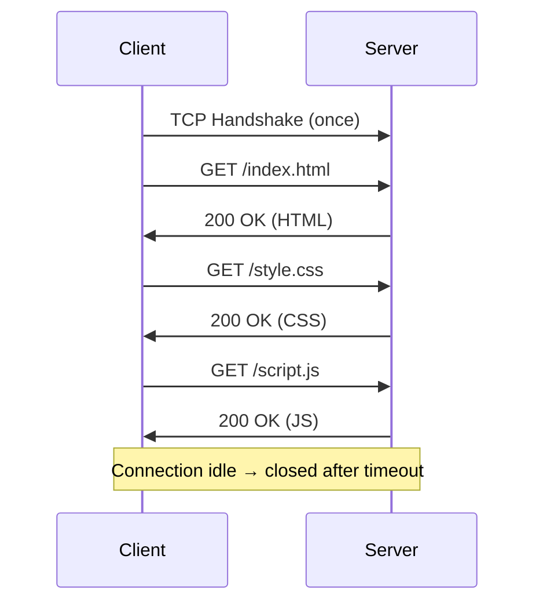
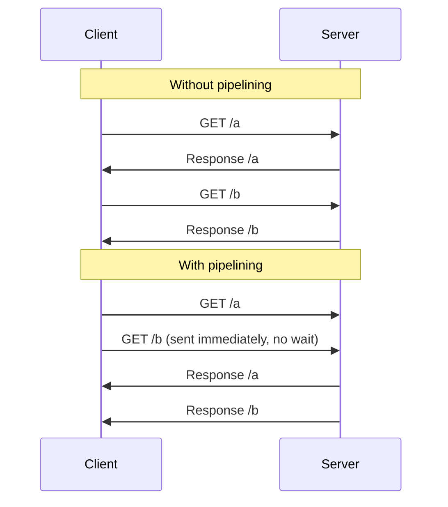
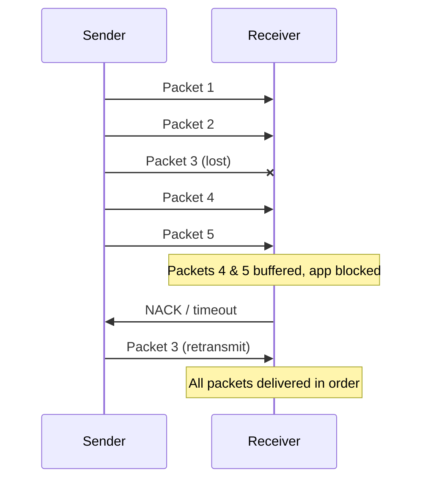

You're profiling a slow page load and notice the browser opens six TCP connections to your origin even though only one CSS file is being fetched. Looking deeper, you see headers like `User-Agent` and `Cookie` — hundreds of bytes — repeated verbatim on every single asset request. Welcome to HTTP/1.1: the protocol that powered the web for two decades, and whose limitations are the entire reason HTTP/2 and HTTP/3 exist.

HTTP/1.1 (originally RFC 2616, replaced by RFC 7230–7235 in 2014, and currently specified by RFC 9110/9112 in 2022) is a text-based, stateless, request-response protocol over TCP. It became the dominant web protocol from 1997 and introduced persistent connections, chunked transfer, and request pipelining.

## Message Structure

Every HTTP exchange consists of a **request** from the client and a **response** from the server. Both follow the same structure:

```
start-line\r\n
header-name: header-value\r\n
header-name: header-value\r\n
\r\n                          ← blank line (mandatory separator)
[optional body]
```

Lines are terminated by **CRLF** (`\r\n`). The blank line is not optional — parsers use it to detect where headers end.


  
  ```
  POST /api/users HTTP/1.1\r\n
  Host: example.com\r\n
  Content-Type: application/json\r\n
  Content-Length: 27\r\n
  \r\n
  {"name": "alice", "age": 30}
  ```

  | Part | Description |
  |------|-------------|
  | **Request Line** | `METHOD SP Request-URI SP HTTP/version` |
  | **Headers** | Key-value pairs; names are case-insensitive |
  | **Blank Line** | Signals end of headers |
  | **Body** | Present for POST, PUT, PATCH; absent for GET, HEAD |

  
  `Host` is the **only mandatory header** in HTTP/1.1. Without it, the server returns `400 Bad Request`.
  
  

  
  ```
  HTTP/1.1 201 Created\r\n
  Content-Type: application/json\r\n
  Content-Length: 45\r\n
  \r\n
  {"id": 42, "name": "alice", "created": true}
  ```

  | Part | Description |
  |------|-------------|
  | **Status Line** | `HTTP/version SP status-code SP reason-phrase` |
  | **Headers** | Metadata about the response |
  | **Blank Line** | Signals end of headers |
  | **Body** | The payload (HTML, JSON, binary, etc.) |
  


## HTTP Methods

| Method | Safe | Idempotent | Has Body | Use |
|--------|------|------------|----------|-----|
| `GET` | ✅ | ✅ | No | Retrieve a resource |
| `HEAD` | ✅ | ✅ | No | Retrieve headers only (no body) |
| `POST` | ❌ | ❌ | Yes | Create resource or trigger action |
| `PUT` | ❌ | ✅ | Yes | Replace resource entirely |
| `PATCH` | ❌ | ❌ | Yes | Partial update |
| `DELETE` | ❌ | ✅ | Optional | Delete a resource |
| `OPTIONS` | ✅ | ✅ | No | Query allowed methods (used in CORS preflight) |
| `TRACE` | ✅ | ✅ | No | Echo request back (debugging; disabled on most servers) |

- **Safe**: Does not modify server state
- **Idempotent**: Multiple identical requests produce the same result as one

## Connections

### HTTP/1.0 — One Request Per Connection

A new TCP connection is opened for every request, then closed immediately.

```
TCP Handshake → GET /index.html → Response → TCP Close
TCP Handshake → GET /style.css  → Response → TCP Close
TCP Handshake → GET /script.js  → Response → TCP Close
```


TCP handshake (and TLS handshake over HTTPS) adds ~100–300ms of latency per request. Loading a page with 30 assets = 30 separate handshakes.


### HTTP/1.1 — Persistent Connections (Keep-Alive)

The default in HTTP/1.1. The TCP connection stays open after a request completes and is reused for multiple requests.



**Keep-Alive headers:**

```
Connection: keep-alive
Keep-Alive: timeout=5, max=100
```

| Parameter | Meaning |
|-----------|---------|
| `timeout` | Seconds the server keeps the idle connection open |
| `max` | Max number of requests before closing the connection |

To close explicitly: `Connection: close`


Browsers open **6 parallel TCP connections per origin** (not 1) to download resources concurrently. This is a workaround for HTTP/1.1's sequential request constraint — not a feature of the protocol.


## Chunked Transfer Encoding

Used when the server cannot know the total response size before starting to send — e.g., streaming, on-the-fly compression, dynamically generated content.

**Without chunked encoding** (fixed-size): server must buffer the entire body to set `Content-Length`.
**With chunked encoding**: server sends data as it becomes available, no `Content-Length` needed.

**Header that enables it:**
```
Transfer-Encoding: chunked
```

### Wire Format

{}

### Write the chunk size

Write the byte count of the next chunk in **hexadecimal**, followed by `\r\n`.

```
7\r\n
```

### Write the chunk data

Write the data bytes, followed by `\r\n`.

```
Hello, \r\n
```

### Repeat for each chunk

Each subsequent chunk follows the same size + data pattern.

```
6\r\n
world!\r\n
```

### Terminate the body

Signal end of body with a **zero-length chunk**.

```
0\r\n
\r\n
```

{}

**Use cases:**
- Streaming large file downloads
- Server-sent log output or progress updates
- Compressing a response whose final size is unknown
- Server-Sent Events (SSE) over HTTP/1.1

## Pipelining

Allows a client to send multiple requests on a single connection **without waiting for each response**. The goal was to avoid round-trip idle time.



### Why Pipelining Failed

HTTP/1.1 pipelining requires the server to respond **in the same order as requests were received** (FIFO). This introduces **head-of-line blocking**.

- A slow `/a` response forces `/b` (even if ready) to wait
- Most HTTP proxies did not correctly support pipelining
- Disabled by default in all major browsers


**Pipelining is effectively dead.** HTTP/2 multiplexing solves the same problem without ordering constraints. Do not rely on or enable pipelining in production.


## Head-of-Line (HOL) Blocking

HOL blocking occurs when the first item in a queue holds up all items behind it.

### Application-Level HOL (HTTP/1.1 Pipelining)

```
Client sends:    [GET /slow] → [GET /fast] → [GET /instant]
Server responds: [slow........] → [fast] → [instant]
                          ↑
          /fast and /instant are blocked until /slow finishes
```

### TCP-Level HOL (Affects HTTP/1.1 and HTTP/2)

TCP guarantees **reliable, ordered delivery**. When a packet is lost:
1. The receiver gets later packets but cannot deliver them to the app
2. All data waits in the receive buffer until the lost packet is retransmitted
3. Every byte stream that shares the TCP connection is stalled



| Protocol | App-Level HOL | TCP-Level HOL | Solution |
|----------|:---:|:---:|----------|
| HTTP/1.1 | ✅ (pipelining) | ✅ | — |
| HTTP/2 | ❌ (multiplexed) | ✅ | Streams share one TCP |
| HTTP/3 | ❌ | ❌ | QUIC streams independent at transport |


**HTTP/2 does not eliminate TCP-level HOL blocking.** Its multiplexing only solves the application-level problem. In fact, TCP-level HOL on HTTP/2 can be worse — a single dropped packet stalls all streams simultaneously. HTTP/3 (QUIC) is the actual fix.


## Content Negotiation

Client advertises what it can handle; server responds with the best match.

| Header | Direction | Purpose |
|--------|-----------|---------|
| `Accept` | Request | Preferred MIME types (`text/html`, `application/json`) |
| `Accept-Encoding` | Request | Preferred compression (`gzip`, `br`, `deflate`) |
| `Accept-Language` | Request | Preferred language (`en-US`, `fr`) |
| `Content-Type` | Both | Actual MIME type of the body |
| `Content-Encoding` | Response | Compression applied to the response body |

**Quality values** (`q`) let the client rank preferences:
```
Accept: text/html, application/json;q=0.9, */*;q=0.8
```

## Compression

Enabled via `Accept-Encoding` (request) and `Content-Encoding` (response).

| Encoding | Speed | Compression Ratio | Notes |
|----------|-------|:-----------------:|-------|
| `gzip` | Fast | Good | Universally supported |
| `br` (Brotli) | Medium | Better than gzip (~20%) | Modern browsers, typically requires HTTPS |
| `deflate` | Fast | Similar to gzip | Less common; has implementation quirks |
| `identity` | — | None | No encoding applied |

## HTTP/1.1 Limitations

| Problem | Root Cause | Impact |
|---------|-----------|--------|
| HOL blocking | FIFO response ordering | One slow request stalls the queue |
| Header overhead | Headers sent as plain text on every request | `User-Agent`, `Cookie`, `Accept` repeated for every resource |
| No multiplexing | One outstanding request per connection | Browsers open 6 connections per origin as a workaround |
| No server push | Strictly request-response | Client must discover and request all sub-resources |
| No request prioritization | All requests treated equally | Critical resources compete with non-critical ones |

These limitations motivated **HTTP/2** (binary framing, multiplexing, header compression, server push) and **HTTP/3** (QUIC, no TCP-level HOL blocking).


**Interview tip:** "HTTP/1.1's three structural problems: HOL blocking (pipelining is dead, browsers open 6 parallel connections as a workaround), header bloat (plaintext `User-Agent` and `Cookie` repeated on every request), and no multiplexing (one outstanding request per connection). These are exactly what [HTTP/2](../http-2)'s binary framing, HPACK, and stream multiplexing solve."


## Test Your Understanding


Pipelining required the server to respond **in FIFO order** — responses had to come back in the same order as requests were sent. A slow `/checkout` response blocked every response behind it, even if `/health` was ready in 1ms. This is application-level HOL blocking — the same problem pipelining was meant to solve.

Additionally, most HTTP proxies didn't correctly implement pipelining (some reordered responses, others dropped connections), so all major browsers disabled it by default.

**HTTP/2's fix:** Streams are independent. Stream 3's response can arrive before Stream 1's. No FIFO constraint. The server sends whichever response is ready first.



With 6 connections, the browser can fetch 6 resources per RTT (one per connection, serially within each connection due to HTTP/1.1's request-response model).

50 resources / 6 connections = **~9 RTTs** (ceil(50/6) = 9, with the last round having only 2 resources).

This assumes each resource completes in one RTT. In reality, slow responses on one connection (HOL blocking) can delay resources queued behind them, making the actual time worse.

**HTTP/2** eliminates this: all 50 requests go out immediately on a single connection as interleaved streams. The server responds to whichever is ready first. In the best case, all 50 complete in **~1 RTT** (limited by server processing and TCP congestion window).



Without chunked encoding, the server **must** set `Content-Length`, which means it must **buffer the entire response in memory** before sending. For a 2GB report, that's 2GB of server memory per concurrent request.

With `Transfer-Encoding: chunked`, the server streams data as it's generated — each chunk has its own size prefix, and a zero-length chunk signals the end. The server never needs to know the total size upfront, and memory usage stays constant regardless of response size.

**Important:** `Content-Length` and `Transfer-Encoding: chunked` are **mutually exclusive**. If both are present, `Transfer-Encoding` takes precedence per RFC 7230.



If the "client" is a load testing tool making parallel requests, this is expected. HTTP/1.1 is one-request-per-connection-at-a-time. To achieve high concurrency (e.g., 6000 concurrent requests), the client must open 6000 connections. Keep-alive just means each connection is **reused** after a response completes — it doesn't enable multiplexing.

If this is a single browser, it's likely a bug — browsers limit to 6 connections per origin. 6000 connections would require ~1000 origins (domain sharding) or a non-browser client ignoring the limit.

**The fix for high-concurrency clients:** HTTP/2, where a single connection multiplexes all requests. The load test would use 1 connection instead of 6000.

