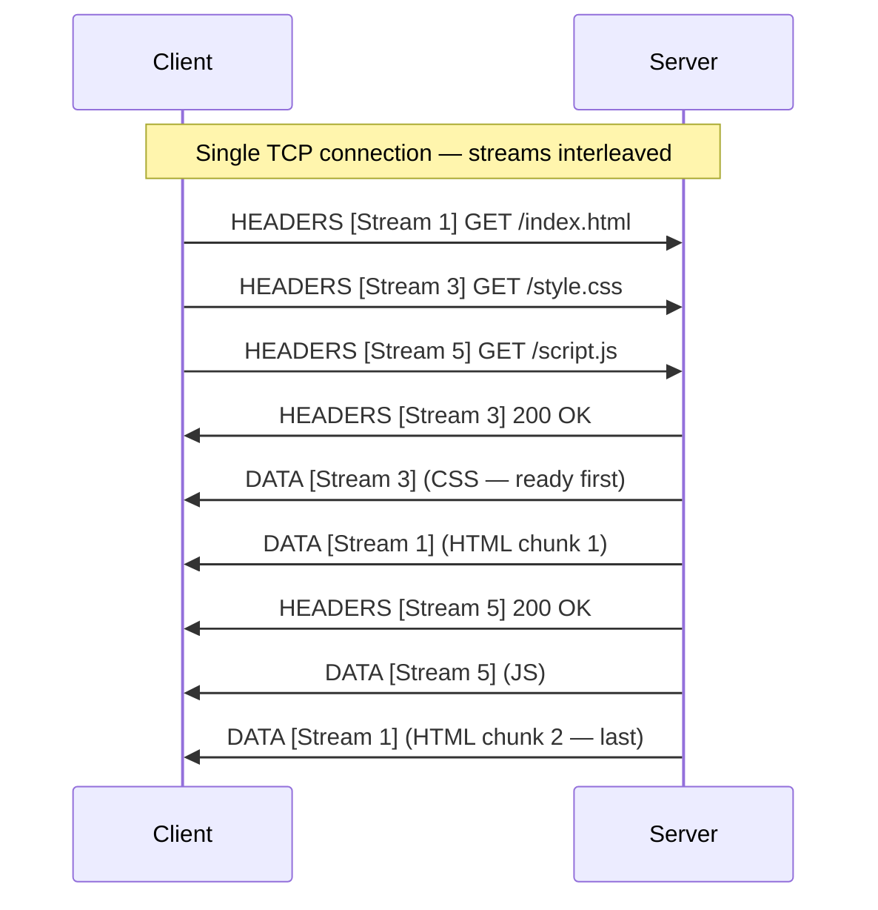
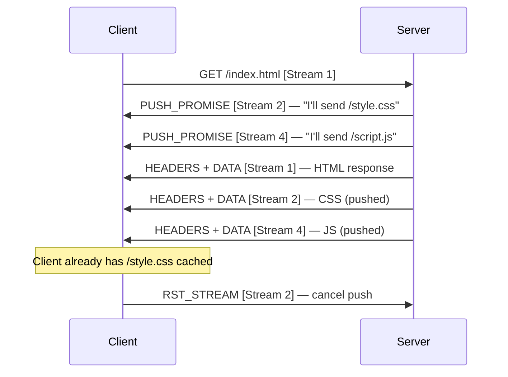

You're loading a product page that pulls 40 sub-resources from the same origin. Over HTTP/1.1, the browser opens 6 parallel TCP connections and serializes the rest behind them; the page renders in 2.1 seconds. Flip the server to HTTP/2 and the same request set finishes in 700ms over a single connection — same bytes on the wire, no code changes, no extra hardware. The difference is the binary framing layer.

HTTP/2 (originally RFC 7540 in 2015, now superseded by RFC 9113 in 2022) keeps the same semantics as HTTP/1.1 — methods, status codes, headers — but replaces the text-based wire format with a **binary framing layer**. The primary goals: eliminate HOL blocking at the application layer, reduce header overhead, and allow multiple requests to share a single TCP connection.

## Binary Framing Layer

HTTP/1.1 sends requests and responses as ASCII text. HTTP/2 splits every message into **frames** — small binary units that can be interleaved and reassembled.

```
HTTP/1.1 (text)                HTTP/2 (binary frames)
──────────────────             ──────────────────────
GET /index.html HTTP/1.1  →    HEADERS frame
Host: example.com              DATA frame(s)
Accept: text/html
[blank line]
```

### Frame Structure

Every frame starts with a fixed 9-byte header:

```
┌──────────────────────────────────────┐
│  Length: 24 bits  │  Type: 8 bits    │
├──────────────────────────────────────┤
│  Flags: 8 bits    │  Stream ID: 31 b │
├──────────────────────────────────────┤
│  Payload (variable, up to 16KB–16MB) │
└──────────────────────────────────────┘
```

| Frame Type | Purpose |
|------------|---------|
| `HEADERS` | Initiates a stream; carries request/response headers (HPACK-compressed) |
| `DATA` | Carries body bytes for a stream |
| `SETTINGS` | Negotiates connection parameters (max frame size, header table size, etc.) |
| `WINDOW_UPDATE` | Flow control — grants permission to send more data |
| `PUSH_PROMISE` | Server announces a resource it will push before being asked |
| `RST_STREAM` | Immediately terminate a single stream without closing the connection |
| `GOAWAY` | Gracefully close the connection; signals last processed stream ID |
| `PING` | Measure round-trip time; keep connection alive |

## Streams and Multiplexing

A **stream** is a logical bidirectional channel within a single TCP connection. Each stream carries one request/response pair and has a unique integer ID.

- Client-initiated streams: **odd IDs** (1, 3, 5, …)
- Server-initiated streams (push): **even IDs** (2, 4, 6, …)
- Stream 0: reserved for connection-level control frames (SETTINGS, PING, GOAWAY)

Multiple streams are **interleaved** on the same connection — frames from different streams can be mixed freely:




This eliminates **application-level HOL blocking**. In HTTP/1.1, a slow response blocked everything behind it. In HTTP/2, Stream 1 being slow has no effect on Streams 3 or 5.


**Key properties:**
- Default max concurrent streams: 100 (negotiated via `SETTINGS_MAX_CONCURRENT_STREAMS`)
- Browsers typically use **one TCP connection per origin** (vs 6 in HTTP/1.1)
- Streams can be opened and closed independently without affecting the connection

## HPACK Header Compression

HTTP/1.1 sends headers as plain text on every request. A typical request carries 500–2000 bytes of headers (cookies, user-agent, accept-*) even when most of them haven't changed.

HPACK (RFC 7541) compresses headers using two techniques:

### Static Table

A predefined table of 61 common header name/value pairs. Sending the index number instead of the literal string:

| Index | Header | Value |
|-------|--------|-------|
| 2 | `:method` | `GET` |
| 3 | `:method` | `POST` |
| 4 | `:path` | `/` |
| 7 | `:scheme` | `https` |
| 8 | `:status` | `200` |
| 13 | `content-length` | |
| 23 | `content-type` | `application/json` |

Sending `GET /` over HTTPS takes **2 bytes** (indices 2 and 7) instead of the full text.

### Dynamic Table

Both client and server maintain a table that grows as new headers are seen. A header sent once can be referenced by index in all subsequent requests. The table is **per-connection** — entries are lost when the connection closes.

```
Request 1: Authorization: Bearer eyJhbGc...  → sent as literal, added to dynamic table at index 62
Request 2: Authorization: Bearer eyJhbGc...  → sent as index 62 (single byte)
```

### Huffman Encoding

Literal values that can't be indexed are Huffman-encoded — common characters use fewer bits. Average compression: **~85–95% reduction** in header bytes on subsequent requests.


Compression oracle attacks (CRIME targeted DEFLATE inside TLS/SPDY; BREACH targeted gzip-compressed HTTP response bodies) exploit the fact that secret bytes compress more efficiently when they appear alongside known plaintext. HPACK uses Huffman encoding — not DEFLATE — so it is not directly vulnerable to those specific attacks. However, the same class of attack applies if attacker-controlled values can be injected into the same compression context as secrets. Never mix user-controlled input with sensitive values in the same compressed header block.


## Server Push

The server can proactively send resources the client will need — before the client asks for them.



**When it helps:** Server knows from the HTML response that the client will need CSS and JS. By pushing them immediately, it eliminates a round trip.

**Limitations in practice:**
- Server can't know if the client already has the resource cached
- Pushed resources can't be shared across tabs (unlike cached responses)
- Client can cancel with `RST_STREAM` but bandwidth for the pushed data is already spent
- **Deprecated in Chrome (2022)** and removed from Firefox; replaced by `103 Early Hints`


Use **`Link: </style.css>; rel=preload`** in response headers or `103 Early Hints` instead of server push. The browser can then decide whether to fetch based on its cache.


## Flow Control

Each stream and the connection itself has a **receive window** — the maximum amount of unacknowledged `DATA` frames the sender can transmit.

- Default window: 65,535 bytes (per stream and connection)
- Receiver sends `WINDOW_UPDATE` to grant more capacity
- Prevents a fast sender from overwhelming a slow receiver
- Operates at both stream level and connection level independently

## HTTP/2 Limitations

| Problem | Why it persists |
|---------|----------------|
| TCP-level HOL blocking | All streams share one TCP connection; a single dropped packet stalls every stream |
| Slow start | New TCP connections start with a small congestion window; takes time to ramp up |
| Connection migration breaks | TCP connections are tied to IP:port; a network change (WiFi → cellular) kills the connection |
| Handshake latency | TCP 3-way handshake + TLS 1.3 = minimum 2 RTT before first byte |


**TCP-level HOL blocking is worse in HTTP/2 than HTTP/1.1.** HTTP/1.1 opens 6 connections — a packet loss on one affects only ~1/6 of requests. HTTP/2 uses one connection — a packet loss stalls 100% of in-flight streams simultaneously.


## HTTP/1.1 vs HTTP/2

| Feature | HTTP/1.1 | HTTP/2 |
|---------|----------|--------|
| Wire format | Text (ASCII) | Binary frames |
| Connections per origin | 6 (browser workaround) | 1 |
| Request multiplexing | ❌ | ✅ |
| HOL blocking (app level) | ✅ (pipelining) | ❌ |
| HOL blocking (TCP level) | ✅ | ✅ |
| Header compression | ❌ (plaintext, repeated) | ✅ (HPACK) |
| Server push | ❌ | ✅ (deprecated in practice) |
| TLS required | No | No (but enforced by all browsers) |


**Interview tip:** "HTTP/2's wins: binary framing eliminates app-level HOL blocking, HPACK compresses repeated headers by 85–95%, and one TCP connection replaces the 6-connection-per-origin hack. The catch: TCP-level HOL blocking is actually worse — a single dropped packet stalls every stream. That's why I'd reach for [HTTP/3](../http-3) on lossy networks. Skip server push — use `103 Early Hints` instead."


## Test Your Understanding


**TCP-level HOL blocking.** HTTP/2 multiplexes all streams over one TCP connection. With 2% packet loss, roughly 1 in 50 TCP segments is lost. Each loss stalls **every** in-flight stream until retransmission completes (~1 RTT).

HTTP/1.1 opens 6 parallel connections. A lost packet on one connection stalls only that connection — the other 5 continue. On lossy networks, 6 independent connections provide better aggregate throughput than one multiplexed connection.

**This is the fundamental reason HTTP/3 exists** — QUIC streams are independent at the transport layer, so loss on one stream doesn't affect others.



The HPACK dynamic table is built up over the **lifetime of a single connection**. After many requests, frequently used headers (like `Authorization: Bearer <token>`) are referenced by index (1 byte) instead of sent literally (hundreds of bytes).

If the load balancer routes the client to 3 different backends, there are 3 separate HTTP/2 connections, each with its own dynamic table. Each table starts empty and takes several requests to warm up. The client pays full literal header cost on every connection switch.

**Mitigation:** Use **sticky sessions** or **connection pooling** at the load balancer so the client reuses the same backend connection. Or accept the trade-off — HPACK's static table (61 predefined entries) still provides significant compression even without a warm dynamic table.



The server sends a **`RST_STREAM`** with error code `REFUSED_STREAM` for the excess stream. The client must wait for an existing stream to complete before opening a new one. The client-side HTTP/2 implementation typically queues the request internally until a stream becomes available.

This means under heavy load, HTTP/2 can still experience **queuing delays** — not HOL blocking, but throughput limitation. If 100 streams are in flight and all are slow, the 101st request waits.

**Mitigation:** The limit is negotiable via `SETTINGS_MAX_CONCURRENT_STREAMS`. Servers can raise it (e.g., 256), but higher limits increase memory usage per connection. For extremely high concurrency, the client may open **multiple HTTP/2 connections** to the same origin — uncommon but allowed.



The client **already has the resources in its browser cache**. When the server sends `PUSH_PROMISE`, the client checks its cache. If the resource is already cached, it sends `RST_STREAM` to cancel the push — but the server has already started sending data. The bandwidth for the pushed bytes is **wasted**.

Server push cannot know the client's cache state. This is the fundamental flaw — the server guesses what the client needs, but the client may already have it from a previous page load.

**Why Chrome deprecated server push (2022):** In real-world measurements, push rarely improved performance and often wasted bandwidth. The replacement is `103 Early Hints` with `Link: rel=preload` — the server sends hints, and the **client** decides whether to fetch based on its cache.

