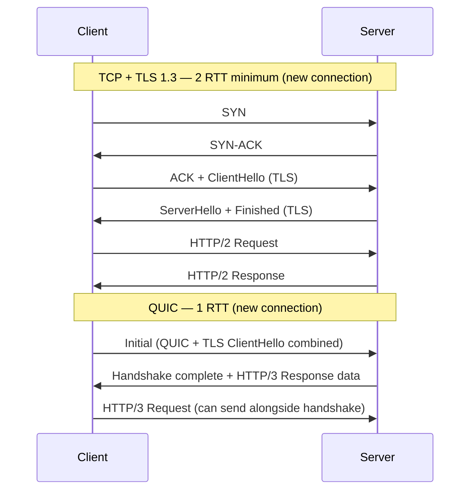
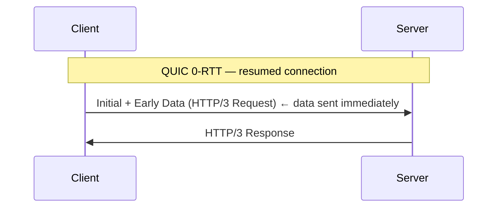
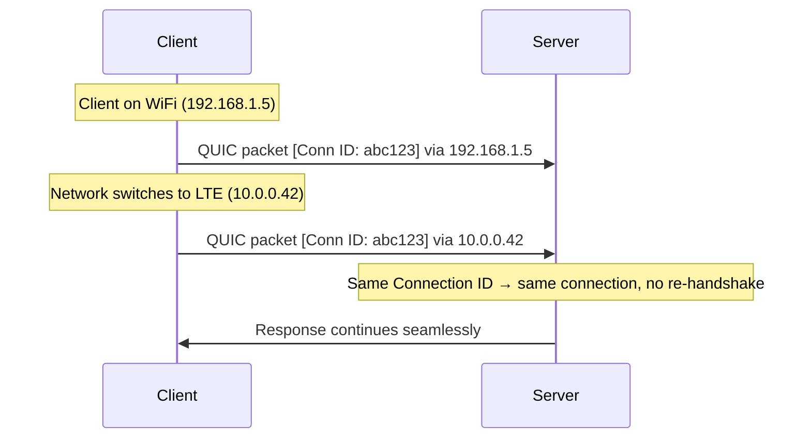

HTTP/3 (RFC 9114, 2022) replaces TCP with **QUIC** (RFC 9000) as the transport layer. QUIC is built on UDP and reimplements reliable transport in user space, solving the two remaining problems of HTTP/2: TCP-level HOL blocking and slow connection establishment.

## Why Not Fix TCP?

TCP is implemented in the OS kernel. Deploying changes requires OS updates across billions of devices — a process that takes years. QUIC runs in user space (as part of the application), enabling rapid iteration.

| | TCP | QUIC |
|---|-----|------|
| Layer | OS kernel | User space |
| Deployment speed | Years (OS updates) | App update |
| Base protocol | — (is the transport) | UDP |
| Encryption | Optional (TLS on top) | Mandatory (TLS 1.3 built-in) |
| Connection identity | IP:port 4-tuple | Connection ID (opaque bytes) |

## QUIC Streams — No TCP-Level HOL Blocking

In HTTP/2, all streams share one TCP connection. A single lost packet blocks every stream:

```
HTTP/2 over TCP — packet loss stalls ALL streams

Stream 1: [■■■ LOST ■■■ ■■■ ■■■]  ← all frames behind lost packet wait
Stream 3: [■■■ ■■■ ■■■ ■■■ ■■■]  ← stalled
Stream 5: [■■■ ■■■ ■■■ ■■■ ■■■]  ← stalled
```

QUIC streams are **independent at the transport layer**. Packet loss on one stream has no effect on others:

```
HTTP/3 over QUIC — packet loss isolated to one stream

Stream 1: [■■■ LOST ■■■ ■■■ ■■■]  ← retransmits only what's needed
Stream 3: [■■■ ■■■ ■■■ ■■■ ■■■]  ← unaffected, keeps flowing
Stream 5: [■■■ ■■■ ■■■ ■■■ ■■■]  ← unaffected, keeps flowing
```


This is the fundamental improvement of HTTP/3 over HTTP/2. Everything else (0-RTT, connection migration) is a bonus; stream independence is the core reason HTTP/3 exists.


## Connection Establishment

HTTP/2 over TCP requires at minimum 2 round trips before the first byte of application data:



### 0-RTT (Resumed Connections)

When reconnecting to a known server, QUIC can send application data with the **very first packet** — zero round trips before data:



QUIC saves a session ticket from the previous connection. On reconnect, the client uses it to derive keys and encrypt data before receiving any server response.


**0-RTT data is vulnerable to replay attacks.** An attacker who captures the 0-RTT packet can replay it. Servers must only accept **idempotent requests** (GET, HEAD) in 0-RTT data — never POST, payment operations, or state-changing requests.


## Connection Migration

TCP connections are bound to the client's **IP address and port**. A network change (WiFi → cellular, VPN connect/disconnect, IP reassignment) kills the connection — the client must re-establish a new TCP connection and TLS session from scratch.

QUIC uses a **Connection ID** instead of IP:port to identify connections:



The connection ID is a cryptographically opaque byte string chosen by the server. The server uses it to look up connection state regardless of which IP packet it arrives from.

**Practical impact:** Streaming video, file downloads, and real-time apps survive network transitions without interruption.

## TLS 1.3 — Built In

TLS is not optional in QUIC. The TLS 1.3 handshake is **integrated into the QUIC handshake**, not layered on top:

- In TCP: `TCP handshake → TLS handshake → data`
- In QUIC: `single combined handshake → data`

QUIC encrypts **everything** — not just the payload. Even packet numbers and connection IDs (in some cases) are encrypted, preventing middlebox interference and passive traffic analysis.

## QPACK — Header Compression for HTTP/3

HTTP/2 uses HPACK, which has a problem in a QUIC context: the dynamic table assumes headers arrive in order. QUIC streams can deliver packets out of order.

**QPACK** (RFC 9204) adapts HPACK for QUIC:

| | HPACK (HTTP/2) | QPACK (HTTP/3) |
|---|---|---|
| Transport assumption | Ordered (TCP) | Can be unordered (QUIC) |
| Dynamic table updates | Inline in HEADERS frames | Sent on a dedicated encoder stream |
| Decoder acknowledgements | Implicit | Explicit (on decoder stream) |
| Blocking | Headers block on dynamic table | Can send without blocking (reduced compression) |

QPACK uses two dedicated unidirectional QUIC streams:
- **Encoder stream**: server sends dynamic table updates
- **Decoder stream**: client acknowledges which updates it has applied

## HTTP/3 Frame Types

HTTP/3 defines its own frame types over QUIC streams. QUIC already handles reliability and multiplexing, so HTTP/3 has a simpler set:

| Frame | Purpose |
|-------|---------|
| `HEADERS` | Carries QPACK-compressed request/response headers |
| `DATA` | Carries body bytes |
| `SETTINGS` | Connection-level configuration (sent on a control stream) |
| `GOAWAY` | Signals graceful shutdown |
| `MAX_PUSH_ID` | Limits server push (server push is effectively unused in practice) |


QUIC streams map to HTTP/3 streams 1:1. A client request opens a bidirectional QUIC stream; the response arrives on the same stream. Control frames (SETTINGS, GOAWAY) travel on dedicated unidirectional streams.


## Deployment Considerations

### Discovery — Alt-Svc

Browsers don't know a server supports HTTP/3 in advance. The server advertises it via the `Alt-Svc` response header on an HTTP/1.1 or HTTP/2 connection:

```
Alt-Svc: h3=":443"; ma=86400
```

The browser then attempts HTTP/3 on the next connection (or in parallel). `ma` is the max-age in seconds for how long to remember the advertisement.

### CDN and Proxy Termination

| Layer | Behaviour |
|-------|-----------|
| CDN edge (Cloudflare, Fastly, AWS CloudFront) | Terminates QUIC/HTTP/3 at the edge; origin connection may still be HTTP/2 or HTTP/1.1 |
| Reverse proxy (Nginx, Caddy, HAProxy) | Must listen on **UDP port 443** for QUIC; separate from TCP 443 for HTTP/1.1 and HTTP/2 |
| Load balancer (L4) | Must forward UDP to correct backend; QUIC Connection IDs must be routed consistently |


**UDP port 443 is frequently blocked** by corporate firewalls, some ISPs, and older middleware. Browsers fall back to HTTP/2 over TCP when QUIC is blocked. Always keep HTTP/2 working as a fallback.


### Connection Coalescing

If multiple hostnames resolve to the same IP and share a TLS certificate, a QUIC connection can be **reused across origins** — reducing connection overhead for CDN-hosted assets.

## Protocol Comparison

| Feature | HTTP/1.1 | HTTP/2 | HTTP/3 |
|---------|----------|--------|--------|
| Transport | TCP | TCP | QUIC (UDP) |
| Wire format | Text | Binary frames | Binary frames |
| Multiplexing | ❌ (6 connections) | ✅ (streams) | ✅ (streams) |
| App-level HOL blocking | ✅ | ❌ | ❌ |
| TCP-level HOL blocking | ✅ | ✅ | ❌ |
| Header compression | ❌ | HPACK | QPACK |
| TLS required | No | No (browser-enforced) | Yes (always) |
| Handshake latency | 2 RTT | 2 RTT | 1 RTT |
| 0-RTT resumption | ❌ | ❌ | ✅ (idempotent only) |
| Connection migration | ❌ | ❌ | ✅ |
| Server push | ❌ | ✅ (deprecated) | ✅ (unused) |
| Middlebox ossification risk | Low | Medium | Low (encrypted) |
