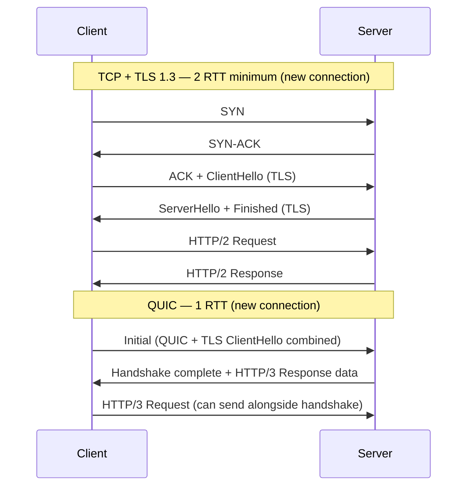
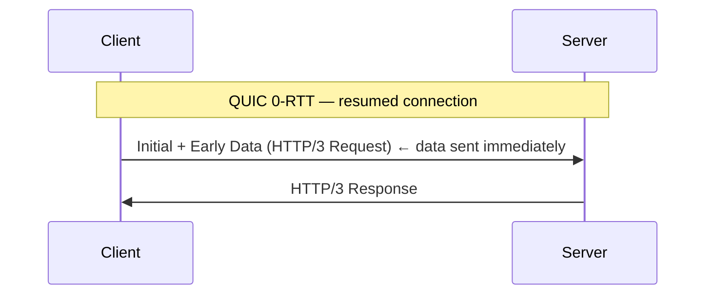
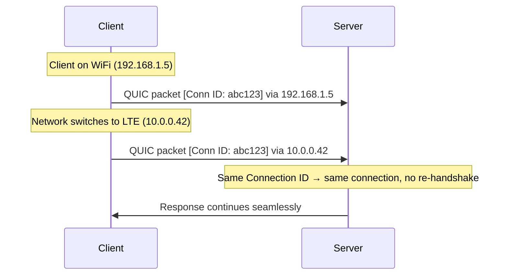

A user is streaming video on your app. They walk out of WiFi range and their phone switches to LTE — the IP address changes. Over HTTP/2, the TCP connection is dead; the phone re-handshakes TCP and TLS from scratch, the video buffers for 1–2 seconds, and your engagement metrics dip every time someone walks down a hallway. Over HTTP/3, the connection survives the IP change because it's identified by an opaque Connection ID, not a 4-tuple — playback never stutters. That single property, plus stream-independent loss recovery, is the reason HTTP/3 exists.

HTTP/3 (RFC 9114, 2022) replaces TCP with **QUIC** (RFC 9000) as the transport layer. QUIC is built on UDP and reimplements reliable transport in user space, solving the two remaining problems of HTTP/2: TCP-level HOL blocking and slow connection establishment.

## Why Not Fix TCP?

TCP is implemented in the OS kernel. Deploying changes requires OS updates across billions of devices — a process that takes years. QUIC runs in user space (as part of the application), enabling rapid iteration.

| | TCP | QUIC |
|---|-----|------|
| Layer | OS kernel | User space |
| Deployment speed | Years (OS updates) | App update |
| Base protocol | — (is the transport) | UDP |
| Encryption | Optional (TLS on top) | Mandatory (TLS 1.3 built-in) |
| Connection identity | IP:port 4-tuple | Connection ID (opaque bytes) |

## QUIC Streams — No TCP-Level HOL Blocking

In HTTP/2, all streams share one TCP connection. A single lost packet blocks every stream:

```
HTTP/2 over TCP — packet loss stalls ALL streams

Stream 1: [■■■ LOST ■■■ ■■■ ■■■]  ← all frames behind lost packet wait
Stream 3: [■■■ ■■■ ■■■ ■■■ ■■■]  ← stalled
Stream 5: [■■■ ■■■ ■■■ ■■■ ■■■]  ← stalled
```

QUIC streams are **independent at the transport layer**. Packet loss on one stream has no effect on others:

```
HTTP/3 over QUIC — packet loss isolated to one stream

Stream 1: [■■■ LOST ■■■ ■■■ ■■■]  ← retransmits only what's needed
Stream 3: [■■■ ■■■ ■■■ ■■■ ■■■]  ← unaffected, keeps flowing
Stream 5: [■■■ ■■■ ■■■ ■■■ ■■■]  ← unaffected, keeps flowing
```


This is the fundamental improvement of HTTP/3 over HTTP/2. Everything else (0-RTT, connection migration) is a bonus; stream independence is the core reason HTTP/3 exists.


## Connection Establishment

HTTP/2 over TCP requires at minimum 2 round trips before the first byte of application data:



### 0-RTT (Resumed Connections)

When reconnecting to a known server, QUIC can send application data with the **very first packet** — zero round trips before data:



QUIC saves a session ticket from the previous connection. On reconnect, the client uses it to derive keys and encrypt data before receiving any server response.


**0-RTT data is vulnerable to replay attacks.** An attacker who captures the 0-RTT packet can replay it. Servers must only accept **idempotent requests** (GET, HEAD) in 0-RTT data — never POST, payment operations, or state-changing requests.


## Connection Migration

TCP connections are bound to the client's **IP address and port**. A network change (WiFi → cellular, VPN connect/disconnect, IP reassignment) kills the connection — the client must re-establish a new TCP connection and TLS session from scratch.

QUIC uses a **Connection ID** instead of IP:port to identify connections:



The connection ID is a cryptographically opaque byte string chosen by the server. The server uses it to look up connection state regardless of which IP packet it arrives from.

**Practical impact:** Streaming video, file downloads, and real-time apps survive network transitions without interruption.

## TLS 1.3 — Built In

TLS is not optional in QUIC. The TLS 1.3 handshake is **integrated into the QUIC handshake**, not layered on top:

- In TCP: `TCP handshake → TLS handshake → data`
- In QUIC: `single combined handshake → data`

QUIC encrypts **everything** — not just the payload. Packet numbers are always encrypted (preventing on-path traffic analysis), and most header fields are protected; the connection IDs that have to be visible for routing remain in cleartext in the long header during the initial handshake. The result still prevents middlebox interference far better than TLS-over-TCP, where the entire TCP header is exposed.

## QPACK — Header Compression for HTTP/3

HTTP/2 uses HPACK, which has a problem in a QUIC context: the dynamic table assumes headers arrive in order. QUIC streams can deliver packets out of order.

**QPACK** (RFC 9204) adapts HPACK for QUIC:

| | HPACK (HTTP/2) | QPACK (HTTP/3) |
|---|---|---|
| Transport assumption | Ordered (TCP) | Can be unordered (QUIC) |
| Dynamic table updates | Inline in HEADERS frames | Sent on a dedicated encoder stream |
| Decoder acknowledgements | Implicit | Explicit (on decoder stream) |
| Blocking | Headers block on dynamic table | Can send without blocking (reduced compression) |

QPACK uses two dedicated unidirectional QUIC streams:
- **Encoder stream**: server sends dynamic table updates
- **Decoder stream**: client acknowledges which updates it has applied

## HTTP/3 Frame Types

HTTP/3 defines its own frame types over QUIC streams. QUIC already handles reliability and multiplexing, so HTTP/3 has a simpler set:

| Frame | Purpose |
|-------|---------|
| `HEADERS` | Carries QPACK-compressed request/response headers |
| `DATA` | Carries body bytes |
| `SETTINGS` | Connection-level configuration (sent on a control stream) |
| `GOAWAY` | Signals graceful shutdown |
| `MAX_PUSH_ID` | Limits server push (server push is effectively unused in practice) |


QUIC streams map to HTTP/3 streams 1:1. A client request opens a bidirectional QUIC stream; the response arrives on the same stream. Control frames (SETTINGS, GOAWAY) travel on dedicated unidirectional streams.


## Deployment Considerations

### Discovery — Alt-Svc

Browsers don't know a server supports HTTP/3 in advance. The server advertises it via the `Alt-Svc` response header on an HTTP/1.1 or HTTP/2 connection:

```
Alt-Svc: h3=":443"; ma=86400
```

The browser then attempts HTTP/3 on the next connection (or in parallel). `ma` is the max-age in seconds for how long to remember the advertisement.

### CDN and Proxy Termination

| Layer | Behaviour |
|-------|-----------|
| CDN edge (Cloudflare, Fastly, AWS CloudFront) | Terminates QUIC/HTTP/3 at the edge; origin connection may still be HTTP/2 or HTTP/1.1 |
| Reverse proxy (Nginx, Caddy, HAProxy) | Must listen on **UDP port 443** for QUIC; separate from TCP 443 for HTTP/1.1 and HTTP/2 |
| Load balancer (L4) | Must forward UDP to correct backend; QUIC Connection IDs must be routed consistently |


**UDP port 443 is frequently blocked** by corporate firewalls, some ISPs, and older middleware. Browsers fall back to HTTP/2 over TCP when QUIC is blocked. Always keep HTTP/2 working as a fallback.


### Connection Coalescing

If multiple hostnames resolve to the same IP and share a TLS certificate, a QUIC connection can be **reused across origins** — reducing connection overhead for CDN-hosted assets.

## Protocol Comparison

| Feature | HTTP/1.1 | HTTP/2 | HTTP/3 |
|---------|----------|--------|--------|
| Transport | TCP | TCP | QUIC (UDP) |
| Wire format | Text | Binary frames | Binary frames |
| Multiplexing | ❌ (6 connections) | ✅ (streams) | ✅ (streams) |
| App-level HOL blocking | ✅ | ❌ | ❌ |
| TCP-level HOL blocking | ✅ | ✅ | ❌ |
| Header compression | ❌ | HPACK | QPACK |
| TLS required | No | No (browser-enforced) | Yes (always) |
| Handshake latency | 2 RTT | 2 RTT | 1 RTT |
| 0-RTT resumption | ❌ | ❌ | ✅ (idempotent only) |
| Connection migration | ❌ | ❌ | ✅ |
| Server push | ❌ | ✅ (deprecated) | ✅ (unused) |
| Middlebox ossification risk | Low | Medium | Low (encrypted) |


**Interview tip:** "HTTP/3 for mobile clients and lossy networks. The core win: QUIC streams are independent at the transport layer — a dropped packet only affects one stream. Connection migration via Connection ID survives WiFi-to-LTE handoffs. Advertise via `Alt-Svc` with HTTP/2 fallback — UDP 443 is often blocked. Two traps: 0-RTT data is replay-vulnerable (reject non-idempotent requests), and CDN-to-origin should stay HTTP/2 (RTT too low for QUIC's handshake savings). See the [version comparison](../http-evolution) for a side-by-side view."


## Test Your Understanding


QUIC reimplements reliability **in user space** on top of UDP. Each QUIC stream has its own:

1. **Sequence numbers** (packet numbers) — monotonically increasing, never reused (unlike TCP which can wrap)
2. **ACK frames** — the receiver sends ACK frames listing which packet numbers it has received
3. **Retransmission** — lost packets are detected via ACK gaps and timers, then retransmitted
4. **Flow control** — per-stream and per-connection credit-based flow control (similar to HTTP/2's WINDOW_UPDATE)

The key difference from TCP: loss recovery is **per-stream**. A lost packet on Stream 1 only blocks Stream 1's data. Stream 3's data, even if it arrived in the same UDP datagram, is delivered immediately. TCP can't do this because it guarantees in-order delivery of the **entire byte stream**, not per-logical-stream.



QUIC identifies connections by a **Connection ID** (an opaque byte string), not by the IP:port 4-tuple. When the phone's IP changes (WiFi → cellular), it sends the next QUIC packet from the new IP but with the **same Connection ID**. The server looks up the connection by ID, finds the existing state, and continues.

There is no re-handshake — the cryptographic keys from the original handshake are still valid because they were negotiated per-Connection-ID, not per-IP. The server may issue a new Connection ID for the new path (to prevent linkability) via a `NEW_CONNECTION_ID` frame, but the logical connection is uninterrupted.

TCP connections are identified by (src IP, src port, dst IP, dst port). Any change to this 4-tuple kills the connection — requiring a full TCP + TLS handshake, which takes 2 RTTs and interrupts playback.



**Replay attack.** An attacker who captures the 0-RTT packet can replay it to the server. Since 0-RTT data is sent before the handshake completes, the server has no way to distinguish the original request from a replay. The `/charge` endpoint processes the payment **twice**.

0-RTT data lacks **forward secrecy for replay protection** — the session ticket from the previous connection is used to derive keys, and anyone who captured the initial packet can resend it.

**Fix:** Servers must only accept **idempotent requests** (GET, HEAD) in 0-RTT data. Reject POST, PUT, DELETE, or any state-changing request in early data. Alternatively, implement server-side replay detection (a strike register of recently seen 0-RTT tokens), but this adds state and complexity.



QUIC uses **Connection IDs** to route packets to the correct connection state. The L4 LB must route all packets with the same Connection ID to the same backend server. If the LB routes based on the IP:port 4-tuple (like TCP), a QUIC connection migration (client IP change) or a new backend deployment can route packets to a server that doesn't have the connection state → **connection reset**.

**Why TCP doesn't have this problem:** TCP connections are identified by the 4-tuple, which doesn't change mid-connection. The LB's flow table maps the 4-tuple to a backend, and it stays consistent.

**Fix for QUIC:** Use a **QUIC-aware L4 LB** that parses the Connection ID from the QUIC header and routes based on it. Alternatively, encode a backend identifier in the Connection ID itself (Cloudflare's approach) — the LB can extract the target backend from the Connection ID without maintaining any state.



**Middlebox ossification.** Over decades, network middleboxes (firewalls, NATs, WAN optimizers) have been built to inspect and sometimes modify TCP header fields. When TCP tries to deploy new features (like TCP Fast Open or new congestion control), middleboxes that don't recognize the new fields may drop or mangle the packets. This effectively **froze TCP evolution** — any change that modifies visible header fields breaks on some fraction of the internet.

QUIC encrypts packet numbers, most header fields, and all payload. Middleboxes can see the Connection ID (for routing) and a few bits for packet handling, but nothing else. They can't inspect or modify QUIC internals, so QUIC can evolve freely without middlebox interference.

TLS-over-TCP only encrypts the payload. The entire TCP header (sequence numbers, window size, flags, options) remains in plaintext — visible and modifiable by middleboxes. This is why TCP couldn't evolve and QUIC was built from scratch on UDP.

