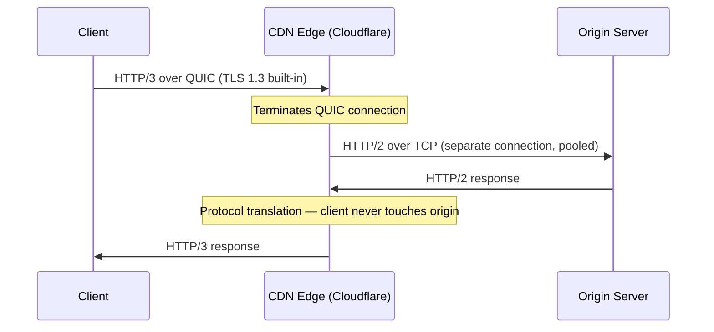

A side-by-side view of what changed across HTTP versions, who benefits from each, and how the protocol is handled at CDN edges and reverse proxies.

## Protocol Comparison

| | HTTP/1.1 | HTTP/2 | HTTP/3 |
|---|---|---|---|
| **Transport** | TCP | TCP | QUIC (UDP) |
| **Wire format** | Text | Binary frames | Binary frames |
| **Multiplexing** | ❌ (6 conns/origin workaround) | ✅ streams over 1 TCP conn | ✅ independent QUIC streams |
| **App-level HOL blocking** | ✅ | ❌ | ❌ |
| **TCP-level HOL blocking** | ✅ | ✅ (worse — 1 conn) | ❌ (QUIC streams are independent) |
| **Header compression** | ❌ (plaintext, repeated) | HPACK | QPACK |
| **Connection setup** | 1 RTT (TCP) + 1 RTT (TLS 1.3) | Same as HTTP/1.1 | 1 RTT new / 0-RTT resumed |
| **Connection migration** | ❌ | ❌ | ✅ (Connection ID survives IP change) |
| **HTTPS required** | No | In practice yes (browsers enforce) | Yes (TLS 1.3 built into QUIC) |

## Practical Implications by Client Type

| Client | Best fit | Reason |
|--------|----------|--------|
| **Browser** | HTTP/2 (today), HTTP/3 (lossy networks) | Many small sub-resources — multiplexing replaces 6 parallel TCP conns. HTTP/3 eliminates HOL on mobile/congested WiFi |
| **Mobile app (iOS/Android)** | HTTP/3 | Connection migration survives WiFi↔LTE switches; 0-RTT saves 100–300ms on wakeup; independent streams under packet loss |
| **gRPC** | HTTP/2 | gRPC is built on HTTP/2; multiplexing handles bursty RPC traffic |
| **REST (chatty, many small calls)** | HTTP/2 | Single connection with multiplexing; eliminates connection pool churn |
| **REST (infrequent, large payloads)** | HTTP/1.1 or HTTP/2 | Multiplexing advantage is smaller; keep-alive handles the infrequent case |
| **Event streaming (SSE, chunked)** | HTTP/2 | One stream per subscription; no connection-per-subscriber |
| **Cross-region / internet-facing API** | HTTP/3 | Higher latency and loss make QUIC's handshake and HOL advantages meaningful |
| **IoT / constrained devices** | HTTP/1.1 | Small library footprint; QUIC stack too heavy for embedded SDKs |


Most service meshes (Istio, Linkerd) use HTTP/2 for all service-to-service traffic by default, regardless of what the application declares. The sidecar proxy handles protocol upgrade transparently.


## CDN and Proxy Termination

CDNs terminate the client-side protocol and open a separate connection to the origin. The client protocol and the origin protocol are **independently negotiated**.



### Protocol Negotiation

**Client → CDN:** TLS ALPN — client includes supported protocols in the ClientHello (`h2`, `http/1.1`). HTTP/3 is discovered via `Alt-Svc` header or `HTTPS` DNS record; browsers connect over HTTP/2 first, then upgrade on subsequent visits.

```
Alt-Svc: h3=":443"; ma=86400
```

**CDN → Origin:** Negotiated separately. Most CDN-to-origin connections use HTTP/2 or HTTP/1.1 — QUIC/HTTP/3 to origin is uncommon (see below).

### CDN Behavior by Provider

| CDN / Proxy | Client-facing | Origin-facing | Notes |
|-------------|--------------|---------------|-------|
| Cloudflare | HTTP/3 ✅ | HTTP/2 or HTTP/1.1 | HTTP/3 to origin available but opt-in |
| AWS CloudFront | HTTP/3 ✅ | HTTP/2 or HTTP/1.1 | No HTTP/3 to origin |
| Fastly | HTTP/3 ✅ | HTTP/2 or HTTP/1.1 | HTTP/3 to origin in beta |
| Nginx (self-hosted) | HTTP/2 ✅, HTTP/3 via QUIC module | HTTP/1.1 only (`proxy_pass`) | `proxy_pass` does not support upstream HTTP/2; use `grpc_pass` for gRPC |
| Envoy | HTTP/2 ✅, HTTP/3 ✅ | HTTP/2 ✅, HTTP/3 ✅ | Full support upstream and downstream |
| HAProxy | HTTP/2 ✅ | HTTP/1.1 or HTTP/2 | HTTP/3 support experimental |

### Why Origins Stay on HTTP/1.1 or HTTP/2

- **CDN connection collapsing**: a CDN PoP serving thousands of clients opens only 10–50 connections to origin. HTTP/2 multiplexing already makes those connections efficient.
- **Low CDN → origin latency**: CDN PoPs are colocated with origin DCs. RTT is 1–5ms — HTTP/3's 1 RTT handshake savings are negligible.
- **UDP firewall rules**: corporate and cloud firewalls commonly allow TCP 443 but block UDP 443.
- **Operational complexity**: QUIC runs in user space and requires more expertise than TCP-based HTTP/2.
