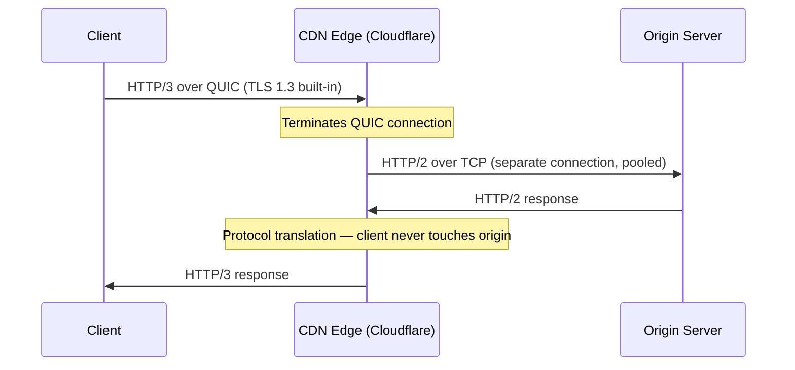

Your team is debating whether to enable HTTP/3 on the public CDN. The mobile team says it'll fix tail-latency complaints from users on flaky LTE; the security team is worried about UDP firewalls; the backend team argues that HTTP/2 is "good enough" for the origin. Each team is right for a different reason — and the decision depends on which segment of the connection you're optimizing.

A side-by-side view of what changed across HTTP versions, who benefits from each, and how the protocol is handled at CDN edges and reverse proxies.

## Protocol Comparison

| | HTTP/1.1 | HTTP/2 | HTTP/3 |
|---|---|---|---|
| **Transport** | TCP | TCP | QUIC (UDP) |
| **Wire format** | Text | Binary frames | Binary frames |
| **Multiplexing** | ❌ (6 conns/origin workaround) | ✅ streams over 1 TCP conn | ✅ independent QUIC streams |
| **App-level HOL blocking** | ✅ | ❌ | ❌ |
| **TCP-level HOL blocking** | ✅ | ✅ (worse — 1 conn) | ❌ (QUIC streams are independent) |
| **Header compression** | ❌ (plaintext, repeated) | HPACK | QPACK |
| **Connection setup** | 1 RTT (TCP) + 1 RTT (TLS 1.3) | Same as HTTP/1.1 | 1 RTT new / 0-RTT resumed |
| **Connection migration** | ❌ | ❌ | ✅ (Connection ID survives IP change) |
| **HTTPS required** | No | In practice yes (browsers enforce) | Yes (TLS 1.3 built into QUIC) |

## Practical Implications by Client Type

| Client | Best fit | Reason |
|--------|----------|--------|
| **Browser** | HTTP/2 (today), HTTP/3 (lossy networks) | Many small sub-resources — multiplexing replaces 6 parallel TCP conns. HTTP/3 eliminates HOL on mobile/congested WiFi |
| **Mobile app (iOS/Android)** | HTTP/3 | Connection migration survives WiFi↔LTE switches; 0-RTT saves 100–300ms on wakeup; independent streams under packet loss |
| **gRPC** | HTTP/2 | gRPC is built on HTTP/2; multiplexing handles bursty RPC traffic |
| **REST (chatty, many small calls)** | HTTP/2 | Single connection with multiplexing; eliminates connection pool churn |
| **REST (infrequent, large payloads)** | HTTP/1.1 or HTTP/2 | Multiplexing advantage is smaller; keep-alive handles the infrequent case |
| **Event streaming (SSE, chunked)** | HTTP/2 | One stream per subscription; no connection-per-subscriber |
| **Cross-region / internet-facing API** | HTTP/3 | Higher latency and loss make QUIC's handshake and HOL advantages meaningful |
| **IoT / constrained devices** | HTTP/1.1 | Small library footprint; QUIC stack too heavy for embedded SDKs |


Most service meshes (Istio, Linkerd) use HTTP/2 for all service-to-service traffic by default, regardless of what the application declares. The sidecar proxy handles protocol upgrade transparently.


## CDN and Proxy Termination

CDNs terminate the client-side protocol and open a separate connection to the origin. The client protocol and the origin protocol are **independently negotiated**.



### Protocol Negotiation

**Client → CDN:** TLS ALPN — client includes supported protocols in the ClientHello (`h2`, `http/1.1`). HTTP/3 is discovered via `Alt-Svc` header or `HTTPS` DNS record; browsers connect over HTTP/2 first, then upgrade on subsequent visits.

```
Alt-Svc: h3=":443"; ma=86400
```

**CDN → Origin:** Negotiated separately. Most CDN-to-origin connections use HTTP/2 or HTTP/1.1 — QUIC/HTTP/3 to origin is uncommon (see below).

### CDN Behavior by Provider

| CDN / Proxy | Client-facing | Origin-facing | Notes |
|-------------|--------------|---------------|-------|
| Cloudflare | HTTP/3 ✅ | HTTP/2 or HTTP/1.1 | HTTP/3 to origin available but opt-in |
| AWS CloudFront | HTTP/3 ✅ | HTTP/2 or HTTP/1.1 | No HTTP/3 to origin |
| Fastly | HTTP/3 ✅ | HTTP/2 or HTTP/1.1 | HTTP/3 to origin in beta |
| Nginx (self-hosted) | HTTP/2 ✅, HTTP/3 via QUIC module | HTTP/1.1 only (`proxy_pass`) | `proxy_pass` does not support upstream HTTP/2; use `grpc_pass` for gRPC |
| Envoy | HTTP/2 ✅, HTTP/3 ✅ | HTTP/2 ✅, HTTP/3 ✅ | Full support upstream and downstream |
| HAProxy | HTTP/2 ✅ | HTTP/1.1 or HTTP/2 | HTTP/3 support experimental |

### Why Origins Stay on HTTP/1.1 or HTTP/2

- **CDN connection collapsing**: a CDN PoP serving thousands of clients opens only 10–50 connections to origin. HTTP/2 multiplexing already makes those connections efficient.
- **Low CDN → origin latency**: CDN PoPs are colocated with origin DCs. RTT is 1–5ms — HTTP/3's 1 RTT handshake savings are negligible.
- **UDP firewall rules**: corporate and cloud firewalls commonly allow TCP 443 but block UDP 443.
- **Operational complexity**: QUIC runs in user space and requires more expertise than TCP-based HTTP/2.


**Interview tip:** "I'd pick the protocol per segment. Browser-to-CDN: HTTP/3 with HTTP/2 fallback via `Alt-Svc` — QUIC's stream independence and 0-RTT are huge wins on mobile, and connection migration survives WiFi-to-LTE handoffs. CDN-to-origin: HTTP/2 over TCP — RTT is 1–5ms, connection collapsing amortizes handshakes, and UDP 443 is often blocked. Service-to-service: HTTP/2 — gRPC requires it, and service meshes handle the upgrade transparently. The trap: HTTP/2 on a single TCP connection makes TCP-level HOL blocking *worse* than HTTP/1.1's six connections — HTTP/3 is the real fix for lossy networks."


## Test Your Understanding


HTTP/2 eliminates **application-level** HOL blocking (one slow response no longer blocks others). But it introduces **TCP-level** HOL blocking that's worse: all streams share one TCP connection, so a single lost TCP packet blocks **every** stream until retransmission completes. HTTP/1.1 uses 6 parallel TCP connections — a lost packet on one connection only blocks 1/6 of requests.

This is exactly why HTTP/3 uses QUIC (UDP-based): each QUIC stream has independent loss recovery, so a lost packet only stalls the affected stream.



No. The client and origin connections are **independently negotiated**. The client still gets HTTP/3's benefits for the segment it controls: 0-RTT connection setup, connection migration, independent stream loss recovery, and QPACK header compression.

The CDN-to-origin leg doesn't need HTTP/3 because: (1) CDN-to-origin RTT is 1–5ms (handshake savings are negligible), (2) the CDN opens only a handful of pooled connections to the origin (multiplexing gains are minimal), and (3) UDP 443 may be blocked in the origin's network.



**0-RTT data is vulnerable to replay attacks.** An attacker who captures the initial 0-RTT packet can replay it to the server, potentially executing the request twice. This is safe for idempotent requests (GET) but dangerous for non-idempotent ones (POST creating a payment).

Servers must either: (1) reject 0-RTT for non-idempotent endpoints, (2) implement server-side replay detection (e.g., using a strike register or single-use ticket), or (3) only serve idempotent, cacheable resources on 0-RTT.

HTTP/2's TLS 1.3 also supports 0-RTT, but it's less commonly used because the handshake is already only 1-RTT.



**HTTP/3 connection migration.** QUIC connections are identified by a **Connection ID** rather than the (source IP, source port, dest IP, dest port) 4-tuple. When the client's IP changes (WiFi → cellular), the Connection ID stays the same and the connection continues without a new handshake.

HTTP/2 over TCP cannot do this — TCP connections are bound to the 4-tuple, so any IP change requires a full TCP + TLS handshake (1–2 RTTs). On a subway where WiFi/cellular switches happen frequently, that's 100–300ms of reconnection delay each time.



HPACK uses a **dynamic table** that both sender and receiver update in strict order — compressing header `:path: /api/users` as index 62 only works if both sides agree on what index 62 is. This requires headers to be processed **in order**.

In HTTP/2 (single TCP connection), ordering is guaranteed by TCP. In HTTP/3 (QUIC), streams are independent and may arrive out of order — if stream 3's header update arrives before stream 2's, the dynamic table becomes inconsistent.

**QPACK** solves this by separating the dynamic table updates into a dedicated unidirectional stream, and using a two-phase reference model: the encoder sends table updates on the control stream and references them in header blocks only after the decoder acknowledges receipt. This preserves compression efficiency without requiring cross-stream ordering.

