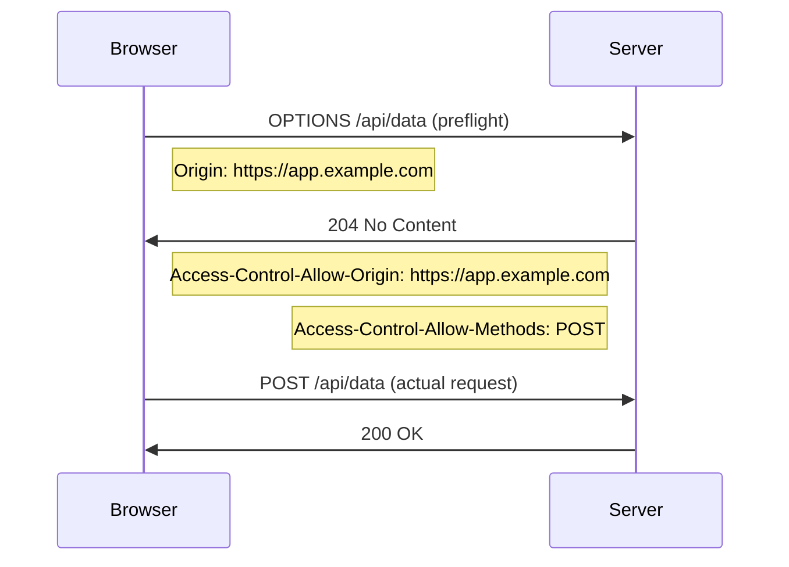

Headers are key-value pairs sent in both requests and responses. Names are **case-insensitive**. Values are strings. Multiple values can be comma-separated or sent as multiple header lines.

```
Header-Name: value
Header-Name: value1, value2
```

Headers are grouped by purpose, not by whether they appear in requests or responses.

## Request Headers

Sent by the client to provide context about the request, the client, and what it will accept.

### Identity & Routing

| Header | Example | Description |
|--------|---------|-------------|
| `Host` | `Host: api.example.com` | Target host and port. **Mandatory** in HTTP/1.1. Enables virtual hosting (multiple sites on one IP). |
| `User-Agent` | `User-Agent: Mozilla/5.0 ...` | Client software identity. Browser, version, OS. |
| `Referer` | `Referer: https://example.com/page` | URL of the page that initiated the request. Note: intentionally misspelled in the spec. |
| `Origin` | `Origin: https://app.example.com` | Origin of the request. Used in CORS. Does not include path. |
| `From` | `From: bot@example.com` | Email of the user/bot. Mainly used by crawlers. |

### Content Negotiation

| Header | Example | Description |
|--------|---------|-------------|
| `Accept` | `Accept: application/json, text/html;q=0.9` | Preferred response MIME types. `q` values indicate priority (default 1.0). |
| `Accept-Encoding` | `Accept-Encoding: gzip, br` | Acceptable compression algorithms for the response body. |
| `Accept-Language` | `Accept-Language: en-US, en;q=0.8` | Preferred natural languages for the response. |
| `Accept-Charset` | `Accept-Charset: utf-8` | Acceptable character encodings. Mostly obsolete; UTF-8 is assumed. |

### Authentication & Authorization

| Header | Example | Description |
|--------|---------|-------------|
| `Authorization` | `Authorization: Bearer eyJhbGc...` | Credentials for the request. Common schemes: `Basic`, `Bearer`, `Digest`, `AWS4-HMAC-SHA256`. |
| `Cookie` | `Cookie: session=abc123; theme=dark` | Cookies previously set by `Set-Cookie`. Sent automatically by the browser. |
| `Proxy-Authorization` | `Proxy-Authorization: Basic dXNlcjpwYXNz` | Credentials for an authenticating proxy. |

### Conditional Requests

Used with caching and to prevent lost-update problems.

| Header | Example | Description |
|--------|---------|-------------|
| `If-None-Match` | `If-None-Match: "abc123"` | Returns `304 Not Modified` if the resource ETag hasn't changed. |
| `If-Modified-Since` | `If-Modified-Since: Tue, 01 Jan 2025 00:00:00 GMT` | Returns `304` if the resource hasn't changed since the given date. |
| `If-Match` | `If-Match: "abc123"` | Proceeds only if resource ETag matches. Used for safe updates (optimistic concurrency). Returns `412` on mismatch. |
| `If-Unmodified-Since` | `If-Unmodified-Since: Tue, 01 Jan 2025 00:00:00 GMT` | Proceeds only if resource hasn't changed since the date. Returns `412` otherwise. |

### Connection & Transmission

| Header | Example | Description |
|--------|---------|-------------|
| `Connection` | `Connection: keep-alive` | Control options for the current connection. `keep-alive` or `close`. |
| `Keep-Alive` | `Keep-Alive: timeout=5, max=100` | Parameters for persistent connection. Works with `Connection: keep-alive`. |
| `Content-Length` | `Content-Length: 348` | Byte length of the request body. Required when sending a body without chunked encoding. |
| `Content-Type` | `Content-Type: application/json` | MIME type of the request body. Required when sending a body. |
| `Transfer-Encoding` | `Transfer-Encoding: chunked` | How the body is encoded for transfer. `chunked` is most common. |
| `Expect` | `Expect: 100-continue` | Asks the server to acknowledge readiness to receive body before the client sends it. Useful for large payloads. |
| `Upgrade` | `Upgrade: websocket` | Request to switch to a different protocol (e.g., WebSocket). |

### Range Requests

| Header | Example | Description |
|--------|---------|-------------|
| `Range` | `Range: bytes=0-1023` | Requests a specific byte range of the resource. Server responds with `206 Partial Content`. |
| `If-Range` | `If-Range: "abc123"` | Combined with `Range`; only applies the range request if the resource hasn't changed. |

### Forwarding & Proxy Headers

| Header | Example | Description |
|--------|---------|-------------|
| `X-Forwarded-For` | `X-Forwarded-For: 203.0.113.5, 198.51.100.1` | Original client IP, added by each proxy in the chain. Rightmost IP is the most recently added. |
| `X-Forwarded-Proto` | `X-Forwarded-Proto: https` | Original protocol (HTTP or HTTPS) used by the client. Set by load balancers/proxies when terminating TLS. |
| `X-Forwarded-Host` | `X-Forwarded-Host: api.example.com` | Original `Host` header, preserved by the proxy. |
| `Forwarded` | `Forwarded: for=203.0.113.5;proto=https` | Standard RFC 7239 replacement for `X-Forwarded-*` headers. |

## Response Headers

Sent by the server to describe the response, control caching, and set client-side state.

### Content Description

| Header | Example | Description |
|--------|---------|-------------|
| `Content-Type` | `Content-Type: application/json; charset=utf-8` | MIME type and optional character encoding of the response body. |
| `Content-Length` | `Content-Length: 1234` | Byte length of the response body. Absent when `Transfer-Encoding: chunked`. |
| `Content-Encoding` | `Content-Encoding: gzip` | Compression applied to the body. Client decompresses before processing. |
| `Content-Language` | `Content-Language: en-US` | Natural language of the response body. |
| `Content-Location` | `Content-Location: /api/users/42` | Alternate URI for the returned resource. |
| `Content-Range` | `Content-Range: bytes 0-1023/5120` | Range of bytes returned in a `206` response. Format: `unit start-end/total`. |
| `Transfer-Encoding` | `Transfer-Encoding: chunked` | How the body is transmitted. Mutually exclusive with `Content-Length`. |

### Resource Identity

| Header | Example | Description |
|--------|---------|-------------|
| `ETag` | `ETag: "abc123"` | Opaque identifier for a specific version of a resource. Used in conditional requests (`If-None-Match`, `If-Match`). |
| `Last-Modified` | `Last-Modified: Mon, 20 Jan 2025 10:00:00 GMT` | Timestamp of last modification. Used in `If-Modified-Since` checks. |
| `Location` | `Location: /api/users/42` | URI of a new or moved resource. Used with `201 Created` and all `3xx` redirects. |
| `Vary` | `Vary: Accept-Encoding` | Lists request headers that affect the response. Tells caches to store separate versions per header value. |

### Connection Control

| Header | Example | Description |
|--------|---------|-------------|
| `Connection` | `Connection: keep-alive` | Directs the client on connection handling after the response. |
| `Keep-Alive` | `Keep-Alive: timeout=5, max=100` | Parameters for how long the server will keep the connection open. |
| `Upgrade` | `Upgrade: websocket` | Server agrees to switch protocols (response to a client `Upgrade` request). |

### Authentication Challenges

| Header | Example | Description |
|--------|---------|-------------|
| `WWW-Authenticate` | `WWW-Authenticate: Bearer realm="api"` | Required on `401` responses. Tells the client what auth scheme to use. |
| `Proxy-Authenticate` | `Proxy-Authenticate: Basic realm="proxy"` | Required on `407 Proxy Auth Required`. |

### Cookies

| Header | Example | Description |
|--------|---------|-------------|
| `Set-Cookie` | `Set-Cookie: session=abc; Path=/; HttpOnly; Secure; SameSite=Lax` | Sets a cookie in the browser. Can be repeated for multiple cookies. |

Cookie attributes:

| Attribute | Description |
|-----------|-------------|
| `Path=` | Scope of the cookie by URL path |
| `Domain=` | Scope by domain (and subdomains if leading dot) |
| `Expires=` / `Max-Age=` | Cookie lifetime. `Max-Age` takes precedence. Session cookie if omitted. |
| `HttpOnly` | Prevents JavaScript access (`document.cookie`). Mitigates XSS cookie theft. |
| `Secure` | Cookie only sent over HTTPS. |
| `SameSite=Strict` | Cookie not sent on cross-site requests. |
| `SameSite=Lax` | Cookie not sent on cross-site sub-resource requests, but sent on top-level navigation. Default in modern browsers. |
| `SameSite=None` | Cookie sent on all cross-site requests. Requires `Secure`. |


`SameSite=None` requires the `Secure` attribute. Browsers silently reject `SameSite=None` cookies that are not also marked `Secure`.


### Rate Limiting (Common Conventions)

Not standardized in HTTP/1.1; widely adopted by APIs.

| Header | Example | Description |
|--------|---------|-------------|
| `X-RateLimit-Limit` | `X-RateLimit-Limit: 1000` | Max requests allowed in the window. |
| `X-RateLimit-Remaining` | `X-RateLimit-Remaining: 42` | Requests remaining in the current window. |
| `X-RateLimit-Reset` | `X-RateLimit-Reset: 1706745600` | Unix timestamp when the window resets. |
| `Retry-After` | `Retry-After: 30` | Seconds to wait before retrying. Used with `429` and `503`. Can be a date instead of seconds. |

## Caching Headers

Caching headers control how responses are stored and reused by browsers, CDNs, and proxies.

| Header | Direction | Description |
|--------|-----------|-------------|
| `Cache-Control` | Both | Primary cache directive. See directives below. |
| `Expires` | Response | Absolute expiry date. Overridden by `Cache-Control: max-age`. Legacy. |
| `ETag` | Response | Version identifier. Client sends back in `If-None-Match`. |
| `Last-Modified` | Response | Modification timestamp. Client sends back in `If-Modified-Since`. |
| `Pragma` | Both | Legacy `no-cache` directive for HTTP/1.0 proxies. Effectively replaced by `Cache-Control`. |

### Cache-Control Directives


`Cache-Control: no-cache` does **not** mean "don't cache." It means "store it, but revalidate with the server before every use." Use `no-store` to actually prevent caching.



  
  | Directive | Description |
  |-----------|-------------|
  | `max-age=N` | Cache for N seconds from the response date. |
  | `s-maxage=N` | Override `max-age` for shared caches (CDNs, proxies). |
  | `no-store` | Never cache. Response must not be stored anywhere. |
  | `no-cache` | Store but always revalidate with server before using. |
  | `private` | Only browser cache; not shared caches (CDNs). Suitable for user-specific content. |
  | `public` | Any cache may store the response. |
  | `must-revalidate` | Cache must not serve stale content; must revalidate with server when expired. |
  | `immutable` | Resource will never change during `max-age`. Browser won't revalidate even on reload. For content-hashed assets. |
  | `stale-while-revalidate=N` | Serve stale content for N seconds while revalidating in the background. |
  

  
  | Directive | Description |
  |-----------|-------------|
  | `no-cache` | Force revalidation for this request even if cached copy is fresh. |
  | `no-store` | Do not store any part of this request or response. |
  | `max-age=0` | Treat any cached copy as stale; require fresh response. |
  | `max-stale=N` | Client will accept a stale response up to N seconds past expiry. |
  


### Common Cache Patterns

| Use Case | Cache-Control Value |
|----------|-------------------|
| Content-hashed static assets (JS, CSS) | `public, max-age=31536000, immutable` |
| HTML pages | `no-cache` (revalidate every time) |
| Private user data | `private, no-store` |
| API responses (short TTL) | `private, max-age=60` |
| CDN-cached API responses | `public, s-maxage=300, max-age=0` |

## Security Headers

Set by the server to instruct the browser on security policies.

| Header | Example | Description |
|--------|---------|-------------|
| `Strict-Transport-Security` (HSTS) | `max-age=31536000; includeSubDomains; preload` | Forces browser to use HTTPS for the domain for `max-age` seconds. `preload` submits to browser preload lists. |
| `Content-Security-Policy` (CSP) | `default-src 'self'; script-src 'self' cdn.example.com` | Controls which sources the browser may load resources from. Primary defense against XSS. |
| `X-Content-Type-Options` | `nosniff` | Prevents browser from MIME-sniffing. Forces use of declared `Content-Type`. |
| `X-Frame-Options` | `DENY` or `SAMEORIGIN` | Controls iframe embedding. Replaced by CSP `frame-ancestors` but still widely used. |
| `Referrer-Policy` | `strict-origin-when-cross-origin` | Controls how much of the `Referer` URL is sent on navigation. |
| `Permissions-Policy` | `camera=(), microphone=()` | Controls which browser APIs the page may use. Replaces `Feature-Policy`. |
| `Cross-Origin-Opener-Policy` (COOP) | `same-origin` | Isolates browsing context from cross-origin windows. Required to enable `SharedArrayBuffer`. |
| `Cross-Origin-Embedder-Policy` (COEP) | `require-corp` | Requires all sub-resources to opt in to cross-origin loading. Also required for `SharedArrayBuffer`. |
| `Cross-Origin-Resource-Policy` (CORP) | `same-site` | Restricts who can load the resource. |

### CORS Headers

Cross-Origin Resource Sharing — allows controlled cross-origin requests from browsers.

**Response headers (set by server):**

| Header | Example | Description |
|--------|---------|-------------|
| `Access-Control-Allow-Origin` | `*` or `https://app.example.com` | Which origins may access the resource. `*` disallows credentials. |
| `Access-Control-Allow-Methods` | `GET, POST, PUT` | Allowed HTTP methods for cross-origin requests. |
| `Access-Control-Allow-Headers` | `Content-Type, Authorization` | Allowed request headers. |
| `Access-Control-Allow-Credentials` | `true` | Whether cookies/auth headers are included. Cannot be used with `*` origin. |
| `Access-Control-Max-Age` | `86400` | Seconds the preflight response may be cached. |
| `Access-Control-Expose-Headers` | `X-Request-Id` | Response headers the browser JS may read beyond the safe defaults. |


`Access-Control-Allow-Origin: *` and `Access-Control-Allow-Credentials: true` are **mutually exclusive**. Browsers will block the response if both are set. Use an explicit origin (e.g., `https://app.example.com`) when credentials are required.


**Preflight flow (for non-simple requests):**



## Custom / Vendor Headers


The `X-` prefix convention was **deprecated by RFC 6648 in 2012**. New custom headers should not use `X-`. Existing ones (`X-Forwarded-For`, `X-Request-Id`, etc.) remain in widespread use and are not going away.


| Header | Description |
|--------|-------------|
| `X-Request-Id` | Unique identifier for the request. Used for distributed tracing and log correlation. |
| `X-Correlation-Id` | Similar to `X-Request-Id`. Common in microservice architectures. |
| `X-Real-IP` | Original client IP as set by Nginx. Simpler alternative to `X-Forwarded-For`. |
| `X-Api-Version` | API version indicator. Some APIs use this instead of URL versioning. |
